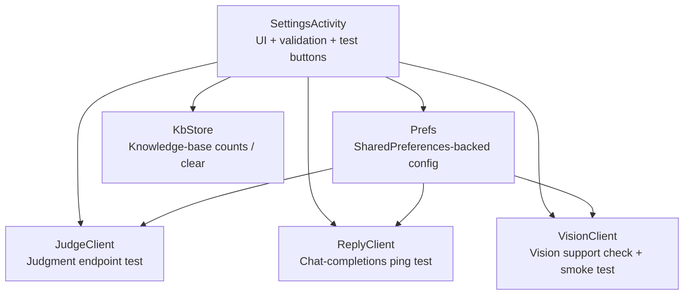
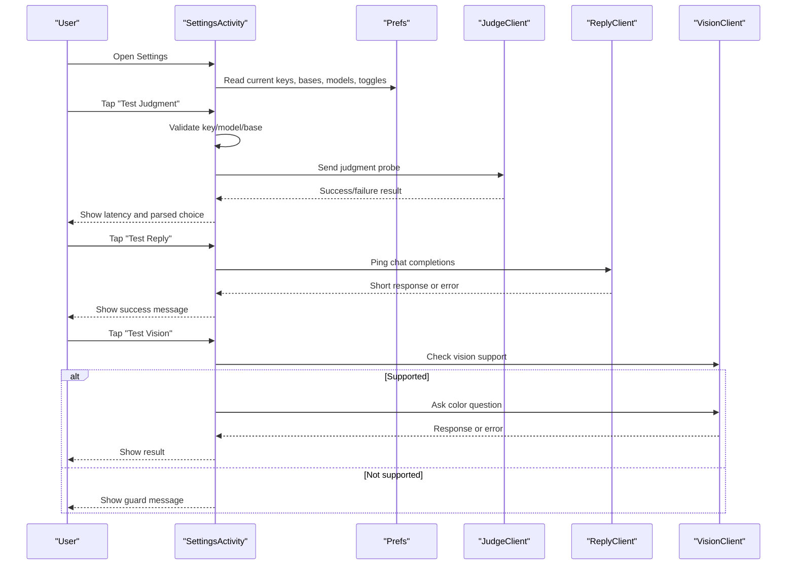
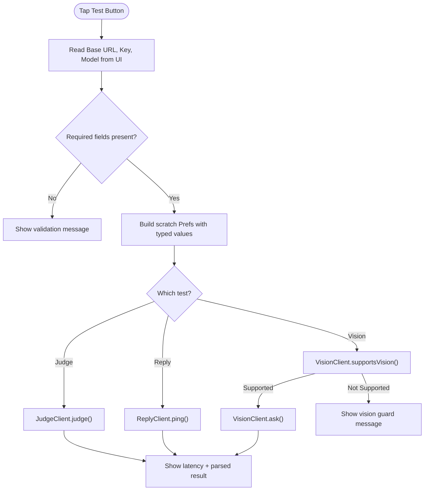
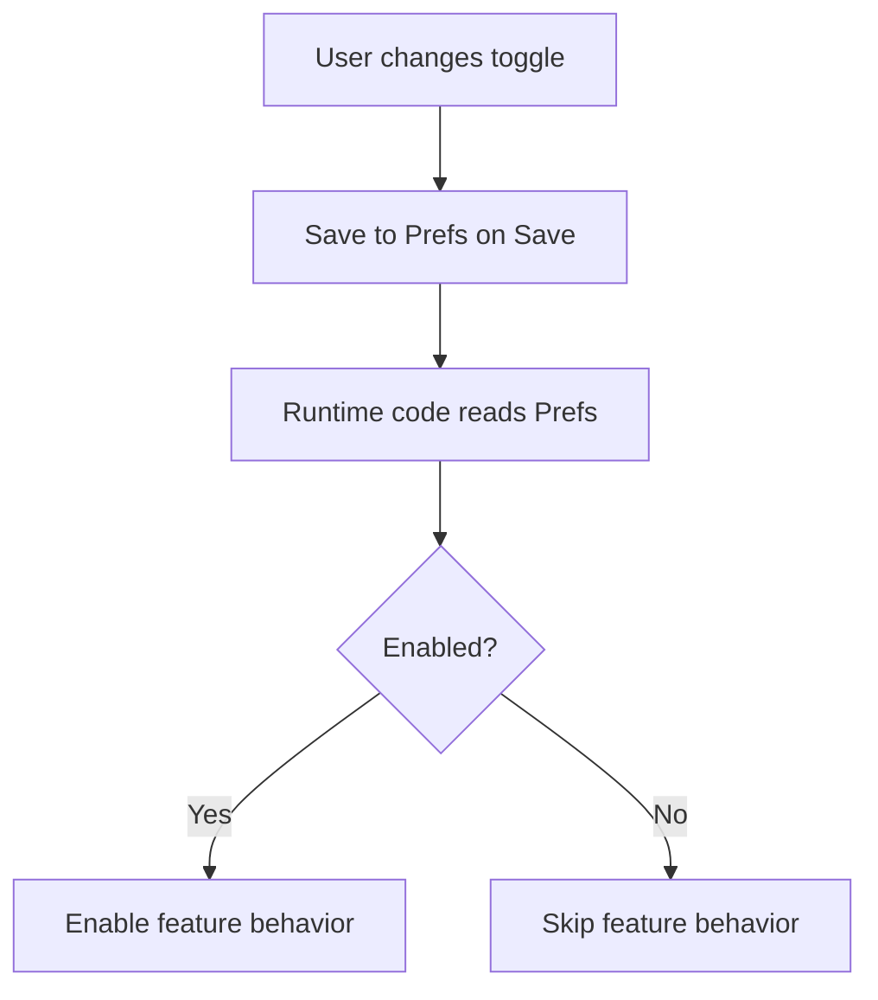
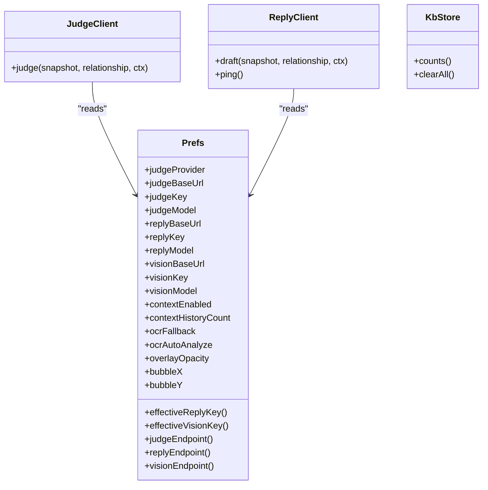
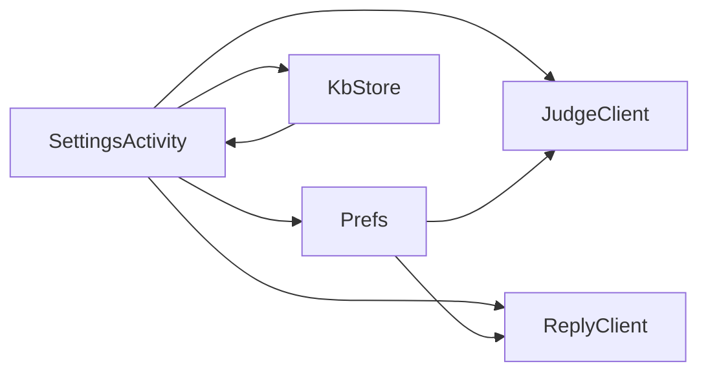

# Settings Management Interface

<cite>
**Referenced Files in This Document**
- [SettingsActivity.kt](file://app/src/main/java/com/jev/probe/SettingsActivity.kt)
- [Prefs.kt](file://app/src/main/java/com/jev/probe/core/Prefs.kt)
- [JudgeClient.kt](file://app/src/main/java/com/jev/probe/jev/JudgeClient.kt)
- [ReplyClient.kt](file://app/src/main/java/com/jev/probe/jev/ReplyClient.kt)
- [OcrEngine.kt](file://app/src/main/java/com/jev/probe/capture/ocr/OcrEngine.kt)
- [KbStore.kt](file://app/src/main/java/com/jev/probe/core/kb/KbStore.kt)
</cite>

## Table of Contents
1. [Introduction](#introduction)
2. [Project Structure](#project-structure)
3. [Core Components](#core-components)
4. [Architecture Overview](#architecture-overview)
5. [Detailed Component Analysis](#detailed-component-analysis)
6. [Dependency Analysis](#dependency-analysis)
7. [Performance Considerations](#performance-considerations)
8. [Troubleshooting Guide](#troubleshooting-guide)
9. [Conclusion](#conclusion)

## Introduction
This document explains the Settings management interface that lets users configure API endpoints, authentication tokens, model selection, feature toggles, overlay appearance, and privacy-related options. It focuses on how the settings screen reads, validates, tests, and persists configuration through a centralized preferences store, and how those settings affect judgment, reply, vision, OCR, knowledge base, and overlay behavior across the application.

## Project Structure
The settings interface is implemented as a single Android Activity that builds its UI programmatically and delegates persistence to a shared preferences class. Network calls for testing are executed on a background executor and reported back on the main thread.

**Diagram sources**
- [SettingsActivity.kt:35-447](file://app/src/main/java/com/jev/probe/SettingsActivity.kt#L35-L447)
- [Prefs.kt:14-316](file://app/src/main/java/com/jev/probe/core/Prefs.kt#L14-L316)
- [JudgeClient.kt:19-112](file://app/src/main/java/com/jev/probe/jev/JudgeClient.kt#L19-L112)
- [ReplyClient.kt:15-93](file://app/src/main/java/com/jev/probe/jev/ReplyClient.kt#L15-L93)
- [KbStore.kt:24-290](file://app/src/main/java/com/jev/probe/core/kb/KbStore.kt#L24-L290)

**Section sources**
- [SettingsActivity.kt:35-447](file://app/src/main/java/com/jev/probe/SettingsActivity.kt#L35-L447)
- [Prefs.kt:14-316](file://app/src/main/java/com/jev/probe/core/Prefs.kt#L14-L316)

## Core Components
- SettingsActivity: Builds sections for API configuration, analysis features, appearance, and about/privacy; provides per-section test buttons; saves all values when the user taps Save.
- Prefs: Centralized configuration with defaults, migration logic, provider routing, effective key resolution, endpoint builders, and feature flags.
- JudgeClient: Sends the judgment request using judge route configuration and parses structured answers.
- ReplyClient: Sends OpenAI-compatible chat requests and exposes a lightweight connectivity ping used by the settings screen.
- OcrEngine: Defines the local OCR contract used when tree-based text capture is unavailable.
- KbStore: Persists notes, contacts, and conversation history; exposes counts and a safe clear-all operation.

**Section sources**
- [SettingsActivity.kt:35-447](file://app/src/main/java/com/jev/probe/SettingsActivity.kt#L35-L447)
- [Prefs.kt:71-316](file://app/src/main/java/com/jev/probe/core/Prefs.kt#L71-L316)
- [JudgeClient.kt:19-112](file://app/src/main/java/com/jev/probe/jev/JudgeClient.kt#L19-L112)
- [ReplyClient.kt:15-93](file://app/src/main/java/com/jev/probe/jev/ReplyClient.kt#L15-L93)
- [OcrEngine.kt:9-22](file://app/src/main/java/com/jev/probe/capture/ocr/OcrEngine.kt#L9-L22)
- [KbStore.kt:24-290](file://app/src/main/java/com/jev/probe/core/kb/KbStore.kt#L24-L290)

## Architecture Overview
The settings flow centers on three API routes:

- Judgment route: Determines intent, danger level, best action, and related signals.
- Reply route: Generates three candidate replies via an OpenAI-compatible endpoint.
- Vision route: Optional image-capable endpoint used by OCR fallback or vision flows.

**Diagram sources**
- [SettingsActivity.kt:157-307](file://app/src/main/java/com/jev/probe/SettingsActivity.kt#L157-L307)
- [JudgeClient.kt:31-55](file://app/src/main/java/com/jev/probe/jev/JudgeClient.kt#L31-L55)
- [ReplyClient.kt:65-93](file://app/src/main/java/com/jev/probe/jev/ReplyClient.kt#L65-L93)

## Detailed Component Analysis

### API Endpoint Configuration
The settings screen groups API configuration into three cards:

- Judgment (Jev): Base URL, provider pills, API key, model, and a test button.
- Reply: Base URL, optional override key, model, and a connectivity ping.
- Vision: Base URL, optional key, model, and a vision capability check plus smoke test.

Key behaviors:
- Provider pills preset base URLs and models for known providers.
- Custom provider allows full endpoint control for judgment; blank custom base is rejected during test.
- Reply and vision keys can be left blank to fall back to other configured keys.
- Each test runs off a scratch preferences instance so it does not overwrite saved configuration.

**Diagram sources**
- [SettingsActivity.kt:157-307](file://app/src/main/java/com/jev/probe/SettingsActivity.kt#L157-L307)
- [Prefs.kt:281-303](file://app/src/main/java/com/jev/probe/core/Prefs.kt#L281-L303)

#### Judgment Endpoint Options
- Provider presets include OpenRouter, Bocha Jev, TypeSafe, Vercel, OpenCode Zen, and Custom.
- The activity resolves the actual provider based on the selected pill and the typed base URL.
- Default base paths differ by provider; Custom expects a full endpoint.
- Effective endpoint construction is delegated to the preferences layer.

Relevant implementation references:
- Provider selection and default expansion: [SettingsActivity.kt:455-504](file://app/src/main/java/com/jev/probe/SettingsActivity.kt#L455-L504)
- Endpoint builder and hosted override: [Prefs.kt:281-293](file://app/src/main/java/com/jev/probe/core/Prefs.kt#L281-L293)

#### Reply Endpoint Options
- Supports OpenRouter, DeepSeek official, DashScope compatibility, and Custom.
- If no reply key is provided, the effective reply key falls back to the judgment key.
- The ping call exercises the normal chat-completions path without invoking summary logic.

Relevant implementation references:
- Preset mapping and model defaults: [SettingsActivity.kt:202-217](file://app/src/main/java/com/jev/probe/SettingsActivity.kt#L202-L217)
- Effective key fallback: [Prefs.kt:275-276](file://app/src/main/java/com/jev/probe/core/Prefs.kt#L275-L276)
- Ping implementation: [ReplyClient.kt:65-66](file://app/src/main/java/com/jev/probe/jev/ReplyClient.kt#L65-L66)

#### Vision Endpoint Options
- Vision base URL is independent from the reply base URL to avoid accidentally pointing at non-vision endpoints.
- If no vision key is set, it falls back to the effective reply key, then to the judgment key.
- A guard prevents testing unsupported providers such as DeepSeek official.

Relevant implementation references:
- Independent vision base handling: [Prefs.kt:115-131](file://app/src/main/java/com/jev/probe/core/Prefs.kt#L115-L131)
- Effective vision key fallback: [Prefs.kt:278-279](file://app/src/main/java/com/jev/probe/core/Prefs.kt#L278-L279)
- Vision guard message: [SettingsActivity.kt:669-671](file://app/src/main/java/com/jev/probe/SettingsActivity.kt#L669-L671)

**Section sources**
- [SettingsActivity.kt:72-308](file://app/src/main/java/com/jev/probe/SettingsActivity.kt#L72-L308)
- [Prefs.kt:71-131](file://app/src/main/java/com/jev/probe/core/Prefs.kt#L71-L131)
- [Prefs.kt:275-303](file://app/src/main/java/com/jev/probe/core/Prefs.kt#L275-L303)
- [ReplyClient.kt:65-93](file://app/src/main/java/com/jev/probe/jev/ReplyClient.kt#L65-L93)

### Feature Toggles
The analysis section exposes toggles that control how the app captures and analyzes content:

- Auto analyze incoming messages: enables automatic analysis when the other party sends a message.
- OCR fallback: uses screenshot-based OCR when the view tree cannot provide text.
- OCR auto analyze: automatically analyzes after OCR recognition; otherwise shows the bubble for manual analysis.
- Context recording: stores recent chat history locally to enrich analysis and knowledge context.
- Knowledge base integration: opens the knowledge activity and supports clearing stored notes, contacts, and logs.

Important details:
- OCR fallback and OCR auto-analyze are separate controls because OCR may incur extra cost or performance impact.
- Context recording is disabled by default to protect privacy unless explicitly enabled.
- The number of recent history lines injected into prompts is configurable between 0 and 100.

**Diagram sources**
- [SettingsActivity.kt:321-340](file://app/src/main/java/com/jev/probe/SettingsActivity.kt#L321-L340)
- [Prefs.kt:133-174](file://app/src/main/java/com/jev/probe/core/Prefs.kt#L133-L174)

**Section sources**
- [SettingsActivity.kt:310-371](file://app/src/main/java/com/jev/probe/SettingsActivity.kt#L310-L371)
- [Prefs.kt:133-174](file://app/src/main/java/com/jev/probe/core/Prefs.kt#L133-L174)
- [OcrEngine.kt:9-22](file://app/src/main/java/com/jev/probe/capture/ocr/OcrEngine.kt#L9-L22)

### User Preference Management
The settings screen manages several user-facing preferences:

- Relationship description: free-text context sent to the judgment service.
- Conversation whitelist: one keyword per line; empty means all conversations.
- Overlay opacity: slider from 60% to 100%.
- Bubble positioning: remembered X/Y coordinates are persisted in preferences.
- Notification and overlay behavior: controlled elsewhere but influenced by these preference values.

Validation and defaults:
- Whitelist entries are trimmed and filtered to remove blanks.
- Context history count is coerced into the 0–100 range; defaults to 30 if invalid.
- Overlay opacity is coerced into 60–100.
- Bubble positions use -1 as a sentinel for “default.”

Persistence:
- All settings are written only when the user taps Save.
- Scratch instances are used for test buttons so live configuration is never mutated during probing.

**Section sources**
- [SettingsActivity.kt:313-343](file://app/src/main/java/com/jev/probe/SettingsActivity.kt#L313-L343)
- [SettingsActivity.kt:373-390](file://app/src/main/java/com/jev/probe/SettingsActivity.kt#L373-L390)
- [SettingsActivity.kt:404-445](file://app/src/main/java/com/jev/probe/SettingsActivity.kt#L404-L445)
- [Prefs.kt:178-214](file://app/src/main/java/com/jev/probe/core/Prefs.kt#L178-L214)
- [Prefs.kt:196-209](file://app/src/main/java/com/jev/probe/core/Prefs.kt#L196-L209)

### Security Considerations
Security is handled primarily through the preferences layer and UI design:

- Keys are stored in app-private SharedPreferences.
- Only key lengths are logged; actual secrets are never printed.
- Password-style input masking is applied to API key fields.
- Hosted mode introduces a gateway token treated like an API key.
- Privacy policy and repository links are exposed directly from the settings screen.

Recommendations:
- Avoid sharing screenshots containing visible API keys.
- Use environment-specific keys and rotate them regularly.
- Enable hosted mode only when you trust the operator’s gateway and have accepted consent.
- Clear knowledge base and history when sensitive data has been captured locally.

**Section sources**
- [Prefs.kt:6-13](file://app/src/main/java/com/jev/probe/core/Prefs.kt#L6-L13)
- [Prefs.kt:218-271](file://app/src/main/java/com/jev/probe/core/Prefs.kt#L218-L271)
- [SettingsActivity.kt:626-635](file://app/src/main/java/com/jev/probe/SettingsActivity.kt#L626-L635)
- [SettingsActivity.kt:392-401](file://app/src/main/java/com/jev/probe/SettingsActivity.kt#L392-L401)

### Validation Mechanisms and Default Handling
Validation occurs both in the UI test flows and during Save:

- Judgment test requires a key; custom provider also requires a full base URL and model name.
- Reply test requires an effective key; it can come from the reply field or the judgment field.
- Vision test checks endpoint support before sending a request.
- On Save, blank base URLs are filled with provider defaults except for custom provider.
- Blank model names are filled with provider defaults except for custom provider.
- Numeric inputs are coerced into allowed ranges.

Default handling:
- Provider defaults are defined centrally in preferences.
- Fresh installs may receive migration or unseed logic to avoid unintended provider changes.
- Effective key resolution ensures backward compatibility and graceful fallback.

**Section sources**
- [SettingsActivity.kt:157-194](file://app/src/main/java/com/jev/probe/SettingsActivity.kt#L157-L194)
- [SettingsActivity.kt:225-248](file://app/src/main/java/com/jev/probe/SettingsActivity.kt#L225-L248)
- [SettingsActivity.kt:278-307](file://app/src/main/java/com/jev/probe/SettingsActivity.kt#L278-L307)
- [SettingsActivity.kt:404-445](file://app/src/main/java/com/jev/probe/SettingsActivity.kt#L404-L445)
- [Prefs.kt:29-69](file://app/src/main/java/com/jev/probe/core/Prefs.kt#L29-L69)
- [Prefs.kt:368-397](file://app/src/main/java/com/jev/probe/core/Prefs.kt#L368-L397)

### Settings Synchronization Across App Components
Configuration is read from the same Prefs instance throughout the app:

- JudgeClient uses judge endpoint, model, and effective route key.
- ReplyClient uses reply endpoint, model, and effective route key.
- Vision flows rely on vision endpoint and effective vision key.
- Knowledge base operations use KbStore independently of API keys.
- Overlay and bubble preferences are consumed by overlay and UI components.

**Diagram sources**
- [Prefs.kt:71-303](file://app/src/main/java/com/jev/probe/core/Prefs.kt#L71-L303)
- [JudgeClient.kt:19-112](file://app/src/main/java/com/jev/probe/jev/JudgeClient.kt#L19-L112)
- [ReplyClient.kt:15-93](file://app/src/main/java/com/jev/probe/jev/ReplyClient.kt#L15-L93)
- [KbStore.kt:24-290](file://app/src/main/java/com/jev/probe/core/kb/KbStore.kt#L24-L290)

**Section sources**
- [JudgeClient.kt:100-112](file://app/src/main/java/com/jev/probe/jev/JudgeClient.kt#L100-L112)
- [ReplyClient.kt:81-93](file://app/src/main/java/com/jev/probe/jev/ReplyClient.kt#L81-L93)
- [Prefs.kt:275-303](file://app/src/main/java/com/jev/probe/core/Prefs.kt#L275-L303)

## Dependency Analysis
The settings screen depends on multiple subsystems:

- UI layer: SettingsActivity composes cards, pills, toggles, and buttons.
- Configuration layer: Prefs centralizes storage, defaults, migration, and endpoint computation.
- Networking layer: JudgeClient and ReplyClient perform HTTP calls using shared headers and route keys.
- Local data layer: KbStore manages notes, contacts, and logs with atomic writes and safety guards.
- OCR layer: OcrEngine defines the contract for screenshot-based text extraction.

**Diagram sources**
- [SettingsActivity.kt:35-447](file://app/src/main/java/com/jev/probe/SettingsActivity.kt#L35-L447)
- [Prefs.kt:14-316](file://app/src/main/java/com/jev/probe/core/Prefs.kt#L14-L316)
- [JudgeClient.kt:19-112](file://app/src/main/java/com/jev/probe/jev/JudgeClient.kt#L19-L112)
- [ReplyClient.kt:15-93](file://app/src/main/java/com/jev/probe/jev/ReplyClient.kt#L15-L93)
- [KbStore.kt:24-290](file://app/src/main/java/com/jev/probe/core/kb/KbStore.kt#L24-L290)

**Section sources**
- [SettingsActivity.kt:35-447](file://app/src/main/java/com/jev/probe/SettingsActivity.kt#L35-L447)
- [Prefs.kt:14-316](file://app/src/main/java/com/jev/probe/core/Prefs.kt#L14-L316)

## Performance Considerations
- Background execution: Test buttons run network calls on a single-thread executor and post results to the main thread.
- Scratch preferences: Tests do not mutate real configuration, avoiding unnecessary disk writes.
- OCR costs: OCR fallback and OCR auto-analyze can trigger screenshots and processing; keep them disabled unless needed.
- Context history size: Injecting too many history lines increases prompt size and latency; prefer smaller counts for faster responses.
- Atomic file writes: Knowledge base writes use temp files and rename to reduce corruption risk.

[No sources needed since this section provides general guidance]

## Troubleshooting Guide

Common issues and resolutions:

- Judgment test fails with missing key:
  - Ensure the judgment key is filled.
  - Verify the selected provider matches the base URL.
  - For custom provider, fill both full base URL and model name.

- Reply test reports missing key:
  - Fill the reply key, or leave it blank to inherit the judgment key.
  - Confirm the effective reply key is not blank.

- Vision test says the endpoint does not support vision:
  - Switch to a provider that supports image capabilities.
  - Do not use DeepSeek official for vision; use OpenRouter or DashScope-compatible endpoints.

- Connectivity errors:
  - Check network access and firewall rules.
  - Verify base URLs resolve correctly.
  - Confirm API keys are valid for the selected provider.

- Knowledge base clear warning:
  - Clearing knowledge base removes notes, contacts, and chat logs but does not delete API keys or settings.
  - Use the self-check button to inspect internal state.

- Overlay looks too opaque:
  - Adjust the overlay opacity slider to a lower percentage.
  - Remember that lower values make the overlay more transparent.

- Settings not applying:
  - Make sure to tap Save to persist changes.
  - Restart the app if runtime services need to reload configuration.

**Section sources**
- [SettingsActivity.kt:157-194](file://app/src/main/java/com/jev/probe/SettingsActivity.kt#L157-L194)
- [SettingsActivity.kt:225-248](file://app/src/main/java/com/jev/probe/SettingsActivity.kt#L225-L248)
- [SettingsActivity.kt:278-307](file://app/src/main/java/com/jev/probe/SettingsActivity.kt#L278-L307)
- [SettingsActivity.kt:341-370](file://app/src/main/java/com/jev/probe/SettingsActivity.kt#L341-L370)
- [SettingsActivity.kt:373-390](file://app/src/main/java/com/jev/probe/SettingsActivity.kt#L373-L390)
- [SettingsActivity.kt:404-445](file://app/src/main/java/com/jev/probe/SettingsActivity.kt#L404-L445)
- [Prefs.kt:275-303](file://app/src/main/java/com/jev/probe/core/Prefs.kt#L275-L303)

## Conclusion
The Settings management interface provides a comprehensive configuration surface for API endpoints, authentication, model selection, feature toggles, appearance, and privacy. It enforces validation, preserves security-sensitive values, and synchronizes configuration through a centralized preferences layer. By using built-in test buttons, understanding provider constraints, and following the troubleshooting guidance, users can reliably configure and operate the application across different providers and modes.