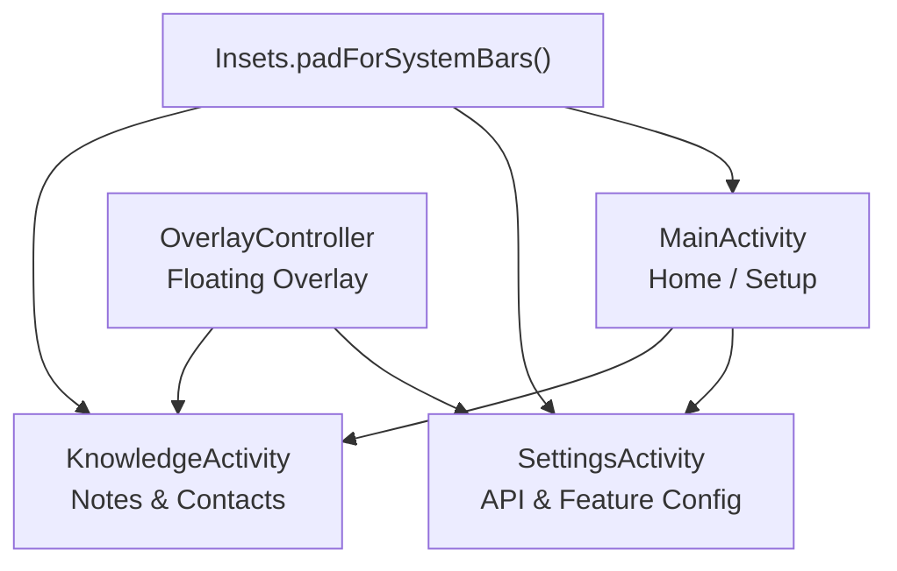
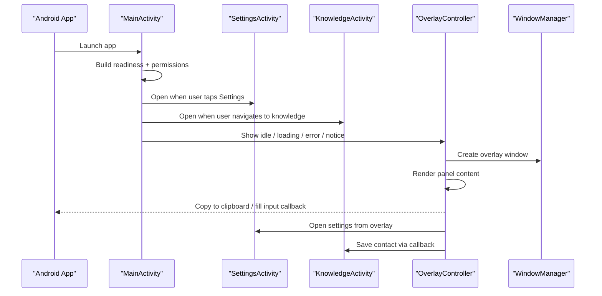
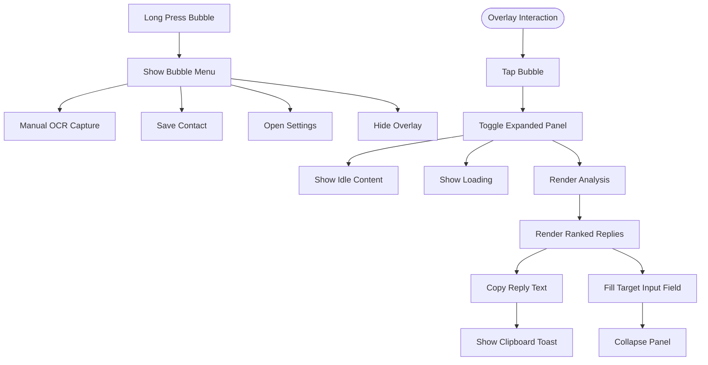
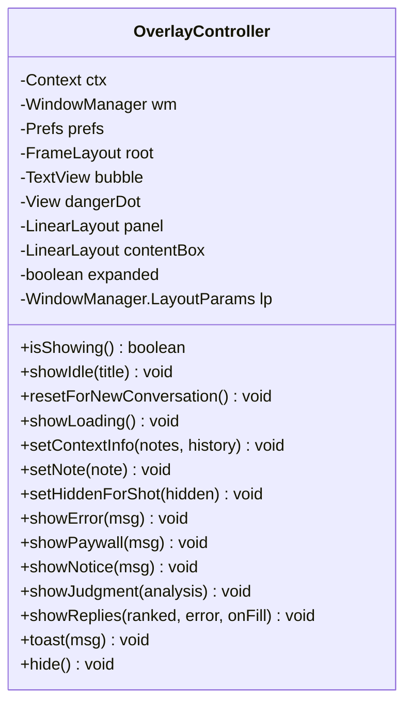
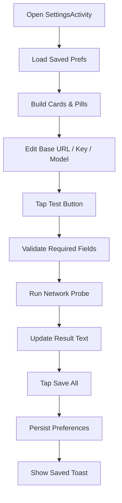
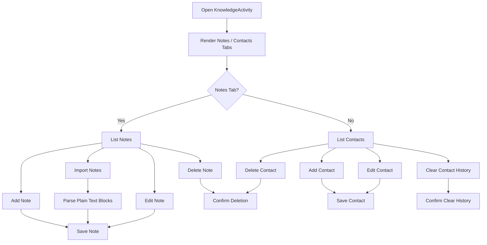
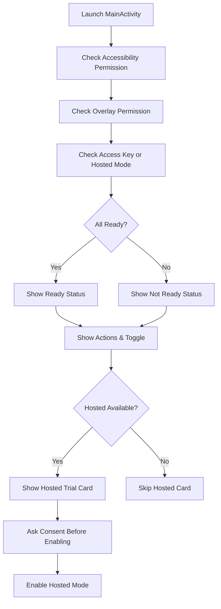
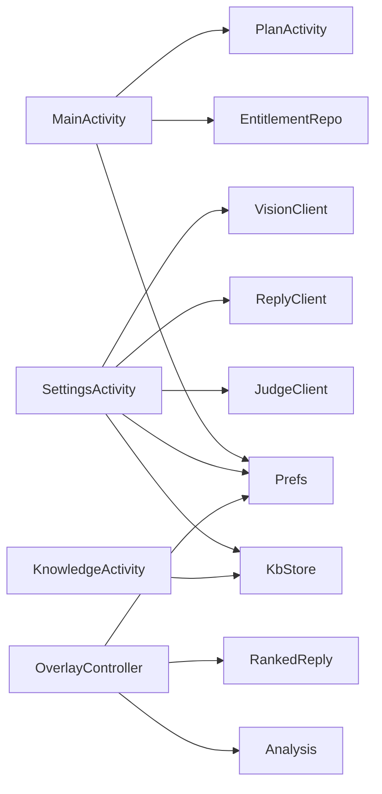

# User Interface Components

<cite>
**Referenced Files in This Document**
- [OverlayController.kt](file://app/src/main/java/com/jev/probe/overlay/OverlayController.kt)
- [SettingsActivity.kt](file://app/src/main/java/com/jev/probe/SettingsActivity.kt)
- [KnowledgeActivity.kt](file://app/src/main/java/com/jev/probe/KnowledgeActivity.kt)
- [MainActivity.kt](file://app/src/main/java/com/jev/probe/MainActivity.kt)
- [Insets.kt](file://app/src/main/java/com/jev/probe/Insets.kt)
- [themes.xml](file://app/src/main/res/values/themes.xml)
- [strings.xml](file://app/src/main/res/values/strings.xml)
</cite>

## Table of Contents
1. [Introduction](#introduction)
2. [Project Structure](#project-structure)
3. [Core Components](#core-components)
4. [Architecture Overview](#architecture-overview)
5. [Detailed Component Analysis](#detailed-component-analysis)
6. [Dependency Analysis](#dependency-analysis)
7. [Performance Considerations](#performance-considerations)
8. [Troubleshooting Guide](#troubleshooting-guide)
9. [Conclusion](#conclusion)

## Introduction
This document explains the user interface components that deliver Jev’s AI analysis experience on Android. The system centers on a floating overlay that displays non-intrusive analysis results over other applications, a settings screen for API and feature configuration, a knowledge management screen for contacts and notes, and a home screen that guides setup and permission management.

The UI is built entirely with code-generated Material-style views: cards, pills, toggles, and buttons share a consistent color palette, typography scale, and rounded drawable style across activities. The overlay uses an application overlay window so it can float above chat apps while remaining draggable, expandable, and dismissible.

## Project Structure
The UI lives primarily in four Kotlin files plus a small insets helper and standard resource files:

**Diagram sources**
- [MainActivity.kt:26-113](file://app/src/main/java/com/jev/probe/MainActivity.kt#L26-L113)
- [SettingsActivity.kt:35-448](file://app/src/main/java/com/jev/probe/SettingsActivity.kt#L35-L448)
- [KnowledgeActivity.kt:24-74](file://app/src/main/java/com/jev/probe/KnowledgeActivity.kt#L24-L74)
- [OverlayController.kt:29-66](file://app/src/main/java/com/jev/probe/overlay/OverlayController.kt#L29-L66)
- [Insets.kt:7-30](file://app/src/main/java/com/jev/probe/Insets.kt#L7-L30)

**Section sources**
- [MainActivity.kt:26-113](file://app/src/main/java/com/jev/probe/MainActivity.kt#L26-L113)
- [SettingsActivity.kt:35-448](file://app/src/main/java/com/jev/probe/SettingsActivity.kt#L35-L448)
- [KnowledgeActivity.kt:24-74](file://app/src/main/java/com/jev/probe/KnowledgeActivity.kt#L24-L74)
- [OverlayController.kt:29-66](file://app/src/main/java/com/jev/probe/overlay/OverlayController.kt#L29-L66)
- [Insets.kt:7-30](file://app/src/main/java/com/jev/probe/Insets.kt#L7-L30)

## Core Components
- **OverlayController**: Manages the floating bubble and translucent panel that shows AI analysis results, candidate replies, danger signals, and actions such as copy-to-clipboard and text input population.
- **SettingsActivity**: Provides a comprehensive configuration interface for judgment, reply, and vision API endpoints; model selection; provider presets; feature toggles; overlay opacity; and knowledge base controls.
- **KnowledgeActivity**: Offers an intuitive manager for notes and contacts, including creation, editing, enabling/disabling, bulk import from plain text, history clearing, and deletion.
- **MainActivity**: Serves as the primary entry point, showing readiness status, guiding permissions, offering hosted trial or self-managed key flows, and exposing a master toggle.

**Section sources**
- [OverlayController.kt:29-66](file://app/src/main/java/com/jev/probe/overlay/OverlayController.kt#L29-L66)
- [SettingsActivity.kt:35-448](file://app/src/main/java/com/jev/probe/SettingsActivity.kt#L35-L448)
- [KnowledgeActivity.kt:24-74](file://app/src/main/java/com/jev/probe/KnowledgeActivity.kt#L24-L74)
- [MainActivity.kt:26-113](file://app/src/main/java/com/jev/probe/MainActivity.kt#L26-L113)

## Architecture Overview
The UI architecture separates concerns into presentation screens and a floating overlay controller:

**Diagram sources**
- [MainActivity.kt:62-113](file://app/src/main/java/com/jev/probe/MainActivity.kt#L62-L113)
- [SettingsActivity.kt:52-448](file://app/src/main/java/com/jev/probe/SettingsActivity.kt#L52-L448)
- [KnowledgeActivity.kt:49-74](file://app/src/main/java/com/jev/probe/KnowledgeActivity.kt#L49-L74)
- [OverlayController.kt:97-122](file://app/src/main/java/com/jev/probe/overlay/OverlayController.kt#L97-L122)
- [OverlayController.kt:256-262](file://app/src/main/java/com/jev/probe/overlay/OverlayController.kt#L256-L262)

## Detailed Component Analysis

### Floating Overlay System: OverlayController
OverlayController implements a draggable bubble that expands into a translucent panel. It manages:
- Window lifecycle and positioning through `WindowManager`.
- Bubble touch handling for drag, long press menu, and tap-to-toggle.
- Panel visibility states: idle, loading, error, paywall, notice, and rendered analysis.
- Rendering of danger badges, intent headlines, secondary hints, and ranked reply cards.
- User interactions: copy-to-clipboard, fill text input field, re-analyze, open settings, save contact, and OCR capture.

#### Key Responsibilities
- **Positioning**: Initializes overlay parameters, reads saved bubble coordinates, constrains movement within screen bounds, and updates layout without stealing focus.
- **Visibility States**: Uses methods like `showIdle`, `showLoading`, `showError`, `showPaywall`, `showNotice`, `showJudgment`, and `showReplies` to transition between states.
- **User Interactions**: Implements a long-press menu for manual screenshot OCR, saving current conversation as a contact, opening settings, hiding temporarily, and canceling.
- **Copy-to-Clipboard**: Copies selected reply text using the system clipboard service and shows a short toast confirmation.
- **Text Input Population**: Accepts a callback to populate the target app’s input field, then collapses the panel so the keyboard and input box remain visible.

**Diagram sources**
- [OverlayController.kt:198-233](file://app/src/main/java/com/jev/probe/overlay/OverlayController.kt#L198-L233)
- [OverlayController.kt:235-254](file://app/src/main/java/com/jev/probe/overlay/OverlayController.kt#L235-L254)
- [OverlayController.kt:267-284](file://app/src/main/java/com/jev/probe/overlay/OverlayController.kt#L267-L284)
- [OverlayController.kt:288-418](file://app/src/main/java/com/jev/probe/overlay/OverlayController.kt#L288-L418)
- [OverlayController.kt:575-579](file://app/src/main/java/com/jev/probe/overlay/OverlayController.kt#L575-L579)

#### Window and Panel Construction
- Creates a translucent overlay window with `TYPE_APPLICATION_OVERLAY` and `FLAG_NOT_FOCUSABLE`.
- Builds a root `FrameLayout` containing both the bubble and the expanded panel.
- Applies rounded card backgrounds, elevation, and adjustable opacity based on user preference.
- Caps panel height to avoid covering input boxes and keyboards.

**Diagram sources**
- [OverlayController.kt:38-74](file://app/src/main/java/com/jev/probe/overlay/OverlayController.kt#L38-L74)
- [OverlayController.kt:288-418](file://app/src/main/java/com/jev/probe/overlay/OverlayController.kt#L288-L418)

**Section sources**
- [OverlayController.kt:29-66](file://app/src/main/java/com/jev/probe/overlay/OverlayController.kt#L29-L66)
- [OverlayController.kt:97-122](file://app/src/main/java/com/jev/probe/overlay/OverlayController.kt#L97-L122)
- [OverlayController.kt:124-188](file://app/src/main/java/com/jev/probe/overlay/OverlayController.kt#L124-L188)
- [OverlayController.kt:198-233](file://app/src/main/java/com/jev/probe/overlay/OverlayController.kt#L198-L233)
- [OverlayController.kt:235-284](file://app/src/main/java/com/jev/probe/overlay/OverlayController.kt#L235-L284)
- [OverlayController.kt:288-418](file://app/src/main/java/com/jev/probe/overlay/OverlayController.kt#L288-L418)
- [OverlayController.kt:433-584](file://app/src/main/java/com/jev/probe/overlay/OverlayController.kt#L433-L584)

### SettingsActivity: Configuration Interface
SettingsActivity provides a scrollable, card-based configuration screen organized into sections:
- **API Endpoints**: Judgment (Jev), reply, and vision interfaces with provider presets, base URL, secret key, and model fields.
- **Analysis Features**: Relationship description, session whitelist, automatic analysis, OCR fallback, OCR auto-analysis, context recording, and history count.
- **Appearance**: Overlay opacity slider.
- **About & Privacy**: Links to privacy policy and repository, version label.
- **Save All**: Persists all edits and shows a confirmation toast.

#### Provider Selection and Validation
- Supports multiple providers for each API: OpenRouter, Bocha Jev, TypeSafe, Vercel, OpenCode Zen, DeepSeek official, DashScope compatible, and custom endpoints.
- Preset pills update base URLs and models automatically.
- Custom mode preserves exact user input without guessing defaults.
- Test buttons run network probes on background threads and display success/failure with timing and sample output.

**Diagram sources**
- [SettingsActivity.kt:52-448](file://app/src/main/java/com/jev/probe/SettingsActivity.kt#L52-L448)
- [SettingsActivity.kt:157-194](file://app/src/main/java/com/jev/probe/SettingsActivity.kt#L157-L194)
- [SettingsActivity.kt:224-249](file://app/src/main/java/com/jev/probe/SettingsActivity.kt#L224-L249)
- [SettingsActivity.kt:277-307](file://app/src/main/java/com/jev/probe/SettingsActivity.kt#L277-L307)

**Section sources**
- [SettingsActivity.kt:35-448](file://app/src/main/java/com/jev/probe/SettingsActivity.kt#L35-L448)
- [SettingsActivity.kt:450-516](file://app/src/main/java/com/jev/probe/SettingsActivity.kt#L450-L516)
- [SettingsActivity.kt:547-608](file://app/src/main/java/com/jev/probe/SettingsActivity.kt#L547-L608)
- [SettingsActivity.kt:610-664](file://app/src/main/java/com/jev/probe/SettingsActivity.kt#L610-L664)

### KnowledgeActivity: Notes and Contacts Management
KnowledgeActivity manages two tabs:
- **Notes**: Title, content, tags, always-on flag, enabled flag, edit dialog, delete confirmation, and bulk import from plain text.
- **Contacts**: Name, aliases, source apps, relationship, notes, history clearing, edit dialog, and delete confirmation.

#### Data Operations
- Loads and sorts notes and contacts by updated timestamp.
- Saves new or edited entries through `KbStore`.
- Clears per-contact chat history without deleting the contact itself.
- Confirms destructive actions before execution.

**Diagram sources**
- [KnowledgeActivity.kt:49-74](file://app/src/main/java/com/jev/probe/KnowledgeActivity.kt#L49-L74)
- [KnowledgeActivity.kt:102-144](file://app/src/main/java/com/jev/probe/KnowledgeActivity.kt#L102-L144)
- [KnowledgeActivity.kt:146-214](file://app/src/main/java/com/jev/probe/KnowledgeActivity.kt#L146-L214)
- [KnowledgeActivity.kt:221-310](file://app/src/main/java/com/jev/probe/KnowledgeActivity.kt#L221-L310)

**Section sources**
- [KnowledgeActivity.kt:24-74](file://app/src/main/java/com/jev/probe/KnowledgeActivity.kt#L24-L74)
- [KnowledgeActivity.kt:102-214](file://app/src/main/java/com/jev/probe/KnowledgeActivity.kt#L102-L214)
- [KnowledgeActivity.kt:221-310](file://app/src/main/java/com/jev/probe/KnowledgeActivity.kt#L221-L310)
- [KnowledgeActivity.kt:321-429](file://app/src/main/java/com/jev/probe/KnowledgeActivity.kt#L321-L429)

### MainActivity: Primary Entry Point and Setup Wizard
MainActivity acts as the home screen and setup guide:
- Shows a readiness summary combining accessibility permission, overlay permission, and access key/hosted mode status.
- Guides users through required permissions with direct links to system settings.
- Offers hosted trial flow with explicit consent and optional switch to self-managed keys.
- Displays a prominent master toggle to enable or disable the assistant.

#### Readiness Logic
Readiness requires:
- Accessibility service enabled for reading chat windows.
- Overlay permission granted for displaying the floating panel.
- Either a configured API key or active hosted subscription.

**Diagram sources**
- [MainActivity.kt:47-113](file://app/src/main/java/com/jev/probe/MainActivity.kt#L47-L113)
- [MainActivity.kt:117-136](file://app/src/main/java/com/jev/probe/MainActivity.kt#L117-L136)
- [MainActivity.kt:144-180](file://app/src/main/java/com/jev/probe/MainActivity.kt#L144-L180)
- [MainActivity.kt:204-228](file://app/src/main/java/com/jev/probe/MainActivity.kt#L204-L228)

**Section sources**
- [MainActivity.kt:26-113](file://app/src/main/java/com/jev/probe/MainActivity.kt#L26-L113)
- [MainActivity.kt:117-180](file://app/src/main/java/com/jev/probe/MainActivity.kt#L117-L180)
- [MainActivity.kt:190-245](file://app/src/main/java/com/jev/probe/MainActivity.kt#L190-L245)
- [MainActivity.kt:247-302](file://app/src/main/java/com/jev/probe/MainActivity.kt#L247-L302)
- [MainActivity.kt:342-346](file://app/src/main/java/com/jev/probe/MainActivity.kt#L342-L346)

## Dependency Analysis
The UI components depend on shared preferences, core data models, and external clients:

**Diagram sources**
- [MainActivity.kt:20-24](file://app/src/main/java/com/jev/probe/MainActivity.kt#L20-L24)
- [SettingsActivity.kt:24-32](file://app/src/main/java/com/jev/probe/SettingsActivity.kt#L24-L32)
- [KnowledgeActivity.kt:19-22](file://app/src/main/java/com/jev/probe/KnowledgeActivity.kt#L19-L22)
- [OverlayController.kt:22-26](file://app/src/main/java/com/jev/probe/overlay/OverlayController.kt#L22-L26)

**Section sources**
- [MainActivity.kt:20-24](file://app/src/main/java/com/jev/probe/MainActivity.kt#L20-L24)
- [SettingsActivity.kt:24-32](file://app/src/main/java/com/jev/probe/SettingsActivity.kt#L24-L32)
- [KnowledgeActivity.kt:19-22](file://app/src/main/java/com/jev/probe/KnowledgeActivity.kt#L19-L22)
- [OverlayController.kt:22-26](file://app/src/main/java/com/jev/probe/overlay/OverlayController.kt#L22-L26)

## Performance Considerations
- **Background Work**: SettingsActivity uses a single-thread executor for API tests and returns results on the main thread via a handler, preventing UI blocking.
- **Overlay Efficiency**: The overlay avoids taking focus (`FLAG_NOT_FOCUSABLE`) and keeps the panel height capped to reduce layout cost and avoid covering input areas.
- **State Reset**: `resetForNewConversation` clears stale judgments and callbacks to prevent rendering incorrect data for a different chat.
- **Network Probes**: Test buttons measure latency and surface errors without crashing the UI.
- **Preference Persistence**: All configuration changes are batched under a single save action, reducing repeated writes.

[No sources needed since this section provides general guidance]

## Troubleshooting Guide
Common issues and their likely causes:

- **Overlay not appearing**:
  - Overlay permission may be denied. Check system overlay settings.
  - `canDrawOverlays` returns false; ensure the app has been granted drawing permission.
  - Root view creation failed; logs indicate overlay addView exceptions.

- **Panel does not show analysis**:
  - No judgment cached; call `showJudgment` before `showReplies`.
  - Conversation reset cleared last judgment; ensure `resetForNewConversation` is called only when switching chats.
  - Reply generation failed; check `replyError` and test reply endpoint in Settings.

- **Copy-to-clipboard not working**:
  - Clipboard service unavailable; verify system clipboard access.
  - Toast feedback confirms copy operation; if missing, inspect clipboard initialization.

- **Settings tests fail**:
  - Missing API key or invalid base URL/model.
  - Provider mismatch: preset host implies a specific path; ensure custom mode includes full endpoint.
  - Vision endpoint unsupported; guard message indicates incompatible provider.

**Section sources**
- [OverlayController.kt:78-122](file://app/src/main/java/com/jev/probe/overlay/OverlayController.kt#L78-L122)
- [OverlayController.kt:313-319](file://app/src/main/java/com/jev/probe/overlay/OverlayController.kt#L313-L319)
- [OverlayController.kt:575-579](file://app/src/main/java/com/jev/probe/overlay/OverlayController.kt#L575-L579)
- [SettingsActivity.kt:157-194](file://app/src/main/java/com/jev/probe/SettingsActivity.kt#L157-L194)
- [SettingsActivity.kt:277-307](file://app/src/main/java/com/jev/probe/SettingsActivity.kt#L277-L307)

## Conclusion
The user interface components form a cohesive, Material-inspired system centered on a floating overlay that delivers AI analysis results without interrupting the user’s workflow. OverlayController handles positioning, visibility, and interactions; SettingsActivity provides robust configuration for APIs and features; KnowledgeActivity offers practical management of contextual data; and MainActivity guides setup and permission management. Together, they implement responsive design through edge-to-edge padding, consistent visual patterns, and clear state transitions, while maintaining performance and usability across Android devices.

[No sources needed since this section summarizes without analyzing specific files]