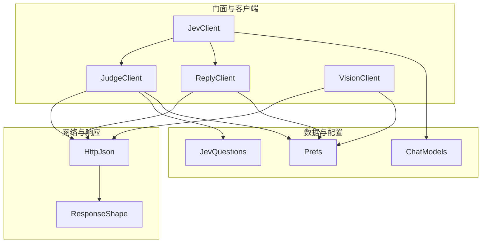
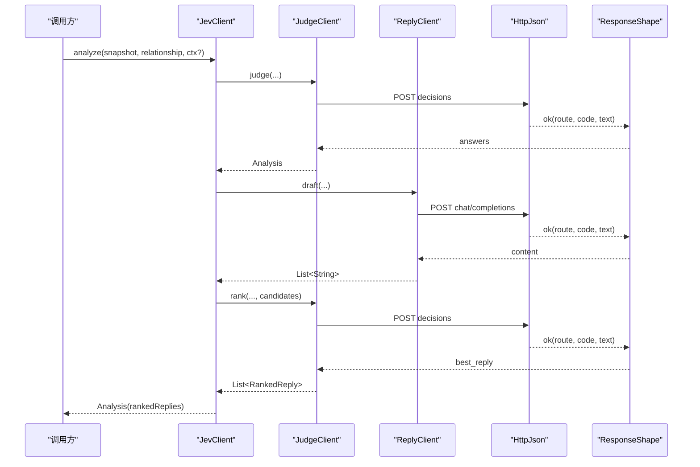
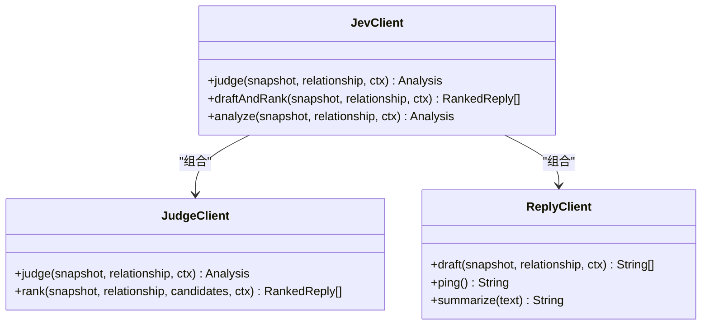
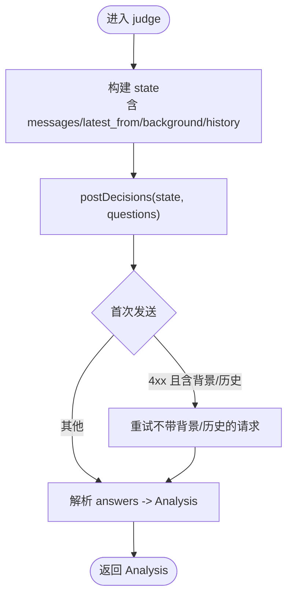
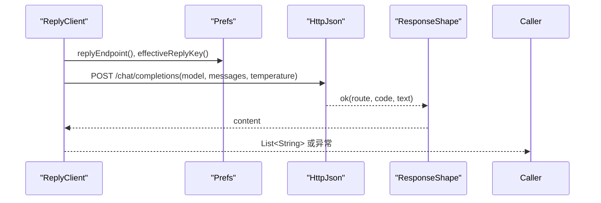
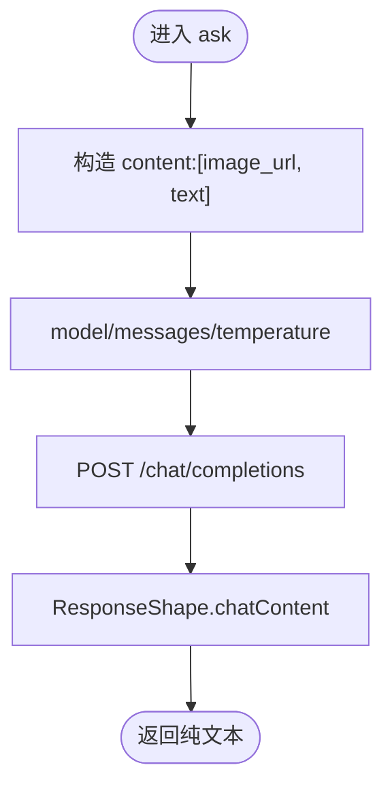
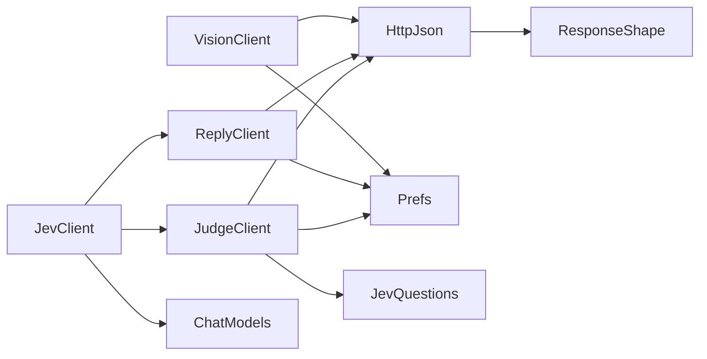
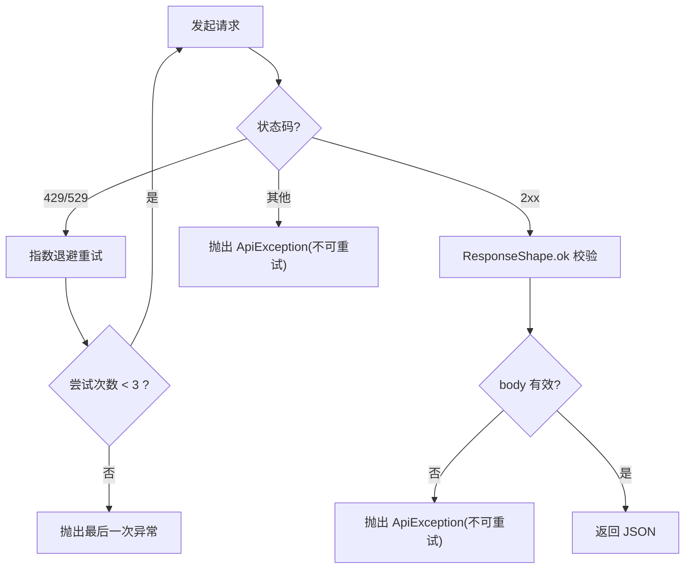

# API 参考文档

<cite>
**本文引用的文件**   
- [JevClient.kt](file://app/src/main/java/com/jev/probe/jev/JevClient.kt)
- [JudgeClient.kt](file://app/src/main/java/com/jev/probe/jev/JudgeClient.kt)
- [ReplyClient.kt](file://app/src/main/java/com/jev/probe/jev/ReplyClient.kt)
- [VisionClient.kt](file://app/src/main/java/com/jev/probe/jev/VisionClient.kt)
- [HttpJson.kt](file://app/src/main/java/com/jev/probe/jev/HttpJson.kt)
- [ResponseShape.kt](file://app/src/main/java/com/jev/probe/jev/ResponseShape.kt)
- [ChatModels.kt](file://app/src/main/java/com/jev/probe/core/ChatModels.kt)
- [Prefs.kt](file://app/src/main/java/com/jev/probe/core/Prefs.kt)
- [JevQuestions.kt](file://app/src/main/java/com/jev/probe/jev/JevQuestions.kt)
</cite>

## 目录
1. [简介](#简介)
2. [项目结构](#项目结构)
3. [核心组件](#核心组件)
4. [架构总览](#架构总览)
5. [详细组件分析](#详细组件分析)
6. [依赖关系分析](#依赖关系分析)
7. [性能与重试策略](#性能与重试策略)
8. [认证、速率限制与版本兼容](#认证速率限制与版本兼容)
9. [调用示例与最佳实践](#调用示例与最佳实践)
10. [故障排查指南](#故障排查指南)
11. [结论](#结论)

## 简介
本文件为 Jev 聊天助手的 API 参考文档，聚焦于门面类 JevClient 提供的统一接口，以及其内部三个子客户端：判断接口 JudgeClient、回复接口 ReplyClient、视觉接口 VisionClient。文档说明各方法的输入输出、HTTP 请求格式、响应数据结构、错误处理机制、重试策略、认证方式、速率限制行为、版本兼容性，并给出调用示例与最佳实践。

## 项目结构
Jev 的 API 相关代码集中在 app/src/main/java/com/jev/probe/jev 包中，配合 core 包的数据模型与配置：
- JevClient：统一门面，聚合判断与回复能力。
- JudgeClient：实现“判断”与“候选回复排序”。
- ReplyClient：实现“候选回复生成”和通用 OpenAI 兼容对话。
- VisionClient：实现“图像转写”等视觉能力。
- HttpJson：统一的 HTTP POST 封装、超时、重试、错误归一化。
- ResponseShape：统一校验与解析三类接口的响应体。
- ChatModels：聊天快照、分析结果、评分等数据模型。
- Prefs：路由地址、密钥、模型、开关等配置。
- JevQuestions：判断问题的固定模板与状态体构造。

图表来源
- [JevClient.kt:14-39](file://app/src/main/java/com/jev/probe/jev/JevClient.kt#L14-L39)
- [JudgeClient.kt:18-103](file://app/src/main/java/com/jev/probe/jev/JudgeClient.kt#L18-L103)
- [ReplyClient.kt:14-87](file://app/src/main/java/com/jev/probe/jev/ReplyClient.kt#L14-L87)
- [VisionClient.kt:26-57](file://app/src/main/java/com/jev/probe/jev/VisionClient.kt#L26-L57)
- [HttpJson.kt:48-122](file://app/src/main/java/com/jev/probe/jev/HttpJson.kt#L48-L122)
- [ResponseShape.kt:25-94](file://app/src/main/java/com/jev/probe/jev/ResponseShape.kt#L25-L94)
- [ChatModels.kt:27-56](file://app/src/main/java/com/jev/probe/core/ChatModels.kt#L27-L56)
- [Prefs.kt:224-244](file://app/src/main/java/com/jev/probe/core/Prefs.kt#L224-L244)
- [JevQuestions.kt:14-203](file://app/src/main/java/com/jev/probe/jev/JevQuestions.kt#L14-L203)

章节来源
- [JevClient.kt:14-39](file://app/src/main/java/com/jev/probe/jev/JevClient.kt#L14-L39)
- [Prefs.kt:224-244](file://app/src/main/java/com/jev/probe/core/Prefs.kt#L224-L244)

## 核心组件
- JevClient：对外暴露 judge、draftAndRank、analyze 三个方法，屏蔽底层判断与回复细节。
- JudgeClient：负责发送判断问题集（7 题）与候选回复排序；支持带知识上下文的降级重试。
- ReplyClient：基于 OpenAI 兼容 /chat/completions 生成 3 条候选回复，并提供连通性测试与摘要能力。
- VisionClient：将截图以 base64 JPEG 形式发送给视觉模型，返回转写文本。
- HttpJson：统一 POST 封装，含超时、指数退避重试、错误分类与可读提示。
- ResponseShape：对三类响应进行严格校验，避免“成功但空结果”的误判。
- ChatModels：定义 ChatSnapshot、Analysis、Choice、Score、RankedReply 等类型。
- Prefs：管理三条路由的地址、密钥、模型及 D-stage 上下文开关。
- JevQuestions：维护判断问题模板与 state 构建逻辑。

章节来源
- [JevClient.kt:14-39](file://app/src/main/java/com/jev/probe/jev/JevClient.kt#L14-L39)
- [JudgeClient.kt:18-103](file://app/src/main/java/com/jev/probe/jev/JudgeClient.kt#L18-L103)
- [ReplyClient.kt:14-87](file://app/src/main/java/com/jev/probe/jev/ReplyClient.kt#L14-L87)
- [VisionClient.kt:26-57](file://app/src/main/java/com/jev/probe/jev/VisionClient.kt#L26-L57)
- [HttpJson.kt:48-122](file://app/src/main/java/com/jev/probe/jev/HttpJson.kt#L48-L122)
- [ResponseShape.kt:25-94](file://app/src/main/java/com/jev/probe/jev/ResponseShape.kt#L25-L94)
- [ChatModels.kt:27-56](file://app/src/main/java/com/jev/probe/core/ChatModels.kt#L27-L56)
- [Prefs.kt:224-244](file://app/src/main/java/com/jev/probe/core/Prefs.kt#L224-L244)
- [JevQuestions.kt:14-203](file://app/src/main/java/com/jev/probe/jev/JevQuestions.kt#L14-L203)

## 架构总览
JevClient 作为门面，组合 JudgeClient 与 ReplyClient；三者均通过 HttpJson 发起 HTTP 请求，并由 ResponseShape 校验响应。配置由 Prefs 提供，判断问题模板由 JevQuestions 提供，业务数据模型位于 ChatModels。

图表来源
- [JevClient.kt:34-39](file://app/src/main/java/com/jev/probe/jev/JevClient.kt#L34-L39)
- [JudgeClient.kt:26-62](file://app/src/main/java/com/jev/probe/jev/JudgeClient.kt#L26-L62)
- [ReplyClient.kt:23-33](file://app/src/main/java/com/jev/probe/jev/ReplyClient.kt#L23-L33)
- [HttpJson.kt:56-122](file://app/src/main/java/com/jev/probe/jev/HttpJson.kt#L56-L122)
- [ResponseShape.kt:35-94](file://app/src/main/java/com/jev/probe/jev/ResponseShape.kt#L35-L94)

## 详细组件分析

### JevClient 门面
- 职责：统一入口，组合判断与回复流程，提供便捷的综合分析。
- 关键方法
  - judge(snapshot, relationship, ctx?): 直接调用判断接口，返回 Analysis。
  - draftAndRank(snapshot, relationship, ctx?): 先生成 3 条候选回复，再排序返回 RankedReply 列表。
  - analyze(snapshot, relationship, ctx?): 顺序执行 judge + draftAndRank，若 judge 出错则直接返回错误分析。
- 返回值
  - Analysis：包含意图、危险等级、需求、是否立即回复、最佳行动、张力是否化解、字面问题概率、已排序候选回复、耗时与可选错误信息。

图表来源
- [JevClient.kt:14-39](file://app/src/main/java/com/jev/probe/jev/JevClient.kt#L14-L39)
- [JudgeClient.kt:18-62](file://app/src/main/java/com/jev/probe/jev/JudgeClient.kt#L18-L62)
- [ReplyClient.kt:14-87](file://app/src/main/java/com/jev/probe/jev/ReplyClient.kt#L14-L87)

章节来源
- [JevClient.kt:14-39](file://app/src/main/java/com/jev/probe/jev/JevClient.kt#L14-L39)
- [ChatModels.kt:41-56](file://app/src/main/java/com/jev/probe/core/ChatModels.kt#L41-L56)

### JudgeClient 判断接口
- 职责：发送 7 个判断问题，或针对 3 条候选回复进行排序。
- 关键方法
  - judge(snapshot, relationship, ctx?): 返回 Analysis，错误不抛出而是写入 error 字段。
  - rank(snapshot, relationship, candidates, ctx?): 返回按概率降序排列的 RankedReply 列表。
- 内部逻辑
  - postDecisions：优先携带 background/history 的知识上下文；若服务端返回 4xx，则去重后重试一次不带上下文的请求。
  - send：组装 model/state/questions，POST 到判断端点，并通过 ResponseShape.jevAnswers 校验 responses。
- 参数与返回
  - snapshot：当前聊天快照。
  - relationship：关系描述。
  - ctx：D-stage 知识上下文，可为空。
  - candidates：恰好 3 条候选回复文本。
  - 返回：Analysis 或 List<RankedReply>。

图表来源
- [JudgeClient.kt:26-103](file://app/src/main/java/com/jev/probe/jev/JudgeClient.kt#L26-L103)
- [JevQuestions.kt:180-203](file://app/src/main/java/com/jev/probe/jev/JevQuestions.kt#L180-L203)

章节来源
- [JudgeClient.kt:18-103](file://app/src/main/java/com/jev/probe/jev/JudgeClient.kt#L18-L103)
- [JevQuestions.kt:180-203](file://app/src/main/java/com/jev/probe/jev/JevQuestions.kt#L180-L203)
- [ResponseShape.kt:71-75](file://app/src/main/java/com/jev/probe/jev/ResponseShape.kt#L71-L75)

### ReplyClient 回复接口
- 职责：使用 OpenAI 兼容 /chat/completions 生成 3 条候选回复，并提供 ping 连通性测试与文本摘要。
- 关键方法
  - draft(snapshot, relationship, ctx?): 返回 3 条候选回复字符串列表。
  - ping(): 最小连通性测试，返回简短文本。
  - summarize(text): 压缩聊天记录为第三人称要点摘要。
- 内部逻辑
  - 构造 system/user 消息，设置 temperature，POST 到 replyEndpoint。
  - 通过 ResponseShape.chatContent 提取 assistant 内容，空内容视为错误。

图表来源
- [ReplyClient.kt:23-87](file://app/src/main/java/com/jev/probe/jev/ReplyClient.kt#L23-L87)
- [Prefs.kt:237-238](file://app/src/main/java/com/jev/probe/core/Prefs.kt#L237-L238)
- [ResponseShape.kt:50-64](file://app/src/main/java/com/jev/probe/jev/ResponseShape.kt#L50-L64)

章节来源
- [ReplyClient.kt:14-87](file://app/src/main/java/com/jev/probe/jev/ReplyClient.kt#L14-L87)
- [ResponseShape.kt:50-64](file://app/src/main/java/com/jev/probe/jev/ResponseShape.kt#L50-L64)

### VisionClient 视觉接口
- 职责：将截图以 base64 JPEG 形式发送给视觉模型，返回转写文本；提供通用 ask 方法与图片编码工具。
- 关键方法
  - extractDialog(imageBase64Jpeg): 将图中聊天气泡转写为多行文本。
  - ask(imageBase64Jpeg, prompt): 通用单轮视觉问答。
  - encodeJpeg(bitmap, quality=80): Bitmap 转 JPEG base64（无换行）。
  - supportsVision(baseUrl): 检测基础地址是否支持 vision（排除 DeepSeek 官方地址）。
- 内部逻辑
  - 构造 content 数组：先 image_url，后 text。
  - POST 到 visionEndpoint，temperature=0.0，通过 ResponseShape.chatContent 提取文本。

图表来源
- [VisionClient.kt:41-57](file://app/src/main/java/com/jev/probe/jev/VisionClient.kt#L41-L57)
- [ResponseShape.kt:50-64](file://app/src/main/java/com/jev/probe/jev/ResponseShape.kt#L50-L64)

章节来源
- [VisionClient.kt:26-70](file://app/src/main/java/com/jev/probe/jev/VisionClient.kt#L26-L70)
- [Prefs.kt:240-244](file://app/src/main/java/com/jev/probe/core/Prefs.kt#L240-L244)

## 依赖关系分析
- JevClient 依赖 JudgeClient 与 ReplyClient。
- 三个客户端均依赖 HttpJson 进行网络请求。
- HttpJson 依赖 ResponseShape 进行响应体校验。
- 配置由 Prefs 提供，判断问题模板由 JevQuestions 提供。
- 数据模型来自 ChatModels。

图表来源
- [JevClient.kt:14-39](file://app/src/main/java/com/jev/probe/jev/JevClient.kt#L14-L39)
- [JudgeClient.kt:18-103](file://app/src/main/java/com/jev/probe/jev/JudgeClient.kt#L18-L103)
- [ReplyClient.kt:14-87](file://app/src/main/java/com/jev/probe/jev/ReplyClient.kt#L14-L87)
- [VisionClient.kt:26-57](file://app/src/main/java/com/jev/probe/jev/VisionClient.kt#L26-L57)
- [HttpJson.kt:48-122](file://app/src/main/java/com/jev/probe/jev/HttpJson.kt#L48-L122)
- [ResponseShape.kt:25-94](file://app/src/main/java/com/jev/probe/jev/ResponseShape.kt#L25-L94)
- [Prefs.kt:224-244](file://app/src/main/java/com/jev/probe/core/Prefs.kt#L224-L244)
- [JevQuestions.kt:14-203](file://app/src/main/java/com/jev/probe/jev/JevQuestions.kt#L14-L203)
- [ChatModels.kt:27-56](file://app/src/main/java/com/jev/probe/core/ChatModels.kt#L27-L56)

章节来源
- [JevClient.kt:14-39](file://app/src/main/java/com/jev/probe/jev/JevClient.kt#L14-L39)
- [HttpJson.kt:48-122](file://app/src/main/java/com/jev/probe/jev/HttpJson.kt#L48-L122)

## 性能与重试策略
- 连接与读取超时：连接超时 15 秒，读取超时 40 秒。
- 最大尝试次数：最多 3 次。
- 速率限制与服务器繁忙：遇到 429 或 529 时指数退避重试（间隔约 500ms、1000ms、2000ms）。
- 客户端错误：4xx 非 429/529 不重试，快速失败。
- 传输错误：网络超时、域名解析失败、无法连接、证书错误等会被归类为可重试，直到达到最大尝试次数。
- 响应体为空或非法：ResponseShape.ok 会抛出不可重试异常，避免把网关的错误体当成成功。

图表来源
- [HttpJson.kt:56-122](file://app/src/main/java/com/jev/probe/jev/HttpJson.kt#L56-L122)
- [ResponseShape.kt:35-43](file://app/src/main/java/com/jev/probe/jev/ResponseShape.kt#L35-L43)

章节来源
- [HttpJson.kt:56-122](file://app/src/main/java/com/jev/probe/jev/HttpJson.kt#L56-L122)
- [ResponseShape.kt:35-43](file://app/src/main/java/com/jev/probe/jev/ResponseShape.kt#L35-L43)

## 认证、速率限制与版本兼容
- 认证方式
  - 所有请求通过 Authorization: Bearer <key> 头传递密钥。
  - 密钥来源：
    - 判断接口：prefs.judgeKey。
    - 回复接口：prefs.effectiveReplyKey()，若 replyKey 为空则回退到 judgeKey。
    - 视觉接口：prefs.effectiveVisionKey()，若 visionKey 为空则回退到 effectiveReplyKey()。
- 速率限制
  - 服务端 429 或 529 触发指数退避重试。
  - 客户端 4xx（除 429/529）不重试，快速失败。
- 版本兼容
  - 判断接口路径：
    - 默认 provider 下为 /alpha/decisions。
    - bocha/typesafe/vercel/zen 使用 /v1/systemone。
    - custom 使用用户自定义完整 URL。
  - 回复与视觉接口均为 OpenAI 兼容 /chat/completions。
  - 视觉接口不支持 DeepSeek 官方地址（supportsVision 检测）。
  - 响应体校验：
    - 判断接口要求存在 answers 字段。
    - 回复/视觉接口要求 choices[0].message.content 非空。
    - 若网关返回 200 但 body 报错，ResponseShape.ok 会抛出不可重试异常。

章节来源
- [HttpJson.kt:69-76](file://app/src/main/java/com/jev/probe/jev/HttpJson.kt#L69-L76)
- [Prefs.kt:224-244](file://app/src/main/java/com/jev/probe/core/Prefs.kt#L224-L244)
- [VisionClient.kt:67-70](file://app/src/main/java/com/jev/probe/jev/VisionClient.kt#L67-L70)
- [ResponseShape.kt:35-75](file://app/src/main/java/com/jev/probe/jev/ResponseShape.kt#L35-L75)

## 调用示例与最佳实践

### 判断接口（JudgeClient）
- 方法签名
  - judge(snapshot, relationship, ctx?): Analysis
  - rank(snapshot, relationship, candidates, ctx?): List<RankedReply>
- 输入
  - snapshot：当前聊天快照。
  - relationship：关系描述。
  - ctx：D-stage 知识上下文，可为空。
  - candidates：恰好 3 条候选回复文本。
- 输出
  - Analysis：包含意图、危险等级、需求、是否立即回复、最佳行动、张力是否化解、字面问题概率、已排序候选回复、耗时与可选错误信息。
  - List<RankedReply>：按概率降序排列的候选回复。
- 最佳实践
  - 优先使用 JevClient.draftAndRank 完成“生成+排序”的一体化流程。
  - 开启 D-stage 上下文时注意 background/history 可能引发 4xx 降级重试。

章节来源
- [JudgeClient.kt:26-62](file://app/src/main/java/com/jev/probe/jev/JudgeClient.kt#L26-L62)
- [ChatModels.kt:41-56](file://app/src/main/java/com/jev/probe/core/ChatModels.kt#L41-L56)

### 回复接口（ReplyClient）
- 方法签名
  - draft(snapshot, relationship, ctx?): List<String>
  - ping(): String
  - summarize(text): String
- 输入
  - snapshot：当前聊天快照。
  - relationship：关系描述。
  - ctx：D-stage 知识上下文，可为空。
  - text：待摘要的文本。
- 输出
  - List<String>：3 条候选回复。
  - String：连通性测试结果或摘要正文。
- 最佳实践
  - 使用 draft 获取候选回复，再交由 JudgeClient.rank 排序。
  - 使用 ping 做连通性测试，避免误用 summarize 的特殊 prompt。

章节来源
- [ReplyClient.kt:23-87](file://app/src/main/java/com/jev/probe/jev/ReplyClient.kt#L23-L87)

### 视觉接口（VisionClient）
- 方法签名
  - extractDialog(imageBase64Jpeg): String
  - ask(imageBase64Jpeg, prompt): String
  - encodeJpeg(bitmap, quality=80): String
  - supportsVision(baseUrl): Boolean
- 输入
  - imageBase64Jpeg：JPEG 的 base64，不含 data: 前缀。
  - prompt：视觉问答提示词。
  - bitmap：Android Bitmap。
  - baseUrl：视觉服务基础地址。
- 输出
  - String：转写文本或问答结果。
  - Boolean：是否支持 vision。
- 最佳实践
  - 使用 encodeJpeg 确保 Base64.NO_WRAP 与 JPEG 格式。
  - 视觉请求 content 顺序必须为 image_url 在前，text 在后。
  - 若使用 DeepSeek 官方地址，需切换至支持 vision 的服务端。

章节来源
- [VisionClient.kt:34-70](file://app/src/main/java/com/jev/probe/jev/VisionClient.kt#L34-L70)

### 门面调用（JevClient）
- 方法签名
  - judge(snapshot, relationship, ctx?): Analysis
  - draftAndRank(snapshot, relationship, ctx?): List<RankedReply>
  - analyze(snapshot, relationship, ctx?): Analysis
- 推荐流程
  - 常规场景：调用 analyze 获得判断结果与候选回复排序。
  - 仅判断：调用 judge。
  - 仅生成候选：调用 draftAndRank 的前半段（通过 ReplyClient.draft），再自行排序。

章节来源
- [JevClient.kt:14-39](file://app/src/main/java/com/jev/probe/jev/JevClient.kt#L14-L39)

## 故障排查指南
- 常见错误与定位
  - 判断接口未返回 answers：该地址不是 Jev decisions 接口。
  - 回复/视觉接口未返回 choices[0].message.content：该地址不是 OpenAI 兼容的 chat/completions，或模型未返回内容。
  - 网关返回 200 但 body 报错：ResponseShape.ok 会抛出不可重试异常，检查网关错误体中的 error/msg/code/success。
  - 视觉接口使用 DeepSeek 官方地址：supportsVision 返回 false，需更换支持 vision 的服务端。
- 重试与失败
  - 429/529：指数退避重试，最多 3 次。
  - 4xx（除 429/529）：不重试，快速失败。
  - 传输错误：网络超时、域名解析失败、无法连接、证书错误等会重试，直至达到最大尝试次数。
- 调试建议
  - 使用 ReplyClient.ping 验证回复接口连通性。
  - 使用 VisionClient.supportsVision 检查视觉接口可用性。
  - 检查 Prefs 中的 endpoint、key、model 是否正确。

章节来源
- [ResponseShape.kt:35-94](file://app/src/main/java/com/jev/probe/jev/ResponseShape.kt#L35-L94)
- [HttpJson.kt:56-122](file://app/src/main/java/com/jev/probe/jev/HttpJson.kt#L56-L122)
- [VisionClient.kt:67-70](file://app/src/main/java/com/jev/probe/jev/VisionClient.kt#L67-L70)

## 结论
Jev 聊天助手通过 JevClient 门面统一暴露判断、回复与视觉能力，内部由 JudgeClient、ReplyClient、VisionClient 分别对接不同协议与服务商。HttpJson 与 ResponseShape 提供了健壮的网络层与响应校验，结合 Prefs 的配置管理与 JevQuestions 的问题模板，形成稳定可扩展的 API 体系。遵循本文档的方法签名、请求格式、错误处理与最佳实践，可在多种服务商与版本环境下获得一致可靠的体验。