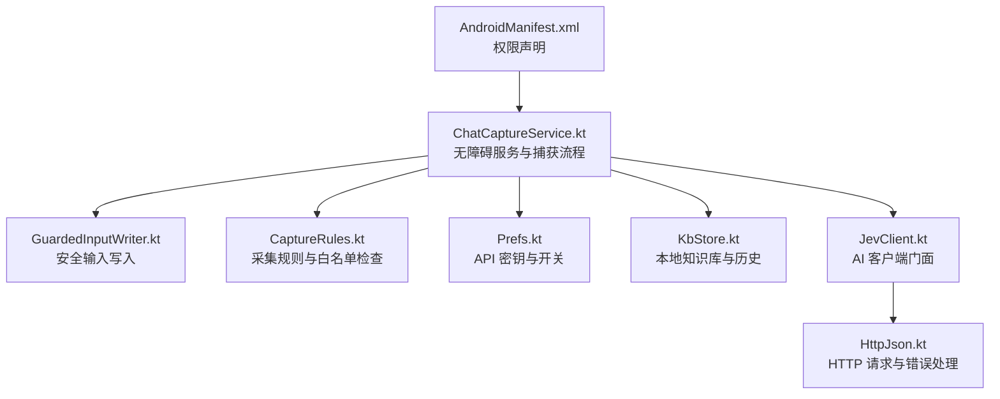
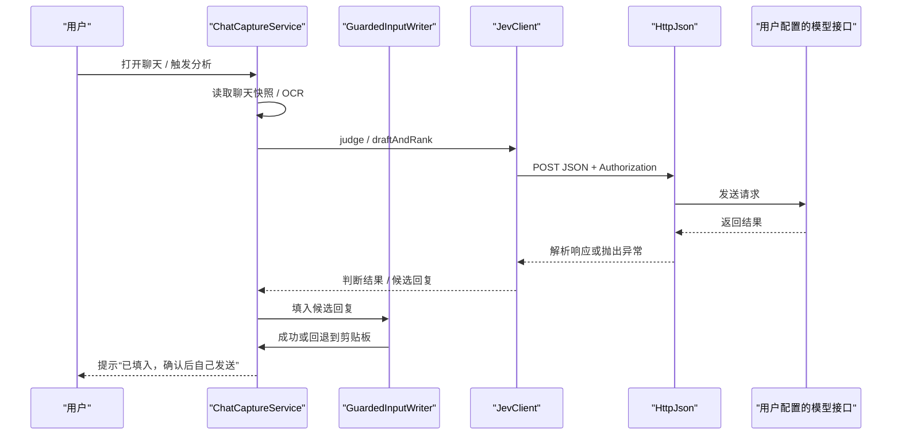
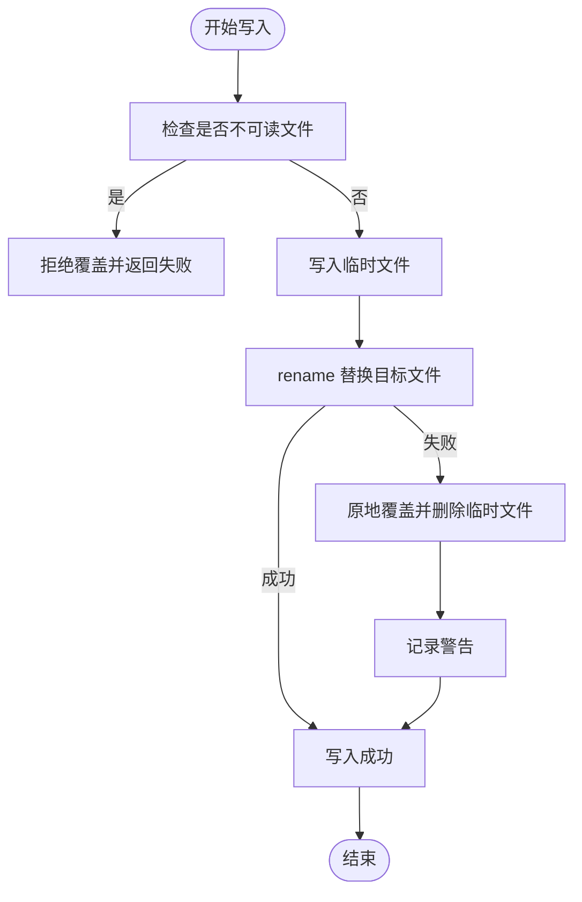
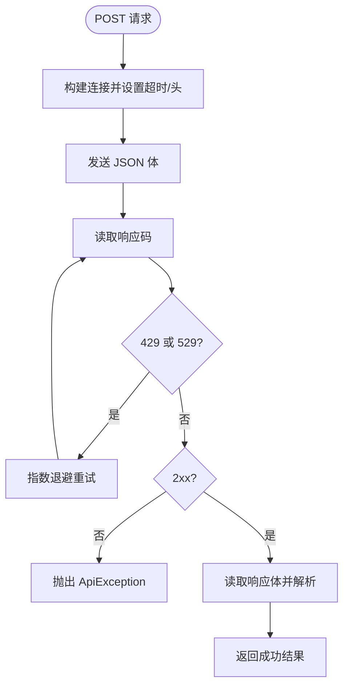
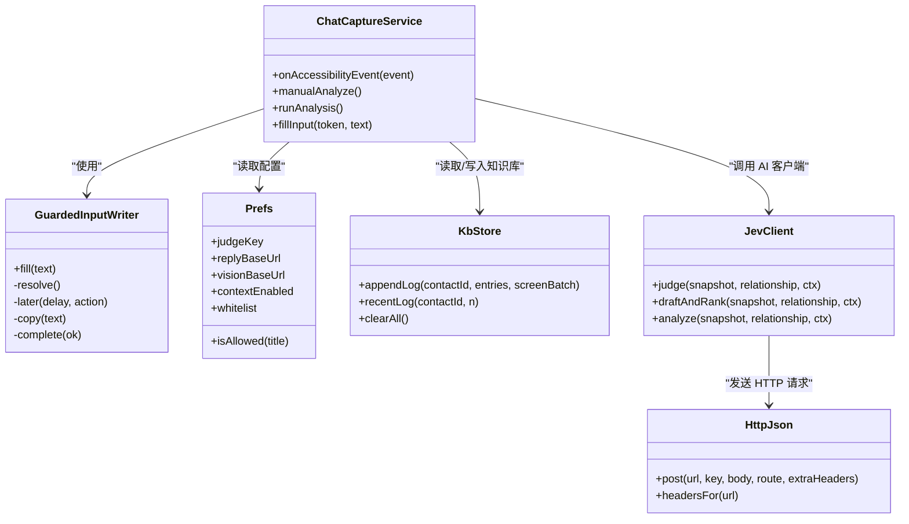

# 安全与隐私

<cite>
**本文引用的文件**   
- [GuardedInputWriter.kt](file://app/src/main/java/com/jev/probe/capture/GuardedInputWriter.kt)
- [ChatCaptureService.kt](file://app/src/main/java/com/jev/probe/capture/ChatCaptureService.kt)
- [CaptureRules.kt](file://app/src/main/java/com/jev/probe/capture/CaptureRules.kt)
- [Prefs.kt](file://app/src/main/java/com/jev/probe/core/Prefs.kt)
- [KbStore.kt](file://app/src/main/java/com/jev/probe/core/kb/KbStore.kt)
- [JevClient.kt](file://app/src/main/java/com/jev/probe/jev/JevClient.kt)
- [HttpJson.kt](file://app/src/main/java/com/jev/probe/jev/HttpJson.kt)
- [AndroidManifest.xml](file://app/src/main/AndroidManifest.xml)
- [GuardedInputWriterTest.kt](file://app/src/test/java/com/jev/probe/capture/GuardedInputWriterTest.kt)
- [PRIVACY.md](file://PRIVACY.md)
- [privacy.html](file://site/privacy.html)
</cite>

## 目录
1. [引言](#引言)
2. [项目结构与安全相关位置](#项目结构与安全相关位置)
3. [核心安全组件](#核心安全组件)
4. [架构总览](#架构总览)
5. [详细组件分析](#详细组件分析)
6. [依赖关系分析](#依赖关系分析)
7. [性能与可靠性考量](#性能与可靠性考量)
8. [故障排查指南](#故障排查指南)
9. [结论](#结论)

## 引言
本文件面向 Jev 聊天助手的安全与隐私，重点说明：
- 数据安全策略：本地存储、传输加密、敏感信息保护。
- 权限管理机制：无障碍服务、悬浮窗、网络、前台服务等权限的用途与边界。
- 隐私保护措施：数据最小化、用户控制权、第三方服务商数据处理。
- GuardedInputWriter 的安全写入机制、输入验证与防注入措施。
- 隐私政策、数据保留策略与用户权利保障。

## 项目结构与安全相关位置
本项目是 Android 应用，安全相关代码主要分布在以下模块：
- 捕获与服务层：`capture` 包负责读取聊天、截图 OCR、会话状态、输入框写入。
- 配置与本地存储：`core.Prefs` 管理 API 密钥、接口地址、开关；`core.kb.KbStore` 管理知识库与聊天历史。
- 网络请求层：`jev.HttpJson` 统一封装 HTTP JSON 请求、重试、错误分类。
- 客户端门面：`jev.JevClient` 聚合判断、回复、视觉等调用入口。
- 系统权限声明：`AndroidManifest.xml` 声明网络、悬浮窗、前台服务、通知等权限。
- 隐私文档：仓库根目录 `PRIVACY.md` 与站点 `site/privacy.html`。



**图表来源**
- [AndroidManifest.xml:1-57](file://app/src/main/AndroidManifest.xml#L1-L57)
- [ChatCaptureService.kt:28-41](file://app/src/main/java/com/jev/probe/capture/ChatCaptureService.kt#L28-L41)
- [GuardedInputWriter.kt:1-45](file://app/src/main/java/com/jev/probe/capture/GuardedInputWriter.kt#L1-L45)
- [CaptureRules.kt:1-69](file://app/src/main/java/com/jev/probe/capture/CaptureRules.kt#L1-L69)
- [Prefs.kt:6-13](file://app/src/main/java/com/jev/probe/core/Prefs.kt#L6-L13)
- [KbStore.kt:12-23](file://app/src/main/java/com/jev/probe/core/kb/KbStore.kt#L12-L23)
- [JevClient.kt:9-13](file://app/src/main/java/com/jev/probe/jev/JevClient.kt#L9-L13)
- [HttpJson.kt:43-47](file://app/src/main/java/com/jev/probe/jev/HttpJson.kt#L43-L47)

**章节来源**
- [AndroidManifest.xml:1-57](file://app/src/main/AndroidManifest.xml#L1-L57)
- [ChatCaptureService.kt:28-41](file://app/src/main/java/com/jev/probe/capture/ChatCaptureService.kt#L28-L41)
- [GuardedInputWriter.kt:1-45](file://app/src/main/java/com/jev/probe/capture/GuardedInputWriter.kt#L1-L45)
- [CaptureRules.kt:1-69](file://app/src/main/java/com/jev/probe/capture/CaptureRules.kt#L1-L69)
- [Prefs.kt:6-13](file://app/src/main/java/com/jev/probe/core/Prefs.kt#L6-L13)
- [KbStore.kt:12-23](file://app/src/main/java/com/jev/probe/core/kb/KbStore.kt#L12-L23)
- [JevClient.kt:9-13](file://app/src/main/java/com/jev/probe/jev/JevClient.kt#L9-L13)
- [HttpJson.kt:43-47](file://app/src/main/java/com/jev/probe/jev/HttpJson.kt#L43-L47)

## 核心安全组件
- Prefs：App 私有的 SharedPreferences，用于保存 API 密钥、接口地址、模型名、开关、白名单等。注释明确密钥不记录日志、不出现在代码或 Git 中，只记录键长度。
- HttpJson：统一的 POST JSON 工具，设置 Authorization 头、UTF-8 编码、超时、指数退避重试（429/529），并将所有失败归一化为 ApiException，避免泄露密钥。
- ChatCaptureService：无障碍服务，负责读取当前聊天、OCR、触发分析、显示悬浮面板、将候选回复填入输入框。明确“不自动发送消息”，仅执行 SET_TEXT 或粘贴回退。
- GuardedInputWriter：非阻塞填充序列，每次操作前重新解析并校验当前会话目标，防止写错输入框或跨会话写入。
- KbStore：本地知识库与聊天历史的原子写入、损坏文件备份、每联系人最多 300 条历史、一键清空 kb 目录。
- CaptureRules：排除系统界面、自身应用、启动器；限制手动分析的阻断条件；仅记录控件 id 名称，不记录聊天正文。

**章节来源**
- [Prefs.kt:6-13](file://app/src/main/java/com/jev/probe/core/Prefs.kt#L6-L13)
- [HttpJson.kt:43-47](file://app/src/main/java/com/jev/probe/jev/HttpJson.kt#L43-L47)
- [ChatCaptureService.kt:28-41](file://app/src/main/java/com/jev/probe/capture/ChatCaptureService.kt#L28-L41)
- [GuardedInputWriter.kt:1-45](file://app/src/main/java/com/jev/probe/capture/GuardedInputWriter.kt#L1-L45)
- [KbStore.kt:12-23](file://app/src/main/java/com/jev/probe/core/kb/KbStore.kt#L12-L23)
- [CaptureRules.kt:1-69](file://app/src/main/java/com/jev/probe/capture/CaptureRules.kt#L1-L69)

## 架构总览
Jev 聊天助手的安全架构围绕“本地优先、用户可控、最小暴露”展开：
- 本地数据：API 密钥、设置、知识库、聊天历史均保存在 App 私有目录，卸载即清空。
- 网络数据：仅向用户配置的模型接口发送判断和回复所需文本；密钥通过 Authorization 头传递；无作者服务器、无遥测、无埋点。
- 权限边界：无障碍服务用于读取聊天与填写输入框；悬浮窗用于显示分析面板；网络用于访问用户配置的接口；前台服务与通知用于保持服务不被系统冻结。
- 输入安全：GuardedInputWriter 在每次重试前重新解析输入节点，校验会话有效性，避免注入或误写。



**图表来源**
- [ChatCaptureService.kt:383-442](file://app/src/main/java/com/jev/probe/capture/ChatCaptureService.kt#L383-L442)
- [ChatCaptureService.kt:719-750](file://app/src/main/java/com/jev/probe/capture/ChatCaptureService.kt#L719-L750)
- [JevClient.kt:19-39](file://app/src/main/java/com/jev/probe/jev/JevClient.kt#L19-L39)
- [HttpJson.kt:56-122](file://app/src/main/java/com/jev/probe/jev/HttpJson.kt#L56-L122)

## 详细组件分析

### 数据安全策略

#### 本地存储
- Prefs 使用 MODE_PRIVATE 的 SharedPreferences，密钥、接口地址、模型名、开关、白名单等仅存在于本机。
- KbStore 将笔记、联系人、聊天历史保存在 `filesDir/kb` 下，采用临时文件加 rename 的原子写入，损坏文件会被备份为 `.corrupt.*`，避免覆盖用户数据。
- 聊天历史默认关闭，开启后每位联系人最多保留 300 条；可通过设置页一键清空 kb 目录。



**图表来源**
- [KbStore.kt:430-459](file://app/src/main/java/com/jev/probe/core/kb/KbStore.kt#L430-L459)

**章节来源**
- [Prefs.kt:14-16](file://app/src/main/java/com/jev/probe/core/Prefs.kt#L14-L16)
- [KbStore.kt:12-23](file://app/src/main/java/com/jev/probe/core/kb/KbStore.kt#L12-L23)
- [KbStore.kt:147-221](file://app/src/main/java/com/jev/probe/core/kb/KbStore.kt#L147-L221)
- [KbStore.kt:430-459](file://app/src/main/java/com/jev/probe/core/kb/KbStore.kt#L430-L459)

#### 传输加密
- HttpJson 使用 HttpURLConnection 发起 HTTPS 请求，设置 Authorization 头携带密钥，Content-Type 为 UTF-8 JSON。
- 对 429/529 进行指数退避重试，其他 4xx 不重试；所有异常被包装为 ApiException，错误信息不包含密钥。
- 针对 OpenRouter 添加 HTTP-Referer 与 X-Title 头，其它主机忽略未知头。



**图表来源**
- [HttpJson.kt:56-122](file://app/src/main/java/com/jev/probe/jev/HttpJson.kt#L56-L122)

**章节来源**
- [HttpJson.kt:43-47](file://app/src/main/java/com/jev/probe/jev/HttpJson.kt#L43-L47)
- [HttpJson.kt:56-122](file://app/src/main/java/com/jev/probe/jev/HttpJson.kt#L56-L122)
- [HttpJson.kt:132-148](file://app/src/main/java/com/jev/probe/jev/HttpJson.kt#L132-L148)

#### 敏感信息保护
- Prefs 注释强调密钥不记录日志、不出现在代码或 Git，只记录键长度。
- HttpJson 的错误描述函数对超时、域名解析、连接失败、SSL 证书错误等进行人类可读翻译，且不包含密钥。
- 日志输出仅包含消息条数、字符长度、异常类名，不输出聊天正文。

**章节来源**
- [Prefs.kt:6-13](file://app/src/main/java/com/jev/probe/core/Prefs.kt#L6-L13)
- [HttpJson.kt:138-148](file://app/src/main/java/com/jev/probe/jev/HttpJson.kt#L138-L148)
- [ChatCaptureService.kt:342-343](file://app/src/main/java/com/jev/probe/capture/ChatCaptureService.kt#L342-L343)

### 权限管理机制

#### 无障碍服务权限
- ChatCaptureService 继承 AccessibilityService，用于读取当前聊天窗口文字、检测新消息、将候选回复填入输入框。
- 明确“不自动发送消息”，唯一写操作是 ACTION_SET_TEXT 或剪贴板 PASTE 回退，最终发送由用户手动完成。
- 输入框查找会过滤密码字段、不可见、禁用状态，并对未知应用仅支持剪贴板复制，不直接写入。

**章节来源**
- [ChatCaptureService.kt:28-41](file://app/src/main/java/com/jev/probe/capture/ChatCaptureService.kt#L28-L41)
- [ChatCaptureService.kt:691-717](file://app/src/main/java/com/jev/probe/capture/ChatCaptureService.kt#L691-L717)
- [ChatCaptureService.kt:759-774](file://app/src/main/java/com/jev/probe/capture/ChatCaptureService.kt#L759-L774)

#### 悬浮窗权限
- AndroidManifest 声明 SYSTEM_ALERT_WINDOW，用于在聊天上方显示分析面板。
- OverlayController 控制悬浮面板显示、隐藏、加载状态、错误提示等。

**章节来源**
- [AndroidManifest.xml:5-5](file://app/src/main/AndroidManifest.xml#L5-L5)
- [ChatCaptureService.kt:201-220](file://app/src/main/java/com/jev/probe/capture/ChatCaptureService.kt#L201-L220)

#### 存储权限
- 应用未声明外部存储读写权限，所有数据保存在 App 私有目录。
- KbStore 的 clearAll 仅删除 kb 目录，不影响 SharedPreferences 中的密钥与其他设置。

**章节来源**
- [KbStore.kt:278-290](file://app/src/main/java/com/jev/probe/core/kb/KbStore.kt#L278-L290)
- [AndroidManifest.xml:1-57](file://app/src/main/AndroidManifest.xml#L1-L57)

#### 网络与前台服务
- 声明 INTERNET、FOREGROUND_SERVICE、FOREGROUND_SERVICE_SPECIAL_USE、POST_NOTIFICATIONS。
- KeepAliveService 用于保持服务在前台，避免被 OEM 电源管理冻结。

**章节来源**
- [AndroidManifest.xml:4-8](file://app/src/main/AndroidManifest.xml#L4-L8)
- [AndroidManifest.xml:46-53](file://app/src/main/AndroidManifest.xml#L46-L53)

### 隐私保护措施

#### 数据最小化原则
- 只会离开设备的只有用于生成判断和回复的聊天文字与背景信息，且只发往用户自己配置的模型接口。
- 截图本身从不上传，OCR 在手机本地完成。
- 日志只输出调试信息，不输出聊天正文。

**章节来源**
- [PRIVACY.md:11-17](file://PRIVACY.md#L11-L17)
- [PRIVACY.md:19-31](file://PRIVACY.md#L19-L31)
- [PRIVACY.md:56-56](file://PRIVACY.md#L56-L56)

#### 用户控制权
- 可关闭历史记录、清空知识库与历史、更换或自建接口、只用手动分析、设置会话白名单。
- 卸载即清空本机全部数据，无需云端账号或注销。

**章节来源**
- [PRIVACY.md:77-84](file://PRIVACY.md#L77-L84)
- [Prefs.kt:188-194](file://app/src/main/java/com/jev/probe/core/Prefs.kt#L188-L194)

#### 第三方服务商数据处理
- 用户在设置页填写的接口地址决定聊天内容最终发给谁；OpenRouter、TypeSafe、DeepSeek、阿里云百炼等服务商的隐私政策由各自官网决定。
- 作者不对第三方服务商的数据处理行为负责。

**章节来源**
- [PRIVACY.md:33-40](file://PRIVACY.md#L33-L40)
- [PRIVACY.md:86-88](file://PRIVACY.md#L86-L88)

### GuardedInputWriter 的安全写入机制

GuardedInputWriter 的核心目标是：在非阻塞条件下安全地将候选回复写入目标输入框，并在会话切换或目标失效时停止写入，必要时回退到剪贴板。

关键安全特性：
- 每次操作前通过 resolve() 重新获取 Input，确保会话仍有效。
- 先尝试 setText，若未生效则 focus 并重试一次。
- 若仍不一致，则清空输入框并尝试 paste，最后再次校验。
- 任何阶段若会话无效，立即停止后续操作，避免误写。

```mermaid
flowchart TD
Start(["fill(text)"]) --> Resolve["resolve() 获取 Input"]
Resolve --> |为空| Exit["直接返回"]
Resolve --> SetText["setText(text)"]
SetText --> Delay1["延迟检查"]
Delay1 --> Fresh["fresh = resolve()"]
Fresh --> |为空| Stop["停止"]
Fresh --> CheckEqual{"text 是否相等?"}
CheckEqual --> |是| CompleteTrue["complete(true)"]
CheckEqual --> |否| Focus["focus()"]
Focus --> Delay2["延迟重试"]
Delay2 --> RetryResolve["retryInput = resolve()"]
RetryResolve --> |为空| Stop
RetryResolve --> SetTextAgain["setText(text)"]
SetTextAgain --> Delay3["延迟检查"]
Delay3 --> AfterRetry["after = resolve()"]
AfterRetry --> |为空| Stop
AfterRetry --> EqualAgain{"text 是否相等?"}
EqualAgain --> |是| CompleteTrue
EqualAgain --> |否| Copy["copy(text)"]
Copy --> ClearCheck{"setText(\"\") 成功?"}
ClearCheck --> |是| Paste["paste()"]
ClearCheck --> |否| Stop
Paste --> FinalCheck["afterPaste = resolve()"]
FinalCheck --> CompareFinal{"after.text == text?"}
CompareFinal --> |是| CompleteTrue
CompareFinal --> |否| CompleteFalse["complete(false)"]
```

**图表来源**
- [GuardedInputWriter.kt:17-43](file://app/src/main/java/com/jev/probe/capture/GuardedInputWriter.kt#L17-L43)

测试用例覆盖了：
- 成功写入不触发 focus、clear、paste。
- 会话切换时不写入或停止重试。
- 清空草稿触发会话切换时停止 paste。
- 会话未变化时使用剪贴板回退。

**章节来源**
- [GuardedInputWriter.kt:1-45](file://app/src/main/java/com/jev/probe/capture/GuardedInputWriter.kt#L1-L45)
- [GuardedInputWriterTest.kt:41-102](file://app/src/test/java/com/jev/probe/capture/GuardedInputWriterTest.kt#L41-L102)

### 输入验证与防注入措施
- ChatCaptureService 在查找输入框时过滤密码字段、不可见、禁用状态，并对未知应用仅支持剪贴板复制。
- GuardedInputWriter 每次重试前重新解析输入节点，校验会话有效性，避免跨会话写入。
- CaptureRules 排除系统界面、自身应用、启动器，防止误读或误写。
- 日志仅记录控件 id 名称与计数，不记录聊天正文，降低泄露风险。

**章节来源**
- [ChatCaptureService.kt:691-717](file://app/src/main/java/com/jev/probe/capture/ChatCaptureService.kt#L691-L717)
- [ChatCaptureService.kt:759-774](file://app/src/main/java/com/jev/probe/capture/ChatCaptureService.kt#L759-L774)
- [GuardedInputWriter.kt:17-43](file://app/src/main/java/com/jev/probe/capture/GuardedInputWriter.kt#L17-L43)
- [CaptureRules.kt:14-25](file://app/src/main/java/com/jev/probe/capture/CaptureRules.kt#L14-L25)
- [CaptureRules.kt:40-56](file://app/src/main/java/com/jev/probe/capture/CaptureRules.kt#L40-L56)

## 依赖关系分析



**图表来源**
- [ChatCaptureService.kt:42-800](file://app/src/main/java/com/jev/probe/capture/ChatCaptureService.kt#L42-L800)
- [GuardedInputWriter.kt:4-45](file://app/src/main/java/com/jev/probe/capture/GuardedInputWriter.kt#L4-L45)
- [Prefs.kt:74-254](file://app/src/main/java/com/jev/probe/core/Prefs.kt#L74-L254)
- [KbStore.kt:172-241](file://app/src/main/java/com/jev/probe/core/kb/KbStore.kt#L172-L241)
- [JevClient.kt:14-39](file://app/src/main/java/com/jev/probe/jev/JevClient.kt#L14-L39)
- [HttpJson.kt:48-122](file://app/src/main/java/com/jev/probe/jev/HttpJson.kt#L48-L122)

**章节来源**
- [ChatCaptureService.kt:42-800](file://app/src/main/java/com/jev/probe/capture/ChatCaptureService.kt#L42-L800)
- [GuardedInputWriter.kt:4-45](file://app/src/main/java/com/jev/probe/capture/GuardedInputWriter.kt#L4-L45)
- [Prefs.kt:74-254](file://app/src/main/java/com/jev/probe/core/Prefs.kt#L74-L254)
- [KbStore.kt:172-241](file://app/src/main/java/com/jev/probe/core/kb/KbStore.kt#L172-L241)
- [JevClient.kt:14-39](file://app/src/main/java/com/jev/probe/jev/JevClient.kt#L14-L39)
- [HttpJson.kt:48-122](file://app/src/main/java/com/jev/probe/jev/HttpJson.kt#L48-L122)

## 性能与可靠性考量
- ChatCaptureService 使用固定线程池执行分析任务，避免阻塞主线程；对 RejectedExecutionException 做容错处理。
- 输入写入使用 Handler.postDelayed 实现非阻塞重试，避免 UI 卡顿。
- HttpJson 对 429/529 进行指数退避重试，减少瞬时拥塞导致的失败。
- KbStore 使用原子写入与损坏文件备份，提升数据可靠性。

**章节来源**
- [ChatCaptureService.kt:44-58](file://app/src/main/java/com/jev/probe/capture/ChatCaptureService.kt#L44-L58)
- [ChatCaptureService.kt:719-750](file://app/src/main/java/com/jev/probe/capture/ChatCaptureService.kt#L719-L750)
- [HttpJson.kt:81-85](file://app/src/main/java/com/jev/probe/jev/HttpJson.kt#L81-L85)
- [KbStore.kt:430-459](file://app/src/main/java/com/jev/probe/core/kb/KbStore.kt#L430-L459)

## 故障排查指南
- 如果无法截屏识别：检查无障碍服务是否启用，重新开关服务后重进会话。
- 如果分析按钮无响应：检查总开关、是否正在分析、是否尚未读到会话内容。
- 如果网络请求失败：检查接口地址、密钥、网络连接、HTTPS 证书；查看 ApiException 中的路由与状态码。
- 如果输入框未填入：检查会话是否切换、输入框是否可用、是否回退到剪贴板。

**章节来源**
- [ChatCaptureService.kt:452-466](file://app/src/main/java/com/jev/probe/capture/ChatCaptureService.kt#L452-L466)
- [CaptureRules.kt:32-38](file://app/src/main/java/com/jev/probe/capture/CaptureRules.kt#L32-L38)
- [HttpJson.kt:20-41](file://app/src/main/java/com/jev/probe/jev/HttpJson.kt#L20-L41)
- [ChatCaptureService.kt:719-750](file://app/src/main/java/com/jev/probe/capture/ChatCaptureService.kt#L719-L750)

## 结论
Jev 聊天助手的安全与隐私设计以本地优先、用户可控为核心：
- 数据仅存本机，卸载即清空；知识库与历史可一键清理。
- 网络请求仅发往用户配置的模型接口，密钥通过 Authorization 头传递，无作者服务器、无遥测。
- 权限严格限定于无障碍服务、悬浮窗、网络、前台服务，不自动发送消息，不触碰支付相关操作。
- GuardedInputWriter 提供安全的输入写入机制，防止跨会话写入与注入风险。
- 隐私政策明确数据最小化、用户控制权与第三方服务商数据处理边界。