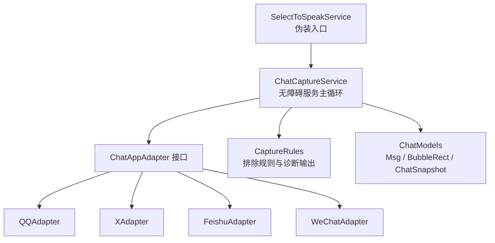
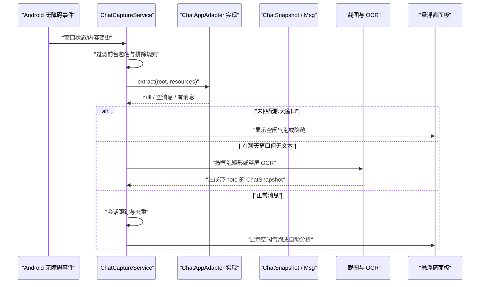
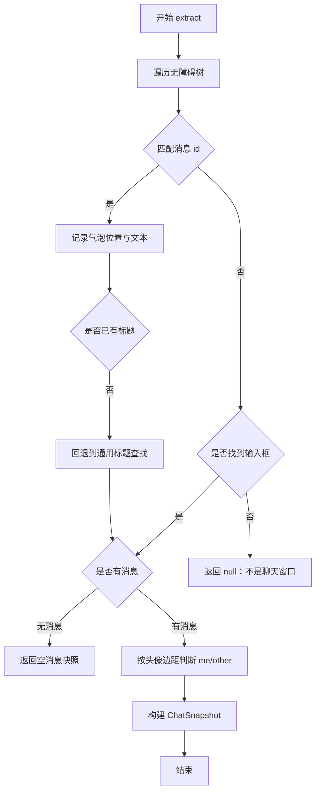
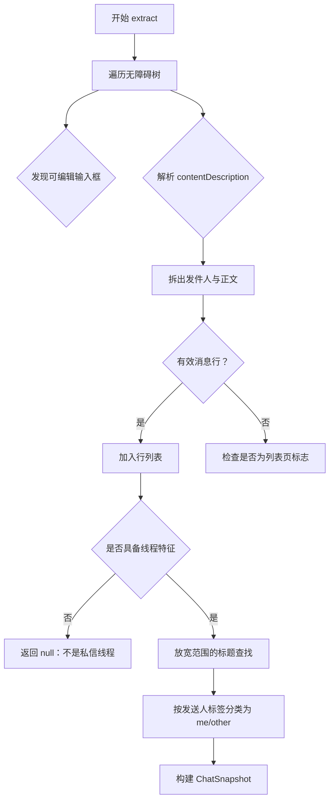
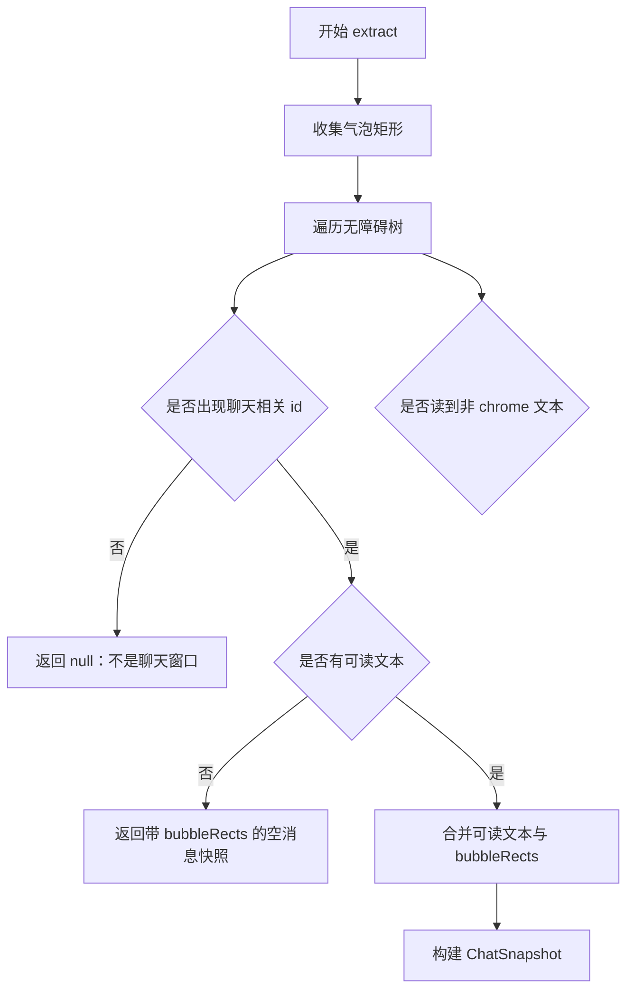
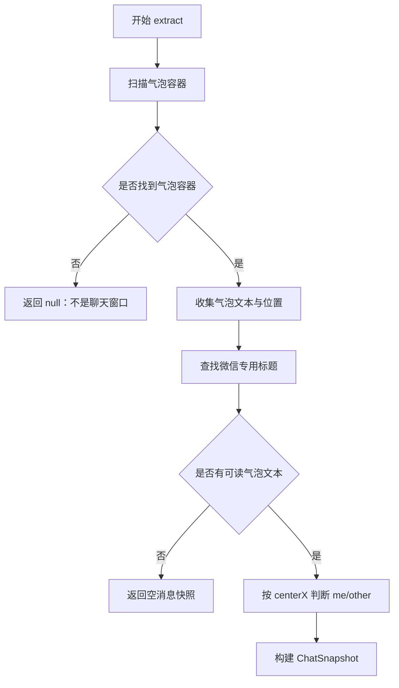
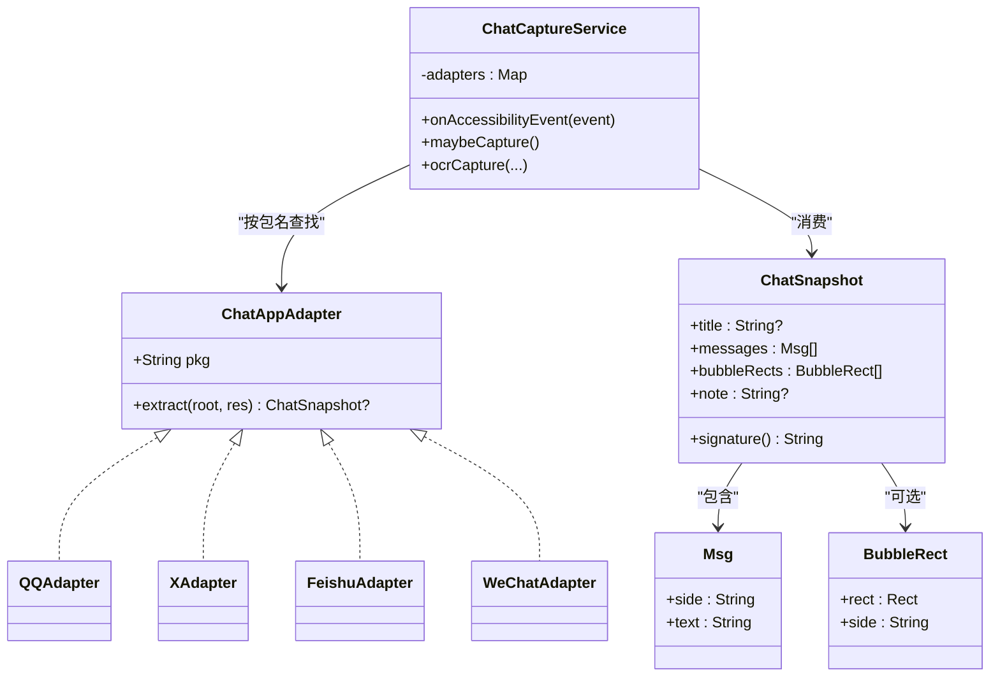

# 平台适配指南

<cite>
**本文引用的文件**   
- [ChatAppAdapter.kt](file://app/src/main/java/com/jev/probe/capture/ChatAppAdapter.kt)
- [ChatCaptureService.kt](file://app/src/main/java/com/jev/probe/capture/ChatCaptureService.kt)
- [CaptureRules.kt](file://app/src/main/java/com/jev/probe/capture/CaptureRules.kt)
- [ChatModels.kt](file://app/src/main/java/com/jev/probe/core/ChatModels.kt)
- [SelectToSpeakService.kt](file://app/src/main/java/com/google/android/accessibility/selecttospeak/SelectToSpeakService.kt)
- [ConversationSessionTest.kt](file://app/src/test/java/com/jev/probe/capture/ConversationSessionTest.kt)
- [CaptureRulesTest.kt](file://app/src/test/java/com/jev/probe/capture/CaptureRulesTest.kt)
</cite>

## 目录
1. [引言](#引言)
2. [项目结构](#项目结构)
3. [核心组件](#核心组件)
4. [架构总览](#架构总览)
5. [详细组件分析](#详细组件分析)
6. [依赖关系分析](#依赖关系分析)
7. [新增平台适配器完整步骤](#新增平台适配器完整步骤)
8. [性能与稳定性考虑](#性能与稳定性考虑)
9. [测试验证方法](#测试验证方法)
10. [调试技巧与常见问题](#调试技巧与常见问题)
11. [结论](#结论)

## 引言
本指南面向需要为新的聊天类 App 接入 ChatAppAdapter 的开发者。文档围绕以下目标展开：
- 解释 ChatAppAdapter 接口的设计理念、pkg 包名映射和 extract 方法的三态契约。
- 说明消息列表提取逻辑，包括“是否在聊天窗口”“如何识别标题”“如何区分发送方”。
- 对比现有 QQ、X/Twitter、飞书、微信四个平台适配器的实现差异与技术要点。
- 给出新增平台适配器的完整流程：无障碍树分析、节点定位、消息解析、边界情况处理。
- 提供测试验证方法和调试技巧，帮助快速定位适配失败原因。

## 项目结构
与平台适配直接相关的代码集中在 capture 包和 core 包中：
- capture 包负责无障碍事件监听、会话状态管理、截图 OCR 以及各平台适配器。
- core 包定义跨模块共享的数据模型，如 Msg、BubbleRect、ChatSnapshot。
- SelectToSpeakService 是伪装成系统无障碍服务的入口，用于绕过部分 App 对无障碍树的屏蔽。

**图表来源**
- [ChatCaptureService.kt:28-52](file://app/src/main/java/com/jev/probe/capture/ChatCaptureService.kt#L28-L52)
- [ChatAppAdapter.kt:10-30](file://app/src/main/java/com/jev/probe/capture/ChatAppAdapter.kt#L10-L30)
- [ChatModels.kt:5-38](file://app/src/main/java/com/jev/probe/core/ChatModels.kt#L5-L38)
- [SelectToSpeakService.kt:5-13](file://app/src/main/java/com/google/android/accessibility/selecttospeak/SelectToSpeakService.kt#L5-L13)

**章节来源**
- [ChatCaptureService.kt:28-52](file://app/src/main/java/com/jev/probe/capture/ChatCaptureService.kt#L28-L52)
- [ChatAppAdapter.kt:10-30](file://app/src/main/java/com/jev/probe/capture/ChatAppAdapter.kt#L10-L30)
- [ChatModels.kt:5-38](file://app/src/main/java/com/jev/probe/core/ChatModels.kt#L5-L38)
- [SelectToSpeakService.kt:5-13](file://app/src/main/java/com/google/android/accessibility/selecttospeak/SelectToSpeakService.kt#L5-L13)

## 核心组件
### ChatAppAdapter 接口设计
ChatAppAdapter 是“每个聊天 App 一个适配器”的核心抽象，职责是把某个聊天 App 当前打开的聊天窗口转换成统一的 ChatSnapshot。它只暴露两个成员：
- pkg：应用包名，用于注册到服务端的适配器表。
- extract：从无障碍根节点中提取聊天快照。

extract 的三态契约非常重要：
- 返回 null：当前不在该 App 的聊天窗口（例如列表页、朋友圈、设置）。服务端不做任何自动捕获。
- 返回 messages 为空：在聊天窗口，但无障碍树没有可读消息文本。这是 OCR 兜底的信号。
- 返回 messages 非空：正常捕获，进入后续判断与回复生成流程。

此外，注释明确说明：伪装无障碍服务可以让某些会混淆无障碍树的 App（如微信）暴露完整控件树；而飞书等不混淆的 App 可以直接读取资源 id。

**章节来源**
- [ChatAppAdapter.kt:10-30](file://app/src/main/java/com/jev/probe/capture/ChatAppAdapter.kt#L10-L30)

### ChatSnapshot 数据模型
ChatSnapshot 是适配器输出的统一结果，包含：
- title：会话标题，可能为空或瞬态占位。
- messages：消息列表，每条消息用 side 表示“我”或“对方”，text 表示内容。
- bubbleRects：当消息正文不可读时，由适配器提供气泡矩形和推断的发送方，供 OCR 逐条识别。
- note：可选提示，例如 OCR 无法判断发送方时的说明。
- signature：基于最近若干条消息的稳定签名，用于去重和检测真实变化。

**章节来源**
- [ChatModels.kt:5-38](file://app/src/main/java/com/jev/probe/core/ChatModels.kt#L5-L38)

### CaptureRules 辅助决策
CaptureRules 提供纯函数式决策，避免把错误路径变成静默死胡同：
- isExcludedForeground：排除自身 App、系统 UI、桌面启动器等前台。
- manualBlock：决定“分析当前对话”按钮是否被禁用，并给出用户可操作文案。
- idInventory：统计无障碍树中的资源 id，用于日志诊断，不包含消息文本。

**章节来源**
- [CaptureRules.kt:12-57](file://app/src/main/java/com/jev/probe/capture/CaptureRules.kt#L12-L57)

## 架构总览
整体流程可以理解为：无障碍事件触发 → 服务根据前台包名选择适配器 → 适配器提取 ChatSnapshot → 服务进行会话跟踪、去重、OCR 兜底、AI 判断与悬浮窗展示。

**图表来源**
- [ChatCaptureService.kt:233-354](file://app/src/main/java/com/jev/probe/capture/ChatCaptureService.kt#L233-L354)
- [ChatCaptureService.kt:444-689](file://app/src/main/java/com/jev/probe/capture/ChatCaptureService.kt#L444-L689)
- [ChatAppAdapter.kt:10-30](file://app/src/main/java/com/jev/probe/capture/ChatAppAdapter.kt#L10-L30)

## 详细组件分析

### QQ 适配器
QQ 适配器针对 com.tencent.mobileqq，关键特征如下：
- 无障碍树未被混淆，消息体使用固定资源 id。
- “在聊天窗口”的判断依赖输入框是否存在；若只有输入框但没有消息体，则返回空消息快照，作为 OCR 兜底信号。
- 标题优先使用固定 id，否则回退到通用标题查找逻辑。
- 发送方判断不使用简单中心点，而是比较气泡左右边缘与头像列的距离，从而避免长消息导致中心偏移误判。

技术要点：
- 使用 viewIdResourceName 精确匹配消息节点。
- 维护 firstBubbleTop 以限制标题搜索区域。
- 使用内部 Bubble 数据结构记录 top/left/right/text，再排序后转换为 Msg。

**图表来源**
- [ChatAppAdapter.kt:197-247](file://app/src/main/java/com/jev/probe/capture/ChatAppAdapter.kt#L197-L247)

**章节来源**
- [ChatAppAdapter.kt:181-247](file://app/src/main/java/com/jev/probe/capture/ChatAppAdapter.kt#L181-L247)

### X / Twitter 适配器
X 适配器针对 com.twitter.android 的私信线程，关键特征如下：
- Compose UI 的消息行是裸 View，没有稳定 resource-id，也没有 text，完整信息在 contentDescription 中。
- 发送方来自描述中的“你/You”标签，而不是几何位置，因为每行都是全屏宽度。
- “在聊天窗口”的判断需要同时满足：存在输入框，并且出现“消息行形状”或“私信占位标签”。
- 需要排除 DM 列表页的干扰项，例如“新私信”入口、仅含列表标题的行。
- 标题查找放宽水平居中范围，因为 X 的线程标题左对齐。

技术要点：
- parseXDesc 从 contentDescription 中拆分 sender 和 body，并剥离已读标记、时间戳和多余分隔符。
- 通过 hasMessageRowShape 和 hasDmLabel 共同确认线程上下文。
- 对列表页的“聊天/Messages”标题与 rows 数量做联合判断，避免误入。

**图表来源**
- [ChatAppAdapter.kt:378-510](file://app/src/main/java/com/jev/probe/capture/ChatAppAdapter.kt#L378-L510)

**章节来源**
- [ChatAppAdapter.kt:378-510](file://app/src/main/java/com/jev/probe/capture/ChatAppAdapter.kt#L378-L510)

### 飞书适配器
飞书适配器针对 com.ss.android.lark，关键特征如下：
- 无障碍树不混淆，但消息正文是绘制出来的，树里通常只有气泡容器和 chrome。
- 因此适配器主要提供气泡矩形集合 bubbleRects，让服务在截图回调中按矩形 OCR。
- “在聊天窗口”的判断依据是 message、bubble_content_container 或富文本输入框 id。
- 发送方判断不能靠左右布局，而是通过子树中是否存在“已读/未读”状态条来推断“我的消息”。

技术要点：
- collectFeishuBubbleRects 独立出来，以便在服务端截图回调中重新测量，避免滚动导致的错位。
- 过滤掉 action bar、tab 行、输入框等区域，只保留屏幕中间的有效气泡。
- 如果树中能读到少量 TextView 文本，也会尝试合并进 messages，但主体仍依赖 OCR。

**图表来源**
- [ChatAppAdapter.kt:249-376](file://app/src/main/java/com/jev/probe/capture/ChatAppAdapter.kt#L249-L376)
- [ChatCaptureService.kt:530-598](file://app/src/main/java/com/jev/probe/capture/ChatCaptureService.kt#L530-L598)

**章节来源**
- [ChatAppAdapter.kt:249-376](file://app/src/main/java/com/jev/probe/capture/ChatAppAdapter.kt#L249-L376)
- [ChatCaptureService.kt:530-598](file://app/src/main/java/com/jev/probe/capture/ChatCaptureService.kt#L530-L598)

### 微信适配器
微信适配器针对 com.tencent.mm，关键特征如下：
- 微信会混淆无障碍树，普通服务只能读到极少节点；本项目通过伪装成 SelectToSpeakService 的服务类获取完整树。
- 气泡容器使用稳定 id，即使文本被脱敏，只要容器存在就能证明“在聊天窗口”。
- 发送方判断依靠气泡的水平中心位置：右侧为“我”，左侧为“对方”。
- 标题查找使用专门的 findWeChatTitle，排除中文标点、日期时间，并优先选择带成员数后缀的群标题。

技术要点：
- WeChatAdapter.extract 先扫描所有气泡容器，收集 top、centerX、text。
- 如果 bubbles 为空但检测到气泡容器，返回空消息快照，触发 OCR 兜底。
- findWeChatTitle 比通用标题查找更严格，避免把公告或杂散消息当成标题。

**图表来源**
- [ChatAppAdapter.kt:130-179](file://app/src/main/java/com/jev/probe/capture/ChatAppAdapter.kt#L130-L179)
- [ChatAppAdapter.kt:93-128](file://app/src/main/java/com/jev/probe/capture/ChatAppAdapter.kt#L93-L128)
- [SelectToSpeakService.kt:5-13](file://app/src/main/java/com/google/android/accessibility/selecttospeak/SelectToSpeakService.kt#L5-L13)

**章节来源**
- [ChatAppAdapter.kt:130-179](file://app/src/main/java/com/jev/probe/capture/ChatAppAdapter.kt#L130-L179)
- [ChatAppAdapter.kt:93-128](file://app/src/main/java/com/jev/probe/capture/ChatAppAdapter.kt#L93-L128)
- [SelectToSpeakService.kt:5-13](file://app/src/main/java/com/google/android/accessibility/selecttospeak/SelectToSpeakService.kt#L5-L13)

## 依赖关系分析
ChatAppAdapter 本身不依赖具体业务逻辑，只依赖 Android 无障碍 API 和 core 包数据模型。ChatCaptureService 是调度者，负责：
- 根据前台包名查找适配器。
- 调用 extract 并处理三种返回值。
- 在无文本时走 OCR 路径。
- 将 ChatSnapshot 交给会话管理与悬浮窗展示。

**图表来源**
- [ChatAppAdapter.kt:27-30](file://app/src/main/java/com/jev/probe/capture/ChatAppAdapter.kt#L27-L30)
- [ChatAppAdapter.kt:139-179](file://app/src/main/java/com/jev/probe/capture/ChatAppAdapter.kt#L139-L179)
- [ChatAppAdapter.kt:197-247](file://app/src/main/java/com/jev/probe/capture/ChatAppAdapter.kt#L197-L247)
- [ChatAppAdapter.kt:319-376](file://app/src/main/java/com/jev/probe/capture/ChatAppAdapter.kt#L319-L376)
- [ChatAppAdapter.kt:440-510](file://app/src/main/java/com/jev/probe/capture/ChatAppAdapter.kt#L440-L510)
- [ChatCaptureService.kt:47-52](file://app/src/main/java/com/jev/probe/capture/ChatCaptureService.kt#L47-L52)
- [ChatModels.kt:5-38](file://app/src/main/java/com/jev/probe/core/ChatModels.kt#L5-L38)

**章节来源**
- [ChatCaptureService.kt:47-52](file://app/src/main/java/com/jev/probe/capture/ChatCaptureService.kt#L47-L52)
- [ChatAppAdapter.kt:27-30](file://app/src/main/java/com/jev/probe/capture/ChatAppAdapter.kt#L27-L30)
- [ChatModels.kt:5-38](file://app/src/main/java/com/jev/probe/core/ChatModels.kt#L5-L38)

## 新增平台适配器完整步骤

### 第一步：确定包名与入口
- 在 ChatCaptureService 的适配器表中注册新适配器，键为应用的包名。
- 如果目标 App 会屏蔽无障碍树，需要评估是否需要伪装服务入口；微信已经通过 SelectToSpeakService 绕过屏蔽，其他 App 应实测后再决定是否沿用同样策略。

**章节来源**
- [ChatCaptureService.kt:47-52](file://app/src/main/java/com/jev/probe/capture/ChatCaptureService.kt#L47-L52)
- [SelectToSpeakService.kt:5-13](file://app/src/main/java/com/google/android/accessibility/selecttospeak/SelectToSpeakService.kt#L5-L13)

### 第二步：无障碍树分析
- 打开目标 App 的聊天窗口，观察无障碍树中是否存在稳定的资源 id。
- 如果消息体是普通 TextView 且 id 稳定，参考 QQ 适配器。
- 如果消息体是绘制文本或 Compose 裸 View，id 不稳定，参考飞书或 X 适配器，准备使用 contentDescription、geometry 或 OCR。
- 如果 App 会混淆无障碍树，优先尝试伪装服务；否则记录“树中没有可用 id”的诊断信息。

**章节来源**
- [ChatAppAdapter.kt:181-247](file://app/src/main/java/com/jev/probe/capture/ChatAppAdapter.kt#L181-L247)
- [ChatAppAdapter.kt:319-376](file://app/src/main/java/com/jev/probe/capture/ChatAppAdapter.kt#L319-L376)
- [ChatAppAdapter.kt:440-510](file://app/src/main/java/com/jev/probe/capture/ChatAppAdapter.kt#L440-L510)

### 第三步：实现 extract 方法
extract 必须遵守三态契约：
- 不在聊天窗口：返回 null。
- 在聊天窗口但无可读消息：返回 ChatSnapshot(title, emptyList(), ...)。
- 正常消息：返回 ChatSnapshot(title, messages)。

建议实现顺序：
1. 扫描无障碍树，收集候选消息节点。
2. 判断“是否在聊天窗口”，可使用输入框、消息容器、特定 id 或 contentDescription 形状。
3. 提取标题：优先使用稳定 id，否则使用 findTitleInActionBar 或平台专用标题查找。
4. 提取消息：将节点文本转为 Msg，并根据平台特征判断 side。
5. 如果正文不可读：返回 bubbleRects，让服务走 OCR 路径。

**章节来源**
- [ChatAppAdapter.kt:10-30](file://app/src/main/java/com/jev/probe/capture/ChatAppAdapter.kt#L10-L30)
- [ChatAppAdapter.kt:45-74](file://app/src/main/java/com/jev/probe/capture/ChatAppAdapter.kt#L45-L74)
- [ChatModels.kt:27-38](file://app/src/main/java/com/jev/probe/core/ChatModels.kt#L27-L38)

### 第四步：消息列表提取逻辑
不同平台的侧重点不同：
- QQ：按 id 筛选消息体，按头像边距判断发送方。
- X：按 contentDescription 解析 sender/body，按“你/You”判断发送方。
- 飞书：按气泡容器矩形 + 已读状态条推断发送方，正文走 OCR。
- 微信：按气泡容器 id 判断聊天窗口，按 centerX 判断发送方，标题需额外过滤。

**章节来源**
- [ChatAppAdapter.kt:197-247](file://app/src/main/java/com/jev/probe/capture/ChatAppAdapter.kt#L197-L247)
- [ChatAppAdapter.kt:378-510](file://app/src/main/java/com/jev/probe/capture/ChatAppAdapter.kt#L378-L510)
- [ChatAppAdapter.kt:249-376](file://app/src/main/java/com/jev/probe/capture/ChatAppAdapter.kt#L249-L376)
- [ChatAppAdapter.kt:130-179](file://app/src/main/java/com/jev/probe/capture/ChatAppAdapter.kt#L130-L179)

### 第五步：边界情况处理
新增适配器需要至少覆盖以下边界：
- 列表页、个人资料页、设置页：不应被识别为聊天窗口。
- 空聊天窗口：应有标题或占位文本，但 messages 为空，触发 OCR。
- 瞬态标题：例如“连接中…”“加载中…”，不应作为稳定会话标识。
- 多窗口场景：同一标题在不同 App 或不同 windowId 下应视为不同会话。
- 输入框存在但无消息：应返回空消息快照，而不是 null。
- 无障碍树被混淆：应记录 id 清单，便于后续适配更新。

**章节来源**
- [ChatAppAdapter.kt:181-247](file://app/src/main/java/com/jev/probe/capture/ChatAppAdapter.kt#L181-L247)
- [ChatAppAdapter.kt:440-510](file://app/src/main/java/com/jev/probe/capture/ChatAppAdapter.kt#L440-L510)
- [ChatCaptureService.kt:356-364](file://app/src/main/java/com/jev/probe/capture/ChatCaptureService.kt#L356-L364)
- [CaptureRules.kt:41-57](file://app/src/main/java/com/jev/probe/capture/CaptureRules.kt#L41-L57)

## 性能与稳定性考虑
- 遍历无障碍树时必须加 guard，防止无限递归或过深树导致卡顿。现有适配器普遍使用 ArrayDeque 栈和计数器。
- 截图与 OCR 是昂贵操作，服务中对自动截图做了节流、签名去重和失败退避。
- 会话状态使用 ConversationSession 管理，避免旧请求在新会话中复活。
- 悬浮窗回调和服务生命周期解耦，销毁时清理回调、任务队列和 overlay 引用。

**章节来源**
- [ChatAppAdapter.kt:148-165](file://app/src/main/java/com/jev/probe/capture/ChatAppAdapter.kt#L148-L165)
- [ChatAppAdapter.kt:211-224](file://app/src/main/java/com/jev/probe/capture/ChatAppAdapter.kt#L211-L224)
- [ChatAppAdapter.kt:334-354](file://app/src/main/java/com/jev/probe/capture/ChatAppAdapter.kt#L334-L354)
- [ChatCaptureService.kt:302-354](file://app/src/main/java/com/jev/probe/capture/ChatCaptureService.kt#L302-L354)
- [ChatCaptureService.kt:530-689](file://app/src/main/java/com/jev/probe/capture/ChatCaptureService.kt#L530-L689)

## 测试验证方法
### 单元测试覆盖
- CaptureRulesTest 验证前台排除规则、手动分析阻塞原因、id 清单输出格式。
- ConversationSessionTest 验证会话切换、窗口变化、消息签名变化、显式失效等场景。

建议为新适配器补充测试：
- 不在聊天窗口时 extract 返回 null。
- 在聊天窗口但无文本时返回空消息。
- 正常消息时 messages 非空且 side 正确。
- 标题稳定且不被瞬态占位词污染。
- bubbleRects 在非 OCR 场景为空，在飞书类场景不为空。

**章节来源**
- [CaptureRulesTest.kt:23-47](file://app/src/test/java/com/jev/probe/capture/CaptureRulesTest.kt#L23-L47)
- [CaptureRulesTest.kt:51-86](file://app/src/test/java/com/jev/probe/capture/CaptureRulesTest.kt#L51-L86)
- [CaptureRulesTest.kt:90-120](file://app/src/test/java/com/jev/probe/capture/CaptureRulesTest.kt#L90-L120)
- [ConversationSessionTest.kt:10-87](file://app/src/test/java/com/jev/probe/capture/ConversationSessionTest.kt#L10-L87)

### 真机验证步骤
1. 安装并启用无障碍服务。
2. 打开目标 App 的聊天窗口，确认悬浮球出现。
3. 验证自动捕获：收到对方消息后，是否弹出分析面板。
4. 验证 OCR 兜底：对于飞书或微信等正文不可读的场景，是否通过截屏识别出消息。
5. 验证手动识别：点击“截屏识别一次”，是否能对任意 App 进行一次 OCR。
6. 验证填写输入框：点击候选回复后，是否能写入对应 App 的输入框。

**章节来源**
- [ChatCaptureService.kt:219-230](file://app/src/main/java/com/jev/probe/capture/ChatCaptureService.kt#L219-L230)
- [ChatCaptureService.kt:444-486](file://app/src/main/java/com/jev/probe/capture/ChatCaptureService.kt#L444-L486)
- [ChatCaptureService.kt:691-750](file://app/src/main/java/com/jev/probe/capture/ChatCaptureService.kt#L691-L750)

## 调试技巧与常见问题

### 无障碍树没有匹配到聊天窗口
常见原因：
- App 更新后资源 id 发生变化。
- 目标页面不是聊天窗口，而是列表页或设置页。
- 无障碍树被混淆，普通服务只能读到空节点。

排查方法：
- 使用“截屏识别一次”触发 logTreeIds，查看当前树中实际存在的资源 id。
- 对照 CaptureRules.idInventory 的输出，确认是否包含适配器硬编码的 id。
- 如果是微信类混淆 App，确认是否通过伪装服务读取树。

**章节来源**
- [ChatCaptureService.kt:494-511](file://app/src/main/java/com/jev/probe/capture/ChatCaptureService.kt#L494-L511)
- [CaptureRules.kt:41-57](file://app/src/main/java/com/jev/probe/capture/CaptureRules.kt#L41-L57)
- [SelectToSpeakService.kt:5-13](file://app/src/main/java/com/google/android/accessibility/selecttospeak/SelectToSpeakService.kt#L5-L13)

### 标题总是瞬态或为空
可能原因：
- 标题还在加载中，例如“连接中…”“加载中…”。
- 标题不在顶部动作栏，或者不符合通用标题查找的居中约束。
- 平台标题有特殊布局，例如 X 左对齐、微信群公告混入。

处理方法：
- 使用 isTransientTitle 过滤瞬态标题。
- 对特殊平台使用放宽范围的 findTitleInActionBar 或平台专用标题查找。
- 如果确实无法稳定识别标题，允许 title 为空，但要注意会话切换逻辑。

**章节来源**
- [ChatCaptureService.kt:356-364](file://app/src/main/java/com/jev/probe/capture/ChatCaptureService.kt#L356-L364)
- [ChatAppAdapter.kt:45-74](file://app/src/main/java/com/jev/probe/capture/ChatAppAdapter.kt#L45-L74)
- [ChatAppAdapter.kt:93-128](file://app/src/main/java/com/jev/probe/capture/ChatAppAdapter.kt#L93-L128)
- [ChatAppAdapter.kt:499-501](file://app/src/main/java/com/jev/probe/capture/ChatAppAdapter.kt#L499-L501)

### OCR 频繁触发或重复截图
可能原因：
- 无障碍事件频繁触发，例如光标闪烁、在线状态变化。
- OCR 签名没有正确去重。
- 气泡矩形在截图回调前已经因滚动变化。

处理方法：
- 使用 ocrSignature 对 package、title、bubbleRects 做签名。
- 对自动 OCR 增加节流和失败退避。
- 飞书类场景在截图回调中重新测量气泡矩形。

**章节来源**
- [ChatCaptureService.kt:302-321](file://app/src/main/java/com/jev/probe/capture/ChatCaptureService.kt#L302-L321)
- [ChatCaptureService.kt:522-528](file://app/src/main/java/com/jev/probe/capture/ChatCaptureService.kt#L522-L528)
- [ChatCaptureService.kt:562-570](file://app/src/main/java/com/jev/probe/capture/ChatCaptureService.kt#L562-L570)

### 填写输入框失败
可能原因：
- 目标输入框 id 变化或不稳定。
- 当前窗口已经不是原会话。
- 输入框不可见、禁用或密码框。
- 未知 App 不支持自动写入，只能复制粘贴。

处理方法：
- 对已知平台使用稳定 id 查找。
- 对微信等无稳定 id 的平台使用 findEditable 寻找唯一可编辑节点。
- 失败时回退到剪贴板复制，并提示用户长按粘贴。

**章节来源**
- [ChatCaptureService.kt:691-750](file://app/src/main/java/com/jev/probe/capture/ChatCaptureService.kt#L691-L750)
- [ChatCaptureService.kt:759-774](file://app/src/main/java/com/jev/probe/capture/ChatCaptureService.kt#L759-L774)

## 结论
平台适配的核心在于三点：
- 准确判断“是否在聊天窗口”，避免列表页、设置页、系统界面误触发。
- 稳定提取标题、消息内容和发送方，或在不可读时提供 bubbleRects 给 OCR。
- 严格遵守 ChatAppAdapter 的三态契约，让 ChatCaptureService 能统一处理自动捕获、OCR 兜底、会话管理和悬浮窗展示。

现有四个平台分别代表了四种典型形态：
- QQ：稳定 id + 几何边距判断。
- X：Compose 裸 View + contentDescription 解析。
- 飞书：绘制正文 + 气泡矩形 OCR。
- 微信：无障碍树混淆 + 伪装服务 + 容器 id 判定。

新增平台时，应先做无障碍树分析，再选择最接近的实现模式，最后补充边界情况和测试用例。这样既能复用现有工具函数，又能保持服务层对平台细节的隔离。