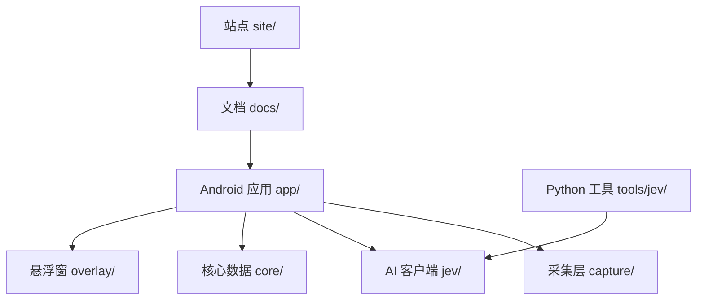
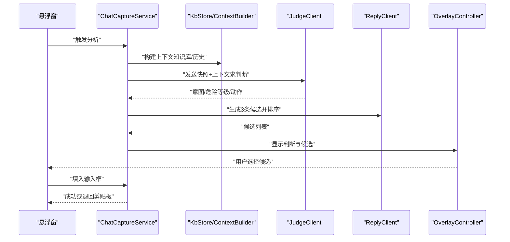
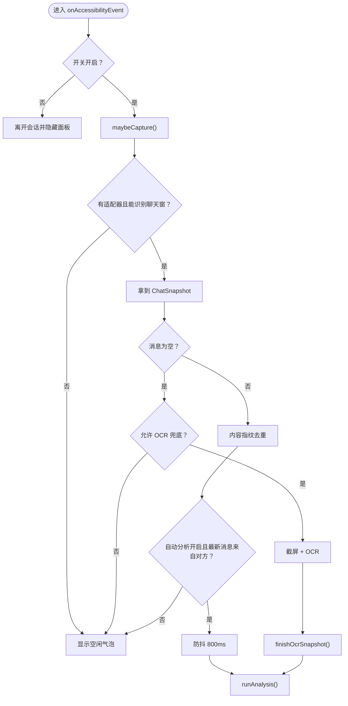
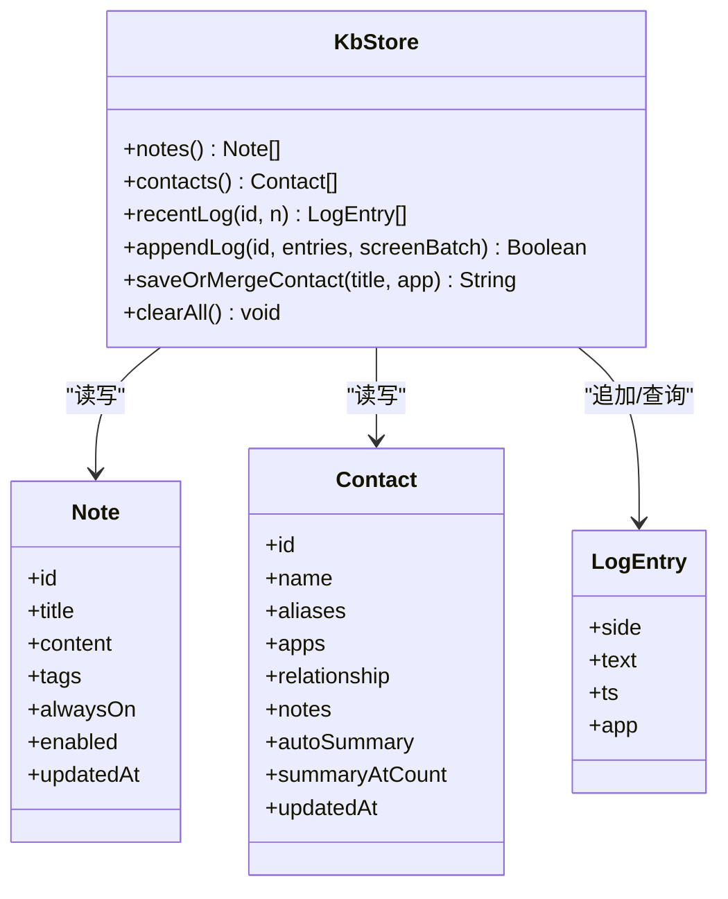
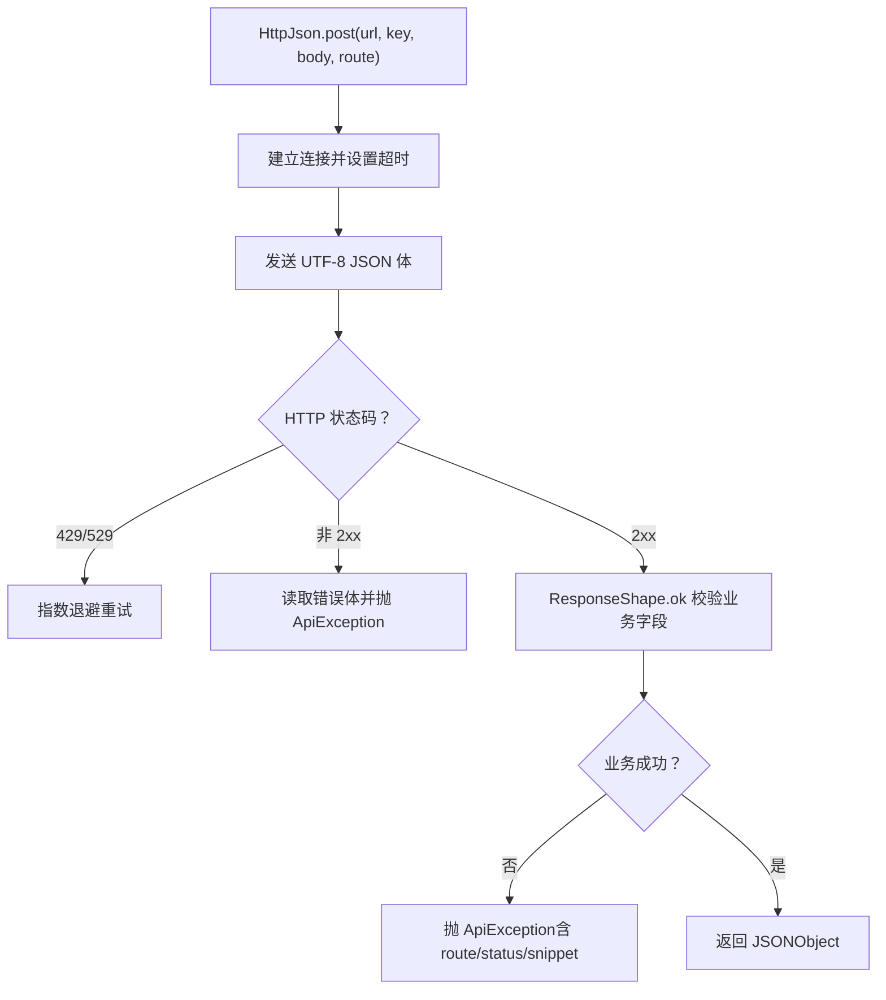
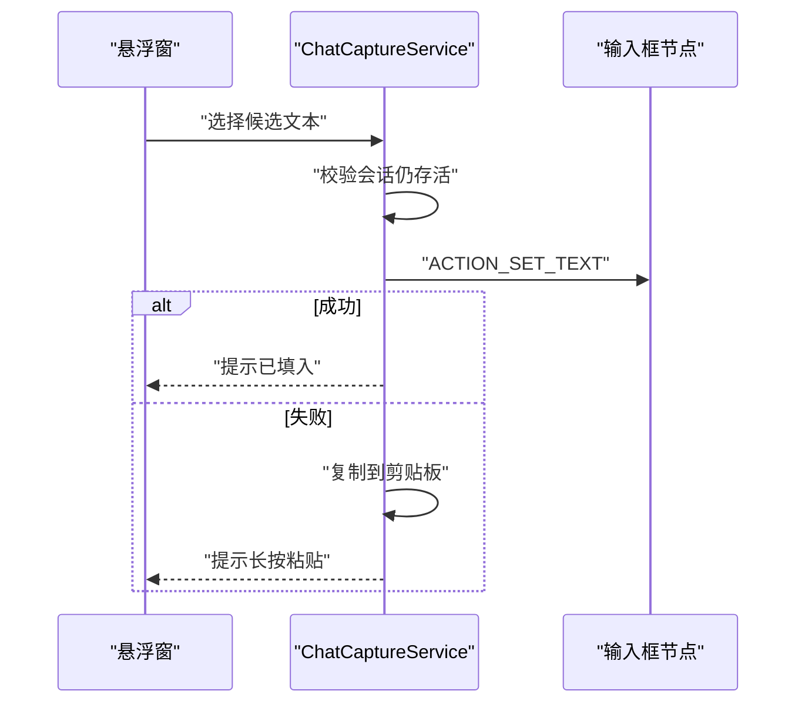
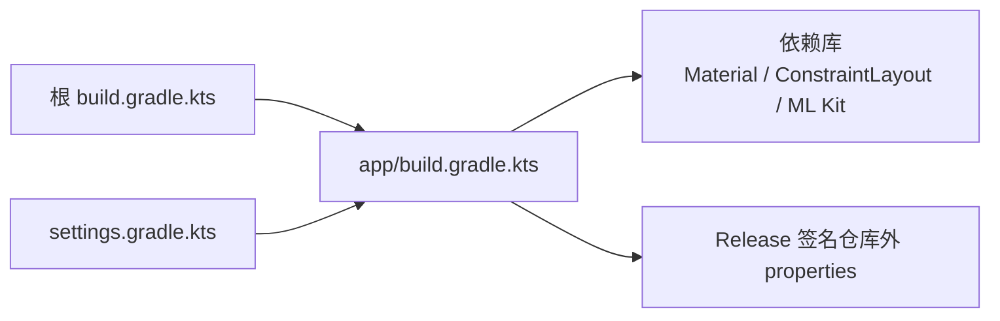

# 开发者指南

<cite>
**本文引用的文件**   
- [README.md](file://README.md)
- [CLAUDE.md](file://CLAUDE.md)
- [CONTRIBUTORS.md](file://CONTRIBUTORS.md)
- [docs/v1.3-plan.md](file://docs/v1.3-plan.md)
- [tools/jev/TASK.md](file://tools/jev/TASK.md)
- [build.gradle.kts](file://build.gradle.kts)
- [settings.gradle.kts](file://settings.gradle.kts)
- [app/build.gradle.kts](file://app/build.gradle.kts)
- [app/src/main/java/com/jev/probe/capture/ChatCaptureService.kt](file://app/src/main/java/com/jev/probe/capture/ChatCaptureService.kt)
- [app/src/main/java/com/jev/probe/capture/CaptureRules.kt](file://app/src/main/java/com/jev/probe/capture/CaptureRules.kt)
- [app/src/main/java/com/jev/probe/capture/KeepAliveService.kt](file://app/src/main/java/com/jev/probe/capture/KeepAliveService.kt)
- [app/src/main/java/com/jev/probe/core/kb/KbStore.kt](file://app/src/main/java/com/jev/probe/core/kb/KbStore.kt)
- [app/src/main/java/com/jev/probe/jev/HttpJson.kt](file://app/src/main/java/com/jev/probe/jev/HttpJson.kt)
- [app/src/main/java/com/jev/probe/jev/ResponseShape.kt](file://app/src/main/java/com/jev/probe/jev/ResponseShape.kt)
- [app/src/test/java/com/jev/probe/capture/CaptureRulesTest.kt](file://app/src/test/java/com/jev/probe/capture/CaptureRulesTest.kt)
- [app/src/test/java/com/jev/probe/jev/ResponseShapeTest.kt](file://app/src/test/java/com/jev/probe/jev/ResponseShapeTest.kt)
</cite>

## 目录
1. [引言](#引言)
2. [项目结构](#项目结构)
3. [核心组件](#核心组件)
4. [架构总览](#架构总览)
5. [详细组件分析](#详细组件分析)
6. [依赖与构建](#依赖与构建)
7. [代码贡献规范](#代码贡献规范)
8. [调试技巧](#调试技巧)
9. [常见问题与排障](#常见问题与排障)
10. [性能与稳定性](#性能与稳定性)
11. [版本控制与协作流程](#版本控制与协作流程)
12. [结论](#结论)

## 引言
Jev 聊天助手是一个“只读、非侵入”的对话副驾：它通过系统无障碍服务读取当前聊天界面，必要时走截屏 + 本地 OCR，把消息交给判断模型做意图与风险判断，再让生成模型起草候选回复；最终由用户决定是否发送。Android 端是主仓库，macOS 与 Windows 为姊妹项目，共用同一套判断内核。

本指南面向开发者，覆盖项目结构、代码组织原则、依赖管理、开发环境配置、编码与提交规范、调试方法、常见问题与性能优化建议，帮助你在不破坏三条红线的前提下高效协作。

**章节来源**
- [README.md:18-84](file://README.md#L18-L84)
- [CLAUDE.md:1-13](file://CLAUDE.md#L1-L13)

## 项目结构
仓库采用“Android 应用 + Python 工具 + 文档站点”的多模块布局：

- `app/`：Android 应用（Kotlin + 传统 View）
  - `capture/`：无障碍采集、各聊天 App 适配器、OCR 兜底、前台保活
  - `jev/`：判断 / 回复 / 视觉三路客户端与 HTTP 公共层
  - `core/`：偏好设置、数据模型、知识库存储与上下文构建
  - `overlay/`：悬浮窗面板
- `tools/jev/`：Jev 题目集与校准脚本（Python，PC 运行）
- `docs/`：验收标准与方案文档
- `site/`：官网与指南站点源码
- `apk/`：已签名 release 包

**图表来源**
- [README.md:224-240](file://README.md#L224-L240)
- [CLAUDE.md:45-55](file://CLAUDE.md#L45-L55)

**章节来源**
- [README.md:224-240](file://README.md#L224-L240)
- [CLAUDE.md:45-55](file://CLAUDE.md#L45-L55)

## 核心组件
- 采集与适配层：按包名分发到不同聊天 App 的适配器，统一输出“标题 + 消息列表”。树里无正文时走截屏 + ML Kit 离线 OCR。
- Jev 判断与回复：判断接口一次返回意图、危险等级、是否该回、最佳动作等；回复接口生成 3 条候选，再由判断模型排序。
- 知识库与联系人：本地 JSON 存储笔记、联系人档案与历史日志，分析时注入背景信息，避免 AI 编造。
- 悬浮窗与输入回填：展示分析结果与候选，点击后填入输入框，失败退到剪贴板，绝不自动发送。
- HTTP 公共层：统一 POST JSON、指数退避、错误分类，并把业务错误从 2xx 响应中识别出来。

**章节来源**
- [README.md:104-137](file://README.md#L104-L137)
- [CLAUDE.md:24-43](file://CLAUDE.md#L24-L43)

## 架构总览
下图展示一次典型分析的数据流：采集 → 可选 OCR → 上下文构建 → 判断 → 回复草稿 → 排序 → 悬浮窗展示 → 用户手动填入。

**图表来源**
- [app/src/main/java/com/jev/probe/capture/ChatCaptureService.kt:383-442](file://app/src/main/java/com/jev/probe/capture/ChatCaptureService.kt#L383-L442)
- [app/src/main/java/com/jev/probe/core/kb/KbStore.kt:147-241](file://app/src/main/java/com/jev/probe/core/kb/KbStore.kt#L147-L241)

## 详细组件分析

### 采集与 OCR 流程
采集层负责：
- 过滤系统界面与自身界面
- 根据包名选择适配器
- 在聊天窗口但树无正文时触发 OCR
- 对 OCR 结果去重、分组、回填

**图表来源**
- [app/src/main/java/com/jev/probe/capture/ChatCaptureService.kt:233-354](file://app/src/main/java/com/jev/probe/capture/ChatCaptureService.kt#L233-L354)
- [app/src/main/java/com/jev/probe/capture/ChatCaptureService.kt:535-689](file://app/src/main/java/com/jev/probe/capture/ChatCaptureService.kt#L535-L689)

**章节来源**
- [app/src/main/java/com/jev/probe/capture/ChatCaptureService.kt:233-354](file://app/src/main/java/com/jev/probe/capture/ChatCaptureService.kt#L233-L354)
- [app/src/main/java/com/jev/probe/capture/ChatCaptureService.kt:488-511](file://app/src/main/java/com/jev/probe/capture/ChatCaptureService.kt#L488-L511)
- [app/src/main/java/com/jev/probe/capture/CaptureRules.kt:12-69](file://app/src/main/java/com/jev/probe/capture/CaptureRules.kt#L12-L69)

### 知识库与上下文
知识库以 JSON 文件形式保存在 App 私有目录，提供：
- 笔记、联系人、历史日志的增删查
- 名称规范化与别名匹配
- 原子写（临时文件 + rename）保证损坏可恢复
- 屏幕级去重，避免滚动导致重复写入

**图表来源**
- [app/src/main/java/com/jev/probe/core/kb/KbStore.kt:9-23](file://app/src/main/java/com/jev/probe/core/kb/KbStore.kt#L9-L23)
- [app/src/main/java/com/jev/probe/core/kb/KbStore.kt:42-145](file://app/src/main/java/com/jev/probe/core/kb/KbStore.kt#L42-L145)
- [app/src/main/java/com/jev/probe/core/kb/KbStore.kt:147-241](file://app/src/main/java/com/jev/probe/core/kb/KbStore.kt#L147-L241)

**章节来源**
- [app/src/main/java/com/jev/probe/core/kb/KbStore.kt:147-241](file://app/src/main/java/com/jev/probe/core/kb/KbStore.kt#L147-L241)
- [app/src/main/java/com/jev/probe/core/kb/KbStore.kt:430-459](file://app/src/main/java/com/jev/probe/core/kb/KbStore.kt#L430-L459)

### HTTP 客户端与错误处理
HTTP 公共层承担：
- 统一 POST JSON、UTF-8 编码
- 对 429/529 指数退避重试
- 将业务错误从 2xx 响应中识别并抛出带路由信息的异常
- 对网络异常给出人类可读提示，且不泄露密钥

**图表来源**
- [app/src/main/java/com/jev/probe/jev/HttpJson.kt:48-122](file://app/src/main/java/com/jev/probe/jev/HttpJson.kt#L48-L122)
- [app/src/main/java/com/jev/probe/jev/ResponseShape.kt:96-119](file://app/src/main/java/com/jev/probe/jev/ResponseShape.kt#L96-L119)

**章节来源**
- [app/src/main/java/com/jev/probe/jev/HttpJson.kt:10-41](file://app/src/main/java/com/jev/probe/jev/HttpJson.kt#L10-L41)
- [app/src/main/java/com/jev/probe/jev/HttpJson.kt:48-122](file://app/src/main/java/com/jev/probe/jev/HttpJson.kt#L48-L122)
- [app/src/main/java/com/jev/probe/jev/ResponseShape.kt:96-119](file://app/src/main/java/com/jev/probe/jev/ResponseShape.kt#L96-L119)

### 悬浮窗与输入回填
- 悬浮窗用于展示空闲态、加载中、判断结果、候选回复与错误提示。
- 回填优先使用 `ACTION_SET_TEXT`，失败则回退到粘贴和剪贴板。
- 所有写操作都绑定原始会话 token，防止误写到其他窗口。

**图表来源**
- [app/src/main/java/com/jev/probe/capture/ChatCaptureService.kt:691-779](file://app/src/main/java/com/jev/probe/capture/ChatCaptureService.kt#L691-L779)

**章节来源**
- [app/src/main/java/com/jev/probe/capture/ChatCaptureService.kt:691-779](file://app/src/main/java/com/jev/probe/capture/ChatCaptureService.kt#L691-L779)

## 依赖与构建
- Android 工程：compileSdk/targetSdk 35，minSdk 30，JDK 17，Kotlin 1.9.24。
- Gradle 插件：Android Gradle Plugin 8.7.3。
- 关键依赖：Material、ConstraintLayout、ML Kit 中文 OCR（bundled）。
- NDK ABI 仅保留 arm64-v8a，减少包体。
- Release 签名属性放在仓库外，通过环境变量指定路径。

**图表来源**
- [build.gradle.kts:1-6](file://build.gradle.kts#L1-L6)
- [settings.gradle.kts:1-19](file://settings.gradle.kts#L1-L19)
- [app/build.gradle.kts:17-71](file://app/build.gradle.kts#L17-L71)
- [app/build.gradle.kts:73-85](file://app/build.gradle.kts#L73-L85)

**章节来源**
- [build.gradle.kts:1-6](file://build.gradle.kts#L1-L6)
- [settings.gradle.kts:1-19](file://settings.gradle.kts#L1-L19)
- [app/build.gradle.kts:17-85](file://app/build.gradle.kts#L17-L85)

## 代码贡献规范

### 编码风格与硬约束
- Kotlin + 传统 View + XML，不使用 Compose。
- 路径全 ASCII；Windows 下使用 pwsh 7+；Python 读写文件显式 UTF-8。
- 密钥不落盘、不进日志、不进 git；OpenRouter Key 从环境变量读取。
- 禁止自动发送消息、不碰转账红包收款相关元素。
- 字符串模板后紧跟中文标点时使用 `${x}` 语法，避免编译歧义。

**章节来源**
- [CLAUDE.md:5-13](file://CLAUDE.md#L5-L13)
- [CLAUDE.md:39-43](file://CLAUDE.md#L39-L43)

### 提交信息与分支策略
- 每个 PR 只做一件事，改哪层跑哪层的自测。
- 任务完成后写报告：根因或做法 → 改了什么 → 真实输出 → 自验缺口。
- 禁止直接 commit/push，由主控拍板。

**章节来源**
- [CONTRIBUTORS.md:48-58](file://CONTRIBUTORS.md#L48-L58)
- [CLAUDE.md:57-60](file://CLAUDE.md#L57-L60)

### Pull Request 流程
- 先认领任务，再动手。
- 一个 PR 对应一个功能点或修复点。
- 改动需通过构建与真机验证；涉及多端时同步更新对应仓库的验收项。
- 评审通过后由主控合并。

**章节来源**
- [CONTRIBUTORS.md:48-58](file://CONTRIBUTORS.md#L48-L58)

## 调试技巧

### 日志输出
- 采集层会记录树 ID 清单但不记录聊天正文，便于排查控件变化而不泄露隐私。
- OCR 路径会记录截图失败原因码与消息数量。
- 知识库写入会记录追加条数、重叠长度与持久化结果。

建议：
- 使用 logcat 过滤 `JEVASSIST` 或 `com.jev.probe`。
- 遇到未适配 App 时，查看“树里没有带 id 的节点”或前若干个资源 ID，辅助适配器重写。

**章节来源**
- [app/src/main/java/com/jev/probe/capture/ChatCaptureService.kt:488-511](file://app/src/main/java/com/jev/probe/capture/ChatCaptureService.kt#L488-L511)
- [app/src/main/java/com/jev/probe/capture/ChatCaptureService.kt:655-663](file://app/src/main/java/com/jev/probe/capture/ChatCaptureService.kt#L655-L663)
- [app/src/main/java/com/jev/probe/core/kb/KbStore.kt:213-219](file://app/src/main/java/com/jev/probe/core/kb/KbStore.kt#L213-L219)

### 断点调试
- 在 `ChatCaptureService.maybeCapture()` 打断点，观察 snapshot 是否为空、是否触发 OCR。
- 在 `runAnalysis()` 打断点，观察判断与回复请求是否并行执行。
- 在 `fillInput()` 打断点，确认会话 token 是否仍有效、输入框是否唯一可编辑。

### 性能分析
- 判断接口单次约 1 秒，回复草稿与排序通常并发执行。
- OCR 有全局限频与失败退避，避免每秒连拍。
- 知识库 appendLog 使用屏幕级去重，避免滚动重复写入。

**章节来源**
- [CLAUDE.md:36-43](file://CLAUDE.md#L36-L43)
- [app/src/main/java/com/jev/probe/capture/ChatCaptureService.kt:345-354](file://app/src/main/java/com/jev/probe/capture/ChatCaptureService.kt#L345-L354)
- [app/src/main/java/com/jev/probe/core/kb/KbStore.kt:172-220](file://app/src/main/java/com/jev/probe/core/kb/KbStore.kt#L172-L220)

## 常见问题与排障

### 悬浮球消失或读不到消息
- 检查无障碍、悬浮窗、自启动、省电无限制四项权限。
- 小米/HyperOS 可能冻结后台，需在聊天界面重新交互自愈。
- 无障碍开关变更后需关闭再打开，使截屏能力生效。

**章节来源**
- [README.md:96-102](file://README.md#L96-L102)
- [README.md:163-167](file://README.md#L163-L167)
- [README.md:184-187](file://README.md#L184-L187)

### 飞书读不到正文
- 飞书正文自绘，走每个气泡矩形的离线 OCR。
- 若判边错误，可在联系人备注说明，或改用手动 OCR。

**章节来源**
- [README.md:170-173](file://README.md#L170-L173)
- [CLAUDE.md:29-30](file://CLAUDE.md#L29-L30)

### 接口连通测试失败
- 区分判断/回复/视觉三路地址、密钥、模型。
- 注意网关可能返回 HTTP 200 但业务失败，错误会被解析并提示。
- 429/529 会自动重试，其它 4xx 不重试。

**章节来源**
- [README.md:122-130](file://README.md#L122-L130)
- [app/src/main/java/com/jev/probe/jev/HttpJson.kt:80-122](file://app/src/main/java/com/jev/probe/jev/HttpJson.kt#L80-L122)
- [app/src/test/java/com/jev/probe/jev/ResponseShapeTest.kt:23-61](file://app/src/test/java/com/jev/probe/jev/ResponseShapeTest.kt#L23-L61)

### 微信风控与适配
- 微信读取可能触发风控，风险自担。
- 输入框无稳定公开 id，回填走 SET_TEXT → 粘贴 → 剪贴板三级兜底。

**章节来源**
- [README.md:67-70](file://README.md#L67-L70)
- [CLAUDE.md:26-29](file://CLAUDE.md#L26-L29)

## 性能与稳定性
- 采集层对自动分析做 800ms 防抖，避免频繁触发。
- OCR 全局限频 ≥1s，失败退避递增，封顶 30s。
- 知识库 appendLog 基于屏幕序列去重，最多保留 300 条。
- HTTP 层对 429/529 指数退避，最大 3 次；其它 4xx 快速失败。
- 前台保活服务降低 MIUI/HyperOS 冻结概率，但仍需用户授予自启动与省电白名单。

**章节来源**
- [app/src/main/java/com/jev/probe/capture/ChatCaptureService.kt:345-354](file://app/src/main/java/com/jev/probe/capture/ChatCaptureService.kt#L345-L354)
- [CLAUDE.md:42-43](file://CLAUDE.md#L42-L43)
- [app/src/main/java/com/jev/probe/core/kb/KbStore.kt:213-219](file://app/src/main/java/com/jev/probe/core/kb/KbStore.kt#L213-L219)
- [app/src/main/java/com/jev/probe/jev/HttpJson.kt:80-122](file://app/src/main/java/com/jev/probe/jev/HttpJson.kt#L80-L122)
- [app/src/main/java/com/jev/probe/capture/KeepAliveService.kt:12-19](file://app/src/main/java/com/jev/probe/capture/KeepAliveService.kt#L12-L19)

## 版本控制与协作流程
- 三端共享判断内核，差异在采集方式。
- 贡献者分工明确：Android/macOS/Windows 各有维护者，测试覆盖三端。
- 贡献流程参考 macOS 仓库 CONTRIBUTING，同样适用于两端：认领 → 单功能 PR → 自测 → 评审 → 合并。
- 所有 worker 必须遵守 CLAUDE.md 中的硬约束与报告格式。

**章节来源**
- [CONTRIBUTORS.md:5-24](file://CONTRIBUTORS.md#L5-L24)
- [CONTRIBUTORS.md:48-58](file://CONTRIBUTORS.md#L48-L58)
- [CLAUDE.md:57-60](file://CLAUDE.md#L57-L60)

## 结论
Jev 聊天助手以“只读、非侵入、安全可控”为核心设计原则，通过采集层、OCR 兜底、知识库与三路 AI 客户端组合，形成一套可扩展的对话副驾方案。开发者在遵循三条红线与编码规范的前提下，可以围绕适配器扩展、题目集校准、OCR 适配与错误体验持续改进。建议在每次改动后运行构建与真机验证，并在报告中如实记录输出与自验缺口。