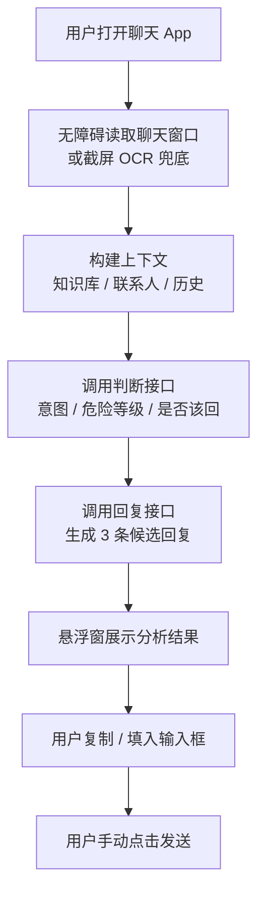
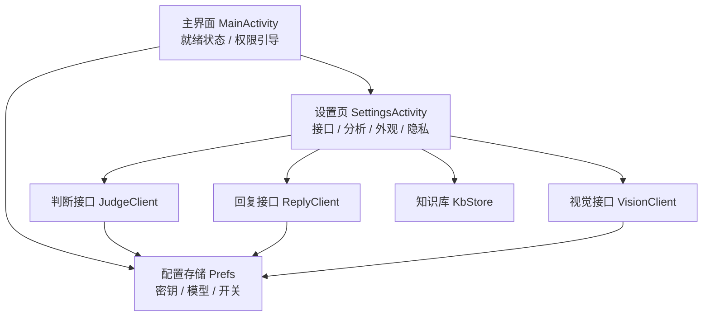

# 快速开始

<cite>
**本文引用的文件**   
- [README.md](file://README.md)
- [android-setup.html](file://site/guides/android-setup.html)
- [MainActivity.kt](file://app/src/main/java/com/jev/probe/MainActivity.kt)
- [SettingsActivity.kt](file://app/src/main/java/com/jev/probe/SettingsActivity.kt)
</cite>

## 目录
1. [简介](#简介)
2. [安装步骤](#安装步骤)
3. [密钥与接口配置](#密钥与接口配置)
4. [权限申请流程](#权限申请流程)
5. [首次运行检查](#首次运行检查)
6. [常见问题与解决方案](#常见问题与解决方案)
7. [架构与数据流概览](#架构与数据流概览)
8. [排错清单](#排错清单)
9. [结论](#结论)

## 简介
Jev 聊天助手是一个 Android 端的对话副驾：它读取你当前聊天窗口中的消息，调用你自己配置的模型接口进行意图判断和候选回复生成，再把建议填入输入框，由你决定是否发送。应用不自动发送消息、不修改聊天软件安装包，也不直接访问对方 App 的账号或数据库。

对于新用户，最关键的三步是：
1. 获取并安装 Android APK。
2. 在设置中配置判断接口、回复接口、视觉接口。
3. 开启无障碍、悬浮窗、自启动与省电无限制等权限。

如果你只想最快跑通，可以只配置「判断接口」，并把「回复接口」「视觉接口」留空，让它们继承判断接口的密钥。

**章节来源**
- [README.md:18-27](file://README.md#L18-L27)
- [README.md:86-102](file://README.md#L86-L102)
- [android-setup.html:28-44](file://site/guides/android-setup.html#L28-L44)

## 安装步骤

### 1. 确认设备要求
- 系统版本：Android 11 及以上。
- 芯片架构：ARM64 / `arm64-v8a`。
- 如果设备不是 ARM64，或者系统低于 Android 11，可能无法正常运行。

**章节来源**
- [README.md:20-24](file://README.md#L20-L24)
- [android-setup.html:28-34](file://site/guides/android-setup.html#L28-L34)

### 2. 下载 APK
官方仓库提供了已签名的 release 包。你可以在项目主页的「开始使用 Jev」区域找到 Android 版 APK 链接，也可以查看 Releases 页面获取历史版本。

推荐操作：
1. 打开项目主页。
2. 找到「Android」对应的安装包链接。
3. 点击后等待浏览器或下载器完成下载。
4. 如果提示未知来源，按系统提示允许从该来源安装。

**章节来源**
- [README.md:20-24](file://README.md#L20-L24)
- [README.md:86-92](file://README.md#L86-L92)
- [android-setup.html:32-34](file://site/guides/android-setup.html#L32-L34)

### 3. 通过手机安装 APK
安装方式有两种：

#### 方式一：直接在手机上安装
1. 打开下载完成的 APK。
2. 如果提示需要授权安装未知来源应用，按系统指引允许。
3. 点击「安装」。
4. 安装完成后点击「打开」。

注意：
- 如果之前装过 debug 包，签名不同会导致覆盖失败。需要先卸载旧版本，再安装 release 包。
- 卸载会清除密钥和设置，请提前确认是否需要保留。

#### 方式二：通过 ADB 安装
如果你已经启用开发者选项并连接了电脑，可以使用 ADB 安装：

```bash
adb install -r apk/jev-assistant-v1.4-release.apk
```

说明：
- `-r` 表示覆盖安装。
- 路径以仓库根目录为基准；实际使用时替换为你本地的 APK 路径。
- 如果提示权限不足，先执行 `adb devices` 确认设备已连接并被识别。

**章节来源**
- [README.md:86-92](file://README.md#L86-L92)
- [android-setup.html:32-34](file://site/guides/android-setup.html#L32-L34)

## 密钥与接口配置

Jev 的设置页把接口分成三张卡片：
- **判断接口（Jev）**：负责读消息、判断对方意图、危险等级、是否该回、候选排序。这是必须配置的接口。
- **回复接口**：负责生成 3 条候选回复。
- **视觉接口**：用于截图 OCR 场景，可先不填。

### 1. 进入设置页
1. 打开 Jev 聊天助手。
2. 在主界面点击「设置」。
3. 进入「接口」区域。

主界面会显示就绪状态、无障碍、悬浮窗、密钥三项检查项；如果密钥未设置，状态会显示「尚未就绪」。

**章节来源**
- [MainActivity.kt:63-106](file://app/src/main/java/com/jev/probe/MainActivity.kt#L63-L106)
- [MainActivity.kt:110-128](file://app/src/main/java/com/jev/probe/MainActivity.kt#L110-L128)

### 2. 最少配置：只填判断接口
最简单的方式：
1. 在「判断接口」中选择预设，例如 OpenRouter。
2. 填写你的 API Key。
3. 模型名通常会自动填充；如果没有，按服务商文档填写。
4. 「回复接口」和「视觉接口」留空，让它们继承判断接口的密钥。
5. 点击「保存全部设置」。

这样你可以先用判断能力验证整个流程，后续再单独调整回复模型或视觉接口。

**章节来源**
- [README.md:94-95](file://README.md#L94-L95)
- [README.md:122-130](file://README.md#L122-L130)
- [SettingsActivity.kt:72-195](file://app/src/main/java/com/jev/probe/SettingsActivity.kt#L72-L195)
- [SettingsActivity.kt:197-250](file://app/src/main/java/com/jev/probe/SettingsActivity.kt#L197-L250)
- [SettingsActivity.kt:252-308](file://app/src/main/java/com/jev/probe/SettingsActivity.kt#L252-L308)

### 3. 判断接口常用预设
判断接口支持多个预设，包括：
- OpenRouter
- 博查 Jev
- TypeSafe 直连
- Vercel
- OpenCode Zen
- 自定义

选择预设后，Base URL 和模型通常会自动填充。自定义模式需要你填写完整地址，并且要同时填写模型名。

**章节来源**
- [README.md:122-128](file://README.md#L122-L128)
- [SettingsActivity.kt:117-156](file://app/src/main/java/com/jev/probe/SettingsActivity.kt#L117-L156)
- [SettingsActivity.kt:455-504](file://app/src/main/java/com/jev/probe/SettingsActivity.kt#L455-L504)

### 4. 回复接口
回复接口用于生成候选回复。它支持：
- OpenRouter
- DeepSeek 官方
- 通义兼容
- 自定义

如果留空密钥，会使用判断接口的密钥。Base URL 一般写到 `/v1` 为止，具体以服务商文档为准。

**章节来源**
- [README.md:122-129](file://README.md#L122-L129)
- [SettingsActivity.kt:197-250](file://app/src/main/java/com/jev/probe/SettingsActivity.kt#L197-L250)

### 5. 视觉接口
视觉接口主要用于截屏 OCR 场景。如果某个聊天 App 的控件树里没有正文，应用会尝试截屏并用本地 OCR 识别；如果需要更强大的视觉理解，可以配置视觉接口。

注意：
- 某些服务商不支持视觉能力，例如 DeepSeek 官方没有 image_url 相关能力。
- 如果测试视觉时提示不支持视觉，应换用支持视觉的接口。

**章节来源**
- [README.md:122-137](file://README.md#L122-L137)
- [SettingsActivity.kt:252-308](file://app/src/main/java/com/jev/probe/SettingsActivity.kt#L252-L308)
- [SettingsActivity.kt:669-671](file://app/src/main/java/com/jev/probe/SettingsActivity.kt#L669-L671)

### 6. 使用连通测试
每张接口卡都有「测试」按钮：
- 判断接口：会模拟一段简短对话，调用判断逻辑，返回意图、置信度等信息。
- 回复接口：会调用 ping 类接口，返回服务响应摘要。
- 视觉接口：会发送一张白图，检查视觉能力是否可用。

建议顺序：
1. 先测判断接口。
2. 再测回复接口。
3. 最后测视觉接口。
4. 全部通过后，再到聊天场景中试用。

**章节来源**
- [SettingsActivity.kt:157-194](file://app/src/main/java/com/jev/probe/SettingsActivity.kt#L157-L194)
- [SettingsActivity.kt:224-249](file://app/src/main/java/com/jev/probe/SettingsActivity.kt#L224-L249)
- [SettingsActivity.kt:277-306](file://app/src/main/java/com/jev/probe/SettingsActivity.kt#L277-L306)
- [android-setup.html:35-38](file://site/guides/android-setup.html#L35-L38)

## 权限申请流程

Jev 需要三类关键权限才能正常工作：
1. 无障碍服务
2. 悬浮窗
3. 自启动 + 省电无限制

### 1. 无障碍服务
无障碍服务用于读取当前聊天窗口中的消息文字。应用不会读取其他 App 的私有数据，而是通过系统无障碍接口读取界面上暴露的内容。

操作步骤：
1. 在主界面点击「无障碍权限」对应的「去开启」。
2. 系统跳转到无障碍设置页。
3. 找到 Jev 聊天助手。
4. 开启开关。
5. 回到 App，状态栏会更新为「已开」。

升级后如果无障碍没生效，可能需要关闭再重新打开一次无障碍开关，让服务重新绑定。

**章节来源**
- [README.md:96-102](file://README.md#L96-L102)
- [README.md:184-188](file://README.md#L184-L188)
- [MainActivity.kt:80-83](file://app/src/main/java/com/jev/probe/MainActivity.kt#L80-L83)
- [MainActivity.kt:240-244](file://app/src/main/java/com/jev/probe/MainActivity.kt#L240-L244)

### 2. 悬浮窗
悬浮窗用于在聊天窗口上方展示分析结果、危险等级和候选回复。

操作步骤：
1. 在主界面点击「悬浮窗权限」对应的「去开启」。
2. 系统跳转到悬浮窗权限管理页。
3. 找到 Jev 聊天助手。
4. 允许「显示在其他应用上层」。
5. 回到 App，状态栏会更新为「已开」。

注意：
- 小米 / HyperOS 重装后可能会重置悬浮窗权限，需要重新开启。
- 如果悬浮球消失，可能是后台被冻结，也可能是悬浮窗权限被系统回收。

**章节来源**
- [README.md:96-102](file://README.md#L96-L102)
- [README.md:163-167](file://README.md#L163-L167)
- [MainActivity.kt:84-86](file://app/src/main/java/com/jev/probe/MainActivity.kt#L84-L86)

### 3. 自启动 + 省电无限制
国产 ROM 容易冻结后台进程，导致悬浮球消失、读不到消息。尤其是小米 / HyperOS，需要重点检查自启动和电池优化。

操作步骤：
1. 在主界面点击「自启动 + 省电无限制」对应的「去开启」。
2. 系统跳转到应用详情页。
3. 找到「自启动」并开启。
4. 找到「电池优化」或「省电策略」，设置为「无限制」。
5. 部分机型还需要在「后台管理」中允许后台运行。

**章节来源**
- [README.md:96-102](file://README.md#L96-L102)
- [README.md:163-167](file://README.md#L163-L167)
- [README.md:243-246](file://README.md#L243-L246)
- [MainActivity.kt:87-91](file://app/src/main/java/com/jev/probe/MainActivity.kt#L87-L91)

### 4. 权限总览
| 权限 | 作用 | 未开启的表现 | 处理建议 |
|---|---|---|---|
| 无障碍 | 读取聊天窗口消息 | 无法识别消息，悬浮窗无内容 | 到系统无障碍设置中开启 |
| 悬浮窗 | 显示分析面板 | 悬浮球不出现或无法显示 | 到悬浮窗权限管理中开启 |
| 自启动 | 防止系统杀死后台 | 后台被冻结，气泡消失 | 开启自启动 |
| 省电无限制 | 防止省电策略冻结 | 长时间后台后失效 | 设置为无限制 |

**章节来源**
- [MainActivity.kt:80-91](file://app/src/main/java/com/jev/probe/MainActivity.kt#L80-L91)
- [android-setup.html:39-41](file://site/guides/android-setup.html#L39-L41)

## 首次运行检查

### 1. 确认就绪状态
打开 App 后，主界面顶部会有一个就绪状态卡片：
- 绿色点表示「已就绪，可以用了」。
- 红色点表示「尚未就绪」。
- 下方会列出无障碍、悬浮窗、密钥的检查结果。

只有当这三项都满足时，应用才具备基本运行条件。

**章节来源**
- [MainActivity.kt:70-77](file://app/src/main/java/com/jev/probe/MainActivity.kt#L70-L77)
- [MainActivity.kt:110-128](file://app/src/main/java/com/jev/probe/MainActivity.kt#L110-L128)

### 2. 打开助手开关
主界面底部有一个大开关：
- 显示「助手已开启 · 点击关闭」或「助手已关闭 · 点击开启」。
- 开启后，应用才会真正参与聊天场景的分析流程。

**章节来源**
- [MainActivity.kt:99-105](file://app/src/main/java/com/jev/probe/MainActivity.kt#L99-L105)

### 3. 进入聊天场景测试
建议先用非敏感对话测试：
1. 打开一个支持的聊天 App。
2. 进入一对一或群聊会话。
3. 观察是否有悬浮球或分析面板。
4. 如果启用了自动分析，收到消息后应触发判断和候选回复。
5. 点击候选回复复制或填入输入框。
6. 自己手动点击发送。

**章节来源**
- [README.md:104-111](file://README.md#L104-L111)
- [android-setup.html:42-44](file://site/guides/android-setup.html#L42-L44)

### 4. 常见表现说明
- 应用会把候选回复填入输入框，但不会自动发送。
- 如果 `ACTION_SET_TEXT` 失败，会退到剪贴板粘贴。
- 转账、红包、收款不会被自动处理。
- 如果读不到控件树，且开启了 OCR 兜底，应用会尝试截屏识别。

**章节来源**
- [README.md:104-111](file://README.md#L104-L111)
- [README.md:196-200](file://README.md#L196-L200)

## 常见问题与解决方案

### 1. 小米 / HyperOS 特殊配置
小米和 HyperOS 对后台控制较严格，容易出现以下问题：
- 悬浮球短暂消失。
- 后台被冻结，读不到消息。
- 重装后悬浮窗权限被重置。

解决方案：
1. 开启自启动。
2. 设置省电策略为「无限制」。
3. 确保无障碍和悬浮窗都已开启。
4. 如果悬浮球消失，在聊天界面里随便点一下，通常能自愈。
5. 重装后重新开启悬浮窗权限。

**章节来源**
- [README.md:96-102](file://README.md#L96-L102)
- [README.md:163-167](file://README.md#L163-L167)
- [README.md:243-246](file://README.md#L243-L246)
- [android-setup.html:39-41](file://site/guides/android-setup.html#L39-L41)

### 2. 权限重置处理
如果重装应用或系统清理后：
- 悬浮窗权限可能被重置。
- 无障碍服务可能未生效。
- 自启动和电池优化可能恢复默认。

建议重新走一遍权限流程：
1. 检查无障碍。
2. 检查悬浮窗。
3. 检查自启动。
4. 检查省电无限制。
5. 重启应用后再试。

**章节来源**
- [README.md:102](file://README.md#L102)
- [README.md:163-167](file://README.md#L163-L167)
- [android-setup.html:39-41](file://site/guides/android-setup.html#L39-L41)

### 3. 后台冻结问题
症状：
- 悬浮球偶尔消失。
- 一段时间不用后读不到消息。
- 切回聊天 App 后才恢复。

原因：
- 国产 ROM 会冻结后台进程。
- 前台保活、自启动、省电无限制都配了仍可能被杀。

解决方案：
1. 开启自启动。
2. 设置省电无限制。
3. 在聊天界面交互一下，让应用重新激活。
4. 如果频繁被杀，考虑在系统「电池优化」中排除该应用。

**章节来源**
- [README.md:163-167](file://README.md#L163-L167)
- [README.md:243-246](file://README.md#L243-L246)

### 4. 升级后没反应
症状：
- 升级后无障碍服务没有生效。
- 悬浮球存在但读不到新消息。

原因：
- 新版本新增了截屏能力。
- 服务需要重新绑定才能生效。

解决方案：
1. 到系统无障碍设置。
2. 关闭 Jev 聊天助手的无障碍开关。
3. 重新打开无障碍开关。
4. 回到 App 重试。

**章节来源**
- [README.md:96-102](file://README.md#L96-L102)
- [README.md:184-188](file://README.md#L184-L188)

### 5. 飞书读不到正文
症状：
- 能看到气泡，但正文为空。
- 判断不准确。

原因：
- 飞书的消息正文是自绘控件，无障碍树里没有文字。
- 应用会对每个气泡矩形做离线 OCR。

解决方案：
1. 开启「树读不到正文时用 OCR 兜底」。
2. 如果自动分析误判，可在悬浮窗长按存为联系人，或在备注中说明。
3. 必要时关闭自动分析，改用手动触发。

**章节来源**
- [README.md:170-174](file://README.md#L170-L174)
- [README.md:196-200](file://README.md#L196-L200)
- [SettingsActivity.kt:324-330](file://app/src/main/java/com/jev/probe/SettingsActivity.kt#L324-L330)

### 6. 其它未适配 App 能用吗
可以用，但功能有限：
- 未适配的 App 可以在悬浮窗菜单里点「截屏识别一次」。
- 整屏 OCR 后可以分析。
- 不区分我方和对方，所有识别到的文字会被当作对方所说。

**章节来源**
- [README.md:80](file://README.md#L80)
- [README.md:132-137](file://README.md#L132-L137)

### 7. 接口连通失败
排查顺序：
1. 检查 Base URL 是否正确。
2. 检查模型名是否与服务商匹配。
3. 检查 API Key 是否有效。
4. 检查服务商是否在线。
5. 使用对应接口卡的「测试」按钮验证。

特别注意：
- 不要直接把 API Key 写进截图、Issue 或公开文档。
- 软件免费不代表模型请求免费，费用按服务商规则结算。

**章节来源**
- [android-setup.html:35-38](file://site/guides/android-setup.html#L35-L38)
- [SettingsActivity.kt:157-194](file://app/src/main/java/com/jev/probe/SettingsActivity.kt#L157-L194)
- [SettingsActivity.kt:224-249](file://app/src/main/java/com/jev/probe/SettingsActivity.kt#L224-L249)

### 8. 悬浮球不见了
可能原因：
- 无障碍未开启。
- 悬浮窗权限被重置。
- 后台被冻结。
- 系统清理了应用。

处理建议：
1. 检查无障碍。
2. 检查悬浮窗。
3. 检查自启动和电池优化。
4. 在聊天界面点一下，尝试自愈。
5. 必要时重启应用。

**章节来源**
- [README.md:163-167](file://README.md#L163-L167)
- [android-setup.html:45-46](file://site/guides/android-setup.html#L45-L46)

## 架构与数据流概览

Jev 的核心流程可以分为四个阶段：采集、判断、回复、回填。



**图表来源**
- [README.md:190-200](file://README.md#L190-L200)
- [MainActivity.kt:63-106](file://app/src/main/java/com/jev/probe/MainActivity.kt#L63-L106)
- [SettingsActivity.kt:72-195](file://app/src/main/java/com/jev/probe/SettingsActivity.kt#L72-L195)

### 数据边界
- 聊天界面读取与 OCR 在本机完成。
- 触发分析后，文字和启用的背景信息发送到你配置的模型服务商。
- 候选回复由你确认，应用不会代发。
- 截图仅在本机 OCR，不上传。

**章节来源**
- [README.md:190-199](file://README.md#L190-L199)

### 组件关系


**图表来源**
- [MainActivity.kt:27-106](file://app/src/main/java/com/jev/probe/MainActivity.kt#L27-L106)
- [SettingsActivity.kt:35-70](file://app/src/main/java/com/jev/probe/SettingsActivity.kt#L35-L70)
- [SettingsActivity.kt:403-445](file://app/src/main/java/com/jev/probe/SettingsActivity.kt#L403-L445)

## 排错清单

| 现象 | 优先检查 | 处理建议 |
|---|---|---|
| 主界面显示「尚未就绪」 | 密钥、无障碍、悬浮窗 | 先补全密钥，再开启权限 |
| 有悬浮球但没有文字 | 无障碍、聊天兼容性、OCR | 检查无障碍是否生效；确认当前 App 是否在支持列表 |
| 悬浮球消失 | 后台、自启动、省电策略 | 开启自启动、省电无限制；在聊天中交互一下 |
| 接口测试失败 | Base URL、模型、API Key | 核对服务商文档；使用连通测试 |
| 视觉测试失败 | 视觉接口是否支持图片 | 换用支持视觉的接口 |
| 飞书正文为空 | OCR 兜底 | 开启 OCR 兜底；必要时手动触发 |
| 升级后无反应 | 无障碍服务 | 关闭再重新打开无障碍 |
| 重装后悬浮球不可见 | 悬浮窗权限 | 重新开启悬浮窗权限 |

**章节来源**
- [README.md:139-188](file://README.md#L139-L188)
- [android-setup.html:45-46](file://site/guides/android-setup.html#L45-L46)
- [MainActivity.kt:110-128](file://app/src/main/java/com/jev/probe/MainActivity.kt#L110-L128)

## 结论
对于新用户，最快的成功路径是：
1. 下载并安装 ARM64 版本的 APK。
2. 在设置中配置判断接口，并点击「测试判断」确认连通。
3. 回复接口和视觉接口可以先留空，继承判断接口密钥。
4. 开启无障碍、悬浮窗、自启动、省电无限制。
5. 打开助手开关，进入一个支持的聊天场景，确认悬浮窗出现并能识别消息。
6. 复制候选回复到输入框，自己手动发送。

如果你遇到国产 ROM 冻结后台、权限重置、飞书正文缺失等问题，优先检查 README 和官网指南中列出的权限与兼容性说明，并按排错清单逐项验证。

**章节来源**
- [README.md:86-102](file://README.md#L86-L102)
- [README.md:139-188](file://README.md#L139-L188)
- [android-setup.html:32-46](file://site/guides/android-setup.html#L32-L46)