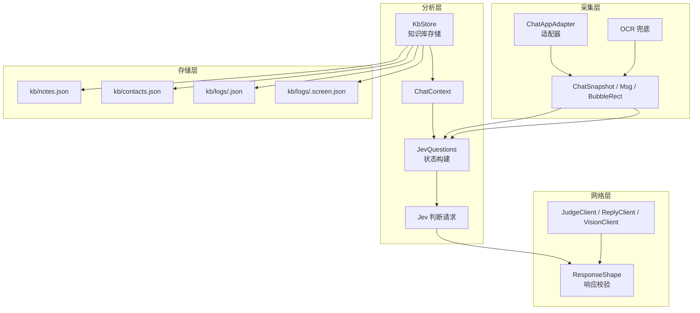
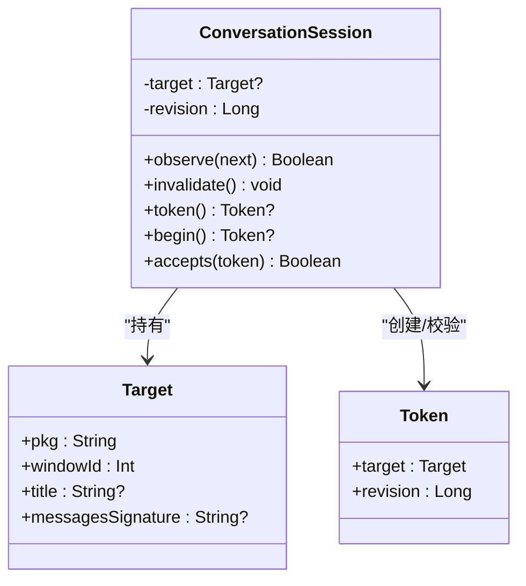
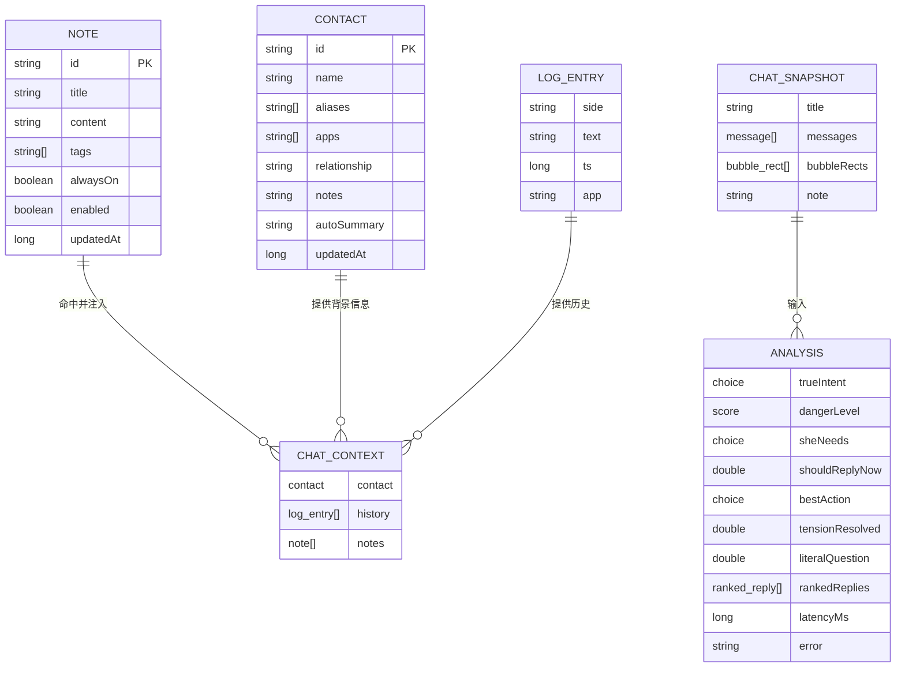
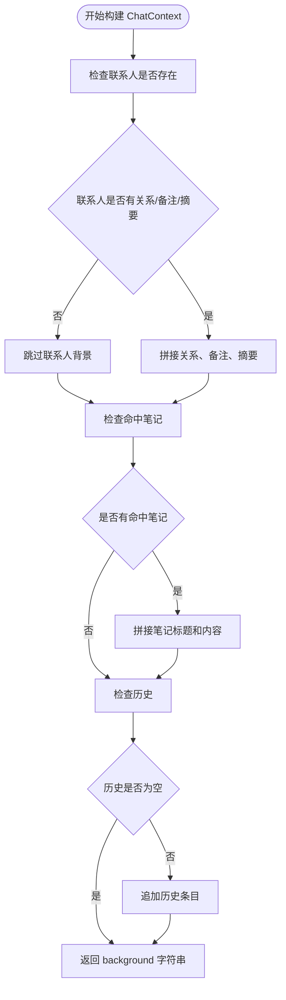
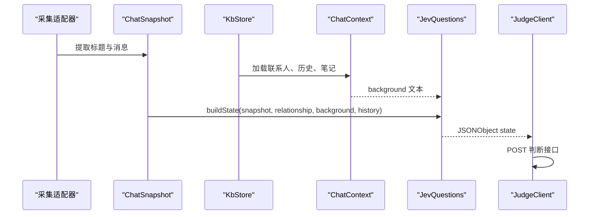
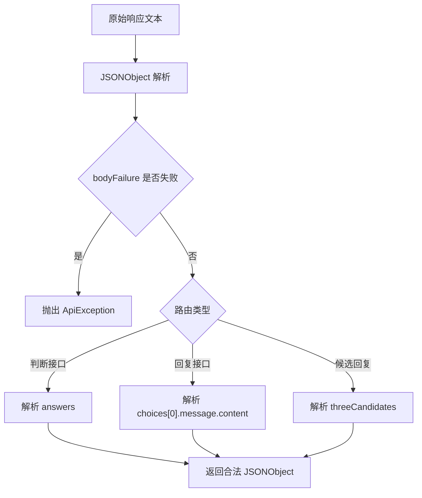
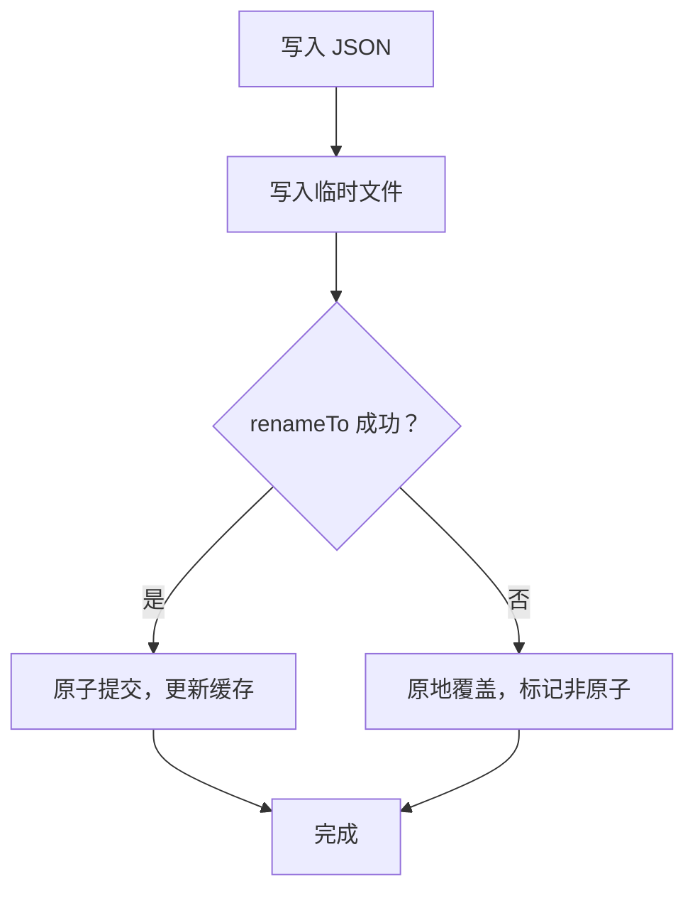
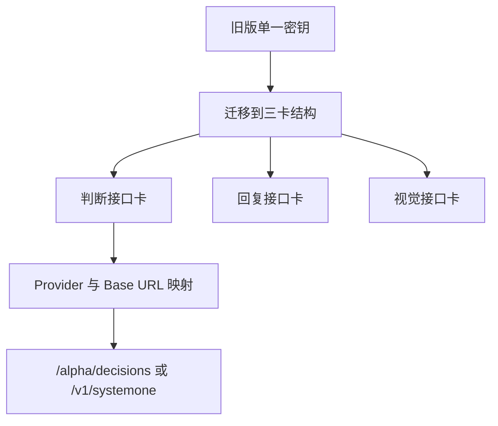
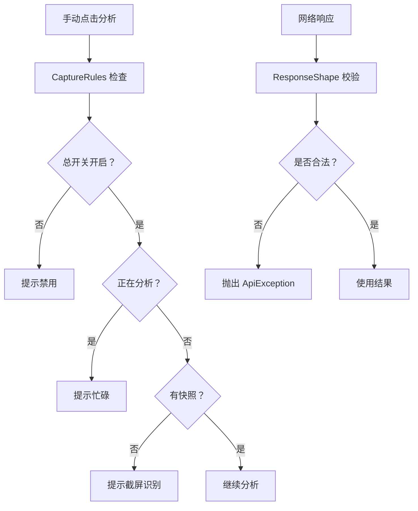

# 数据模型设计

<cite>
**本文引用的文件**   
- [ChatModels.kt](file://app/src/main/java/com/jev/probe/core/ChatModels.kt)
- [ConversationSession.kt](file://app/src/main/java/com/jev/probe/capture/ConversationSession.kt)
- [KbModels.kt](file://app/src/main/java/com/jev/probe/core/kb/KbModels.kt)
- [KbStore.kt](file://app/src/main/java/com/jev/probe/core/kb/KbStore.kt)
- [ResponseShape.kt](file://app/src/main/java/com/jev/probe/jev/ResponseShape.kt)
- [JevQuestions.kt](file://app/src/main/java/com/jev/probe/jev/JevQuestions.kt)
- [CaptureRules.kt](file://app/src/main/java/com/jev/probe/capture/CaptureRules.kt)
- [SettingsActivity.kt](file://app/src/main/java/com/jev/probe/SettingsActivity.kt)
- [README.md](file://README.md)
</cite>

## 目录
1. [引言](#引言)
2. [项目结构与数据边界](#项目结构与数据边界)
3. [核心数据结构](#核心数据结构)
4. [实体关系与上下文构建](#实体关系与上下文构建)
5. [JSON 序列化格式与网络契约](#json-序列化格式与网络契约)
6. [数据存储结构、缓存策略与一致性](#数据存储结构缓存策略与一致性)
7. [数据生命周期、保留策略与归档规则](#数据生命周期保留策略与归档规则)
8. [数据迁移与版本管理](#数据迁移与版本管理)
9. [性能与容量考虑](#性能与容量考虑)
10. [故障排查与错误处理](#故障排查与错误处理)
11. [结论](#结论)

## 引言
本文面向 Jev 聊天助手的数据模型，聚焦 Android 端如何把“屏幕上看到的聊天”转成稳定的数据结构，再结合本地知识库和联系人档案，构造发送给判断接口和回复接口的数据。文档覆盖以下目标：
- 说明核心数据结构：`ChatSnapshot`、`Msg`、`BubbleRect`、`Analysis`、`Contact`、`Note`、`LogEntry`、`ChatContext`、会话令牌等。
- 解释字段含义、数据类型、验证规则和业务约束。
- 给出 JSON 序列化格式、网络响应契约、存储路径和缓存策略。
- 描述数据生命周期、保留上限、清空行为与隐私边界。
- 总结数据迁移路径与版本管理策略。

## 项目结构与数据边界
从数据角度，项目可划分为四层：
- 采集层：无障碍树或 OCR 产出 `ChatSnapshot`。
- 分析层：把快照、联系人、历史、笔记组合为 Jev 判断请求的 state。
- 存储层：本地知识库（笔记、联系人、聊天记录）以纯 JSON 文件保存。
- 网络层：判断接口、回复接口、视觉接口返回结构化结果，由响应解析器校验。

**图表来源**
- [ChatModels.kt:5-38](file://app/src/main/java/com/jev/probe/core/ChatModels.kt#L5-L38)
- [KbModels.kt:11-85](file://app/src/main/java/com/jev/probe/core/kb/KbModels.kt#L11-L85)
- [KbStore.kt:12-33](file://app/src/main/java/com/jev/probe/core/kb/KbStore.kt#L12-L33)
- [JevQuestions.kt:169-203](file://app/src/main/java/com/jev/probe/jev/JevQuestions.kt#L169-L203)
- [ResponseShape.kt:25-94](file://app/src/main/java/com/jev/probe/jev/ResponseShape.kt#L25-L94)

**章节来源**
- [README.md:62-84](file://README.md#L62-L84)
- [README.md:190-221](file://README.md#L190-L221)

## 核心数据结构

### 聊天快照与消息
| 类型 | 字段 | 类型 | 含义与规则 |
|---|---|---|---|
| `Msg` | `side` | String | 消息方向，业务约定为 `"me"` 或 `"other"`。 |
| `Msg` | `text` | String | 气泡正文；空文本可能出现在 OCR 失败或控件未暴露时。 |
| `BubbleRect` | `rect` | Rect | 屏幕坐标下的气泡矩形，用于飞书等自绘控件的 OCR。 |
| `BubbleRect` | `side` | String | 通过已读状态等推断的方向，OCR 阶段可能无法准确区分。 |
| `ChatSnapshot` | `title` | String? | 当前聊天窗口标题，用于联系人匹配。 |
| `ChatSnapshot` | `messages` | List\<Msg\> | 当前可见消息列表；为空表示“在聊天窗但树里无正文”，会触发 OCR。 |
| `ChatSnapshot` | `bubbleRects` | List\<BubbleRect\> | 仅 OCR 场景填充，普通无障碍读取不使用。 |
| `ChatSnapshot` | `note` | String? | 快照来源说明，例如 OCR 捕获无法区分我/对方时的提示。 |
| `ChatSnapshot` | `latestFrom` | String? | 最近一条消息的方向，便于下游快速判断谁最后说话。 |
| `ChatSnapshot` | `signature()` | String | 基于最近 6 条消息的稳定签名，用于检测真实变化。 |

业务要点：
- 适配器返回 `null` 表示不在聊天窗口；返回空消息列表表示在聊天窗口但需要 OCR。
- `signature()` 只用于内存中的变更检测，不对外持久化。

**章节来源**
- [ChatModels.kt:5-38](file://app/src/main/java/com/jev/probe/core/ChatModels.kt#L5-L38)

### 判断结果与分析
| 类型 | 字段 | 类型 | 含义与规则 |
|---|---|---|---|
| `Analysis` | `trueIntent` | Choice? | 对方真实意图的选择结果。 |
| `Analysis` | `dangerLevel` | Score? | 危险等级评分，通常对应 1–9 的范围。 |
| `Analysis` | `sheNeeds` | Choice? | 对方想要什么。 |
| `Analysis` | `shouldReplyNow` | Double? | 是否应该马上回复的概率或置信度。 |
| `Analysis` | `bestAction` | Choice? | 最佳动作建议。 |
| `Analysis` | `tensionResolved` | Double? | 紧张感是否缓解。 |
| `Analysis` | `literalQuestion` | Double? | 字面问题相关指标。 |
| `Analysis` | `rankedReplies` | List\<RankedReply\> | 排序后的候选回复。 |
| `Analysis` | `latencyMs` | Long | 判断耗时毫秒数。 |
| `Analysis` | `error` | String? | 非空时表示本次分析失败原因。 |
| `Choice` | `choice` | String | 选择项文本。 |
| `Choice` | `confidence` | Double | 置信度。 |
| `Choice` | `probabilities` | Map\<String, Double\> | 各选项概率分布。 |
| `Score` | `score` | Double | 分数。 |
| `Score` | `confidence` | Double | 置信度。 |
| `Score` | `maxLevel` | Int | 最大等级。 |
| `RankedReply` | `text` | String | 候选回复文本。 |
| `RankedReply` | `prob` | Double | 该回复被选中的概率。 |

注意：`Analysis` 是应用内部的分析结果对象，不是直接写入磁盘的结构；它来自判断接口返回的 JSON，经过 `ResponseShape` 和客户端解析后形成。

**章节来源**
- [ChatModels.kt:40-56](file://app/src/main/java/com/jev/probe/core/ChatModels.kt#L40-L56)

### 知识库实体
| 类型 | 字段 | 类型 | 含义与规则 |
|---|---|---|---|
| `Note` | `id` | String | 笔记唯一标识，由系统生成短 UUID。 |
| `Note` | `title` | String | 笔记标题，用于匹配和展示。 |
| `Note` | `content` | String | 笔记正文，支持多行。 |
| `Note` | `tags` | List\<String\> | 标签列表，用于命中检索。 |
| `Note` | `alwaysOn` | Boolean | 是否每次分析都注入。 |
| `Note` | `enabled` | Boolean | 是否启用。 |
| `Note` | `updatedAt` | Long | 更新时间戳。 |
| `Contact` | `id` | String | 联系人唯一标识。 |
| `Contact` | `name` | String | 显示名称。 |
| `Contact` | `aliases` | List\<String\> | 别名列表，用于跨 App 同名匹配。 |
| `Contact` | `apps` | List\<String\> | 出现过的聊天应用包名。 |
| `Contact` | `relationship` | String | 与对方的关系描述。 |
| `Contact` | `notes` | String | 关于该联系人的备注。 |
| `Contact` | `autoSummary` | String | 预留自动摘要字段，v1.3 不写入。 |
| `Contact` | `updatedAt` | Long | 更新时间戳。 |
| `LogEntry` | `side` | String | 消息方向，与 `Msg.side` 一致。 |
| `LogEntry` | `text` | String | 历史消息原文。 |
| `LogEntry` | `ts` | Long | 时间戳。 |
| `LogEntry` | `app` | String | 所属聊天应用包名。 |

**章节来源**
- [KbModels.kt:11-42](file://app/src/main/java/com/jev/probe/core/kb/KbModels.kt#L11-L42)
- [KbStore.kt:473-484](file://app/src/main/java/com/jev/probe/core/kb/KbStore.kt#L473-L484)

### 会话状态与令牌
`ConversationSession` 维护主线程上的会话观察状态，避免重复发起请求或处理过期结果：
- `Target`：包含包名、窗口 ID、标题、消息签名。
- `Token`：携带 `Target` 和版本号 `revision`。
- `observe`：切换目标时失效旧请求。
- `begin`：开始新请求并递增版本号。
- `accepts`：回调中校验 Token 仍有效。

**图表来源**
- [ConversationSession.kt:4-35](file://app/src/main/java/com/jev/probe/capture/ConversationSession.kt#L4-L35)

**章节来源**
- [ConversationSession.kt:1-35](file://app/src/main/java/com/jev/probe/capture/ConversationSession.kt#L1-L35)

## 实体关系与上下文构建

### 实体关系图

**图表来源**
- [KbModels.kt:11-85](file://app/src/main/java/com/jev/probe/core/kb/KbModels.kt#L11-L85)
- [ChatModels.kt:5-56](file://app/src/main/java/com/jev/probe/core/ChatModels.kt#L5-L56)

### 上下文构建流程
`ChatContext` 负责把联系人、历史、笔记合并为一段 `background` 文本，供判断接口使用。其关键规则：
- 如果联系人没有设置关系、备注、自动摘要，则视为空背景。
- 如果历史为空且命中笔记为空，则整体上下文为空。
- `background` 按固定顺序拼接：关系、关于联系人的备注、过往摘要、每条命中笔记的“标题：内容”。

**图表来源**
- [KbModels.kt:48-85](file://app/src/main/java/com/jev/probe/core/kb/KbModels.kt#L48-L85)

**章节来源**
- [KbModels.kt:41-85](file://app/src/main/java/com/jev/probe/core/kb/KbModels.kt#L41-L85)

## JSON 序列化格式与网络契约

### 判断接口请求体
判断接口使用 `JevQuestions.buildState` 构造 state，核心字段如下：
- `chat.relationship`：全局关系描述。
- `chat.messages`：最多取最近 10 条消息，每条含 `from` 和 `text`。
- `chat.latest_from`：最近一条消息方向，若无则为 `"other"`。
- `background`：可选，当有联系人背景或命中笔记时注入。
- `history`：可选，当启用历史记录时注入，每条含 `from` 和 `text`。

**图表来源**
- [JevQuestions.kt:169-203](file://app/src/main/java/com/jev/probe/jev/JevQuestions.kt#L169-L203)
- [KbModels.kt:48-85](file://app/src/main/java/com/jev/probe/core/kb/KbModels.kt#L48-L85)

### 判断接口响应体
`ResponseShape` 定义三类契约：
- `ok(route, status, text)`：校验 HTTP 2xx 响应体，若内部报告失败则抛出异常。
- `chatContent(route, resp)`：解析 OpenAI 兼容 chat completion 的 `choices[0].message.content`。
- `jevAnswers(route, resp)`：要求响应体包含 `answers` 字段，否则报错。
- `threeCandidates(route, content)`：从文本中提取最多 3 条候选回复，不足则用占位符补齐。

**图表来源**
- [ResponseShape.kt:25-94](file://app/src/main/java/com/jev/probe/jev/ResponseShape.kt#L25-L94)

### 本地存储 JSON 结构
知识库使用纯 JSON 数组存储，字段映射如下：

| 文件 | 根类型 | 主要字段 |
|---|---|---|
| `kb/notes.json` | Array\<Note\> | `id`、`title`、`content`、`tags`、`alwaysOn`、`enabled`、`updatedAt` |
| `kb/contacts.json` | Array\<Contact\> | `id`、`name`、`aliases`、`apps`、`relationship`、`notes`、`autoSummary`、`updatedAt` |
| `kb/logs/<contactId>.json` | Array\<LogEntry\> | `side`、`text`、`ts`、`app` |
| `kb/logs/<contactId>.screen.json` | Array\<String\> | 上次写入屏幕的 `(side,text)` 比较键序列 |

**章节来源**
- [KbStore.kt:358-399](file://app/src/main/java/com/jev/probe/core/kb/KbStore.kt#L358-L399)
- [KbStore.kt:24-33](file://app/src/main/java/com/jev/probe/core/kb/KbStore.kt#L24-L33)

## 数据存储结构、缓存策略与一致性

### 存储布局
- 根目录：`filesDir/kb`。
- 笔记：`kb/notes.json`。
- 联系人：`kb/contacts.json`。
- 联系人历史：`kb/logs/<contactId>.json`。
- 上次屏幕键序列：`kb/logs/<contactId>.screen.json`。

### 缓存策略
- 笔记、联系人、每个联系人的日志分别有内存缓存。
- 写成功后才更新缓存；写失败则丢弃对应缓存，下次读取回源。
- 上次屏幕键也同时保存在内存和磁盘，避免重启后重复写入相同屏幕。

### 一致性保障
- 所有读写通过单例锁同步，保证单写者语义。
- 写操作采用临时文件 + 原子 rename，防止崩溃留下半截 JSON。
- 解析失败的文件会被重命名为 `.corrupt.<时间戳>`，避免后续覆盖用户数据。
- 日志去重使用 `(side,text)` 序列键，避免重复记录相同屏幕。

**图表来源**
- [KbStore.kt:430-459](file://app/src/main/java/com/jev/probe/core/kb/KbStore.kt#L430-L459)

**章节来源**
- [KbStore.kt:12-41](file://app/src/main/java/com/jev/probe/core/kb/KbStore.kt#L12-L41)
- [KbStore.kt:401-459](file://app/src/main/java/com/jev/probe/core/kb/KbStore.kt#L401-L459)

## 数据生命周期、保留策略与归档规则

### 数据生命周期
1. **采集**：适配器从无障碍树或 OCR 得到 `ChatSnapshot`。
2. **匹配**：根据会话标题和包名查找 `Contact`。
3. **上下文**：加载匹配的 `Note`、`Contact.notes`、`history`，构造 `ChatContext.background`。
4. **判断**：调用判断接口，得到 `Analysis`。
5. **回复**：调用回复接口生成候选回复，再由判断接口排序。
6. **回填**：将候选回复填入输入框，不发送。
7. **历史**：若启用历史，按屏幕批次写入 `kb/logs/<contactId>.json`。

### 保留策略
- 笔记和联系人：用户手动增删改，直到主动清空。
- 联系人历史：每个联系人最多保留 300 条；超出时删除最旧条目。
- 上次屏幕键：随历史更新而更新，用于去重。
- 截图：仅在本地 OCR，不上传。
- 密钥、白名单、接口配置：存储在 SharedPreferences，不属于知识库清理范围。

### 归档规则
- 当前实现没有显式归档机制。
- 损坏文件会被备份为 `.corrupt.<时间戳>`，属于容错而非归档。
- 用户可通过“清空知识库与历史”一次性删除 `filesDir/kb`。

**章节来源**
- [KbStore.kt:147-241](file://app/src/main/java/com/jev/probe/core/kb/KbStore.kt#L147-L241)
- [KbStore.kt:278-290](file://app/src/main/java/com/jev/probe/core/kb/KbStore.kt#L278-L290)
- [README.md:112-120](file://README.md#L112-L120)

## 数据迁移与版本管理

### 知识库版本
- 知识库注释明确标注 v1.3，D 阶段。
- 字段演进策略：
  - 新增字段使用默认值或空值，保持向后兼容。
  - 读取时使用 `opt*` 方法，缺失字段不会导致崩溃。
  - 示例：`Note.updatedAt`、`Contact.autoSummary`、`LogEntry.app` 都有默认值或宽松读取。

### 接口预设与地址迁移
- 判断接口支持多个预设：OpenRouter、博查 Jev、TypeSafe、Vercel、OpenCode Zen、自定义。
- 不同预设对应不同 Base URL 和路径：
  - OpenRouter：`/alpha/decisions`。
  - TypeSafe、Vercel、OpenCode Zen、博查 Jev：`/v1/systemone`。
  - 自定义：原样 POST 用户填写的地址。
- 旧版单一密钥会迁移到三卡结构，不影响已有配置。

**图表来源**
- [SettingsActivity.kt:72-151](file://app/src/main/java/com/jev/probe/SettingsActivity.kt#L72-L151)
- [SettingsActivity.kt:470-504](file://app/src/main/java/com/jev/probe/SettingsActivity.kt#L470-L504)

**章节来源**
- [KbModels.kt:3-9](file://app/src/main/java/com/jev/probe/core/kb/KbModels.kt#L3-L9)
- [KbStore.kt:316-337](file://app/src/main/java/com/jev/probe/core/kb/KbStore.kt#L316-L337)
- [SettingsActivity.kt:122-151](file://app/src/main/java/com/jev/probe/SettingsActivity.kt#L122-L151)
- [SettingsActivity.kt:470-504](file://app/src/main/java/com/jev/probe/SettingsActivity.kt#L470-L504)
- [README.md:122-130](file://README.md#L122-L130)

## 性能与容量考虑

### 计算复杂度
- `ChatSnapshot.signature()`：取最近 6 条消息，时间复杂度 O(6)，空间 O(6)。
- `appendLog` 去重逻辑：比较日志尾部与当前屏幕键序列，最坏 O(n×k)，其中 n 为历史长度，k 为当前屏幕行数。
- 联系人匹配：对每个联系人做名称归一化比较，时间复杂度 O(m)，m 为联系人数量。

### 容量限制
- 每个联系人历史最多 300 条。
- 判断请求最多携带最近 10 条消息。
- 候选回复最多 3 条，不足时用占位符补齐。
- 知识库检索是标签/标题包含匹配，不做语义检索。

### 性能优化点
- 使用内存缓存减少频繁磁盘 IO。
- 原子写避免崩溃恢复成本。
- 屏幕键去重避免重复写入。
- OCR 有限频和失败退避，不每秒连拍。

**章节来源**
- [ChatModels.kt:35-37](file://app/src/main/java/com/jev/probe/core/ChatModels.kt#L35-L37)
- [KbStore.kt:172-221](file://app/src/main/java/com/jev/probe/core/kb/KbStore.kt#L172-L221)
- [KbStore.kt:473-475](file://app/src/main/java/com/jev/probe/core/kb/KbStore.kt#L473-L475)
- [JevQuestions.kt:186-190](file://app/src/main/java/com/jev/probe/jev/JevQuestions.kt#L186-L190)
- [ResponseShape.kt:84-94](file://app/src/main/java/com/jev/probe/jev/ResponseShape.kt#L84-L94)
- [README.md:243-253](file://README.md#L243-L253)

## 故障排查与错误处理

### 采集失败
- 主开关关闭：手动分析被阻止。
- 正在分析中：避免并发冲突。
- 未读到会话内容：提示先截屏识别一次。
- 排除前台：系统 UI、桌面、自身包名不应被分析。

### 响应解析失败
- HTTP 2xx 但 body 报告失败：抛出 API 异常，不重试。
- 缺少 `answers` 字段：不是 Jev decisions 接口。
- 缺少 `choices[0].message.content`：不是 OpenAI 兼容 chat completion。
- 候选回复为空：模型未返回可用内容。

### 存储异常
- JSON 解析失败：备份为 `.corrupt.<时间戳>`，不再覆盖。
- 原子写失败：降级为原地覆盖，并记录警告。
- 不可读文件：加入黑名单，拒绝再次写入。

**图表来源**
- [CaptureRules.kt:12-68](file://app/src/main/java/com/jev/probe/capture/CaptureRules.kt#L12-L68)
- [ResponseShape.kt:35-94](file://app/src/main/java/com/jev/probe/jev/ResponseShape.kt#L35-L94)

**章节来源**
- [CaptureRules.kt:12-68](file://app/src/main/java/com/jev/probe/capture/CaptureRules.kt#L12-L68)
- [ResponseShape.kt:25-94](file://app/src/main/java/com/jev/probe/jev/ResponseShape.kt#L25-L94)
- [KbStore.kt:401-459](file://app/src/main/java/com/jev/probe/core/kb/KbStore.kt#L401-L459)

## 结论
Jev 聊天助手的数据模型围绕“屏幕快照 → 本地上下文 → 判断接口 → 候选回复”这条主线展开。核心数据结构清晰分离了采集数据、分析结果和本地知识；存储层采用轻量 JSON 文件加内存缓存，兼顾简单性与可靠性；网络层通过严格响应校验避免静默失败。对于扩展和维护而言，应优先关注：
- 保持 `ChatSnapshot` 与 `LogEntry` 的 `side` 语义一致。
- 在知识库字段演进时保留默认值与宽松读取。
- 在网络契约变化时更新 `ResponseShape` 的错误提示。
- 控制历史长度和 OCR 频率，避免性能退化。
- 明确数据所有权和保留策略，尊重用户隐私。