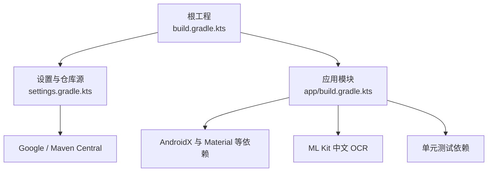
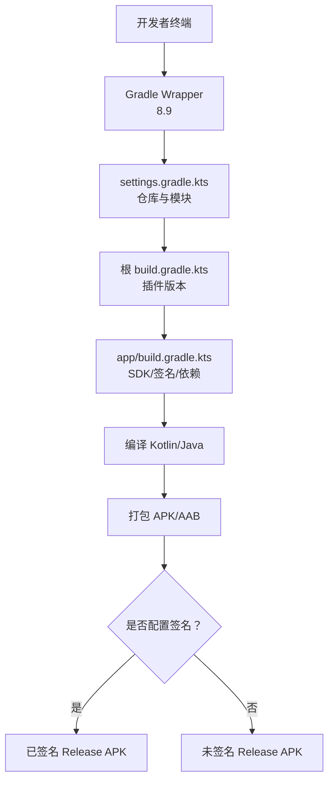
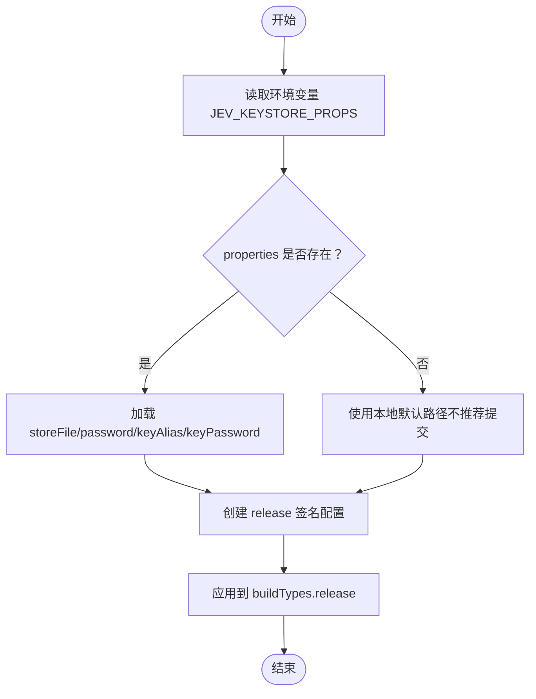
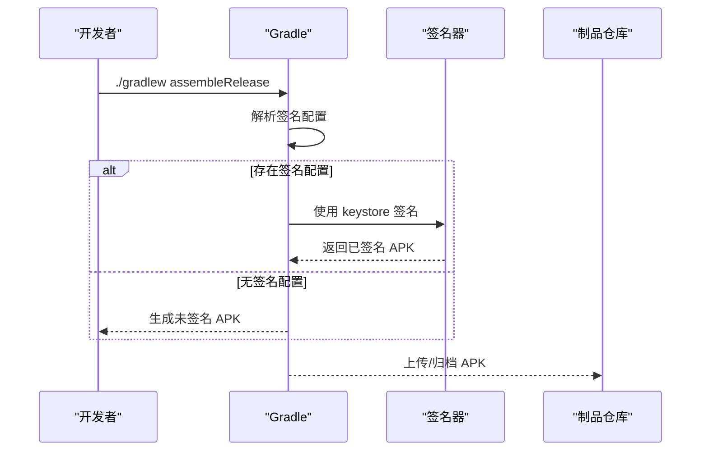
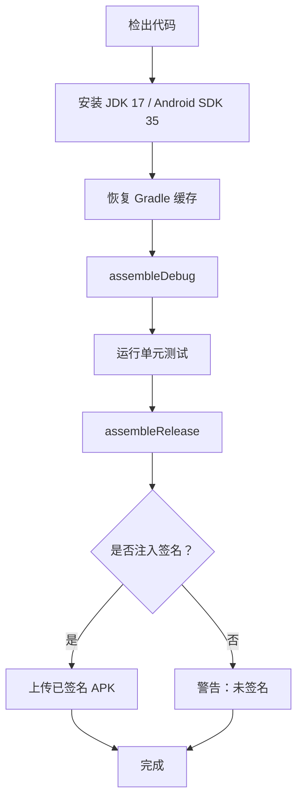
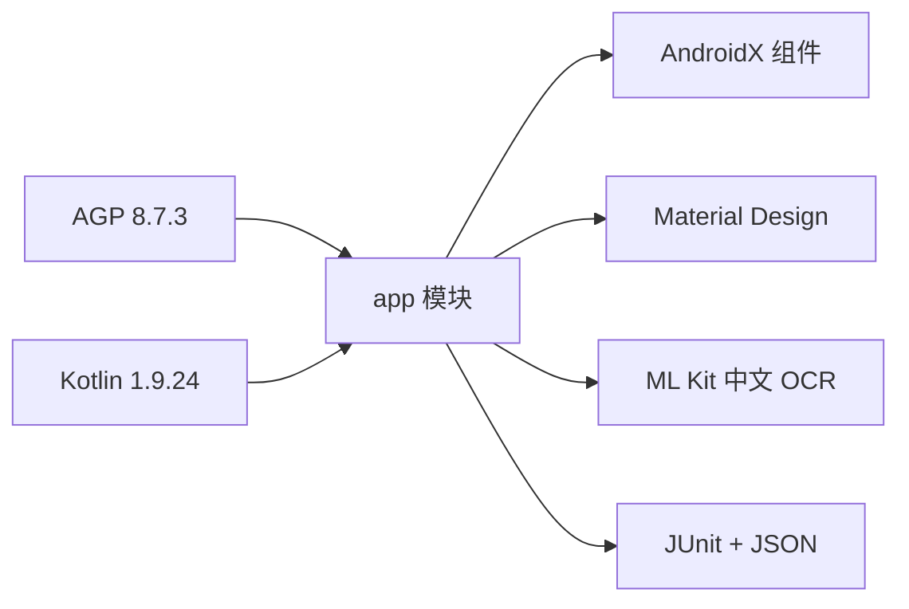

# 构建与部署

<cite>
**本文引用的文件**   
- [app/build.gradle.kts](file://app/build.gradle.kts)
- [build.gradle.kts](file://build.gradle.kts)
- [settings.gradle.kts](file://settings.gradle.kts)
- [gradle.properties](file://gradle.properties)
- [gradle/wrapper/gradle-wrapper.properties](file://gradle/wrapper/gradle-wrapper.properties)
- [README.md](file://README.md)
</cite>

## 目录
1. [简介](#简介)
2. [项目结构](#项目结构)
3. [核心组件](#核心组件)
4. [架构总览](#架构总览)
5. [详细组件分析](#详细组件分析)
6. [依赖关系分析](#依赖关系分析)
7. [性能与体积优化](#性能与体积优化)
8. [故障排查指南](#故障排查指南)
9. [结论](#结论)
10. [附录：任务与环境清单](#附录任务与环境清单)

## 简介
本文面向 Jev 聊天助手 Android 端的开发者与维护者，聚焦“如何正确搭建开发环境、理解 Gradle 构建配置、生成 debug/release 包并安全签名分发”。文档覆盖 JDK 17、Android SDK 35、Gradle 8.9 的约束；详解 app 模块的依赖管理、签名配置、变体与打包策略；说明环境变量、CI/CD 集成要点与版本管理策略。

## 项目结构
Jev Android 端采用单模块 Android 应用结构，根工程仅声明插件版本，所有构建逻辑集中在 app 模块中。仓库同时提供 README 中的快速构建命令与 APK 下载入口。

**图表来源**
- [build.gradle.kts:1-6](file://build.gradle.kts#L1-L6)
- [settings.gradle.kts:1-19](file://settings.gradle.kts#L1-L19)
- [app/build.gradle.kts:73-85](file://app/build.gradle.kts#L73-L85)

**章节来源**
- [build.gradle.kts:1-6](file://build.gradle.kts#L1-L6)
- [settings.gradle.kts:1-19](file://settings.gradle.kts#L1-L19)
- [app/build.gradle.kts:1-86](file://app/build.gradle.kts#L1-L86)
- [README.md:223-241](file://README.md#L223-L241)

## 核心组件
- 应用模块 app：包含 Android 应用的全部 Kotlin 代码、资源与构建脚本。
- 根工程：统一声明 Android 与 Kotlin 插件版本。
- Gradle Wrapper：锁定 Gradle 8.9，保证团队一致。
- 全局属性：启用并行、缓存、AndroidX、非传递 RClass 等。

关键职责划分：
- settings.gradle.kts：集中管理插件仓库与依赖仓库，禁止子模块自行添加仓库。
- build.gradle.kts（根）：声明 com.android.application 与 org.jetbrains.kotlin.android 的版本。
- app/build.gradle.kts：定义命名空间、SDK 版本、签名、变体、NDK ABI 过滤、Java/Kotlin 目标、依赖。
- gradle.properties：JVM 参数、并行与缓存开关、AndroidX 与非传递 RClass。
- gradle-wrapper.properties：Gradle 8.9 二进制分发地址与校验开关。

**章节来源**
- [settings.gradle.kts:1-19](file://settings.gradle.kts#L1-L19)
- [build.gradle.kts:1-6](file://build.gradle.kts#L1-L6)
- [app/build.gradle.kts:1-86](file://app/build.gradle.kts#L1-L86)
- [gradle.properties:1-13](file://gradle.properties#L1-L13)
- [gradle/wrapper/gradle-wrapper.properties:1-8](file://gradle/wrapper/gradle-wrapper.properties#L1-L8)

## 架构总览
下图展示从源码到 APK 的关键路径：Gradle 通过 Wrapper 启动，读取 settings 与根 build，再加载 app 模块的构建脚本，解析依赖、执行编译、打包与签名。

**图表来源**
- [gradle/wrapper/gradle-wrapper.properties:1-8](file://gradle/wrapper/gradle-wrapper.properties#L1-L8)
- [settings.gradle.kts:1-19](file://settings.gradle.kts#L1-L19)
- [build.gradle.kts:1-6](file://build.gradle.kts#L1-L6)
- [app/build.gradle.kts:9-52](file://app/build.gradle.kts#L9-L52)

## 详细组件分析

### 开发环境搭建
- JDK：必须使用 JDK 17。Gradle 与 Kotlin 均要求 Java 17 目标。
- Android SDK：compileSdk/targetSdk 为 35，minSdk 为 30。需安装 platform 35 与对应 build-tools。
- Gradle：通过 Wrapper 使用 8.9，建议不要手动替换。
- Android Studio：建议使用支持 AGP 8.x 与 Kotlin 1.9.x 的版本。

验证方式：
- 运行 `./gradlew --version` 确认 Gradle 8.9。
- 在 Android Studio 中检查 Project Structure 的 SDK 与 JDK 路径。

**章节来源**
- [app/build.gradle.kts:17-26](file://app/build.gradle.kts#L17-L26)
- [app/build.gradle.kts:63-70](file://app/build.gradle.kts#L63-L70)
- [gradle/wrapper/gradle-wrapper.properties:1-8](file://gradle/wrapper/gradle-wrapper.properties#L1-L8)
- [README.md:223-231](file://README.md#L223-L231)

### 构建配置详解

#### 命名空间与 SDK 版本
- 命名空间：com.jev.probe
- compileSdk/targetSdk：35
- minSdk：30

这些值决定可运行的最低系统版本与编译 API 级别。

**章节来源**
- [app/build.gradle.kts:17-26](file://app/build.gradle.kts#L17-L26)

#### NDK ABI 过滤
- 仅保留 arm64-v8a，以减小包体并适配 Android 15+ 的 16KB 页大小设备。
- 该策略会移除其他 ABI 的 native 库，减少无用体积。

**章节来源**
- [app/build.gradle.kts:28-34](file://app/build.gradle.kts#L28-L34)

#### 签名配置
- 签名属性文件位于仓库外，路径由环境变量 JEV_KEYSTORE_PROPS 指定；若不存在则回退到本地默认路径。
- 当 properties 存在时，创建 release signingConfig，读取 storeFile、storePassword、keyAlias、keyPassword。
- 若未找到签名配置，release 构建将生成未签名包。

安全建议：
- 永远不要把 keystore 或签名 properties 提交到仓库。
- CI 中通过密钥管理服务注入 JEV_KEYSTORE_PROPS 指向临时 properties。

**图表来源**
- [app/build.gradle.kts:9-15](file://app/build.gradle.kts#L9-L15)
- [app/build.gradle.kts:36-52](file://app/build.gradle.kts#L36-L52)

**章节来源**
- [app/build.gradle.kts:9-15](file://app/build.gradle.kts#L9-L15)
- [app/build.gradle.kts:36-52](file://app/build.gradle.kts#L36-L52)

#### 构建变体
- debug：默认生成未签名的调试包，适合开发与测试。
- release：可选签名；未配置签名时生成未签名 release 包。
- 关闭混淆（isMinifyEnabled=false），便于快速迭代与定位问题。

产物路径：
- debug：app/build/outputs/apk/debug/app-debug.apk
- release：app/build/outputs/apk/release/app-release.apk（若签名成功则为已签名包）

**章节来源**
- [app/build.gradle.kts:47-52](file://app/build.gradle.kts#L47-L52)
- [README.md:223-231](file://README.md#L223-L231)

#### Java/Kotlin 目标
- Java sourceCompatibility/targetCompatibility：VERSION_17
- Kotlin jvmTarget：17

确保与 JDK 17 工具链一致，避免运行时兼容性问题。

**章节来源**
- [app/build.gradle.kts:63-70](file://app/build.gradle.kts#L63-L70)

#### 依赖管理
- AndroidX 与 Material Design 组件：core-ktx、appcompat、material、constraintlayout。
- 离线 OCR：com.google.mlkit:text-recognition-chinese:16.0.1（内置中文模型，无需 Google Play Services）。
- 单元测试：junit:junit:4.13.2 与 org.json:json:20240303（用于真实 JSON 解析测试）。

注意：
- 仓库模式被强制为 FAIL_ON_PROJECT_REPOS，禁止子模块私自添加仓库，提升依赖可控性。

**章节来源**
- [app/build.gradle.kts:73-85](file://app/build.gradle.kts#L73-L85)
- [settings.gradle.kts:9-15](file://settings.gradle.kts#L9-L15)

#### 打包优化
- packaging.jniLibs.useLegacyPackaging=false：对 .so 使用页对齐打包，利于 Android 15+ 的 mmap 加载，减少安装解压开销。

**章节来源**
- [app/build.gradle.kts:54-61](file://app/build.gradle.kts#L54-L61)

### 发布流程

#### Debug 包生成
- 命令：`./gradlew assembleDebug`
- 产物：app/build/outputs/apk/debug/app-debug.apk
- 用途：本地调试、内部测试、A/B 小范围灰度。

#### Release 包生成与签名
- 命令：`./gradlew assembleRelease`
- 条件：
  - 设置环境变量 JEV_KEYSTORE_PROPS 指向有效的 keystore properties。
  - properties 中包含 storeFile、storePassword、keyAlias、keyPassword。
- 产物：app/build/outputs/apk/release/app-release.apk（已签名）。
- 若无签名配置，将生成未签名 release 包，不可直接上架。

#### APK 分发
- 官方预签名包存放于 apk/ 目录，并在 README 提供下载链接。
- 分发渠道包括 GitHub Releases、官网直链等。

**图表来源**
- [app/build.gradle.kts:9-15](file://app/build.gradle.kts#L9-L15)
- [app/build.gradle.kts:36-52](file://app/build.gradle.kts#L36-L52)
- [README.md:223-231](file://README.md#L223-L231)

**章节来源**
- [app/build.gradle.kts:9-15](file://app/build.gradle.kts#L9-L15)
- [app/build.gradle.kts:36-52](file://app/build.gradle.kts#L36-L52)
- [README.md:223-231](file://README.md#L223-L231)

### Gradle 任务说明
常用任务：
- assembleDebug：构建 debug 变体。
- assembleRelease：构建 release 变体（可能未签名）。
- installDebug：构建并安装到连接设备。
- uninstallApp：卸载当前应用。
- connectedAndroidTest：在真机/模拟器上运行 UI 测试（如有）。
- test：运行 JVM 单元测试。

注意事项：
- 由于未启用混淆，assembleRelease 不会显著缩小包体。
- 如需 AAB，可在 app 模块启用 bundle 相关配置后使用 bundleRelease。

**章节来源**
- [app/build.gradle.kts:47-52](file://app/build.gradle.kts#L47-L52)
- [README.md:223-231](file://README.md#L223-L231)

### 环境变量与全局配置
- JAVA_HOME：指向 JDK 17 安装路径。
- JEV_KEYSTORE_PROPS：指向 keystore properties 文件路径（仓库外）。
- gradle.properties：
  - org.gradle.jvmargs：堆内存与编码。
  - org.gradle.parallel：开启并行构建。
  - org.gradle.caching：开启构建缓存。
  - android.useAndroidX：启用 AndroidX。
  - android.nonTransitiveRClass：启用非传递 RClass，加速编译。
  - kotlin.code.style：官方风格。

CI 建议：
- 在 CI 中设置 JAVA_HOME 与 JEV_KEYSTORE_PROPS。
- 使用缓存 Gradle 依赖与构建缓存目录，缩短构建时间。

**章节来源**
- [gradle.properties:1-13](file://gradle.properties#L1-L13)
- [app/build.gradle.kts:9-15](file://app/build.gradle.kts#L9-L15)

### CI/CD 集成要点
- 环境准备：
  - 安装 JDK 17。
  - 安装 Android SDK 35 与 build-tools 35。
  - 使用 Gradle Wrapper 8.9。
- 缓存策略：
  - 缓存 ~/.gradle/caches 与 wrapper 下载。
- 签名注入：
  - 通过密钥管理服务注入 JEV_KEYSTORE_PROPS。
  - 校验 properties 字段完整性后再执行 assembleRelease。
- 制品归档：
  - 上传 app/build/outputs/apk/release/app-release.apk。
  - 记录版本信息（versionCode/versionName）。

**图表来源**
- [gradle/wrapper/gradle-wrapper.properties:1-8](file://gradle/wrapper/gradle-wrapper.properties#L1-L8)
- [app/build.gradle.kts:9-15](file://app/build.gradle.kts#L9-L15)
- [app/build.gradle.kts:47-52](file://app/build.gradle.kts#L47-L52)

### 版本管理策略
- 版本号位置：app/build.gradle.kts 的 defaultConfig.versionCode 与 versionName。
- 当前版本：versionCode=5，versionName="1.4"。
- 建议：
  - 每次发布前递增 versionCode。
  - versionName 遵循语义化版本（主版本.次版本.修订号）。
  - 在 Git Tag 与 Release Notes 中同步更新版本信息。

**章节来源**
- [app/build.gradle.kts:21-26](file://app/build.gradle.kts#L21-L26)
- [README.md:11](file://README.md#L11)

## 依赖关系分析
- 插件依赖：
  - com.android.application：AGP 8.7.3
  - org.jetbrains.kotlin.android：Kotlin 1.9.24
- 运行时依赖：
  - AndroidX core-ktx、appcompat、material、constraintlayout
  - ML Kit text-recognition-chinese（离线中文 OCR）
- 测试依赖：
  - junit:junit:4.13.2
  - org.json:json:20240303

**图表来源**
- [build.gradle.kts:1-6](file://build.gradle.kts#L1-L6)
- [app/build.gradle.kts:73-85](file://app/build.gradle.kts#L73-L85)

**章节来源**
- [build.gradle.kts:1-6](file://build.gradle.kts#L1-L6)
- [app/build.gradle.kts:73-85](file://app/build.gradle.kts#L73-L85)

## 性能与体积优化
- 已启用并行构建与构建缓存，提升重复构建速度。
- 已启用非传递 RClass，减少 R 类膨胀。
- 仅保留 arm64-v8a，显著降低 native 库体积。
- 使用页对齐打包 .so，改善 Android 15+ 设备的加载性能。
- 未启用混淆与资源压缩，便于调试；生产环境可按需开启 ProGuard/R8。

[本节为通用指导，不涉及具体文件分析]

## 故障排查指南
常见问题与处理：
- 构建失败提示 JDK 版本不匹配：
  - 确认 JAVA_HOME 指向 JDK 17。
- 无法下载 Gradle 或依赖：
  - 检查网络与代理；确保 gradle-wrapper.properties 未被篡改。
- release 包未签名：
  - 检查 JEV_KEYSTORE_PROPS 是否正确指向有效 properties。
  - 确认 properties 包含 storeFile、storePassword、keyAlias、keyPassword。
- 包体异常增大：
  - 检查是否误引入多 ABI 的 native 库；确认 abiFilters 仅包含 arm64-v8a。
- 安装失败或权限问题：
  - 先卸载旧版 debug/release（签名不同），再安装新版本。
  - 按 README 指引开启无障碍、悬浮窗、自启动与省电无限制。

**章节来源**
- [app/build.gradle.kts:9-15](file://app/build.gradle.kts#L9-L15)
- [app/build.gradle.kts:28-34](file://app/build.gradle.kts#L28-L34)
- [README.md:86-103](file://README.md#L86-L103)

## 结论
Jev Android 端的构建体系简洁明确：通过 Gradle Wrapper 锁定版本，根工程统一管理插件，app 模块负责 SDK、签名、ABI 与依赖。开发时使用 assembleDebug 快速迭代；发布时使用 assembleRelease 并结合 JEV_KEYSTORE_PROPS 进行安全签名。建议在 CI 中固化环境、缓存与签名注入流程，并配合语义化版本管理，确保可重复、可追溯的发布流水线。

[本节为总结性内容，不涉及具体文件分析]

## 附录：任务与环境清单

- 必需环境
  - JDK 17
  - Android SDK 35（platform 与 build-tools）
  - Gradle 8.9（通过 Wrapper）
- 关键环境变量
  - JAVA_HOME：JDK 17 路径
  - JEV_KEYSTORE_PROPS：keystore properties 路径
- 常用命令
  - ./gradlew assembleDebug
  - ./gradlew assembleRelease
  - ./gradlew installDebug
- 产物路径
  - debug：app/build/outputs/apk/debug/app-debug.apk
  - release：app/build/outputs/apk/release/app-release.apk

**章节来源**
- [README.md:223-231](file://README.md#L223-L231)
- [app/build.gradle.kts:21-26](file://app/build.gradle.kts#L21-L26)
- [app/build.gradle.kts:9-15](file://app/build.gradle.kts#L9-L15)