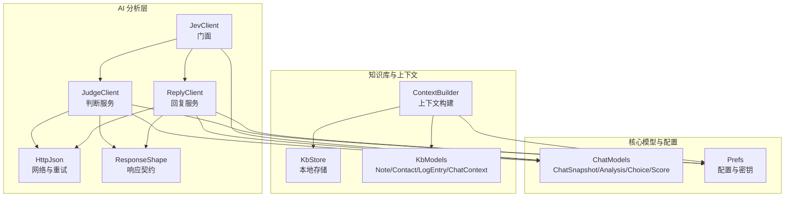
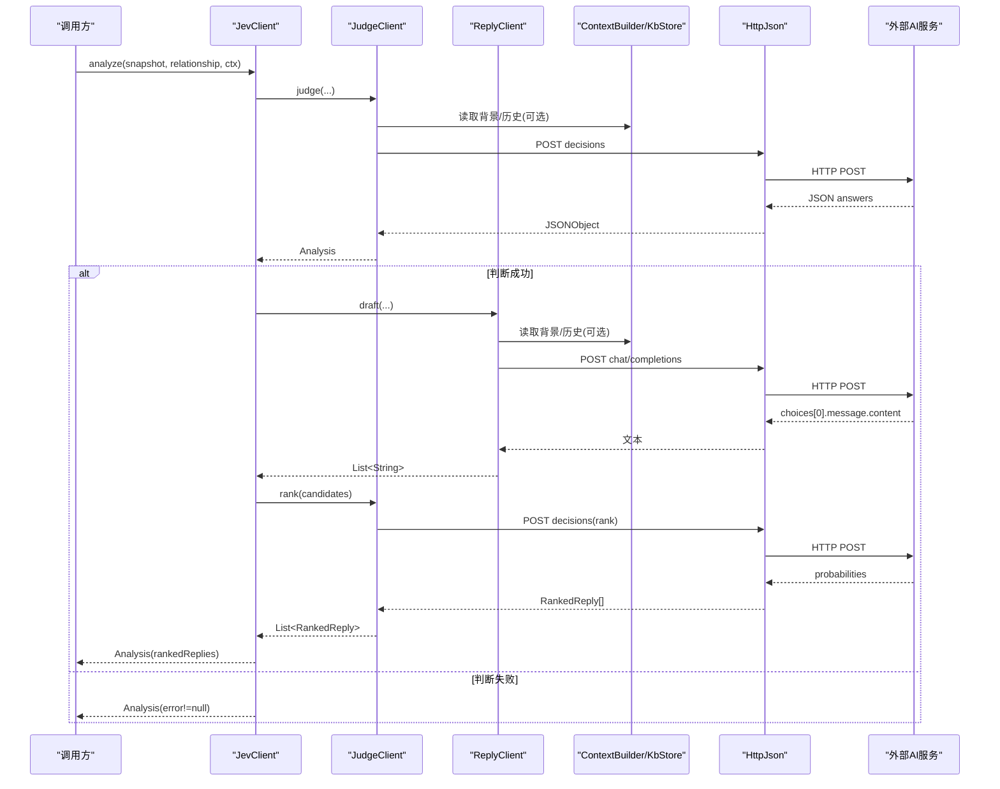
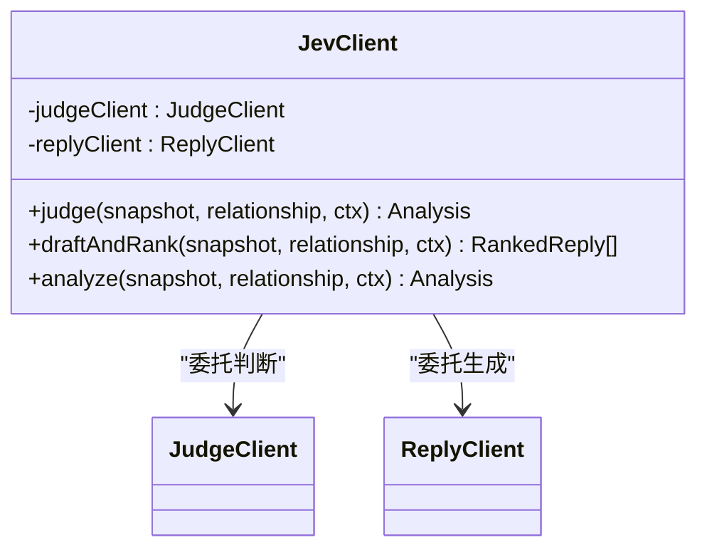
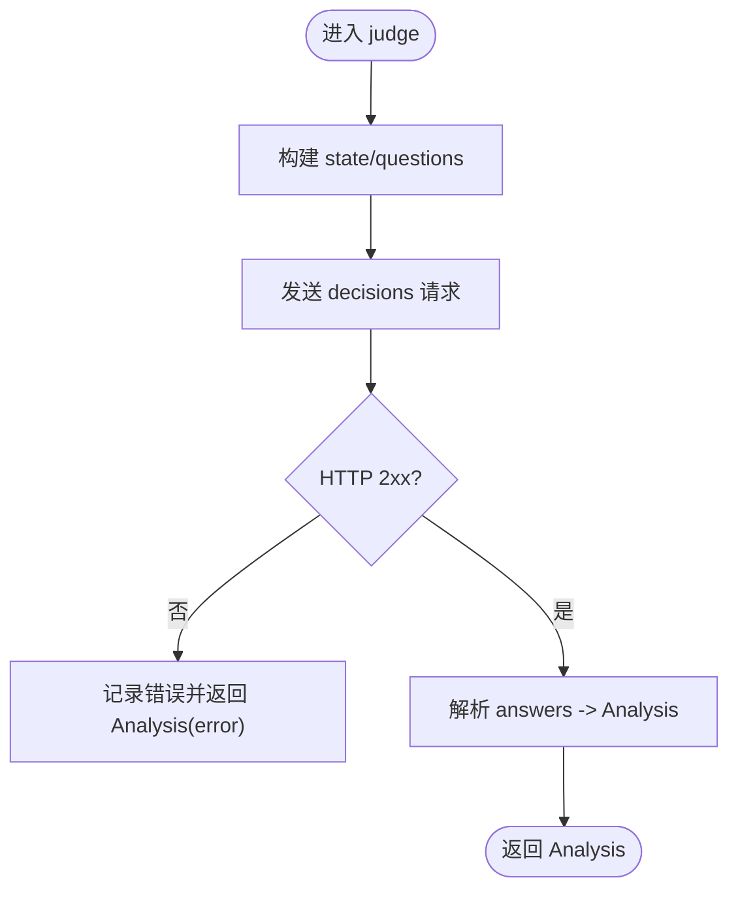
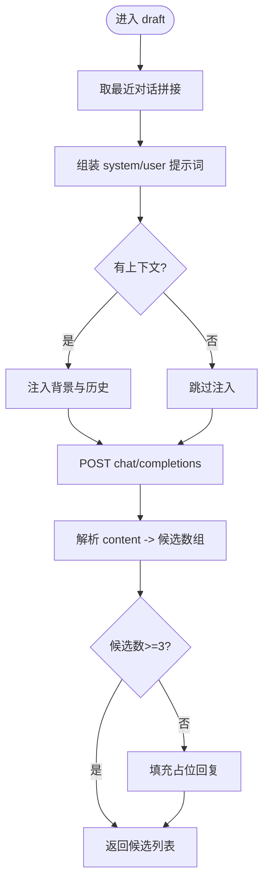
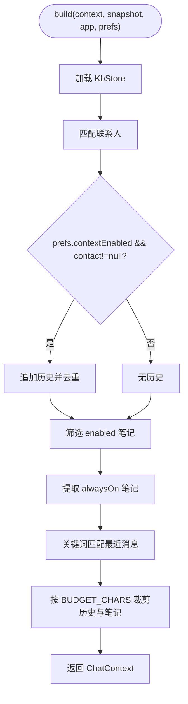
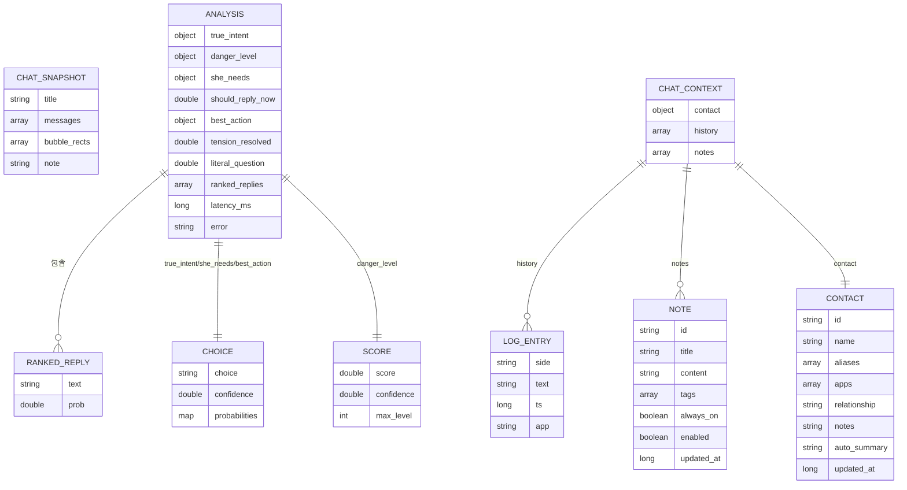
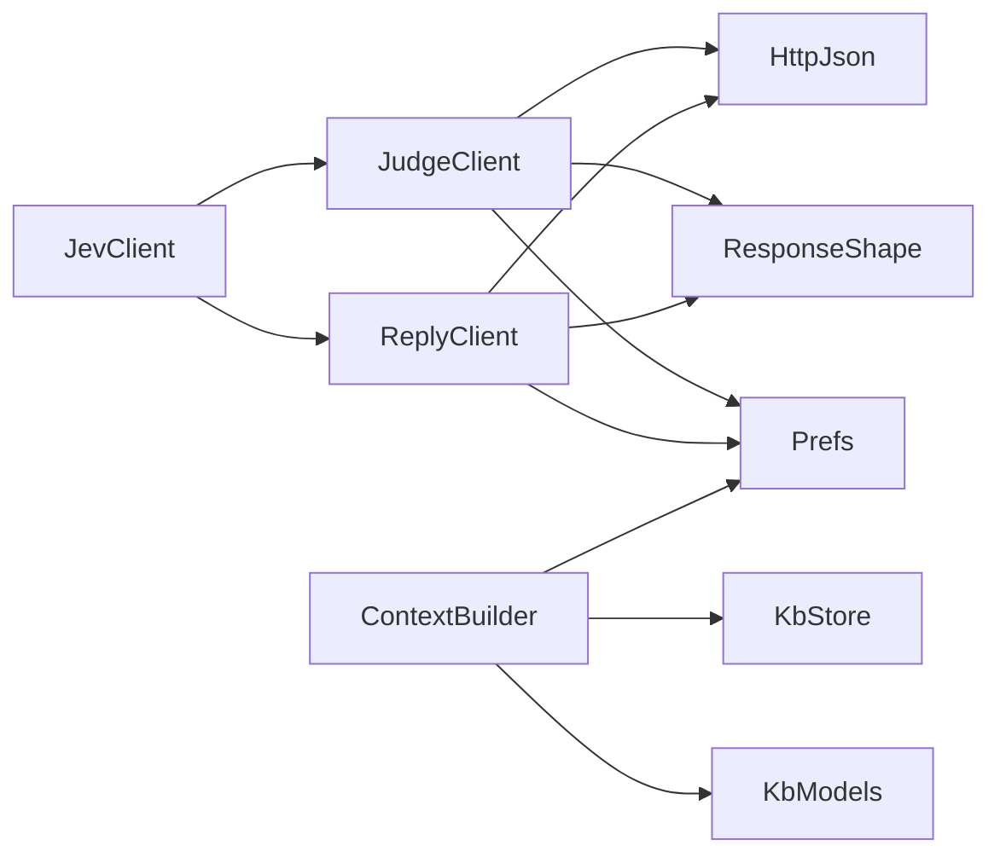
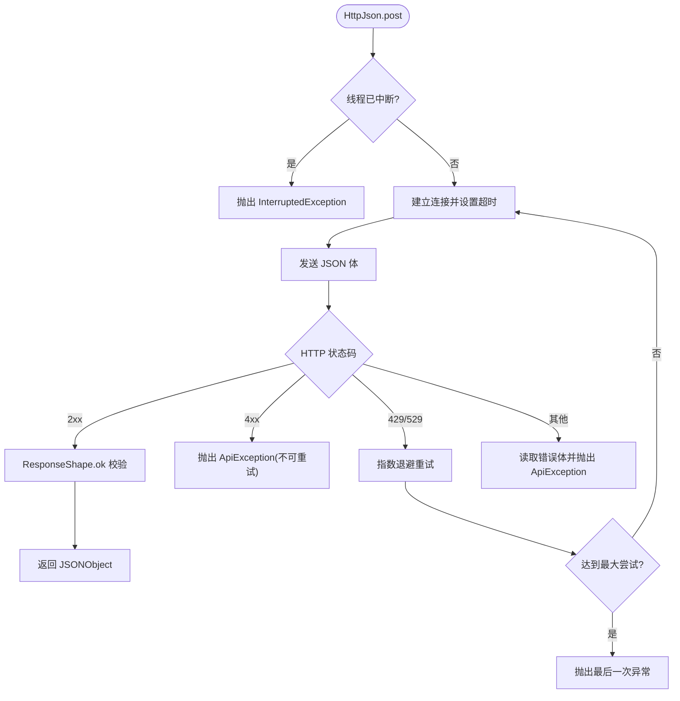

# AI 分析架构

<cite>
**本文引用的文件**   
- [JevClient.kt](file://app/src/main/java/com/jev/probe/jev/JevClient.kt)
- [JudgeClient.kt](file://app/src/main/java/com/jev/probe/jev/JudgeClient.kt)
- [ReplyClient.kt](file://app/src/main/java/com/jev/probe/jev/ReplyClient.kt)
- [ResponseShape.kt](file://app/src/main/java/com/jev/probe/jev/ResponseShape.kt)
- [HttpJson.kt](file://app/src/main/java/com/jev/probe/jev/HttpJson.kt)
- [ContextBuilder.kt](file://app/src/main/java/com/jev/probe/core/kb/ContextBuilder.kt)
- [KbModels.kt](file://app/src/main/java/com/jev/probe/core/kb/KbModels.kt)
- [KbStore.kt](file://app/src/main/java/com/jev/probe/core/kb/KbStore.kt)
- [ChatModels.kt](file://app/src/main/java/com/jev/probe/core/ChatModels.kt)
- [Prefs.kt](file://app/src/main/java/com/jev/probe/core/Prefs.kt)
</cite>

## 目录
1. [引言](#引言)
2. [项目结构](#项目结构)
3. [核心组件](#核心组件)
4. [架构总览](#架构总览)
5. [详细组件分析](#详细组件分析)
6. [依赖关系分析](#依赖关系分析)
7. [性能与容量控制](#性能与容量控制)
8. [异步处理与错误重试](#异步处理与错误重试)
9. [API 调用示例与响应处理](#api-调用示例与响应处理)
10. [配置管理与密钥安全](#配置管理与密钥安全)
11. [故障排查指南](#故障排查指南)
12. [结论](#结论)

## 引言
本文件面向 Jev 聊天助手的 AI 分析层，重点说明门面模式在 `JevClient` 中的实现、判断服务与回复服务的职责分离、意图识别与风险评估流程、回复建议生成流程、上下文构建机制、异步与重试策略、JSON 序列化与字段映射、以及配置与密钥安全。目标是让非技术读者也能理解整体设计，同时为开发者提供可追溯的实现细节。

## 项目结构
AI 分析相关代码集中在两个包：
- `com.jev.probe.jev`：对外门面、判断客户端、回复客户端、HTTP 网络封装、响应契约解析。
- `com.jev.probe.core.kb`：本地知识库模型、存储、上下文构建器。
- `com.jev.probe.core`：通用数据模型（聊天快照、分析结果等）和全局配置。

**图表来源**
- [JevClient.kt:14-40](file://app/src/main/java/com/jev/probe/jev/JevClient.kt#L14-L40)
- [JudgeClient.kt:18-131](file://app/src/main/java/com/jev/probe/jev/JudgeClient.kt#L18-L131)
- [ReplyClient.kt:14-88](file://app/src/main/java/com/jev/probe/jev/ReplyClient.kt#L14-L88)
- [HttpJson.kt:48-149](file://app/src/main/java/com/jev/probe/jev/HttpJson.kt#L48-L149)
- [ResponseShape.kt:25-140](file://app/src/main/java/com/jev/probe/jev/ResponseShape.kt#L25-L140)
- [ContextBuilder.kt:16-123](file://app/src/main/java/com/jev/probe/core/kb/ContextBuilder.kt#L16-L123)
- [KbStore.kt:24-539](file://app/src/main/java/com/jev/probe/core/kb/KbStore.kt#L24-L539)
- [KbModels.kt:12-85](file://app/src/main/java/com/jev/probe/core/kb/KbModels.kt#L12-L85)
- [ChatModels.kt:27-56](file://app/src/main/java/com/jev/probe/core/ChatModels.kt#L27-L56)
- [Prefs.kt:14-332](file://app/src/main/java/com/jev/probe/core/Prefs.kt#L14-L332)

**章节来源**
- [JevClient.kt:14-40](file://app/src/main/java/com/jev/probe/jev/JevClient.kt#L14-L40)
- [ContextBuilder.kt:16-63](file://app/src/main/java/com/jev/probe/core/kb/ContextBuilder.kt#L16-L63)
- [Prefs.kt:14-332](file://app/src/main/java/com/jev/probe/core/Prefs.kt#L14-L332)

## 核心组件
- **JevClient**：门面类，统一入口，封装判断与回复两条路径，负责组合调用并返回统一的 `Analysis` 或候选回复列表。
- **JudgeClient**：专注“判断”接口，输出意图、风险等级、最佳行动等结构化判断结果，并对候选回复进行排序。
- **ReplyClient**：专注“生成”接口，基于 OpenAI 兼容的 `/chat/completions` 协议生成三条差异化中文回复建议。
- **ContextBuilder**：将当前屏幕快照、联系人匹配、历史消息、知识库笔记整合成 `ChatContext`，供判断与回复使用。
- **HttpJson**：统一的 HTTP POST 封装，负责超时、重试、节流退避、异常归一化。
- **ResponseShape**：统一校验不同接口的响应体形状，拒绝“成功状态码但业务失败”的情况。
- **Prefs**：集中管理 API 地址、密钥、模型、功能开关，并提供端点拼接与密钥回退逻辑。
- **KbStore / KbModels**：本地 JSON 文件存储联系人、笔记、聊天记录；提供原子写入、去重、缓存、清理能力。
- **ChatModels**：定义聊天快照、分析结果、选择项、评分、排序后的回复等数据结构。

**章节来源**
- [JevClient.kt:14-40](file://app/src/main/java/com/jev/probe/jev/JevClient.kt#L14-L40)
- [JudgeClient.kt:18-131](file://app/src/main/java/com/jev/probe/jev/JudgeClient.kt#L18-L131)
- [ReplyClient.kt:14-88](file://app/src/main/java/com/jev/probe/jev/ReplyClient.kt#L14-L88)
- [ContextBuilder.kt:16-123](file://app/src/main/java/com/jev/probe/core/kb/ContextBuilder.kt#L16-L123)
- [HttpJson.kt:48-149](file://app/src/main/java/com/jev/probe/jev/HttpJson.kt#L48-L149)
- [ResponseShape.kt:25-140](file://app/src/main/java/com/jev/probe/jev/ResponseShape.kt#L25-L140)
- [Prefs.kt:14-332](file://app/src/main/java/com/jev/probe/core/Prefs.kt#L14-L332)
- [KbStore.kt:24-539](file://app/src/main/java/com/jev/probe/core/kb/KbStore.kt#L24-L539)
- [KbModels.kt:12-85](file://app/src/main/java/com/jev/probe/core/kb/KbModels.kt#L12-L85)
- [ChatModels.kt:27-56](file://app/src/main/java/com/jev/probe/core/ChatModels.kt#L27-L56)

## 架构总览
Jev 的 AI 分析采用“门面 + 双通道客户端”的架构：
- 门面 `JevClient` 屏蔽内部复杂度，对外暴露三类方法：仅判断、生成并排序、判断加回复。
- 判断通道 `JudgeClient` 调用 Jev decisions 接口，产出结构化判断结果，并可对候选回复进行排序。
- 生成通道 `ReplyClient` 调用 OpenAI 兼容 chat completions 接口，生成三条差异化回复。
- 上下文由 `ContextBuilder` 从本地知识库中抽取联系人、历史、笔记，注入到判断与回复请求中。
- 网络层 `HttpJson` 统一处理超时、重试、节流、异常信息可读化。
- 响应层 `ResponseShape` 统一校验不同协议的响应体，避免“成功状态码但无有效内容”的误判。

**图表来源**
- [JevClient.kt:20-39](file://app/src/main/java/com/jev/probe/jev/JevClient.kt#L20-L39)
- [JudgeClient.kt:26-62](file://app/src/main/java/com/jev/probe/jev/JudgeClient.kt#L26-L62)
- [ReplyClient.kt:23-33](file://app/src/main/java/com/jev/probe/jev/ReplyClient.kt#L23-L33)
- [ContextBuilder.kt:35-63](file://app/src/main/java/com/jev/probe/core/kb/ContextBuilder.kt#L35-L63)
- [HttpJson.kt:56-122](file://app/src/main/java/com/jev/probe/jev/HttpJson.kt#L56-L122)

## 详细组件分析

### 门面模式：JevClient
- 职责：统一入口，持有 `JudgeClient` 与 `ReplyClient`，根据场景选择调用路径。
- 关键方法：
  - `judge`：仅执行判断，返回 `Analysis`。
  - `draftAndRank`：先生成三条候选回复，再调用判断接口排序。
  - `analyze`：顺序执行判断与生成+排序，若判断失败则直接返回错误分析。
- 设计要点：
  - 所有路由的地址、密钥、模型均从 `Prefs` 读取，设置页修改后下次调用生效。
  - 错误不向上抛出，而是落入 `Analysis.error`，便于 UI 展示。

**图表来源**
- [JevClient.kt:14-40](file://app/src/main/java/com/jev/probe/jev/JevClient.kt#L14-L40)

**章节来源**
- [JevClient.kt:14-40](file://app/src/main/java/com/jev/probe/jev/JevClient.kt#L14-L40)

### 判断服务：JudgeClient
- 职责：
  - 调用 Jev decisions 接口，产出意图、风险等级、是否需要立即回复、最佳行动、紧张是否缓解、字面问题概率等。
  - 对候选回复进行排序，返回带概率的 `RankedReply` 列表。
- 关键流程：
  - `judge`：构造状态与问题，POST 后解析 `answers`，填充 `Analysis`。
  - `rank`：构造 ranking 问题，POST 后解析三个候选的概率并排序。
  - `postDecisions`：当携带 background/history 时遇到 4xx，降级为不带这些字段重试一次。
- 错误处理：
  - 捕获异常并记录日志，返回空字段且带 `error` 的分析对象，保证 UI 可见。

**图表来源**
- [JudgeClient.kt:26-49](file://app/src/main/java/com/jev/probe/jev/JudgeClient.kt#L26-L49)
- [ResponseShape.kt:71-75](file://app/src/main/java/com/jev/probe/jev/ResponseShape.kt#L71-L75)

**章节来源**
- [JudgeClient.kt:18-131](file://app/src/main/java/com/jev/probe/jev/JudgeClient.kt#L18-L131)

### 回复服务：ReplyClient
- 职责：
  - 调用 OpenAI 兼容 `/chat/completions`，生成三条差异化中文回复。
  - 支持连通性测试 `ping` 与摘要生成 `summarize`。
- 关键流程：
  - `draft`：组装 system/user 提示词，附加知识库背景与历史，调用 chat 接口，解析出至少一条候选，不足三条用占位补齐。
  - `knowledgeBlock`：当存在 `ChatContext` 时，将背景与历史以指令形式注入 prompt，要求模型不得编造知识库中没有的事实。
- 错误处理：
  - 若响应为空或格式不符，抛出 `ApiException`，避免 UI 显示“成功但空白”。

**图表来源**
- [ReplyClient.kt:23-33](file://app/src/main/java/com/jev/probe/jev/ReplyClient.kt#L23-L33)
- [ResponseShape.kt:84-94](file://app/src/main/java/com/jev/probe/jev/ResponseShape.kt#L84-L94)

**章节来源**
- [ReplyClient.kt:14-88](file://app/src/main/java/com/jev/probe/jev/ReplyClient.kt#L14-L88)

### 上下文构建：ContextBuilder
- 职责：
  - 根据当前聊天快照、应用包名、联系人库、偏好设置，构建 `ChatContext`。
  - 包含三部分：匹配的联系人、最近历史、匹配的笔记。
- 关键逻辑：
  - 联系人匹配：仅精确匹配，不自动创建。
  - 历史整合：用户开启后才写入并注入；去重当前屏幕消息，限制最大条数。
  - 笔记匹配：按标题与标签做子串匹配，限制命中数量。
  - 预算控制：总字符数不超过阈值，优先保留 alwaysOn 笔记，其余按时间裁剪。
- 输出：
  - `ChatContext.background()` 生成一段自然语言背景，供判断与回复使用。

**图表来源**
- [ContextBuilder.kt:35-63](file://app/src/main/java/com/jev/probe/core/kb/ContextBuilder.kt#L35-L63)
- [ContextBuilder.kt:70-91](file://app/src/main/java/com/jev/probe/core/kb/ContextBuilder.kt#L70-L91)
- [ContextBuilder.kt:98-116](file://app/src/main/java/com/jev/probe/core/kb/ContextBuilder.kt#L98-L116)

**章节来源**
- [ContextBuilder.kt:16-123](file://app/src/main/java/com/jev/probe/core/kb/ContextBuilder.kt#L16-L123)
- [KbModels.kt:48-85](file://app/src/main/java/com/jev/probe/core/kb/KbModels.kt#L48-L85)

### 数据模型与关系
- `ChatSnapshot`：当前聊天窗口快照，包含标题、消息气泡、OCR 矩形区域、备注。
- `Analysis`：判断结果，包括意图、风险、最佳行动、是否立即回复、紧张缓解、字面问题概率、排序后的回复、耗时、错误信息。
- `Choice` / `Score`：判断结果的两种常见结构，分别表示分类选择与数值评分。
- `RankedReply`：候选回复及其被选中的概率。
- `Note` / `Contact` / `LogEntry` / `ChatContext`：知识库与上下文的本地数据模型。

**图表来源**
- [ChatModels.kt:27-56](file://app/src/main/java/com/jev/probe/core/ChatModels.kt#L27-L56)
- [KbModels.kt:12-85](file://app/src/main/java/com/jev/probe/core/kb/KbModels.kt#L12-L85)

**章节来源**
- [ChatModels.kt:27-56](file://app/src/main/java/com/jev/probe/core/ChatModels.kt#L27-L56)
- [KbModels.kt:12-85](file://app/src/main/java/com/jev/probe/core/kb/KbModels.kt#L12-L85)

## 依赖关系分析
- `JevClient` 依赖 `JudgeClient` 与 `ReplyClient`，二者都依赖 `Prefs` 获取端点与密钥。
- `JudgeClient` 与 `ReplyClient` 共同依赖 `HttpJson` 与 `ResponseShape`。
- `ContextBuilder` 依赖 `KbStore` 与 `KbModels`，并通过 `Prefs` 控制行为开关。
- `KbStore` 通过原子写入与缓存提升可靠性与性能。
- `Prefs` 提供端点拼接、密钥回退、默认值与迁移逻辑。

**图表来源**
- [JevClient.kt:14-40](file://app/src/main/java/com/jev/probe/jev/JevClient.kt#L14-L40)
- [JudgeClient.kt:18-131](file://app/src/main/java/com/jev/probe/jev/JudgeClient.kt#L18-L131)
- [ReplyClient.kt:14-88](file://app/src/main/java/com/jev/probe/jev/ReplyClient.kt#L14-L88)
- [ContextBuilder.kt:16-123](file://app/src/main/java/com/jev/probe/core/kb/ContextBuilder.kt#L16-L123)
- [Prefs.kt:14-332](file://app/src/main/java/com/jev/probe/core/Prefs.kt#L14-L332)

**章节来源**
- [JevClient.kt:14-40](file://app/src/main/java/com/jev/probe/jev/JevClient.kt#L14-L40)
- [JudgeClient.kt:18-131](file://app/src/main/java/com/jev/probe/jev/JudgeClient.kt#L18-L131)
- [ReplyClient.kt:14-88](file://app/src/main/java/com/jev/probe/jev/ReplyClient.kt#L14-L88)
- [ContextBuilder.kt:16-123](file://app/src/main/java/com/jev/probe/core/kb/ContextBuilder.kt#L16-L123)
- [Prefs.kt:14-332](file://app/src/main/java/com/jev/probe/core/Prefs.kt#L14-L332)

## 性能与容量控制
- 上下文预算：`ContextBuilder.BUDGET_CHARS` 限制注入的背景与历史总长度，避免超出模型输入限制。
- 历史窗口：`MATCH_WINDOW` 限制用于笔记关键词匹配的消息数量；`contextHistoryCount` 限制注入的历史条数。
- 命中笔记上限：`MAX_HIT_NOTES` 限制最多注入的笔记数量。
- 去重：历史记录写入前对当前屏幕消息进行去重，避免重复累积。
- 存储上限：`KbStore.MAX_LOG` 限制每个联系人的历史行数，防止无限增长。

**章节来源**
- [ContextBuilder.kt:18-28](file://app/src/main/java/com/jev/probe/core/kb/ContextBuilder.kt#L18-L28)
- [ContextBuilder.kt:70-91](file://app/src/main/java/com/jev/probe/core/kb/ContextBuilder.kt#L70-L91)
- [ContextBuilder.kt:98-116](file://app/src/main/java/com/jev/probe/core/kb/ContextBuilder.kt#L98-L116)
- [KbStore.kt:473-475](file://app/src/main/java/com/jev/probe/core/kb/KbStore.kt#L473-L475)

## 异步处理与错误重试
- 网络层 `HttpJson.post`：
  - 最大尝试次数为 3 次。
  - 对 429/529 进行指数退避重试。
  - 其他 4xx 不重试，快速失败。
  - 连接超时 15 秒，读取超时 40 秒。
  - 将异常统一包装为 `ApiException`，附带路由、状态码、响应片段与是否可重试标志。
- 判断接口降级：
  - 当携带 background/history 的请求返回 4xx，`JudgeClient.postDecisions` 会再次发送不带这些字段的请求，确保分析可用但不一定最优。
- 线程中断：
  - 每次循环检查线程中断标志，取消请求时抛出 `InterruptedException`。

**图表来源**
- [HttpJson.kt:56-122](file://app/src/main/java/com/jev/probe/jev/HttpJson.kt#L56-L122)
- [JudgeClient.kt:73-90](file://app/src/main/java/com/jev/probe/jev/JudgeClient.kt#L73-L90)

**章节来源**
- [HttpJson.kt:48-149](file://app/src/main/java/com/jev/probe/jev/HttpJson.kt#L48-L149)
- [JudgeClient.kt:73-90](file://app/src/main/java/com/jev/probe/jev/JudgeClient.kt#L73-L90)

## API 调用示例与响应处理

### 判断接口（decisions）
- 请求体结构：
  - `model`：来自 `Prefs.judgeModel`。
  - `state`：由 `JevQuestions.buildState` 构建，包含关系、背景、历史等。
  - `questions`：由 `JevQuestions.judge()` 或 `JevQuestions.rankQuestion` 构建。
- 响应体结构：
  - 顶层需包含 `answers`，否则抛出 `ApiException`。
  - `answers.true_intent`、`answers.she_needs`、`answers.best_action` 为 `Choice` 结构。
  - `answers.danger_level` 为 `Score` 结构。
  - `answers.should_reply_now`、`answers.tension_resolved`、`answers.literal_question` 为数值型概率。
- 字段映射：
  - `JudgeClient.parseChoice` 将 `choice`、`confidence`、`probabilities` 映射为 `Choice`。
  - `JudgeClient.parseScore` 将 `score`、`confidence`、`legend` 的最大级别映射为 `Score`。
  - `JudgeClient.parseRanked` 将三个候选回复的概率映射为 `RankedReply` 并排序。

**章节来源**
- [JudgeClient.kt:26-49](file://app/src/main/java/com/jev/probe/jev/JudgeClient.kt#L26-L49)
- [JudgeClient.kt:105-128](file://app/src/main/java/com/jev/probe/jev/JudgeClient.kt#L105-L128)
- [ResponseShape.kt:71-75](file://app/src/main/java/com/jev/probe/jev/ResponseShape.kt#L71-L75)

### 回复接口（chat/completions）
- 请求体结构：
  - `model`：来自 `Prefs.replyModel`。
  - `messages`：包含 `system` 与 `user` 两条消息。
  - `temperature`：控制生成多样性。
- 响应体结构：
  - 期望 `choices[0].message.content` 为非空字符串。
  - 若为空或格式不符，抛出 `ApiException`，提示 Anthropic 格式或 OpenAI 兼容问题。
- 候选解析：
  - `ResponseShape.threeCandidates` 优先解析 JSON 数组，其次按行分割。
  - 若候选少于三条，用占位文本补齐。

**章节来源**
- [ReplyClient.kt:76-87](file://app/src/main/java/com/jev/probe/jev/ReplyClient.kt#L76-L87)
- [ResponseShape.kt:50-64](file://app/src/main/java/com/jev/probe/jev/ResponseShape.kt#L50-L64)
- [ResponseShape.kt:84-94](file://app/src/main/java/com/jev/probe/jev/ResponseShape.kt#L84-L94)

## 配置管理与密钥安全
- 配置项：
  - 判断接口：提供者、基础地址、密钥、模型。
  - 回复接口：基础地址、密钥、模型。
  - 视觉接口：基础地址、密钥、模型。
  - 上下文开关：是否启用、历史条数、自动摘要。
  - OCR 开关：引擎、未知应用、回退、自动分析。
  - 其他：关系描述、总开关、白名单、悬浮窗透明度与位置、自动分析开关。
- 密钥安全：
  - 存储在应用私有 SharedPreferences，非世界可读。
  - 不在日志中打印密钥本身，只打印密钥长度。
  - 提供 `effectiveReplyKey()` 与 `effectiveVisionKey()` 的回退逻辑，未设置时使用上游密钥。
- 端点拼接：
  - `judgeEndpoint()` 根据提供者拼接完整 URL。
  - `replyEndpoint()` 固定拼接 `/chat/completions`。
  - `visionEndpoint()` 同样拼接 `/chat/completions`。

**章节来源**
- [Prefs.kt:14-332](file://app/src/main/java/com/jev/probe/core/Prefs.kt#L14-L332)

## 故障排查指南
- 判断接口返回空结果：
  - 检查响应是否包含 `answers` 字段，否则属于协议不匹配。
  - 查看 `Analysis.error` 是否为空，若不为空则说明请求失败。
- 回复接口返回空内容：
  - 检查 `choices[0].message.content` 是否存在且非空。
  - 若响应为 Anthropic 格式，需改用 OpenAI 兼容地址。
- 网络异常：
  - 观察 `ApiException` 的 `status` 与 `snippet`，区分 4xx 与 5xx。
  - 429/529 会自动重试，其他 4xx 不会重试。
- 上下文注入无效：
  - 确认 `prefs.contextEnabled` 已开启。
  - 检查联系人是否匹配成功，笔记是否命中关键词。
  - 检查字符预算是否导致历史或笔记被裁剪。

**章节来源**
- [ResponseShape.kt:25-140](file://app/src/main/java/com/jev/probe/jev/ResponseShape.kt#L25-L140)
- [HttpJson.kt:48-149](file://app/src/main/java/com/jev/probe/jev/HttpJson.kt#L48-L149)
- [ContextBuilder.kt:35-63](file://app/src/main/java/com/jev/probe/core/kb/ContextBuilder.kt#L35-L63)

## 结论
Jev 的 AI 分析层通过门面模式统一入口，将判断与回复两条路径解耦，既保证了职责清晰，又提供了灵活的组合调用。上下文构建机制将本地知识库与历史消息安全地注入到 AI 请求中，配合严格的预算与去重策略，确保稳定与可控。网络层与响应层的统一封装提升了健壮性与可观测性，配置与密钥管理遵循最小权限与安全原则。整体架构在易用性、可靠性与可扩展性之间取得了良好平衡。