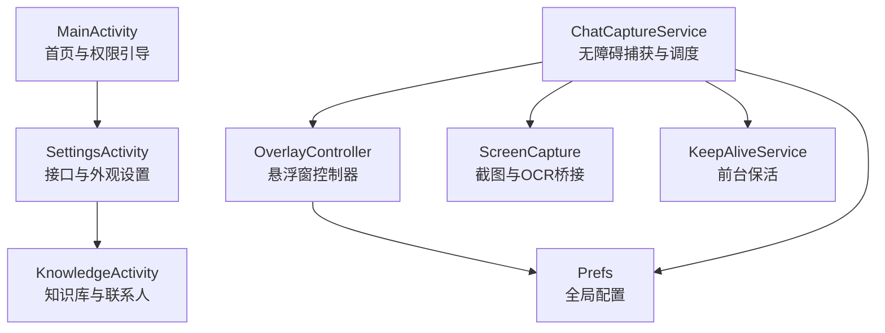
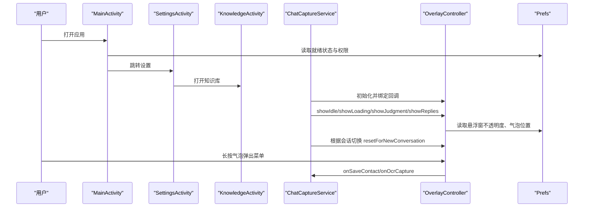
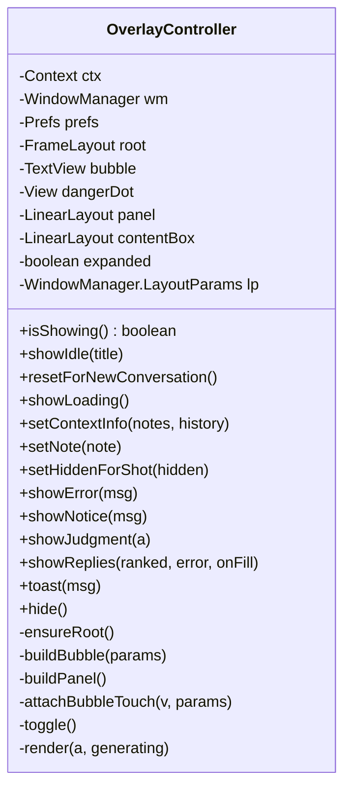
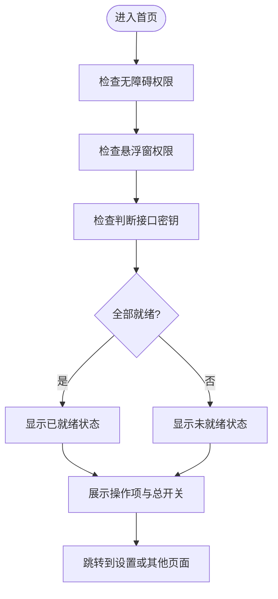
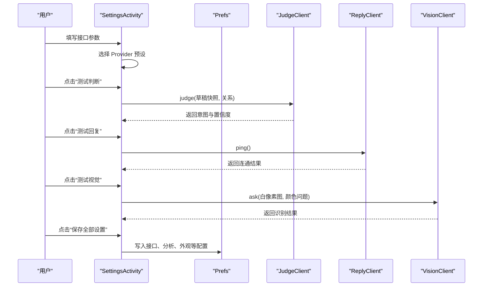
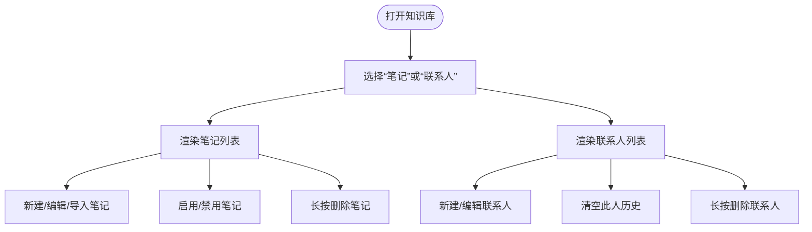
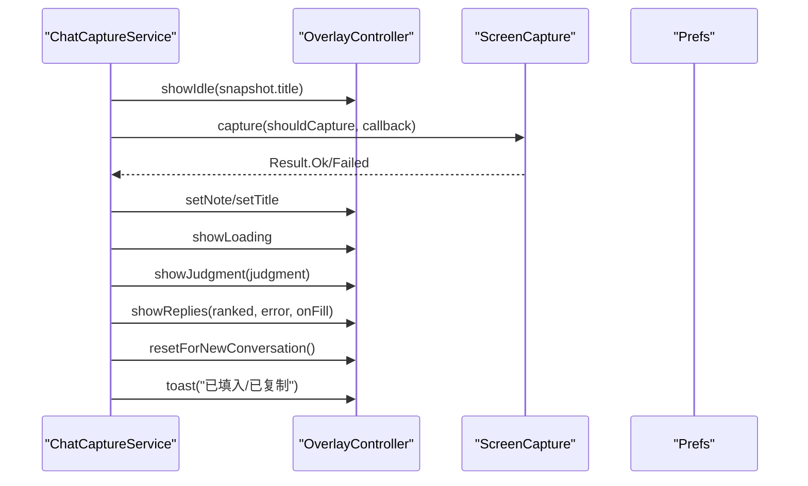
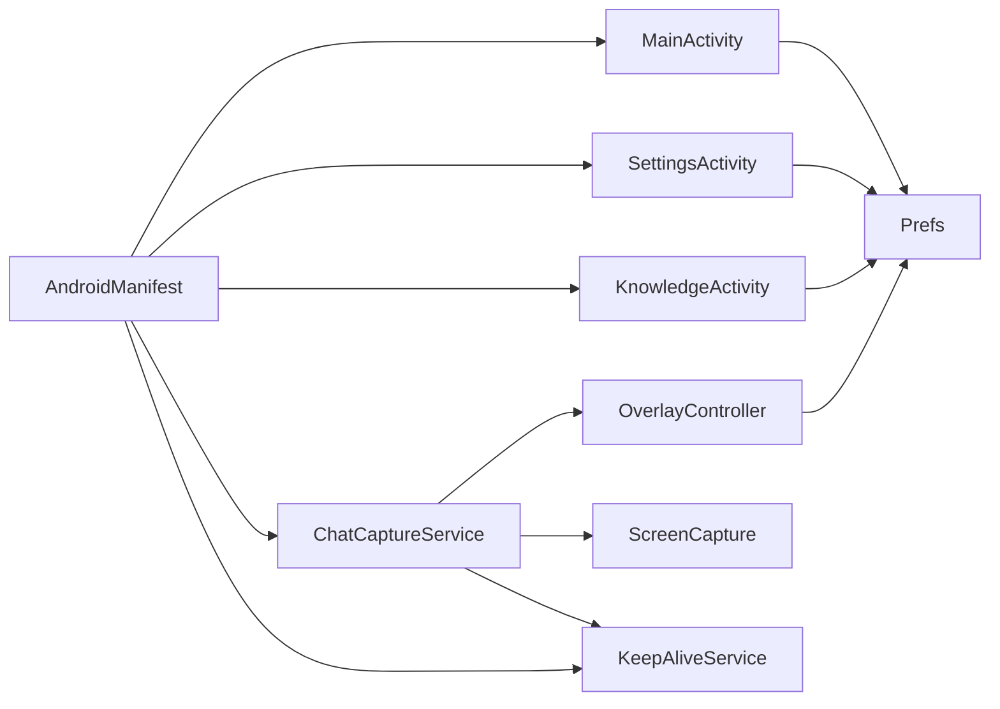

# UI 架构

<cite>
**本文引用的文件**   
- [OverlayController.kt](file://app/src/main/java/com/jev/probe/overlay/OverlayController.kt)
- [MainActivity.kt](file://app/src/main/java/com/jev/probe/MainActivity.kt)
- [SettingsActivity.kt](file://app/src/main/java/com/jev/probe/SettingsActivity.kt)
- [KnowledgeActivity.kt](file://app/src/main/java/com/jev/probe/KnowledgeActivity.kt)
- [ChatCaptureService.kt](file://app/src/main/java/com/jev/probe/capture/ChatCaptureService.kt)
- [Prefs.kt](file://app/src/main/java/com/jev/probe/core/Prefs.kt)
- [AndroidManifest.xml](file://app/src/main/AndroidManifest.xml)
- [ScreenCapture.kt](file://app/src/main/java/com/jev/probe/capture/ocr/ScreenCapture.kt)
- [KeepAliveService.kt](file://app/src/main/java/com/jev/probe/capture/KeepAliveService.kt)
</cite>

## 目录
1. [引言](#引言)
2. [项目结构](#项目结构)
3. [核心组件](#核心组件)
4. [架构总览](#架构总览)
5. [详细组件分析](#详细组件分析)
6. [依赖关系分析](#依赖关系分析)
7. [性能与体验考量](#性能与体验考量)
8. [故障排查指南](#故障排查指南)
9. [结论](#结论)
10. [附录：UI 组件与适配实践](#附录ui-组件与适配实践)

## 引言
本文面向 Jev 聊天助手 Android 应用的 UI 层，重点解释悬浮窗控制器 OverlayController 的实现原理、窗口生命周期管理、手势处理与触摸事件响应；梳理 MainActivity、SettingsActivity、KnowledgeActivity 的职责边界与导航流程；说明悬浮窗与主界面之间的数据同步机制和状态管理策略；阐述 Android 权限在 UI 层的体现、运行时引导流程；并给出 UI 组件使用示例、自定义控件实现方式、响应式设计与多屏幕适配策略，以及无障碍支持与用户体验优化建议。

## 项目结构
UI 层由三个 Activity 和一个系统级悬浮窗控制器组成，同时通过 AccessibilityService 驱动实时捕获与悬浮窗更新：
- MainActivity：应用首页与就绪检查、权限引导、总开关。
- SettingsActivity：接口配置、分析选项、外观设置、知识库入口。
- KnowledgeActivity：本地知识库（笔记）与联系人管理。
- OverlayController：悬浮气泡与半透明面板，承载分析结果、候选回复与交互。
- ChatCaptureService：后台无障碍服务，负责读取聊天树、触发 OCR、驱动悬浮窗。
- Prefs：应用私有配置中心，贯穿所有 UI 与后台逻辑。
- ScreenCapture / KeepAliveService：截图能力与前台保活辅助。

**图表来源**
- [MainActivity.kt:22-106](file://app/src/main/java/com/jev/probe/MainActivity.kt#L22-L106)
- [SettingsActivity.kt:35-448](file://app/src/main/java/com/jev/probe/SettingsActivity.kt#L35-L448)
- [KnowledgeActivity.kt:24-74](file://app/src/main/java/com/jev/probe/KnowledgeActivity.kt#L24-L74)
- [ChatCaptureService.kt:28-41](file://app/src/main/java/com/jev/probe/capture/ChatCaptureService.kt#L28-L41)
- [OverlayController.kt:29-37](file://app/src/main/java/com/jev/probe/overlay/OverlayController.kt#L29-L37)
- [Prefs.kt:6-13](file://app/src/main/java/com/jev/probe/core/Prefs.kt#L6-L13)
- [ScreenCapture.kt:14-34](file://app/src/main/java/com/jev/probe/capture/ocr/ScreenCapture.kt#L14-L34)
- [KeepAliveService.kt:12-18](file://app/src/main/java/com/jev/probe/capture/KeepAliveService.kt#L12-L18)

**章节来源**
- [MainActivity.kt:22-106](file://app/src/main/java/com/jev/probe/MainActivity.kt#L22-L106)
- [SettingsActivity.kt:35-448](file://app/src/main/java/com/jev/probe/SettingsActivity.kt#L35-L448)
- [KnowledgeActivity.kt:24-74](file://app/src/main/java/com/jev/probe/KnowledgeActivity.kt#L24-L74)
- [ChatCaptureService.kt:28-41](file://app/src/main/java/com/jev/probe/capture/ChatCaptureService.kt#L28-L41)
- [OverlayController.kt:29-37](file://app/src/main/java/com/jev/probe/overlay/OverlayController.kt#L29-L37)
- [Prefs.kt:6-13](file://app/src/main/java/com/jev/probe/core/Prefs.kt#L6-L13)
- [ScreenCapture.kt:14-34](file://app/src/main/java/com/jev/probe/capture/ocr/ScreenCapture.kt#L14-L34)
- [KeepAliveService.kt:12-18](file://app/src/main/java/com/jev/probe/capture/KeepAliveService.kt#L12-L18)

## 核心组件
- OverlayController：悬浮窗控制器，负责创建 WindowManager 悬浮窗口、构建气泡与面板、处理拖拽与长按菜单、渲染分析结果与候选回复、与外部回调通信。
- MainActivity：应用启动页，展示就绪状态、权限清单、隐私提示、总开关，并跳转到设置。
- SettingsActivity：集中配置判断接口、回复接口、视觉接口、分析行为、外观透明度、知识库入口等。
- KnowledgeActivity：本地知识库与联系人管理，支持新建、编辑、导入、删除、清空历史等操作。
- ChatCaptureService：无障碍服务，监听窗口变化、提取聊天快照、必要时走 OCR、驱动 OverlayController 显示与分析流程。
- Prefs：统一配置读写，包括接口地址、密钥、模型、白名单、上下文记录开关、悬浮窗不透明度、气泡位置、自动分析开关等。

**章节来源**
- [OverlayController.kt:29-37](file://app/src/main/java/com/jev/probe/overlay/OverlayController.kt#L29-L37)
- [MainActivity.kt:22-106](file://app/src/main/java/com/jev/probe/MainActivity.kt#L22-L106)
- [SettingsActivity.kt:35-448](file://app/src/main/java/com/jev/probe/SettingsActivity.kt#L35-L448)
- [KnowledgeActivity.kt:24-74](file://app/src/main/java/com/jev/probe/KnowledgeActivity.kt#L24-L74)
- [ChatCaptureService.kt:28-41](file://app/src/main/java/com/jev/probe/capture/ChatCaptureService.kt#L28-L41)
- [Prefs.kt:6-13](file://app/src/main/java/com/jev/probe/core/Prefs.kt#L6-L13)

## 架构总览
Jev 的 UI 层采用“前台 Activity + 后台无障碍服务 + 系统悬浮窗”的组合：
- 前台 Activity 负责用户引导、配置与本地知识管理。
- 后台无障碍服务负责监听聊天 App 的窗口与内容变化，抽取聊天快照，必要时触发截图 OCR。
- 悬浮窗控制器以独立 Window 的形式呈现分析结果与候选回复，避免侵入目标聊天 App。

**图表来源**
- [MainActivity.kt:63-106](file://app/src/main/java/com/jev/probe/MainActivity.kt#L63-L106)
- [SettingsActivity.kt:341-343](file://app/src/main/java/com/jev/probe/SettingsActivity.kt#L341-L343)
- [ChatCaptureService.kt:196-231](file://app/src/main/java/com/jev/probe/capture/ChatCaptureService.kt#L196-L231)
- [OverlayController.kt:235-262](file://app/src/main/java/com/jev/probe/overlay/OverlayController.kt#L235-L262)
- [Prefs.kt:196-209](file://app/src/main/java/com/jev/probe/core/Prefs.kt#L196-L209)

## 详细组件分析

### OverlayController 悬浮窗控制器
OverlayController 是 UI 层的核心悬浮窗控制器，职责包括：
- 窗口生命周期管理：通过 ensureRoot 创建 WindowManager.LayoutParams 与 FrameLayout 根视图，添加气泡与面板，调用 wm.addView 显示；提供 hide 移除视图并清理引用。
- 手势与触摸处理：attachBubbleTouch 处理长按弹出菜单、拖拽移动、点击展开/收起面板；拖拽时限制边界以避免 MIUI 手势区冲突。
- 渲染与交互：showIdle/showLoading/showError/showNotice/showJudgment/showReplies 等方法驱动面板内容；render 组合危险等级、意图、行动建议、候选回复卡片；按钮支持复制与填入输入框。
- 状态管理：lastJudgment、lastFill、replyError、ctxNotes、ctxHistory、noteText 等字段维护当前会话的分析上下文；resetForNewConversation 在会话切换时清理旧状态。
- 与外部协作：onManualAnalyze、onSaveContact、onOcrCapture 回调交由 ChatCaptureService 或上层 Activity 实现。

**图表来源**
- [OverlayController.kt:38-78](file://app/src/main/java/com/jev/probe/overlay/OverlayController.kt#L38-L78)
- [OverlayController.kt:97-122](file://app/src/main/java/com/jev/probe/overlay/OverlayController.kt#L97-L122)
- [OverlayController.kt:124-151](file://app/src/main/java/com/jev/probe/overlay/OverlayController.kt#L124-L151)
- [OverlayController.kt:153-188](file://app/src/main/java/com/jev/probe/overlay/OverlayController.kt#L153-L188)
- [OverlayController.kt:198-233](file://app/src/main/java/com/jev/probe/overlay/OverlayController.kt#L198-L233)
- [OverlayController.kt:267-284](file://app/src/main/java/com/jev/probe/overlay/OverlayController.kt#L267-L284)
- [OverlayController.kt:288-399](file://app/src/main/java/com/jev/probe/overlay/OverlayController.kt#L288-L399)
- [OverlayController.kt:408-458](file://app/src/main/java/com/jev/probe/overlay/OverlayController.kt#L408-L458)

**章节来源**
- [OverlayController.kt:29-37](file://app/src/main/java/com/jev/probe/overlay/OverlayController.kt#L29-L37)
- [OverlayController.kt:97-122](file://app/src/main/java/com/jev/probe/overlay/OverlayController.kt#L97-L122)
- [OverlayController.kt:198-233](file://app/src/main/java/com/jev/probe/overlay/OverlayController.kt#L198-L233)
- [OverlayController.kt:267-284](file://app/src/main/java/com/jev/probe/overlay/OverlayController.kt#L267-L284)
- [OverlayController.kt:288-399](file://app/src/main/java/com/jev/probe/overlay/OverlayController.kt#L288-L399)
- [OverlayController.kt:408-458](file://app/src/main/java/com/jev/probe/overlay/OverlayController.kt#L408-L458)

### MainActivity 首页与权限引导
MainActivity 承担以下职责：
- 展示就绪状态：综合无障碍权限、悬浮窗权限、判断接口密钥是否已配置，给出“已就绪/尚未就绪”提示。
- 权限引导：分别跳转到无障碍设置、悬浮窗权限设置、应用详情（自启动与省电无限制）。
- 隐私提示：链接到隐私政策页面。
- 总开关：控制 enabled 标志位，影响后台服务与悬浮窗显示。
- 导航：跳转到 SettingsActivity。

**图表来源**
- [MainActivity.kt:63-106](file://app/src/main/java/com/jev/probe/MainActivity.kt#L63-L106)
- [MainActivity.kt:110-128](file://app/src/main/java/com/jev/probe/MainActivity.kt#L110-L128)
- [MainActivity.kt:157-171](file://app/src/main/java/com/jev/probe/MainActivity.kt#L157-L171)
- [MainActivity.kt:189-200](file://app/src/main/java/com/jev/probe/MainActivity.kt#L189-L200)

**章节来源**
- [MainActivity.kt:22-106](file://app/src/main/java/com/jev/probe/MainActivity.kt#L22-L106)
- [MainActivity.kt:110-128](file://app/src/main/java/com/jev/probe/MainActivity.kt#L110-L128)
- [MainActivity.kt:157-171](file://app/src/main/java/com/jev/probe/MainActivity.kt#L157-L171)
- [MainActivity.kt:189-200](file://app/src/main/java/com/jev/probe/MainActivity.kt#L189-L200)

### SettingsActivity 设置与接口配置
SettingsActivity 负责：
- 接口配置：判断接口（Jev）、回复接口、视觉接口（OCR），支持多种 Provider 预设与自定义 URL。
- 测试按钮：分别对判断、回复、视觉接口进行连通性测试，异步执行并在主线程更新结果。
- 分析选项：关系描述、会话白名单、自动分析、OCR 兜底、OCR 自动分析、上下文记录开关与注入条数。
- 外观设置：悬浮窗不透明度滑块。
- 知识库入口：跳转到 KnowledgeActivity。
- 保存设置：将界面值写入 Prefs。

**图表来源**
- [SettingsActivity.kt:72-195](file://app/src/main/java/com/jev/probe/SettingsActivity.kt#L72-L195)
- [SettingsActivity.kt:197-250](file://app/src/main/java/com/jev/probe/SettingsActivity.kt#L197-L250)
- [SettingsActivity.kt:252-308](file://app/src/main/java/com/jev/probe/SettingsActivity.kt#L252-L308)
- [SettingsActivity.kt:310-371](file://app/src/main/java/com/jev/probe/SettingsActivity.kt#L310-L371)
- [SettingsActivity.kt:373-445](file://app/src/main/java/com/jev/probe/SettingsActivity.kt#L373-L445)

**章节来源**
- [SettingsActivity.kt:35-448](file://app/src/main/java/com/jev/probe/SettingsActivity.kt#L35-L448)

### KnowledgeActivity 知识库与联系人管理
KnowledgeActivity 提供：
- 笔记管理：新建、编辑、导入、启用/禁用、删除；命中规则基于标题与标签匹配会话标题与最近消息。
- 联系人管理：新建、编辑、别名、来源应用、关系、备注；支持清空历史、删除联系人。
- 数据持久化：通过 KbStore 存储于应用私有目录，不上传。

**图表来源**
- [KnowledgeActivity.kt:67-98](file://app/src/main/java/com/jev/probe/KnowledgeActivity.kt#L67-L98)
- [KnowledgeActivity.kt:102-144](file://app/src/main/java/com/jev/probe/KnowledgeActivity.kt#L102-L144)
- [KnowledgeActivity.kt:146-214](file://app/src/main/java/com/jev/probe/KnowledgeActivity.kt#L146-L214)
- [KnowledgeActivity.kt:221-271](file://app/src/main/java/com/jev/probe/KnowledgeActivity.kt#L221-L271)
- [KnowledgeActivity.kt:273-310](file://app/src/main/java/com/jev/probe/KnowledgeActivity.kt#L273-L310)

**章节来源**
- [KnowledgeActivity.kt:24-74](file://app/src/main/java/com/jev/probe/KnowledgeActivity.kt#L24-L74)
- [KnowledgeActivity.kt:67-98](file://app/src/main/java/com/jev/probe/KnowledgeActivity.kt#L67-L98)
- [KnowledgeActivity.kt:102-144](file://app/src/main/java/com/jev/probe/KnowledgeActivity.kt#L102-L144)
- [KnowledgeActivity.kt:146-214](file://app/src/main/java/com/jev/probe/KnowledgeActivity.kt#L146-L214)
- [KnowledgeActivity.kt:221-271](file://app/src/main/java/com/jev/probe/KnowledgeActivity.kt#L221-L271)
- [KnowledgeActivity.kt:273-310](file://app/src/main/java/com/jev/probe/KnowledgeActivity.kt#L273-L310)

### ChatCaptureService 与 OverlayController 的数据同步
ChatCaptureService 负责：
- 监听窗口变化与内容变化，确定当前聊天会话与快照。
- 当树读不到正文时触发 OCR（截屏识别），并通过 ScreenCapture 完成截图与 OCR。
- 驱动 OverlayController 显示 idle/loading/error/judgment/replies，并根据会话切换调用 resetForNewConversation。
- 通过 fillInput 与 GuardedInputWriter 将候选回复填入目标聊天输入框，失败则回退到剪贴板复制。

**图表来源**
- [ChatCaptureService.kt:196-231](file://app/src/main/java/com/jev/probe/capture/ChatCaptureService.kt#L196-L231)
- [ChatCaptureService.kt:269-354](file://app/src/main/java/com/jev/probe/capture/ChatCaptureService.kt#L269-L354)
- [ChatCaptureService.kt:383-442](file://app/src/main/java/com/jev/probe/capture/ChatCaptureService.kt#L383-L442)
- [ChatCaptureService.kt:535-610](file://app/src/main/java/com/jev/probe/capture/ChatCaptureService.kt#L535-L610)
- [ChatCaptureService.kt:720-750](file://app/src/main/java/com/jev/probe/capture/ChatCaptureService.kt#L720-L750)
- [OverlayController.kt:288-399](file://app/src/main/java/com/jev/probe/overlay/OverlayController.kt#L288-L399)

**章节来源**
- [ChatCaptureService.kt:28-41](file://app/src/main/java/com/jev/probe/capture/ChatCaptureService.kt#L28-L41)
- [ChatCaptureService.kt:196-231](file://app/src/main/java/com/jev/probe/capture/ChatCaptureService.kt#L196-L231)
- [ChatCaptureService.kt:269-354](file://app/src/main/java/com/jev/probe/capture/ChatCaptureService.kt#L269-L354)
- [ChatCaptureService.kt:383-442](file://app/src/main/java/com/jev/probe/capture/ChatCaptureService.kt#L383-L442)
- [ChatCaptureService.kt:535-610](file://app/src/main/java/com/jev/probe/capture/ChatCaptureService.kt#L535-L610)
- [ChatCaptureService.kt:720-750](file://app/src/main/java/com/jev/probe/capture/ChatCaptureService.kt#L720-L750)
- [OverlayController.kt:288-399](file://app/src/main/java/com/jev/probe/overlay/OverlayController.kt#L288-L399)

## 依赖关系分析
- OverlayController 依赖 Prefs 读取悬浮窗不透明度与气泡位置，依赖 Context 访问系统服务（WindowManager、ClipboardManager、Toast）。
- MainActivity/SettingsActivity/KnowledgeActivity 均依赖 Prefs 读写配置。
- ChatCaptureService 依赖 OverlayController 驱动 UI，依赖 ScreenCapture 完成截图，依赖 KeepAliveService 保持前台重要性。
- AndroidManifest 声明了 INTERNET、SYSTEM_ALERT_WINDOW、FOREGROUND_SERVICE、POST_NOTIFICATIONS 等权限，以及 AccessibilityService 与 KeepAliveService。

**图表来源**
- [OverlayController.kt:38-78](file://app/src/main/java/com/jev/probe/overlay/OverlayController.kt#L38-L78)
- [MainActivity.kt:22-106](file://app/src/main/java/com/jev/probe/MainActivity.kt#L22-L106)
- [SettingsActivity.kt:35-448](file://app/src/main/java/com/jev/probe/SettingsActivity.kt#L35-L448)
- [KnowledgeActivity.kt:24-74](file://app/src/main/java/com/jev/probe/KnowledgeActivity.kt#L24-L74)
- [ChatCaptureService.kt:196-231](file://app/src/main/java/com/jev/probe/capture/ChatCaptureService.kt#L196-L231)
- [AndroidManifest.xml:4-8](file://app/src/main/AndroidManifest.xml#L4-L8)
- [AndroidManifest.xml:17-32](file://app/src/main/AndroidManifest.xml#L17-L32)
- [AndroidManifest.xml:34-53](file://app/src/main/AndroidManifest.xml#L34-L53)

**章节来源**
- [OverlayController.kt:38-78](file://app/src/main/java/com/jev/probe/overlay/OverlayController.kt#L38-L78)
- [MainActivity.kt:22-106](file://app/src/main/java/com/jev/probe/MainActivity.kt#L22-L106)
- [SettingsActivity.kt:35-448](file://app/src/main/java/com/jev/probe/SettingsActivity.kt#L35-L448)
- [KnowledgeActivity.kt:24-74](file://app/src/main/java/com/jev/probe/KnowledgeActivity.kt#L24-L74)
- [ChatCaptureService.kt:196-231](file://app/src/main/java/com/jev/probe/capture/ChatCaptureService.kt#L196-L231)
- [AndroidManifest.xml:4-8](file://app/src/main/AndroidManifest.xml#L4-L8)
- [AndroidManifest.xml:17-32](file://app/src/main/AndroidManifest.xml#L17-L32)
- [AndroidManifest.xml:34-53](file://app/src/main/AndroidManifest.xml#L34-L53)

## 性能与体验考量
- 悬浮窗渲染与布局：OverlayController 使用 dp 单位与 displayMetrics 适配不同分辨率与密度；面板高度限制为屏幕高度的 40%，避免遮挡输入框与键盘。
- 手势与拖拽：拖拽时限制 x/y 范围，避免 MIUI 手势区冲突；长按 500ms 弹出菜单，区分移动与点击。
- 截图与 OCR：ScreenCapture 对系统截图节流与失败退避（1s→2s→4s…30s），避免频繁截屏；隐藏悬浮窗避免被拍入图片。
- 后台保活：KeepAliveService 提升进程前台重要性，缓解 OEM 省电策略冻结无障碍服务。
- 主线程与子线程：SettingsActivity 使用单线程执行器与 Handler 在主线程更新 UI；ChatCaptureService 使用固定线程池执行分析与 OCR。

**章节来源**
- [OverlayController.kt:75-87](file://app/src/main/java/com/jev/probe/overlay/OverlayController.kt#L75-L87)
- [OverlayController.kt:198-233](file://app/src/main/java/com/jev/probe/overlay/OverlayController.kt#L198-L233)
- [ScreenCapture.kt:14-34](file://app/src/main/java/com/jev/probe/capture/ocr/ScreenCapture.kt#L14-L34)
- [KeepAliveService.kt:12-18](file://app/src/main/java/com/jev/probe/capture/KeepAliveService.kt#L12-L18)
- [SettingsActivity.kt:35-40](file://app/src/main/java/com/jev/probe/SettingsActivity.kt#L35-L40)
- [ChatCaptureService.kt:42-46](file://app/src/main/java/com/jev/probe/capture/ChatCaptureService.kt#L42-L46)

## 故障排查指南
- 悬浮窗无法显示：检查 SYSTEM_ALERT_WINDOW 权限与 Settings.canDrawOverlays；确保 OverlayController.ensureRoot 成功 addView。
- 无障碍服务被冻结：确认 KeepAliveService 已启动，且用户授予自启动与省电无限制；必要时重启无障碍服务。
- OCR 失败或频繁触发：检查 ScreenCapture 节流与失败退避；确认 shouldCapture 回调正确；避免在空树场景下无限截屏。
- 候选回复无法填入：确认 inputFor 能定位到目标聊天输入框；若失败则回退到剪贴板复制；检查 GuardedInputWriter 的 setText/paste/focus 流程。
- 配置无效：检查 SettingsActivity 保存逻辑是否正确写入 Prefs；测试按钮使用临时 scratch Prefs，不影响真实配置。

**章节来源**
- [OverlayController.kt:97-122](file://app/src/main/java/com/jev/probe/overlay/OverlayController.kt#L97-L122)
- [ChatCaptureService.kt:535-610](file://app/src/main/java/com/jev/probe/capture/ChatCaptureService.kt#L535-L610)
- [ChatCaptureService.kt:720-750](file://app/src/main/java/com/jev/probe/capture/ChatCaptureService.kt#L720-L750)
- [SettingsActivity.kt:506-516](file://app/src/main/java/com/jev/probe/SettingsActivity.kt#L506-L516)

## 结论
Jev 聊天助手的 UI 层以 OverlayController 为核心悬浮窗控制器，结合 MainActivity、SettingsActivity、KnowledgeActivity 提供完整的用户引导、配置与本地知识管理能力；ChatCaptureService 作为后台驱动，负责聊天快照捕获、OCR 兜底与悬浮窗状态同步；Prefs 作为统一配置中心贯穿各组件；AndroidManifest 声明必要权限与服务。整体设计强调非侵入、可感知、可恢复与可调试，兼顾性能与用户体验。

## 附录：UI 组件与适配实践
- 自定义控件与原子组件：
  - 圆角背景：GradientDrawable 配合 dp 半径与描边，用于卡片、按钮、气泡。
  - 文本样式：统一 text/hint 颜色、字号、加粗，使用 Typeface.BOLD。
  - 按钮与药丸标签：pill/wideBtn/cardBtn 等封装，支持主色与描边变体。
  - 滑块与开关：SeekBar 与 toggleRow 封装，提供开/关状态与文案。
- 响应式与多屏幕适配：
  - 使用 TypedValue.applyDimension 将 dp 转为 px，适配不同密度。
  - 面板高度限制为屏幕高度的比例（如 40%），避免遮挡输入框。
  - 气泡拖拽边界限制，避免系统手势区冲突。
- 无障碍与用户体验：
  - 悬浮窗 FLAG_NOT_FOCUSABLE，不抢占焦点，避免干扰目标聊天 App。
  - 复制与填入优先，失败回退剪贴板，明确提示用户手动发送。
  - 隐私提示与开源仓库链接，增强信任感。

**章节来源**
- [OverlayController.kt:89-93](file://app/src/main/java/com/jev/probe/overlay/OverlayController.kt#L89-L93)
- [OverlayController.kt:190-194](file://app/src/main/java/com/jev/probe/overlay/OverlayController.kt#L190-L194)
- [OverlayController.kt:506-516](file://app/src/main/java/com/jev/probe/overlay/OverlayController.kt#L506-L516)
- [SettingsActivity.kt:547-583](file://app/src/main/java/com/jev/probe/SettingsActivity.kt#L547-L583)
- [SettingsActivity.kt:585-608](file://app/src/main/java/com/jev/probe/SettingsActivity.kt#L585-L608)
- [KnowledgeActivity.kt:353-396](file://app/src/main/java/com/jev/probe/KnowledgeActivity.kt#L353-L396)