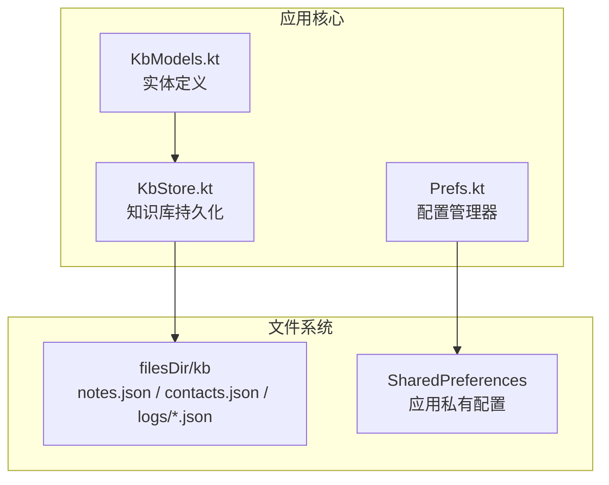
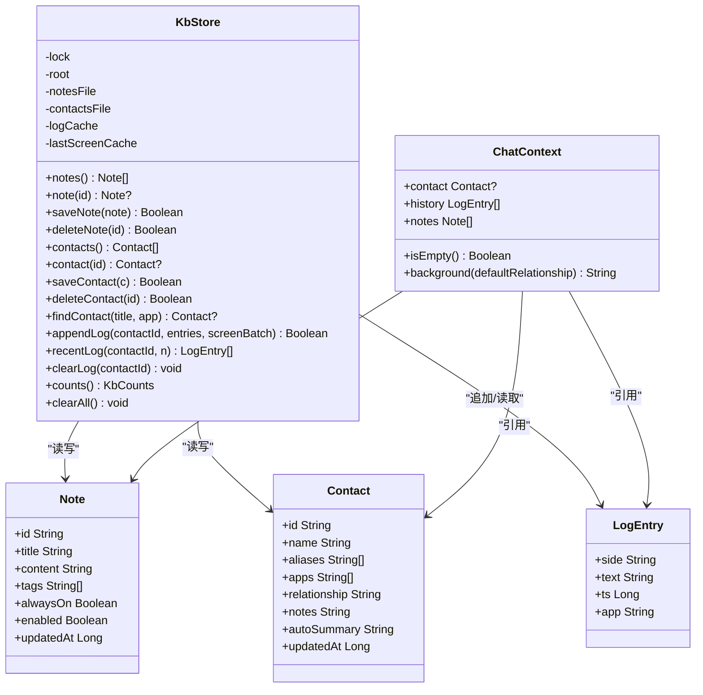
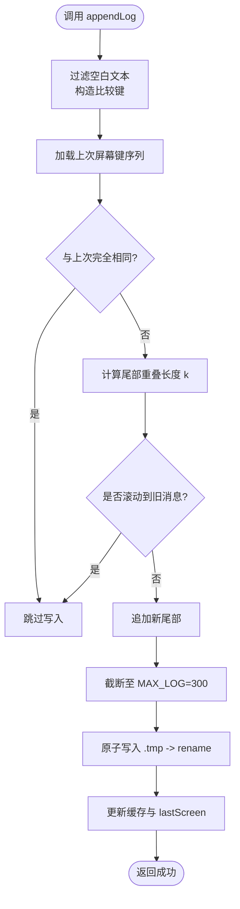
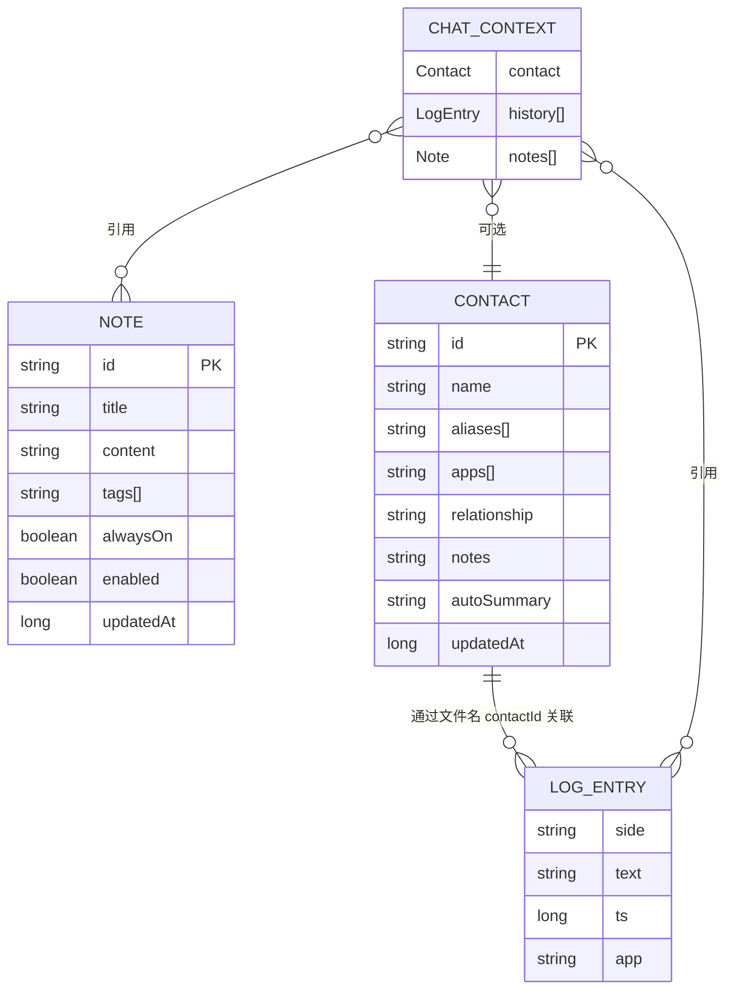
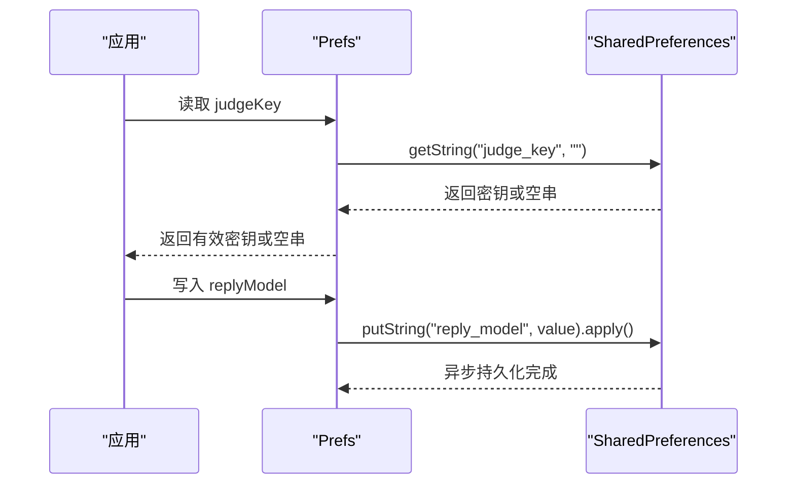
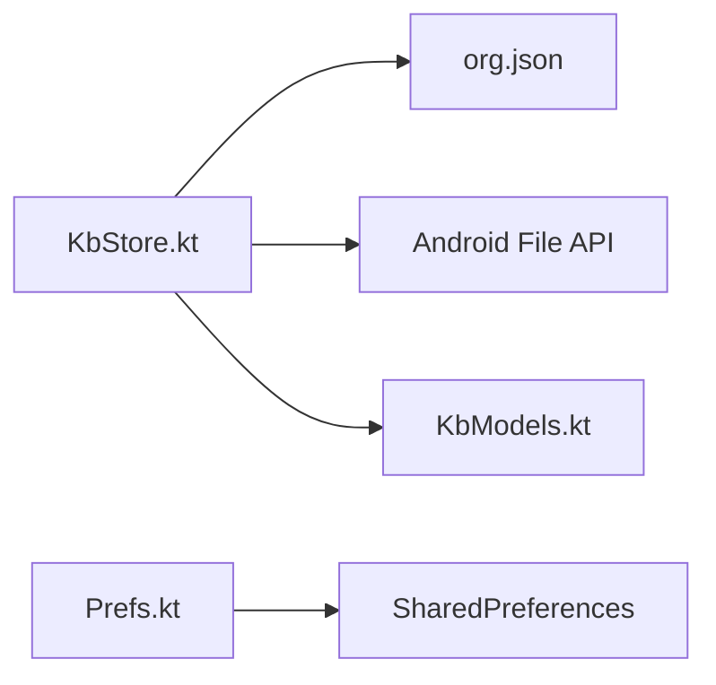
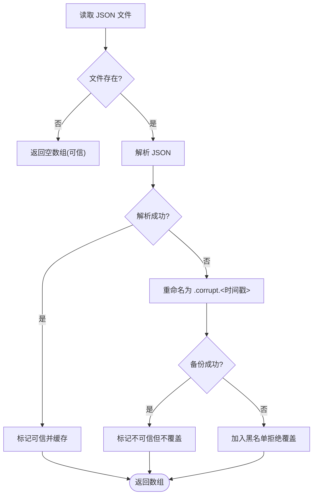

# 数据存储架构

<cite>
**本文引用的文件**   
- [KbStore.kt](file://app/src/main/java/com/jev/probe/core/kb/KbStore.kt)
- [KbModels.kt](file://app/src/main/java/com/jev/probe/core/kb/KbModels.kt)
- [Prefs.kt](file://app/src/main/java/com/jev/probe/core/Prefs.kt)
- [PRIVACY.md](file://PRIVACY.md)
</cite>

## 目录
1. [引言](#引言)
2. [项目结构](#项目结构)
3. [核心组件](#核心组件)
4. [架构总览](#架构总览)
5. [详细组件分析](#详细组件分析)
6. [依赖关系分析](#依赖关系分析)
7. [性能与并发特性](#性能与并发特性)
8. [CRUD 操作示例与查询优化](#crud-操作示例与查询优化)
9. [备份、恢复与隐私安全](#备份恢复与隐私安全)
10. [数据完整性校验与错误恢复](#数据完整性校验与错误恢复)
11. [故障排查指南](#故障排查指南)
12. [结论](#结论)

## 引言
本文件面向 Jev 聊天助手的数据存储层，聚焦以下目标：
- 解释 KbStore 的设计模式与基于 JSON 的文件存储机制。
- 说明 KbModels 中 Contact、Note、History（LogEntry）等实体的关系与约束。
- 阐述 Prefs 配置管理器的统一配置模型、迁移策略与环境变量式默认值。
- 说明线程安全与并发访问控制。
- 提供 CRUD 操作示例与查询优化建议。
- 说明备份恢复机制、隐私数据保护与加密现状。
- 说明数据完整性校验与错误恢复实现细节。

## 项目结构
Jev 的数据存储相关代码集中在 Android 应用模块的 core 包下：
- 知识库实体定义位于 `core/kb/KbModels.kt`。
- 知识库持久化与读写逻辑位于 `core/kb/KbStore.kt`。
- 应用配置与偏好设置位于 `core/Prefs.kt`。
- 隐私与数据范围说明位于仓库根目录 `PRIVACY.md`。

图表来源
- [KbStore.kt:12-33](file://app/src/main/java/com/jev/probe/core/kb/KbStore.kt#L12-L33)
- [KbModels.kt:1-42](file://app/src/main/java/com/jev/probe/core/kb/KbModels.kt#L1-L42)
- [Prefs.kt:6-16](file://app/src/main/java/com/jev/probe/core/Prefs.kt#L6-L16)

章节来源
- [KbStore.kt:12-33](file://app/src/main/java/com/jev/probe/core/kb/KbStore.kt#L12-L33)
- [KbModels.kt:1-42](file://app/src/main/java/com/jev/probe/core/kb/KbModels.kt#L1-L42)
- [Prefs.kt:6-16](file://app/src/main/java/com/jev/probe/core/Prefs.kt#L6-L16)

## 核心组件
- KbModels：定义 Note、Contact、LogEntry、ChatContext 等数据模型，描述本地知识库的结构与上下文拼装规则。
- KbStore：单例化的知识库存储层，负责 notes、contacts、logs 三类 JSON 文件的读写、缓存、去重、原子写入与清理。
- Prefs：封装 SharedPreferences，统一管理 API 路由、模型、开关、白名单、OCR 与上下文记录等配置，并提供迁移与默认值处理。

章节来源
- [KbModels.kt:11-85](file://app/src/main/java/com/jev/probe/core/kb/KbModels.kt#L11-L85)
- [KbStore.kt:24-41](file://app/src/main/java/com/jev/probe/core/kb/KbStore.kt#L24-L41)
- [Prefs.kt:14-23](file://app/src/main/java/com/jev/probe/core/Prefs.kt#L14-L23)

## 架构总览
KbStore 采用“单写者 + 内存缓存 + 原子落盘”的模式：
- 所有公开方法通过同一把锁串行化，避免并发写冲突。
- 读路径带缓存，减少重复 IO。
- 写路径使用临时文件 + rename 原子替换，防止崩溃导致半写文件。
- 损坏文件会被隔离为 `.corrupt.<时间戳>` 备份，避免覆盖用户数据。
- ChatContext 将联系人信息、历史消息与匹配到的笔记拼装成背景文本，供上层 AI 判断与回复使用。

图表来源
- [KbStore.kt:24-41](file://app/src/main/java/com/jev/probe/core/kb/KbStore.kt#L24-L41)
- [KbStore.kt:44-96](file://app/src/main/java/com/jev/probe/core/kb/KbStore.kt#L44-L96)
- [KbStore.kt:172-241](file://app/src/main/java/com/jev/probe/core/kb/KbStore.kt#L172-L241)
- [KbModels.kt:11-85](file://app/src/main/java/com/jev/probe/core/kb/KbModels.kt#L11-L85)

## 详细组件分析

### KbStore：设计模式与文件存储机制
- 设计模式
  - 单例：通过伴生对象的 `get(context)` 提供全局唯一实例，内部用 `@Volatile` 与双重检查锁定保证线程安全初始化。
  - 单写者：所有对外方法包裹 `synchronized(lock)`，确保任意时刻只有一个线程执行知识库读写。
  - 缓存：notes、contacts、每个 contact 的 log 以及 lastScreen 均维护内存缓存；当写失败时主动失效对应缓存。
  - 原子写入：`writeAtomic` 先写 `.tmp` 再 `renameTo` 目标文件，POSIX 语义下替换是原子的；若 rename 失败则回退到原地覆盖并记录警告。
  - 容错读取：`readJsonArray` 捕获解析异常，尝试将损坏文件重命名为 `.corrupt.<时间戳>`；若无法保留则标记为不可信，禁止后续覆盖。
- 文件布局
  - `kb/notes.json`：所有笔记列表。
  - `kb/contacts.json`：所有联系人列表。
  - `kb/logs/<contactId>.json`：按联系人分文件的聊天记录，最多保留 300 条。
  - `kb/logs/<contactId>.screen.json`：上次写入屏幕的关键序列，用于增量去重。
- JSON 序列化
  - 手写 `org.json` 序列化/反序列化，不引入 Gson/Moshi 依赖。
  - 字段映射严格遵循模型定义，缺失字段使用默认值或空集合。
- 版本管理与迁移
  - 当前知识库模型注释标注为 v1.3 D 阶段；KbStore 未内置跨版本 schema 迁移逻辑，但具备损坏文件隔离能力，便于人工修复后重新加载。
  - 配置层 Prefs 包含 v1.2→v1.3 的键迁移逻辑，知识库本身保持向后兼容的宽松读取。

图表来源
- [KbStore.kt:172-220](file://app/src/main/java/com/jev/probe/core/kb/KbStore.kt#L172-L220)
- [KbStore.kt:248-267](file://app/src/main/java/com/jev/probe/core/kb/KbStore.kt#L248-L267)
- [KbStore.kt:438-459](file://app/src/main/java/com/jev/probe/core/kb/KbStore.kt#L438-L459)

章节来源
- [KbStore.kt:12-41](file://app/src/main/java/com/jev/probe/core/kb/KbStore.kt#L12-L41)
- [KbStore.kt:44-96](file://app/src/main/java/com/jev/probe/core/kb/KbStore.kt#L44-L96)
- [KbStore.kt:172-241](file://app/src/main/java/com/jev/probe/core/kb/KbStore.kt#L172-L241)
- [KbStore.kt:294-356](file://app/src/main/java/com/jev/probe/core/kb/KbStore.kt#L294-L356)
- [KbStore.kt:412-459](file://app/src/main/java/com/jev/probe/core/kb/KbStore.kt#L412-L459)

### KbModels：数据模型设计与关系约束
- Note
  - 字段：id、title、content、tags、alwaysOn、enabled、updatedAt。
  - 用途：用户手动维护的自由文本知识，可被注入到分析上下文中。
- Contact
  - 字段：id、name、aliases、apps、relationship、notes、autoSummary、updatedAt。
  - 用途：跨应用识别同一个人或群组；aliases 支持不同聊天应用的会话标题归一匹配；apps 记录出现过的应用包名。
- LogEntry
  - 字段：side（me/other）、text、ts、app。
  - 用途：每条聊天记录的快照行，按联系人分文件保存。
- ChatContext
  - 组合了 Contact、History（List<LogEntry>）、Notes（List<Note>）。
  - background() 将关系、备注、自动摘要与匹配笔记拼接为一段背景文本，供上层推理使用。
- 关系与约束
  - 一对一：Note 独立存在，无外键。
  - 一对多：Contact 关联多条 LogEntry（通过文件名中的 contactId 间接关联）。
  - 可选关联：ChatContext 中的 contact 可为空，表示仅注入通用笔记与历史。
  - 约束：LogEntry 的 side 固定为 me/other；Contact 的 aliases/apps 为空列表时视为无别名或未绑定应用。

图表来源
- [KbModels.kt:11-85](file://app/src/main/java/com/jev/probe/core/kb/KbModels.kt#L11-L85)

章节来源
- [KbModels.kt:11-85](file://app/src/main/java/com/jev/probe/core/kb/KbModels.kt#L11-L85)

### Prefs：配置管理器与迁移策略
- 职责
  - 统一管理三路接口（judge/reply/vision）的基础地址、密钥与模型。
  - 管理上下文记录开关、历史记录条数、自动摘要开关。
  - 管理 OCR 引擎选择、未知应用抓取、回退策略与自动分析开关。
  - 管理关系描述、主开关、会话白名单、悬浮窗位置与透明度、自动分析开关等。
- 迁移策略
  - v1.2→v1.3：将旧的 `openrouter_key` 迁移到新的 `judge_key`，仅对真实配置实例执行一次迁移，并记录密钥长度而非密钥内容。
  - 撤销误播种：若首次安装时被自动设置为 Bocha 默认且用户从未输入过 key，则回滚到 OpenRouter 默认。
- 默认值与回退
  - judgeProvider 默认 openrouter；replyKey 为空时回退到 judgeKey；visionKey 为空时回退到 replyKey 再回退到 judgeKey。
  - 各 provider 的 base URL 与 model 常量集中管理，便于扩展。
- 安全性
  - 使用 MODE_PRIVATE 的 SharedPreferences，不输出密钥内容，只输出密钥长度。
  - 提供 `hasKey()` 作为就绪门控。

图表来源
- [Prefs.kt:73-111](file://app/src/main/java/com/jev/probe/core/Prefs.kt#L73-L111)
- [Prefs.kt:218-254](file://app/src/main/java/com/jev/probe/core/Prefs.kt#L218-L254)

章节来源
- [Prefs.kt:14-69](file://app/src/main/java/com/jev/probe/core/Prefs.kt#L14-L69)
- [Prefs.kt:73-214](file://app/src/main/java/com/jev/probe/core/Prefs.kt#L73-L214)
- [Prefs.kt:218-332](file://app/src/main/java/com/jev/probe/core/Prefs.kt#L218-L332)

## 依赖关系分析
- KbStore 依赖 org.json 进行 JSON 序列化/反序列化，依赖 Android File API 进行文件读写。
- KbStore 与 KbModels 强耦合：所有 JSON 字段映射都围绕 Note、Contact、LogEntry 展开。
- Prefs 与 SharedPreferences 解耦：通过 getter/setter 暴露配置项，屏蔽底层存储细节。
- 无外部数据库或网络依赖；知识库数据完全本地化。

图表来源
- [KbStore.kt:3-7](file://app/src/main/java/com/jev/probe/core/kb/KbStore.kt#L3-L7)
- [Prefs.kt:3-4](file://app/src/main/java/com/jev/probe/core/Prefs.kt#L3-L4)

章节来源
- [KbStore.kt:3-7](file://app/src/main/java/com/jev/probe/core/kb/KbStore.kt#L3-L7)
- [Prefs.kt:3-4](file://app/src/main/java/com/jev/probe/core/Prefs.kt#L3-L4)

## 性能与并发特性
- 并发控制
  - 所有公开方法使用 `synchronized(lock)` 串行化，避免并发写导致的竞争条件。
  - 单例初始化使用 `@Volatile` 与双重检查锁定，保证多线程安全。
- 缓存策略
  - notes、contacts、每个 contact 的 log 与 lastScreen 均有内存缓存。
  - 写失败时主动清空对应缓存，强制下次从磁盘重新加载，保证一致性。
- I/O 优化
  - 原子写入减少崩溃风险；仅在必要时重建缓存。
  - 日志上限 300 条，避免无限增长。
- 复杂度
  - appendLog 的去重算法在最坏情况下为 O(k×n)，其中 k 为重叠长度，n 为屏幕行数；通常很小。
  - recentLog 取子列表为 O(n)。

[本节为一般性指导，不直接分析具体文件]

## CRUD 操作示例与查询优化

### 笔记（Note）
- 创建/更新：调用 `saveNote(note)`，若已存在则替换并更新时间戳；返回是否成功落盘。
- 查询：`notes()` 返回全部笔记；`note(id)` 按 id 查找。
- 删除：`deleteNote(id)` 移除并落盘。
- 优化建议
  - 批量更新前先合并变更，减少频繁写盘。
  - 利用 `notes()` 返回的不可变副本进行 UI 展示，避免持有可变引用。

章节来源
- [KbStore.kt:44-65](file://app/src/main/java/com/jev/probe/core/kb/KbStore.kt#L44-L65)

### 联系人（Contact）
- 创建/更新：`saveContact(c)` 按 id 插入或替换。
- 查询：`contacts()` 返回全部；`contact(id)` 按 id 查找。
- 删除：`deleteContact(id)` 同时删除联系人及其历史与屏幕键文件。
- 匹配：`findContact(title, app)` 通过规范化名称与别名匹配，优先选择已知该 app 的联系人。
- 优化建议
  - 使用 `normalizeName` 与 `displayName` 做模糊匹配前预处理。
  - 批量导入联系人时，先去重再一次性写入。

章节来源
- [KbStore.kt:69-145](file://app/src/main/java/com/jev/probe/core/kb/KbStore.kt#L69-L145)
- [KbStore.kt:521-537](file://app/src/main/java/com/jev/probe/core/kb/KbStore.kt#L521-L537)

### 聊天记录（LogEntry）
- 追加：`appendLog(contactId, entries, screenBatch=true)` 支持屏幕级增量去重；`screenBatch=false` 用于显式注入单条记录。
- 读取：`recentLog(contactId, n)` 返回最近 n 条；`logSize(contactId)` 获取大小。
- 清理：`clearLog(contactId)` 删除历史与屏幕键文件。
- 优化建议
  - 合理设置 MAX_LOG（默认 300），避免过大文件影响 IO。
  - 使用 `recentLog` 限制注入给 AI 的历史长度，降低 token 消耗。

章节来源
- [KbStore.kt:172-241](file://app/src/main/java/com/jev/probe/core/kb/KbStore.kt#L172-L241)
- [KbStore.kt:473-475](file://app/src/main/java/com/jev/probe/core/kb/KbStore.kt#L473-L475)

### 上下文构建（ChatContext）
- 构建：上层根据 Contact、History、Notes 组装 ChatContext。
- 背景文本：`background(defaultRelationship)` 将关系、备注、自动摘要与匹配笔记拼接为字符串。
- 优化建议
  - 在 `isEmpty()` 为真时省略背景字段，减少无效传输。
  - 控制注入笔记数量，避免过长背景影响响应质量。

章节来源
- [KbModels.kt:44-85](file://app/src/main/java/com/jev/probe/core/kb/KbModels.kt#L44-L85)

## 备份、恢复与隐私安全

### 备份与恢复
- 备份
  - 知识库目录 `filesDir/kb` 可通过系统文件管理器或 ADB 导出。
  - 损坏文件会自动生成 `.corrupt.<时间戳>` 备份，便于人工恢复。
- 恢复
  - 将导出的 `notes.json`、`contacts.json`、`logs/*.json` 放回对应路径，重启应用即可加载。
  - 若文件损坏，先修复 JSON 格式后再启动应用。
- 清空
  - `clearAll()` 仅删除 `kb` 目录，不影响 SharedPreferences 中的密钥与配置。

章节来源
- [KbStore.kt:278-290](file://app/src/main/java/com/jev/probe/core/kb/KbStore.kt#L278-L290)
- [KbStore.kt:412-427](file://app/src/main/java/com/jev/probe/core/kb/KbStore.kt#L412-L427)

### 隐私与安全
- 存储位置
  - 知识库与 SharedPreferences 均位于应用私有目录，其他应用不可访问。
- 日志与敏感信息
  - 日志仅输出计数、长度与异常类名，不输出聊天正文。
  - 密钥仅以长度形式记录，不记录明文。
- 加密现状
  - 当前实现未对 JSON 文件或 SharedPreferences 进行加密；如需增强隐私，可在 KbStore 与 Prefs 层增加透明加解密。

章节来源
- [PRIVACY.md:42-56](file://PRIVACY.md#L42-L56)
- [Prefs.kt:6-13](file://app/src/main/java/com/jev/probe/core/Prefs.kt#L6-L13)

## 数据完整性校验与错误恢复

### 完整性校验
- 读取校验
  - `readJsonArray` 使用 try-catch 捕获 JSON 解析异常。
  - 解析成功后清除不可读标记；失败则尝试重命名为 `.corrupt.<时间戳>`。
- 写入校验
  - `writeAtomic` 先写临时文件，再原子替换；若 rename 失败则降级为原地覆盖并记录警告。
  - 对不可读文件拒绝覆盖，防止丢失用户数据。

图表来源
- [KbStore.kt:412-427](file://app/src/main/java/com/jev/probe/core/kb/KbStore.kt#L412-L427)
- [KbStore.kt:438-459](file://app/src/main/java/com/jev/probe/core/kb/KbStore.kt#L438-L459)

### 错误恢复
- 损坏文件恢复
  - 找到 `.corrupt.<时间戳>` 文件，修复 JSON 格式后改回原文件名，重启应用。
- 缓存不一致恢复
  - 写失败时主动清空对应缓存，下次读取从磁盘重新加载。
- 原子写入失败恢复
  - 若 rename 失败，会尝试原地覆盖；若仍失败则返回 false，调用方应重试或提示用户。

章节来源
- [KbStore.kt:412-459](file://app/src/main/java/com/jev/probe/core/kb/KbStore.kt#L412-L459)

## 故障排查指南
- 现象：新增联系人后历史未写入
  - 检查 `contextEnabled` 是否为 true。
  - 确认 `appendLog` 调用时 `entries` 非空且 `text` 非空白。
  - 查看 `logs/<contactId>.json` 是否存在且未被损坏。
- 现象：聊天记录重复
  - 检查 `screenBatch` 参数是否正确；若为 true，需确保屏幕内容确实发生变化。
  - 核对 `lastScreen` 文件是否可读。
- 现象：应用崩溃后数据丢失
  - 检查是否有 `.corrupt.<时间戳>` 文件，恢复后重启应用。
  - 确认 `writeAtomic` 是否因权限或磁盘空间问题失败。
- 现象：AI 未收到背景信息
  - 检查 ChatContext.background() 是否为空；若为空，上层应省略该字段。
  - 确认匹配的 Note 是否启用且命中。

章节来源
- [KbStore.kt:172-241](file://app/src/main/java/com/jev/probe/core/kb/KbStore.kt#L172-L241)
- [KbModels.kt:54-84](file://app/src/main/java/com/jev/probe/core/kb/KbModels.kt#L54-L84)

## 结论
Jev 的数据存储层以 KbStore 为核心，采用单写者、内存缓存与原子写入的策略，确保本地 JSON 文件的可靠性与一致性；KbModels 清晰定义了 Note、Contact、LogEntry 与 ChatContext 的关系；Prefs 提供了统一的配置入口与迁移能力。当前实现未对数据进行加密，但通过私有目录与最小化日志输出保障基础隐私。建议在后续版本中引入数据加密、更完善的版本迁移与自动化备份恢复流程，以提升数据安全与可维护性。