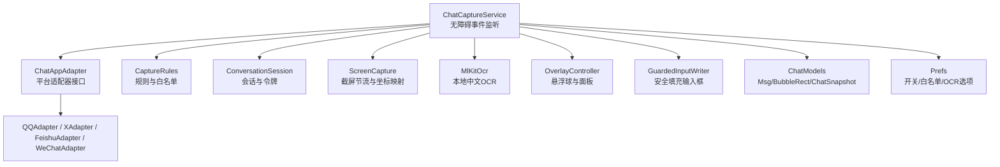
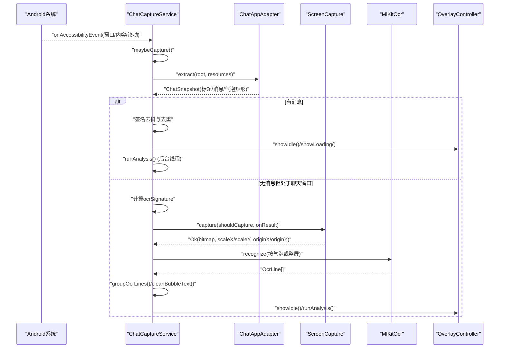
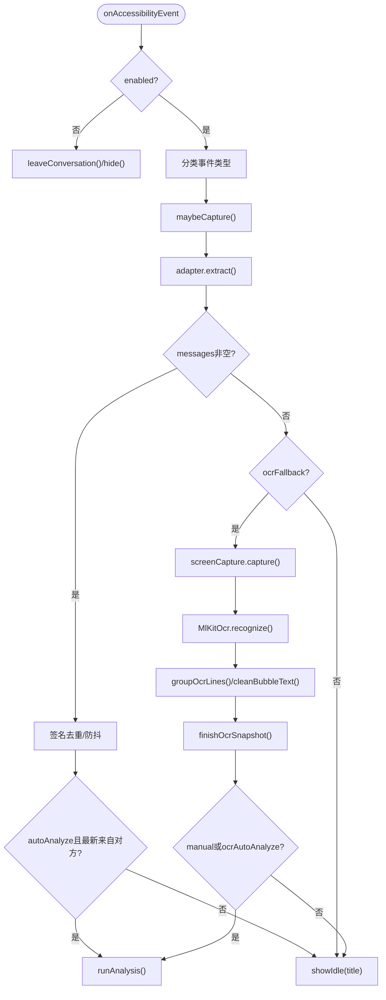
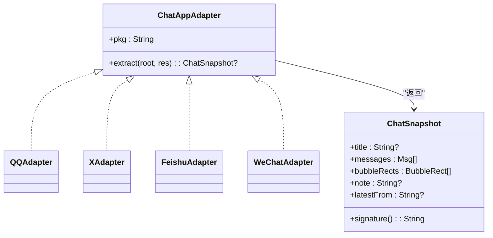
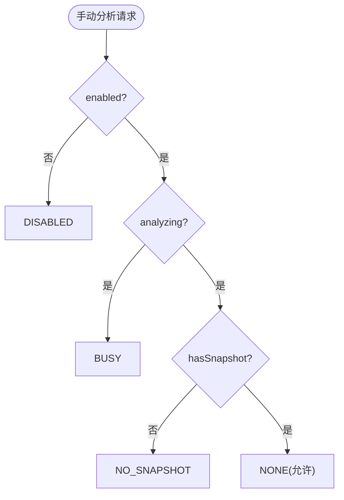
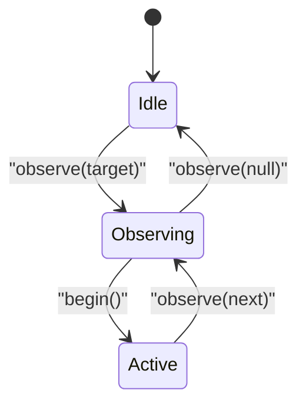
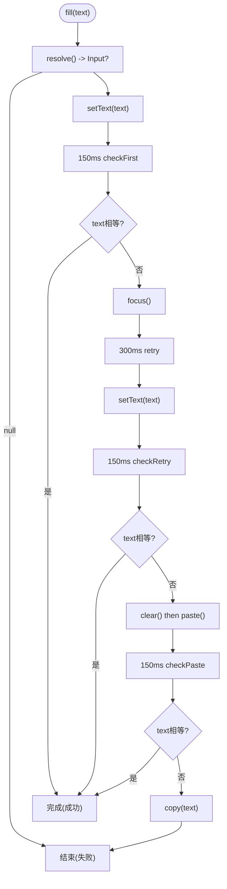
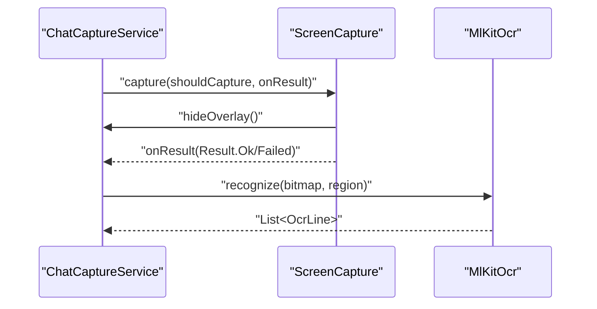
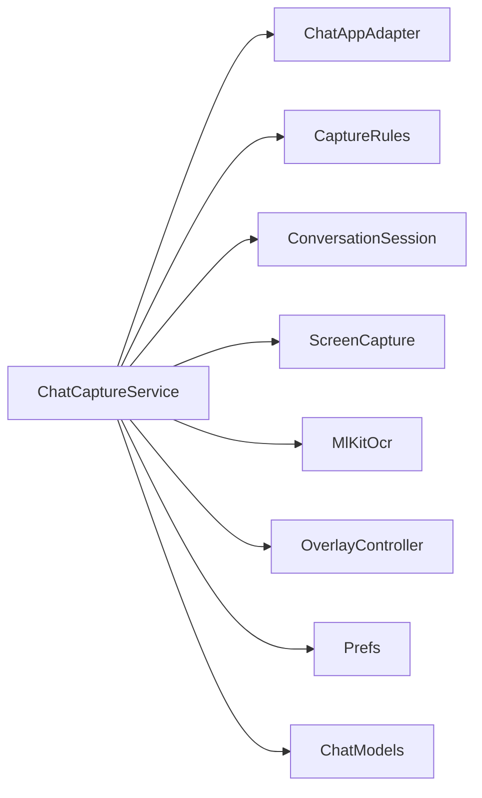

# 数据采集架构

<cite>
**本文引用的文件**   
- [ChatCaptureService.kt](file://app/src/main/java/com/jev/probe/capture/ChatCaptureService.kt)
- [ChatAppAdapter.kt](file://app/src/main/java/com/jev/probe/capture/ChatAppAdapter.kt)
- [CaptureRules.kt](file://app/src/main/java/com/jev/probe/capture/CaptureRules.kt)
- [ConversationSession.kt](file://app/src/main/java/com/jev/probe/capture/ConversationSession.kt)
- [GuardedInputWriter.kt](file://app/src/main/java/com/jev/probe/capture/GuardedInputWriter.kt)
- [MlKitOcr.kt](file://app/src/main/java/com/jev/probe/capture/ocr/MlKitOcr.kt)
- [ScreenCapture.kt](file://app/src/main/java/com/jev/probe/capture/ocr/ScreenCapture.kt)
- [ChatModels.kt](file://app/src/main/java/com/jev/probe/core/ChatModels.kt)
- [Prefs.kt](file://app/src/main/java/com/jev/probe/core/Prefs.kt)
- [OverlayController.kt](file://app/src/main/java/com/jev/probe/overlay/OverlayController.kt)
</cite>

## 目录
1. [引言](#引言)
2. [项目结构](#项目结构)
3. [核心组件](#核心组件)
4. [架构总览](#架构总览)
5. [详细组件分析](#详细组件分析)
6. [依赖关系分析](#依赖关系分析)
7. [性能与优化](#性能与优化)
8. [隐私与安全](#隐私与安全)
9. [故障排查](#故障排查)
10. [结论](#结论)

## 引言
本文件面向 Jev 聊天助手的数据采集层，系统性说明无障碍服务如何监听系统界面变化、适配器模式如何适配不同聊天应用、规则引擎如何过滤和清洗数据，以及截屏 OCR 的补充路径。文档同时给出新增平台适配器的实现要点、关键流程图与类图，并总结隐私保护与安全策略。

## 项目结构
数据采集层位于 `com.jev.probe.capture` 包中，围绕一个无障碍服务展开：
- 入口与调度：`ChatCaptureService`（基于 `AccessibilityService`）
- 平台适配：`ChatAppAdapter` 接口及 QQ/X/Twitter/飞书/微信等具体实现
- 规则与状态：`CaptureRules`、`ConversationSession`
- 输入写入：`GuardedInputWriter`
- OCR 子系统：`ScreenCapture`、`MlKitOcr`
- 共享模型：`ChatModels`（消息、气泡矩形、快照）
- 配置：`Prefs`
- 悬浮面板：`OverlayController`

图表来源
- [ChatCaptureService.kt:42-58](file://app/src/main/java/com/jev/probe/capture/ChatCaptureService.kt#L42-L58)
- [ChatAppAdapter.kt:27-30](file://app/src/main/java/com/jev/probe/capture/ChatAppAdapter.kt#L27-L30)
- [CaptureRules.kt:12-56](file://app/src/main/java/com/jev/probe/capture/CaptureRules.kt#L12-L56)
- [ConversationSession.kt:4-35](file://app/src/main/java/com/jev/probe/capture/ConversationSession.kt#L4-L35)
- [ScreenCapture.kt:35-61](file://app/src/main/java/com/jev/probe/capture/ocr/ScreenCapture.kt#L35-L61)
- [MlKitOcr.kt:26-112](file://app/src/main/java/com/jev/probe/capture/ocr/MlKitOcr.kt#L26-L112)
- [OverlayController.kt:38-74](file://app/src/main/java/com/jev/probe/overlay/OverlayController.kt#L38-L74)
- [ChatModels.kt:5-38](file://app/src/main/java/com/jev/probe/core/ChatModels.kt#L5-L38)
- [Prefs.kt:14-21](file://app/src/main/java/com/jev/probe/core/Prefs.kt#L14-L21)

章节来源
- [ChatCaptureService.kt:28-41](file://app/src/main/java/com/jev/probe/capture/ChatCaptureService.kt#L28-L41)
- [ChatAppAdapter.kt:10-26](file://app/src/main/java/com/jev/probe/capture/ChatAppAdapter.kt#L10-L26)

## 核心组件
- ChatCaptureService：无障碍服务主控制器，负责监听窗口状态变化、内容变更与滚动事件；根据当前前台应用选择对应适配器提取聊天快照；必要时触发截屏+OCR；驱动悬浮面板展示分析与候选回复；提供“填入”能力（不发送）。
- ChatAppAdapter：平台适配器抽象，将任意聊天应用的无障碍节点树转换为统一的 `ChatSnapshot`；各平台实现通过控件 ID、布局位置、contentDescription 等特征识别聊天窗口、标题、消息气泡与发送方。
- CaptureRules：纯决策模块，包含前台排除规则、手动分析阻塞判断、资源 ID 清单输出（用于调试但不含对话文本）。
- ConversationSession：维护当前会话目标与版本修订号，保证异步回调不会在会话切换后继续操作旧会话。
- GuardedInputWriter：非阻塞重试式输入填充流程，依次尝试 SET_TEXT、聚焦重试、清空+粘贴，最终回退到剪贴板。
- ScreenCapture：封装无障碍截屏能力，处理窗口截图/全屏截图、硬件缓冲转 Bitmap、节流与失败退避、超时保护、坐标缩放与偏移。
- MlKitOcr：基于 ML Kit 的本地中文 OCR，支持按区域识别与整屏识别，返回屏幕坐标系的行级结果。
- OverlayController：悬浮球与半透明面板，展示危险等级、意图、建议动作、候选回复，并提供复制/填入/设置/保存联系人/截屏识别等操作。
- Prefs：应用私有 SharedPreferences 封装，管理 API 密钥、白名单、OCR 开关、自动分析开关、悬浮球位置与透明度等。
- ChatModels：统一数据结构，包括消息、气泡矩形、聊天快照与分析结果。

章节来源
- [ChatCaptureService.kt:42-800](file://app/src/main/java/com/jev/probe/capture/ChatCaptureService.kt#L42-L800)
- [ChatAppAdapter.kt:27-511](file://app/src/main/java/com/jev/probe/capture/ChatAppAdapter.kt#L27-L511)
- [CaptureRules.kt:12-68](file://app/src/main/java/com/jev/probe/capture/CaptureRules.kt#L12-L68)
- [ConversationSession.kt:4-35](file://app/src/main/java/com/jev/probe/capture/ConversationSession.kt#L4-L35)
- [GuardedInputWriter.kt:4-44](file://app/src/main/java/com/jev/probe/capture/GuardedInputWriter.kt#L4-L44)
- [ScreenCapture.kt:35-219](file://app/src/main/java/com/jev/probe/capture/ocr/ScreenCapture.kt#L35-L219)
- [MlKitOcr.kt:26-112](file://app/src/main/java/com/jev/probe/capture/ocr/MlKitOcr.kt#L26-L112)
- [OverlayController.kt:38-583](file://app/src/main/java/com/jev/probe/overlay/OverlayController.kt#L38-L583)
- [Prefs.kt:14-334](file://app/src/main/java/com/jev/probe/core/Prefs.kt#L14-L334)
- [ChatModels.kt:5-57](file://app/src/main/java/com/jev/probe/core/ChatModels.kt#L5-L57)

## 架构总览
数据采集采用“无障碍事件 → 适配器解析 → 快照去重 → 可选 OCR → 分析/回复 → 悬浮面板”的流水线。平台差异被隔离在适配器中，服务侧保持通用逻辑。

图表来源
- [ChatCaptureService.kt:233-354](file://app/src/main/java/com/jev/probe/capture/ChatCaptureService.kt#L233-L354)
- [ChatAppAdapter.kt:27-30](file://app/src/main/java/com/jev/probe/capture/ChatAppAdapter.kt#L27-L30)
- [ScreenCapture.kt:65-93](file://app/src/main/java/com/jev/probe/capture/ocr/ScreenCapture.kt#L65-L93)
- [MlKitOcr.kt:39-95](file://app/src/main/java/com/jev/probe/capture/ocr/MlKitOcr.kt#L39-L95)
- [OverlayController.kt:288-337](file://app/src/main/java/com/jev/probe/overlay/OverlayController.kt#L288-L337)

## 详细组件分析

### 无障碍服务与事件监听机制（ChatCaptureService）
- 事件入口：`onAccessibilityEvent` 仅对窗口状态变化、内容变化、滚动三类事件进行捕获，避免误判输入法或状态栏导致的闪烁。
- 前台判定：使用 `rootInActiveWindow.packageName` 而非事件自身 package，确保键盘弹出时仍稳定识别聊天应用。
- 会话绑定：通过 `observeTarget` 建立会话目标（包名、windowId、标题、消息签名），并在会话切换时清理分析任务与悬浮面板状态。
- 快照提取：调用当前包的适配器 `extract`；若未适配则仅显示空闲悬浮球，不自动分析。
- 去重与防抖：基于最近若干条消息生成签名，结合悬浮球是否已显示，避免重复分析；内容变化使用 800ms 延迟合并。
- OCR 回退：当适配器返回空消息但确认为聊天窗口时，依据气泡矩形或整屏截图进行 OCR；OCR 结果按行间距分组为伪气泡，全部标记为对方发送。
- 分析与交互：后台线程构建上下文、调用判断与草稿排序接口，主线程更新悬浮面板；“填入”通过 `GuardedInputWriter` 安全写入输入框，失败则复制到剪贴板。

图表来源
- [ChatCaptureService.kt:233-354](file://app/src/main/java/com/jev/probe/capture/ChatCaptureService.kt#L233-L354)
- [ChatCaptureService.kt:535-689](file://app/src/main/java/com/jev/probe/capture/ChatCaptureService.kt#L535-L689)

章节来源
- [ChatCaptureService.kt:233-354](file://app/src/main/java/com/jev/probe/capture/ChatCaptureService.kt#L233-L354)
- [ChatCaptureService.kt:535-689](file://app/src/main/java/com/jev/probe/capture/ChatCaptureService.kt#L535-L689)

### 适配器模式与平台实现（ChatAppAdapter）
- 接口契约：`extract(root, res)` 返回 `ChatSnapshot?`，三种语义：
  - null：不在聊天窗口
  - messages 为空：在聊天窗口但树不可读（触发 OCR 回退）
  - messages 非空：正常读取
- 公共工具：
  - `findTitleInActionBar`：在顶部栏寻找短文本作为标题，避开时间戳与边缘区域
  - `findWeChatTitle`：针对微信群公告与成员数后缀的特殊处理
  - `collectFeishuBubbleRects`：收集飞书气泡矩形与发送方推断
- 平台实现要点：
  - QQ：通过固定控件 ID 收集气泡与输入框；头像边距决定发送方；标题缺失时回退到通用标题算法
  - X/Twitter：Compose UI，消息体在 contentDescription；通过分隔符解析发送者与正文，剥离“Read/已读”和时间尾缀
  - 飞书：消息文本由绘制生成，适配器只给气泡矩形与发送方推断；OCR 按矩形逐条识别
  - 微信：气泡容器存在即视为聊天窗口；由于无障碍文本被隐藏，通常走 OCR 回退

图表来源
- [ChatAppAdapter.kt:27-30](file://app/src/main/java/com/jev/probe/capture/ChatAppAdapter.kt#L27-L30)
- [ChatAppAdapter.kt:139-179](file://app/src/main/java/com/jev/probe/capture/ChatAppAdapter.kt#L139-L179)
- [ChatAppAdapter.kt:197-247](file://app/src/main/java/com/jev/probe/capture/ChatAppAdapter.kt#L197-L247)
- [ChatAppAdapter.kt:319-376](file://app/src/main/java/com/jev/probe/capture/ChatAppAdapter.kt#L319-L376)
- [ChatAppAdapter.kt:440-510](file://app/src/main/java/com/jev/probe/capture/ChatAppAdapter.kt#L440-L510)
- [ChatModels.kt:27-38](file://app/src/main/java/com/jev/probe/core/ChatModels.kt#L27-L38)

章节来源
- [ChatAppAdapter.kt:27-511](file://app/src/main/java/com/jev/probe/capture/ChatAppAdapter.kt#L27-L511)
- [ChatModels.kt:5-38](file://app/src/main/java/com/jev/probe/core/ChatModels.kt#L5-L38)

### 规则引擎（CaptureRules）
- 前台排除：屏蔽系统 UI、启动器与本应用界面，避免悬浮球遮挡或误读自身 UI；未适配聊天应用不被排除，以便用户通过悬浮球菜单进入。
- 手动分析阻塞：优先级为“总开关关闭 > 正在分析 > 尚未读到会话”，并返回对应的提示文案。
- 资源 ID 清单：仅记录 viewIdResourceName，不含对话文本，便于适配新应用版本时定位控件 ID 变化。

图表来源
- [CaptureRules.kt:32-38](file://app/src/main/java/com/jev/probe/capture/CaptureRules.kt#L32-L38)

章节来源
- [CaptureRules.kt:12-68](file://app/src/main/java/com/jev/probe/capture/CaptureRules.kt#L12-L68)

### 会话与令牌（ConversationSession）
- 目标对象：包含包名、windowId、标题与消息签名，用于精确匹配当前聊天窗口。
- 令牌机制：每次 begin 会递增 revision，回调通过 accepts(token) 校验目标与版本一致，防止旧回调覆盖新会话。

图表来源
- [ConversationSession.kt:4-35](file://app/src/main/java/com/jev/probe/capture/ConversationSession.kt#L4-L35)

章节来源
- [ConversationSession.kt:4-35](file://app/src/main/java/com/jev/probe/capture/ConversationSession.kt#L4-L35)

### 输入写入（GuardedInputWriter）
- 非阻塞重试：SET_TEXT → 150ms 检查 → 聚焦重试 → 300ms 再次 SET_TEXT → 150ms 检查 → 清空 + PASTE → 150ms 检查。
- 安全回退：任一阶段无法确认写入成功，均回退到剪贴板，并提示用户长按粘贴。
- 会话守卫：每次 resolve 都重新验证当前会话，避免写错输入框。

图表来源
- [GuardedInputWriter.kt:17-43](file://app/src/main/java/com/jev/probe/capture/GuardedInputWriter.kt#L17-L43)

章节来源
- [GuardedInputWriter.kt:4-44](file://app/src/main/java/com/jev/probe/capture/GuardedInputWriter.kt#L4-L44)

### OCR 子系统（ScreenCapture + MlKitOcr）
- 截屏节流：全局最小间隔 1s，连续失败指数退避至 30s；避免空树场景下的“截图机枪”。
- 坐标映射：窗口截图时记录 originX/Y 与 scaleX/scaleY，OCR 返回的边界框还原为屏幕坐标系，供气泡裁剪与定位。
- 超时保护：系统回调可能不触发，使用 3s 超时释放 overlay 与 busy 标志。
- OCR 识别：支持按气泡区域识别与整屏识别；整屏时去除顶部与底部区域并按行间距分组为消息。

图表来源
- [ScreenCapture.kt:65-93](file://app/src/main/java/com/jev/probe/capture/ocr/ScreenCapture.kt#L65-L93)
- [ScreenCapture.kt:155-176](file://app/src/main/java/com/jev/probe/capture/ocr/ScreenCapture.kt#L155-L176)
- [MlKitOcr.kt:39-95](file://app/src/main/java/com/jev/probe/capture/ocr/MlKitOcr.kt#L39-L95)

章节来源
- [ScreenCapture.kt:35-219](file://app/src/main/java/com/jev/probe/capture/ocr/ScreenCapture.kt#L35-L219)
- [MlKitOcr.kt:26-112](file://app/src/main/java/com/jev/probe/capture/ocr/MlKitOcr.kt#L26-L112)

### 悬浮面板（OverlayController）
- 悬浮球：可拖拽、记忆位置、长按弹出菜单（截屏识别一次、保存联系人、打开设置、隐藏助手）。
- 面板内容：知识库/历史注入量、OCR 备注、危险等级、真实意图、需求与建议动作、候选回复卡片（复制/填入）、重新分析。
- 安全限制：所有写操作仅为“填入”或“复制”，从不发送消息。

章节来源
- [OverlayController.kt:38-583](file://app/src/main/java/com/jev/probe/overlay/OverlayController.kt#L38-L583)

## 依赖关系分析
- ChatCaptureService 依赖：
  - ChatAppAdapter：平台适配
  - CaptureRules：规则决策
  - ConversationSession：会话令牌
  - ScreenCapture/MlKitOcr：OCR 回退
  - OverlayController：UI 反馈
  - Prefs：配置与白名单
  - ChatModels：数据模型
- 耦合与内聚：
  - 平台差异完全收敛于适配器，服务侧保持高内聚低耦合
  - OCR 子系统独立封装截屏与识别细节，服务侧仅消费统一结果
  - 会话令牌贯穿所有异步回调，避免跨会话污染

图表来源
- [ChatCaptureService.kt:42-58](file://app/src/main/java/com/jev/probe/capture/ChatCaptureService.kt#L42-L58)
- [ChatAppAdapter.kt:27-30](file://app/src/main/java/com/jev/probe/capture/ChatAppAdapter.kt#L27-L30)
- [CaptureRules.kt:12-56](file://app/src/main/java/com/jev/probe/capture/CaptureRules.kt#L12-L56)
- [ConversationSession.kt:4-35](file://app/src/main/java/com/jev/probe/capture/ConversationSession.kt#L4-L35)
- [ScreenCapture.kt:35-61](file://app/src/main/java/com/jev/probe/capture/ocr/ScreenCapture.kt#L35-L61)
- [MlKitOcr.kt:26-112](file://app/src/main/java/com/jev/probe/capture/ocr/MlKitOcr.kt#L26-L112)
- [OverlayController.kt:38-74](file://app/src/main/java/com/jev/probe/overlay/OverlayController.kt#L38-L74)
- [Prefs.kt:14-21](file://app/src/main/java/com/jev/probe/core/Prefs.kt#L14-L21)
- [ChatModels.kt:5-38](file://app/src/main/java/com/jev/probe/core/ChatModels.kt#L5-L38)

章节来源
- [ChatCaptureService.kt:42-800](file://app/src/main/java/com/jev/probe/capture/ChatCaptureService.kt#L42-L800)

## 性能与优化
- 事件合并：800ms 防抖合并频繁的内容变化，减少无效分析。
- 截图节流：全局 1s 最小间隔，失败指数退避至 30s，避免空树导致的高频截图。
- 模型预热：服务连接时后台预热 ML Kit 中文识别器，避免首次 OCR 卡顿。
- 窗口截图优先：API 34+ 优先使用窗口截图，降低开销并兼容部分厂商限制。
- 内存回收：截屏结果及时转为 ARGB_8888 并关闭 HardwareBuffer，避免 compositor 泄漏。
- 去重签名：基于最近若干条消息生成签名，避免重复分析；切换应用时重置签名。
- 输入写入重试：多阶段重试与剪贴板回退，提高成功率且不阻塞主线程。

[本节为通用性能讨论，无需特定文件引用]

## 隐私与安全
- 本地 OCR：ML Kit 中文识别器随 APK 内置，无需 Google Play Services，不下载模型，不上传图像。
- 私有配置：API 密钥与偏好存储在应用私有 SharedPreferences，日志仅记录键长度，不记录值。
- 白名单控制：可通过会话标题白名单限制允许分析的对话。
- 不发送消息：唯一写操作为“填入”或“复制”，用户仍需手动发送。
- 前台排除：屏蔽系统 UI、启动器与本应用界面，避免误读自身 UI。
- 会话令牌：异步回调必须通过令牌校验，防止旧回调污染新会话。
- 调试日志脱敏：资源 ID 清单仅记录控件 ID，不包含对话文本。

章节来源
- [MlKitOcr.kt:13-25](file://app/src/main/java/com/jev/probe/capture/ocr/MlKitOcr.kt#L13-L25)
- [Prefs.kt:11-13](file://app/src/main/java/com/jev/probe/core/Prefs.kt#L11-L13)
- [Prefs.kt:246-254](file://app/src/main/java/com/jev/probe/core/Prefs.kt#L246-L254)
- [CaptureRules.kt:19-25](file://app/src/main/java/com/jev/probe/capture/CaptureRules.kt#L19-L25)
- [CaptureRules.kt:40-56](file://app/src/main/java/com/jev/probe/capture/CaptureRules.kt#L40-L56)
- [ConversationSession.kt:28-35](file://app/src/main/java/com/jev/probe/capture/ConversationSession.kt#L28-L35)

## 故障排查
- 无障碍权限与截屏能力：
  - 若截屏失败码为 2，需关闭再开启无障碍服务以启用截屏能力。
  - 若截屏失败码为 6，表示窗口受保护（FLAG_SECURE），无法截屏。
- 空树与 OCR 回退：
  - 若适配器返回空消息但确认为聊天窗口，检查 OCR 开关与白名单；查看日志中的消息数量与 OCR 耗时统计。
  - 若 OCR 一直失败，检查系统截屏节流与失败退避；确认悬浮球未被遮挡。
- 输入写入失败：
  - 若“填入”失败，检查输入框是否可见、可用且非密码；最终会复制到剪贴板，请手动粘贴。
- 会话切换问题：
  - 若分析结果停留在旧会话，检查会话令牌与窗口 ID 是否匹配；确认 `isLive` 校验通过。
- 平台适配失效：
  - 若某平台不再识别，查看日志中的资源 ID 清单，确认控件 ID 是否变更；更新适配器中的 ID 或解析逻辑。

章节来源
- [ScreenCapture.kt:208-218](file://app/src/main/java/com/jev/probe/capture/ocr/ScreenCapture.kt#L208-L218)
- [ChatCaptureService.kt:546-558](file://app/src/main/java/com/jev/probe/capture/ChatCaptureService.kt#L546-L558)
- [ChatCaptureService.kt:719-750](file://app/src/main/java/com/jev/probe/capture/ChatCaptureService.kt#L719-L750)
- [ChatCaptureService.kt:494-511](file://app/src/main/java/com/jev/probe/capture/ChatCaptureService.kt#L494-L511)

## 结论
Jev 的数据采集层以无障碍服务为核心，通过适配器模式隔离平台差异，结合规则引擎与会话令牌保障稳定性与安全性；在树不可读的场景下，通过截屏与本地 OCR 提供可靠回退。整体设计强调隐私保护、性能优化与用户体验，同时为新增平台适配器提供了清晰的扩展点与最佳实践。

[本节为总结性内容，无需特定文件引用]