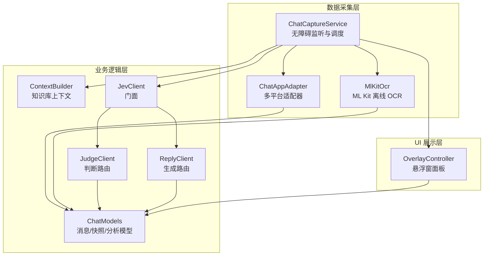
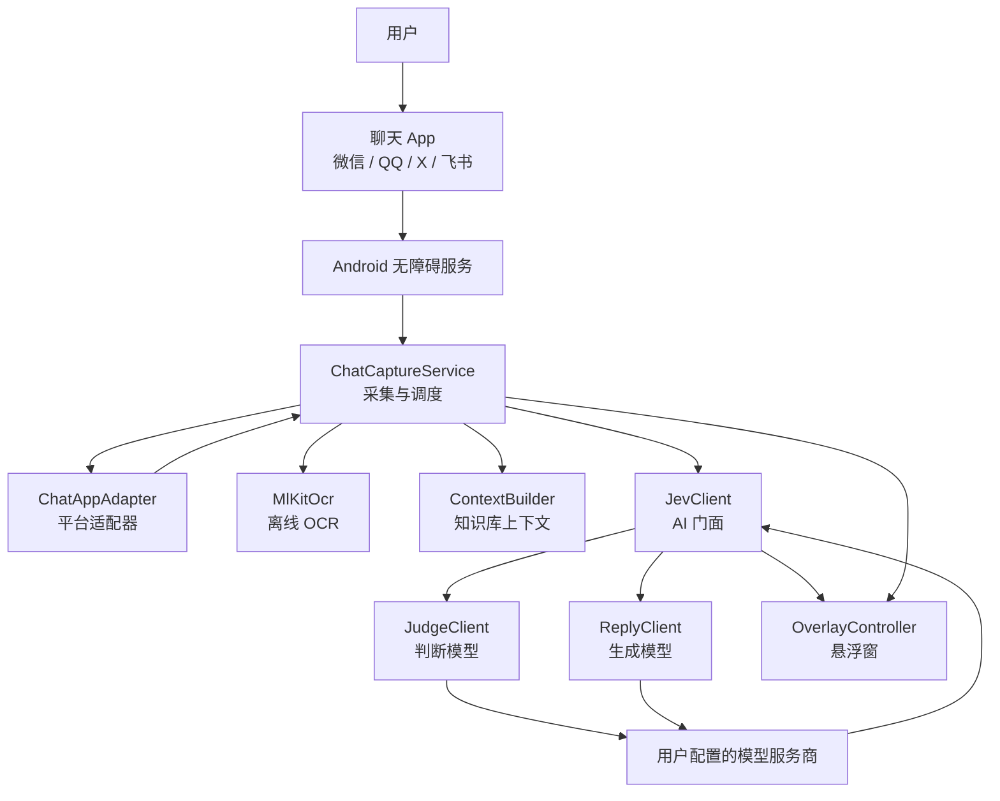
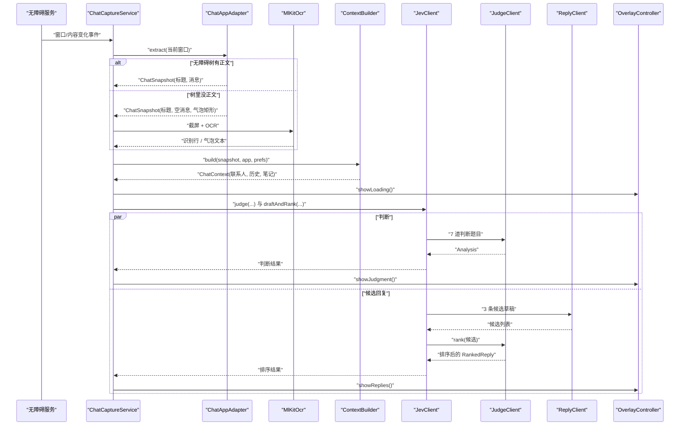
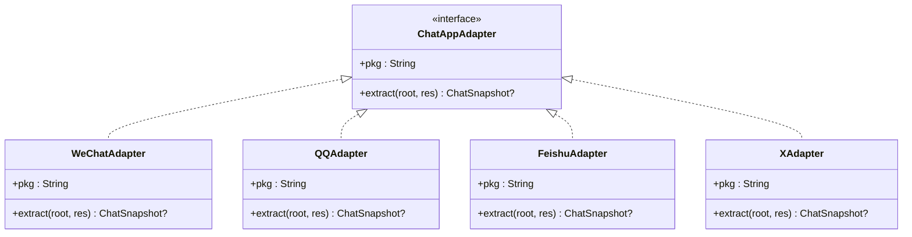
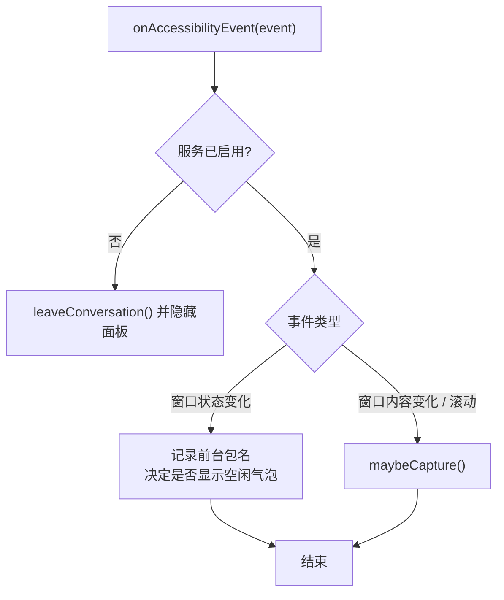
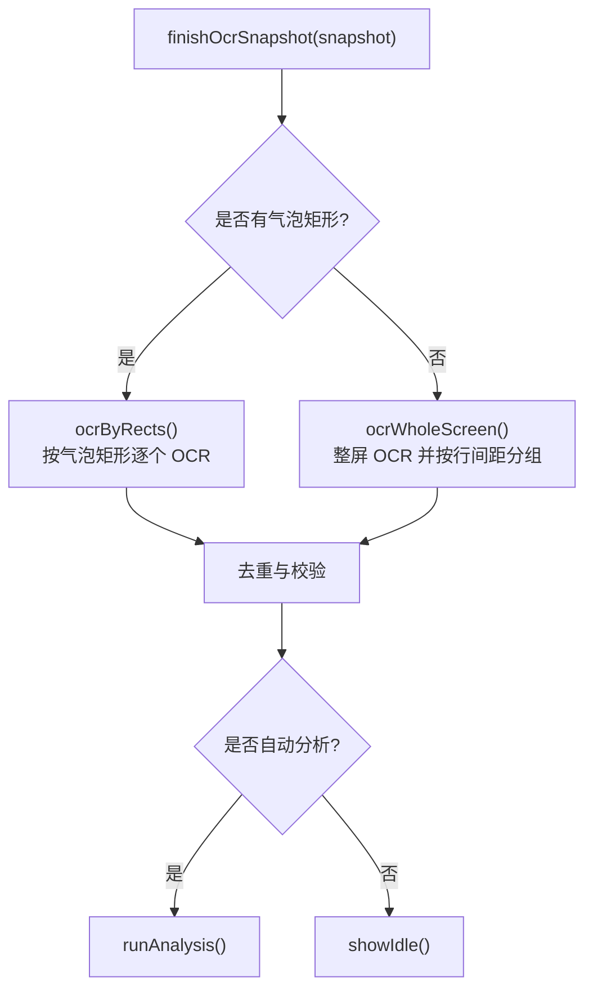
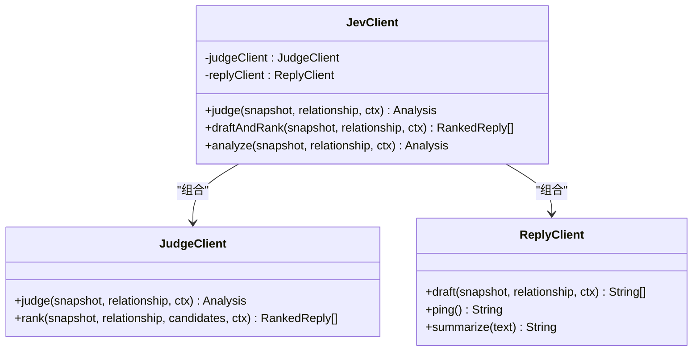
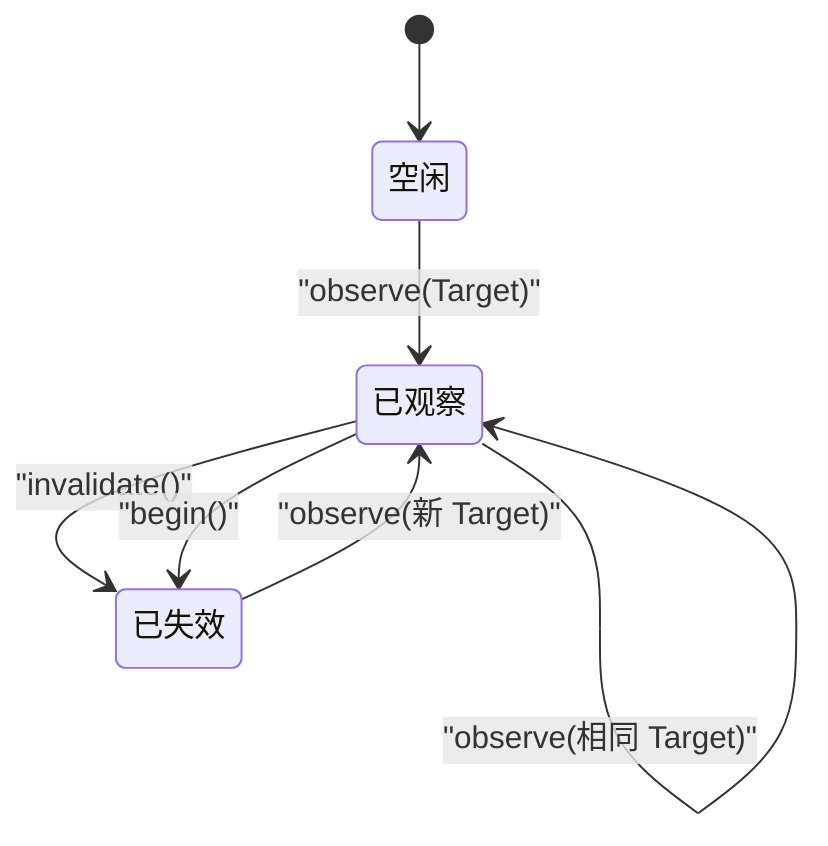
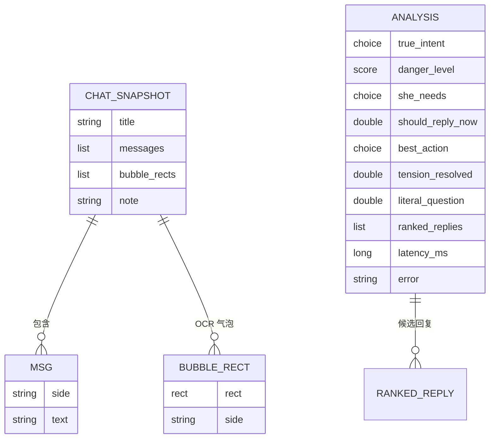
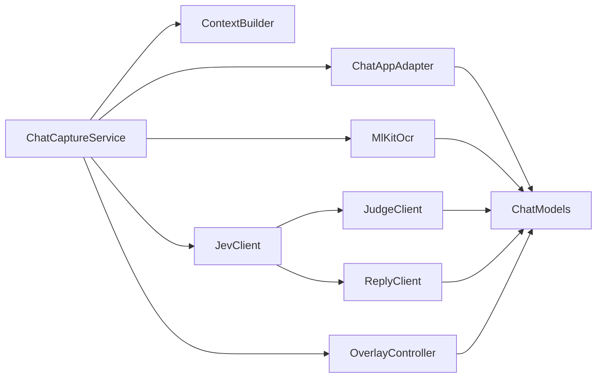

# 架构设计

<cite>
**本文引用的文件**   
- [README.md](file://README.md)
- [ChatCaptureService.kt](file://app/src/main/java/com/jev/probe/capture/ChatCaptureService.kt)
- [ChatAppAdapter.kt](file://app/src/main/java/com/jev/probe/capture/ChatAppAdapter.kt)
- [CaptureRules.kt](file://app/src/main/java/com/jev/probe/capture/CaptureRules.kt)
- [ConversationSession.kt](file://app/src/main/java/com/jev/probe/capture/ConversationSession.kt)
- [MlKitOcr.kt](file://app/src/main/java/com/jev/probe/capture/ocr/MlKitOcr.kt)
- [ChatModels.kt](file://app/src/main/java/com/jev/probe/core/ChatModels.kt)
- [ContextBuilder.kt](file://app/src/main/java/com/jev/probe/core/kb/ContextBuilder.kt)
- [JevClient.kt](file://app/src/main/java/com/jev/probe/jev/JevClient.kt)
- [JudgeClient.kt](file://app/src/main/java/com/jev/probe/jev/JudgeClient.kt)
- [ReplyClient.kt](file://app/src/main/java/com/jev/probe/jev/ReplyClient.kt)
- [OverlayController.kt](file://app/src/main/java/com/jev/probe/overlay/OverlayController.kt)
</cite>

## 目录
1. [引言](#引言)
2. [项目结构](#项目结构)
3. [核心组件](#核心组件)
4. [架构总览](#架构总览)
5. [详细组件分析](#详细组件分析)
6. [依赖关系分析](#依赖关系分析)
7. [性能与约束](#性能与约束)
8. [故障排查指南](#故障排查指南)
9. [结论](#结论)

## 引言
Jev 聊天助手是一个运行在 Android 设备上的“对话副驾”。它不 hook、不改包、不调用聊天 App 的接口，而是通过系统无障碍服务读取当前聊天界面的内容；必要时使用 ML Kit 离线 OCR 识别截屏。拿到消息后，应用把判断题目发给用户配置的模型服务商，由判断模型给出意图、风险等级和动作建议，再由生成模型起草三条候选回复，最后由判断模型排序并展示在悬浮窗中。发送权始终在用户手中：应用只负责把候选文本填入输入框或复制到剪贴板，从不自动发送。

本仓库的 Android 端采用分层架构：数据采集层负责多平台适配与 OCR，业务逻辑层负责会话状态、上下文构建与 AI 调用，UI 展示层负责悬浮窗面板与交互。整体目标是“先判断，再写字”，并在多平台之间复用同一套分析内核。

**章节来源**
- [README.md:62-84](file://README.md#L62-L84)
- [README.md:190-221](file://README.md#L190-L221)

## 项目结构
Android 应用位于 `app/` 模块，主要按职责划分：

| 层级 | 目录 / 类 | 职责 |
|---|---|---|
| 数据采集层 | `capture/ChatCaptureService.kt` | 无障碍事件入口、前台保活、会话生命周期、OCR 调度、结果去重与分析触发 |
| 数据采集层 | `capture/ChatAppAdapter.kt` | 各聊天 App 的适配器，把无障碍树转成统一的标题 + 消息列表 |
| 数据采集层 | `capture/ocr/MlKitOcr.kt` | 基于 ML Kit 的中文离线 OCR |
| 业务逻辑层 | `core/ChatModels.kt` | 消息、气泡矩形、聊天快照、分析结果等数据模型 |
| 业务逻辑层 | `core/kb/ContextBuilder.kt` | 从本地知识库和联系人档案构建分析上下文 |
| 业务逻辑层 | `jev/JevClient.kt` | 面向采集层的门面，统一暴露判断、草稿+排序、连通性测试 |
| 业务逻辑层 | `jev/JudgeClient.kt` | Jev 判断路由：7 道选择题 + 候选排序 |
| 业务逻辑层 | `jev/ReplyClient.kt` | OpenAI 兼容生成路由：起草 3 条候选回复 |
| UI 展示层 | `overlay/OverlayController.kt` | 悬浮球与半透明面板，展示危险等级、意图、候选回复和操作按钮 |
| 配置与规则 | `capture/CaptureRules.kt` | 纯函数式拦截规则：哪些前台应隐藏悬浮窗、手动分析为何被阻止 |
| 会话状态 | `capture/ConversationSession.kt` | 主线程会话目标与 Token，防止旧请求污染新会话 |

**图表来源**
- [ChatCaptureService.kt:28-41](file://app/src/main/java/com/jev/probe/capture/ChatCaptureService.kt#L28-L41)
- [ChatAppAdapter.kt:10-30](file://app/src/main/java/com/jev/probe/capture/ChatAppAdapter.kt#L10-L30)
- [MlKitOcr.kt:13-25](file://app/src/main/java/com/jev/probe/capture/ocr/MlKitOcr.kt#L13-L25)
- [ChatModels.kt:5-57](file://app/src/main/java/com/jev/probe/core/ChatModels.kt#L5-L57)
- [ContextBuilder.kt:8-15](file://app/src/main/java/com/jev/probe/core/kb/ContextBuilder.kt#L8-L15)
- [JevClient.kt:9-13](file://app/src/main/java/com/jev/probe/jev/JevClient.kt#L9-L13)
- [JudgeClient.kt:13-17](file://app/src/main/java/com/jev/probe/jev/JudgeClient.kt#L13-L17)
- [ReplyClient.kt:9-13](file://app/src/main/java/com/jev/probe/jev/ReplyClient.kt#L9-L13)
- [OverlayController.kt:29-37](file://app/src/main/java/com/jev/probe/overlay/OverlayController.kt#L29-L37)

**章节来源**
- [README.md:223-241](file://README.md#L223-L241)

## 核心组件
本节聚焦五个关键组件：无障碍采集服务、聊天适配器、OCR 引擎、AI 客户端门面、悬浮窗控制器。

### 无障碍采集服务
`ChatCaptureService` 是整个系统的中枢。它继承 Android 的 `AccessibilityService`，监听窗口状态变化、内容变化和滚动事件，根据前台包名选择对应的聊天适配器；如果适配器返回空消息，则进入截屏 + OCR 路径。服务维护一个 `ConversationSession`，保证不同聊天会话之间的分析结果不会互相污染，并通过工作线程池异步执行判断和回复任务。

关键点：
- 只读屏幕内容，不自动发送消息。
- 对频繁的内容变化做防抖，避免重复分析。
- 对 OCR 截图做限频、失败退避和画面签名去重。
- 支持手动触发“截屏识别一次”和“保存为联系人”。

**章节来源**
- [ChatCaptureService.kt:28-41](file://app/src/main/java/com/jev/probe/capture/ChatCaptureService.kt#L28-L41)
- [ChatCaptureService.kt:196-231](file://app/src/main/java/com/jev/probe/capture/ChatCaptureService.kt#L196-L231)
- [ChatCaptureService.kt:233-267](file://app/src/main/java/com/jev/probe/capture/ChatCaptureService.kt#L233-L267)
- [ChatCaptureService.kt:269-354](file://app/src/main/java/com/jev/probe/capture/ChatCaptureService.kt#L269-L354)
- [ChatCaptureService.kt:383-442](file://app/src/main/java/com/jev/probe/capture/ChatCaptureService.kt#L383-L442)

### 聊天适配器
`ChatAppAdapter` 是每款聊天 App 的采集规则接口。它的 `extract` 方法有三种约定：
- 返回 `null`：不在该 App 的聊天窗口。
- 返回消息列表为空：在聊天窗口，但无障碍树里没有正文，需要 OCR 兜底。
- 返回非空消息列表：正常采集。

当前实现包括微信、QQ、X/Twitter 私信和飞书四个专用适配器，以及通用的标题提取、时间戳过滤、气泡几何判断等工具。

**章节来源**
- [ChatAppAdapter.kt:10-30](file://app/src/main/java/com/jev/probe/capture/ChatAppAdapter.kt#L10-L30)
- [ChatAppAdapter.kt:139-179](file://app/src/main/java/com/jev/probe/capture/ChatAppAdapter.kt#L139-L179)
- [ChatAppAdapter.kt:197-247](file://app/src/main/java/com/jev/probe/capture/ChatAppAdapter.kt#L197-L247)
- [ChatAppAdapter.kt:319-376](file://app/src/main/java/com/jev/probe/capture/ChatAppAdapter.kt#L319-L376)
- [ChatAppAdapter.kt:440-510](file://app/src/main/java/com/jev/probe/capture/ChatAppAdapter.kt#L440-L510)

### OCR 引擎
`MlKitOcr` 使用 Google ML Kit 的中文离线识别器。模型打包在 APK 内，不需要 Google Play 服务，也不会上传截图。它接收位图和可选区域，返回带屏幕坐标的行级识别结果；坐标会从位图空间转换回屏幕空间，以便与无障碍树的坐标体系对齐。

**章节来源**
- [MlKitOcr.kt:13-25](file://app/src/main/java/com/jev/probe/capture/ocr/MlKitOcr.kt#L13-L25)
- [MlKitOcr.kt:39-95](file://app/src/main/java/com/jev/probe/capture/ocr/MlKitOcr.kt#L39-L95)
- [MlKitOcr.kt:97-112](file://app/src/main/java/com/jev/probe/capture/ocr/MlKitOcr.kt#L97-L112)

### AI 客户端门面
`JevClient` 是业务逻辑对外暴露的统一入口。它内部持有判断客户端和回复客户端，提供三个能力：
- `judge`：一次性发送 7 道判断题目。
- `draftAndRank`：先生成 3 条候选，再用判断模型排序。
- `analyze`：设置页连通性测试用的顺序调用。

这种门面设计让上层只需要关心“分析聊天”，而不必关心底层是判断路由还是生成路由。

**章节来源**
- [JevClient.kt:9-13](file://app/src/main/java/com/jev/probe/jev/JevClient.kt#L9-L13)
- [JevClient.kt:14-40](file://app/src/main/java/com/jev/probe/jev/JevClient.kt#L14-L40)

### 悬浮窗控制器
`OverlayController` 负责绘制可拖拽的悬浮球和展开后的半透明面板。面板展示：
- 是否使用了知识库和历史记录。
- 危险等级徽章。
- 对方真实意图和把握度。
- 下一步动作建议。
- 三条候选回复及复制、填入操作。

所有写操作都是“复制”或“填入输入框”，绝不自动发送。

**章节来源**
- [OverlayController.kt:29-37](file://app/src/main/java/com/jev/probe/overlay/OverlayController.kt#L29-L37)
- [OverlayController.kt:286-399](file://app/src/main/java/com/jev/probe/overlay/OverlayController.kt#L286-L399)
- [OverlayController.kt:408-458](file://app/src/main/java/com/jev/probe/overlay/OverlayController.kt#L408-L458)

## 架构总览
下图展示系统上下文：用户在前台聊天 App 中收到消息，Jev 在本机读取或 OCR 识别，再把文字和背景信息发送到用户配置的模型服务商，最终把候选回复展示在悬浮窗中。

**图表来源**
- [ChatCaptureService.kt:28-41](file://app/src/main/java/com/jev/probe/capture/ChatCaptureService.kt#L28-L41)
- [ChatAppAdapter.kt:10-30](file://app/src/main/java/com/jev/probe/capture/ChatAppAdapter.kt#L10-L30)
- [MlKitOcr.kt:13-25](file://app/src/main/java/com/jev/probe/capture/ocr/MlKitOcr.kt#L13-L25)
- [ContextBuilder.kt:8-15](file://app/src/main/java/com/jev/probe/core/kb/ContextBuilder.kt#L8-L15)
- [JevClient.kt:9-13](file://app/src/main/java/com/jev/probe/jev/JevClient.kt#L9-L13)
- [JudgeClient.kt:13-17](file://app/src/main/java/com/jev/probe/jev/JudgeClient.kt#L13-L17)
- [ReplyClient.kt:9-13](file://app/src/main/java/com/jev/probe/jev/ReplyClient.kt#L9-L13)
- [OverlayController.kt:29-37](file://app/src/main/java/com/jev/probe/overlay/OverlayController.kt#L29-L37)

## 详细组件分析

### 完整处理流程：从无障碍监听到结果展示
下面序列图描述一条典型消息的处理链路：无障碍事件触发 → 适配器解析 → 可能 OCR → 构建上下文 → 并行判断与草稿 → 排序 → 悬浮窗展示。

**图表来源**
- [ChatCaptureService.kt:269-354](file://app/src/main/java/com/jev/probe/capture/ChatCaptureService.kt#L269-L354)
- [ChatCaptureService.kt:383-442](file://app/src/main/java/com/jev/probe/capture/ChatCaptureService.kt#L383-L442)
- [ChatAppAdapter.kt:10-30](file://app/src/main/java/com/jev/probe/capture/ChatAppAdapter.kt#L10-L30)
- [MlKitOcr.kt:39-95](file://app/src/main/java/com/jev/probe/capture/ocr/MlKitOcr.kt#L39-L95)
- [ContextBuilder.kt:35-63](file://app/src/main/java/com/jev/probe/core/kb/ContextBuilder.kt#L35-L63)
- [JevClient.kt:19-31](file://app/src/main/java/com/jev/probe/jev/JevClient.kt#L19-L31)
- [JudgeClient.kt:26-49](file://app/src/main/java/com/jev/probe/jev/JudgeClient.kt#L26-L49)
- [ReplyClient.kt:23-33](file://app/src/main/java/com/jev/probe/jev/ReplyClient.kt#L23-L33)
- [OverlayController.kt:331-391](file://app/src/main/java/com/jev/probe/overlay/OverlayController.kt#L331-L391)

### 适配器模式：多平台聊天 App 适配
每个聊天 App 实现 `ChatAppAdapter`，把平台特定的无障碍树结构转换成统一的 `ChatSnapshot`。这样 `ChatCaptureService` 不需要知道微信、QQ、X、飞书的控件 id 差异，只需按包名分发。

**图表来源**
- [ChatAppAdapter.kt:27-30](file://app/src/main/java/com/jev/probe/capture/ChatAppAdapter.kt#L27-L30)
- [ChatAppAdapter.kt:139-179](file://app/src/main/java/com/jev/probe/capture/ChatAppAdapter.kt#L139-L179)
- [ChatAppAdapter.kt:197-247](file://app/src/main/java/com/jev/probe/capture/ChatAppAdapter.kt#L197-L247)
- [ChatAppAdapter.kt:319-376](file://app/src/main/java/com/jev/probe/capture/ChatAppAdapter.kt#L319-L376)
- [ChatAppAdapter.kt:440-510](file://app/src/main/java/com/jev/probe/capture/ChatAppAdapter.kt#L440-L510)

**章节来源**
- [ChatAppAdapter.kt:10-30](file://app/src/main/java/com/jev/probe/capture/ChatAppAdapter.kt#L10-L30)

### 观察者模式：无障碍事件驱动
`ChatCaptureService` 订阅 Android 无障碍事件，并根据事件类型决定是否需要重新采集。窗口状态变化用于判断是否离开聊天 App；内容变化和滚动用于检测新消息。

**图表来源**
- [ChatCaptureService.kt:233-267](file://app/src/main/java/com/jev/probe/capture/ChatCaptureService.kt#L233-L267)

**章节来源**
- [ChatCaptureService.kt:233-267](file://app/src/main/java/com/jev/probe/capture/ChatCaptureService.kt#L233-L267)

### 策略模式：OCR 与消息分组策略
当无障碍树没有正文时，系统切换到 OCR 策略。对于飞书，优先按已知气泡矩形逐个 OCR；对于其他未适配 App，整屏 OCR 并按行间距分组。两种策略共享同一个 OCR 引擎，但输出到 `ChatSnapshot` 的方式不同。

**图表来源**
- [ChatCaptureService.kt:535-689](file://app/src/main/java/com/jev/probe/capture/ChatCaptureService.kt#L535-L689)

**章节来源**
- [ChatCaptureService.kt:535-689](file://app/src/main/java/com/jev/probe/capture/ChatCaptureService.kt#L535-L689)

### 门面模式：JevClient 统一 AI 入口
`JevClient` 屏蔽了判断路由和生成路由的差异。上层只需要调用 `judge`、`draftAndRank` 或 `analyze`，无需关心具体是哪个子客户端处理请求。

**图表来源**
- [JevClient.kt:14-40](file://app/src/main/java/com/jev/probe/jev/JevClient.kt#L14-L40)
- [JudgeClient.kt:18-62](file://app/src/main/java/com/jev/probe/jev/JudgeClient.kt#L18-L62)
- [ReplyClient.kt:14-33](file://app/src/main/java/com/jev/probe/jev/ReplyClient.kt#L14-L33)

**章节来源**
- [JevClient.kt:9-40](file://app/src/main/java/com/jev/probe/jev/JevClient.kt#L9-L40)

### 会话状态管理：ConversationSession
`ConversationSession` 维护当前观察到的聊天目标，并为每次分析生成不可变 Token。当目标变化或版本更新时，旧 Token 不再被接受，从而避免旧分析结果覆盖新会话。

**图表来源**
- [ConversationSession.kt:4-35](file://app/src/main/java/com/jev/probe/capture/ConversationSession.kt#L4-L35)

**章节来源**
- [ConversationSession.kt:4-35](file://app/src/main/java/com/jev/probe/capture/ConversationSession.kt#L4-L35)

### 数据模型：ChatSnapshot、Msg、Analysis
这些数据结构贯穿采集、分析和展示三层。`ChatSnapshot` 是采集层到业务层的契约；`Analysis` 是 AI 层到 UI 层的契约。

**图表来源**
- [ChatModels.kt:5-57](file://app/src/main/java/com/jev/probe/core/ChatModels.kt#L5-L57)

**章节来源**
- [ChatModels.kt:5-57](file://app/src/main/java/com/jev/probe/core/ChatModels.kt#L5-L57)

## 依赖关系分析
从模块耦合角度看：
- `ChatCaptureService` 是高内聚的中枢，依赖适配器、OCR、上下文构建、AI 门面和悬浮窗控制器。
- 适配器之间相互独立，仅通过 `ChatSnapshot` 与上层解耦。
- AI 客户端通过 `Prefs` 读取配置，不直接感知上层业务。
- 悬浮窗控制器只消费 `Analysis` 和 `RankedReply`，不关心数据来源。

**图表来源**
- [ChatCaptureService.kt:28-41](file://app/src/main/java/com/jev/probe/capture/ChatCaptureService.kt#L28-L41)
- [ChatAppAdapter.kt:10-30](file://app/src/main/java/com/jev/probe/capture/ChatAppAdapter.kt#L10-L30)
- [MlKitOcr.kt:13-25](file://app/src/main/java/com/jev/probe/capture/ocr/MlKitOcr.kt#L13-L25)
- [ContextBuilder.kt:8-15](file://app/src/main/java/com/jev/probe/core/kb/ContextBuilder.kt#L8-L15)
- [JevClient.kt:9-13](file://app/src/main/java/com/jev/probe/jev/JevClient.kt#L9-L13)
- [ChatModels.kt:5-57](file://app/src/main/java/com/jev/probe/core/ChatModels.kt#L5-L57)
- [OverlayController.kt:29-37](file://app/src/main/java/com/jev/probe/overlay/OverlayController.kt#L29-L37)

**章节来源**
- [ChatCaptureService.kt:28-41](file://app/src/main/java/com/jev/probe/capture/ChatCaptureService.kt#L28-L41)
- [JevClient.kt:9-13](file://app/src/main/java/com/jev/probe/jev/JevClient.kt#L9-L13)

## 性能与约束
### 技术决策与权衡
| 决策 | 原因 | 权衡 |
|---|---|---|
| 使用无障碍服务而非 hook | 不修改聊天 App、不注入进程、不读数据库，降低封号和隐私风险 | 依赖系统暴露的界面节点，部分 App 会混淆或自绘控件 |
| 一套内核多平台适配 | 新增聊天 App 只需写几十行适配器 | 每个 App 的控件 id、布局、语言差异需要单独适配 |
| 判断模型先行，再生成回复 | 先评估意图和风险，再决定要不要给实质回复 | 增加一次网络往返，但能减少无效草稿 |
| 本地 OCR 兜底 | 无障碍树没有正文时仍可分析 | APK 体积增大，且受系统截屏权限限制 |
| 只读不写 | 发送权永远在用户手里 | 无法完全自动化，但更安全可控 |
| 轻量知识库匹配 | 标签/标题包含匹配，不做语义检索 | 简单可靠，但需要用户打标签才能命中 |

**章节来源**
- [README.md:62-84](file://README.md#L62-L84)
- [README.md:149-159](file://README.md#L149-L159)
- [README.md:243-254](file://README.md#L243-L254)

### 性能特征
- 判断模型约 1 秒返回，适合实时辅助。
- 判断和候选生成可以并行执行，缩短整体延迟。
- OCR 有节流和失败退避，不会每秒连拍。
- 知识库构建是本地 CPU 计算，字符预算限制上下文大小。
- ML Kit 中文离线模型首次加载较慢，服务连接时会预热。

**章节来源**
- [ChatCaptureService.kt:400-442](file://app/src/main/java/com/jev/probe/capture/ChatCaptureService.kt#L400-L442)
- [ChatCaptureService.kt:182-190](file://app/src/main/java/com/jev/probe/capture/ChatCaptureService.kt#L182-L190)
- [ContextBuilder.kt:18-29](file://app/src/main/java/com/jev/probe/core/kb/ContextBuilder.kt#L18-L29)
- [MlKitOcr.kt:100-112](file://app/src/main/java/com/jev/probe/capture/ocr/MlKitOcr.kt#L100-L112)

## 故障排查指南
### 常见阻塞原因
`CaptureRules` 明确区分了三种手动分析被阻止的原因：
- 助手总开关关闭。
- 正在分析中。
- 还没读到当前会话内容。

**章节来源**
- [CaptureRules.kt:27-38](file://app/src/main/java/com/jev/probe/capture/CaptureRules.kt#L27-L38)
- [CaptureRules.kt:59-68](file://app/src/main/java/com/jev/probe/capture/CaptureRules.kt#L59-L68)

### 悬浮窗与后台冻结
国产 ROM 可能冻结后台进程，导致气泡短暂消失。解决方案包括开启无障碍、悬浮窗、自启动和省电无限制；在聊天界面重新交互通常能自愈。

**章节来源**
- [README.md:96-102](file://README.md#L96-L102)
- [README.md:163-167](file://README.md#L163-L167)
- [README.md:243-246](file://README.md#L243-L246)

### OCR 失败与截屏限制
OCR 依赖系统允许截屏；受保护窗口无法截屏，长消息可能被截断，识别可能有错字。若无障碍树可读但适配器找不到聊天窗口，服务会打印资源 id 清单帮助定位。

**章节来源**
- [ChatCaptureService.kt:494-511](file://app/src/main/java/com/jev/probe/capture/ChatCaptureService.kt#L494-L511)
- [README.md:250-253](file://README.md#L250-L253)

### AI 接口问题
判断接口错误会显示在悬浮窗中；生成候选失败时，面板会提示接口错误或未生成候选。设置页提供三路接口的连通性测试。

**章节来源**
- [ChatCaptureService.kt:417-439](file://app/src/main/java/com/jev/probe/capture/ChatCaptureService.kt#L417-L439)
- [OverlayController.kt:449-452](file://app/src/main/java/com/jev/probe/overlay/OverlayController.kt#L449-L452)
- [ReplyClient.kt:55-62](file://app/src/main/java/com/jev/probe/jev/ReplyClient.kt#L55-L62)

## 结论
Jev 聊天助手的 Android 端以无障碍服务为数据采集入口，通过适配器模式支持多平台聊天 App，通过 OCR 兜底解决自绘控件问题；通过门面模式统一 AI 调用，通过观察者模式响应系统事件，通过策略模式切换 OCR 路径。其核心设计原则是“本机读取、用户授权、只读不写、先判断后回复”。

这套架构的优势在于安全性高、扩展性强、多平台复用成本低；代价是依赖系统无障碍能力、部分 App 需要额外适配、APK 体积因离线 OCR 而增大。未来若接入更多平台，重点仍应放在适配器实现和 OCR 鲁棒性上，同时保持 AI 层与 UI 层的稳定契约。