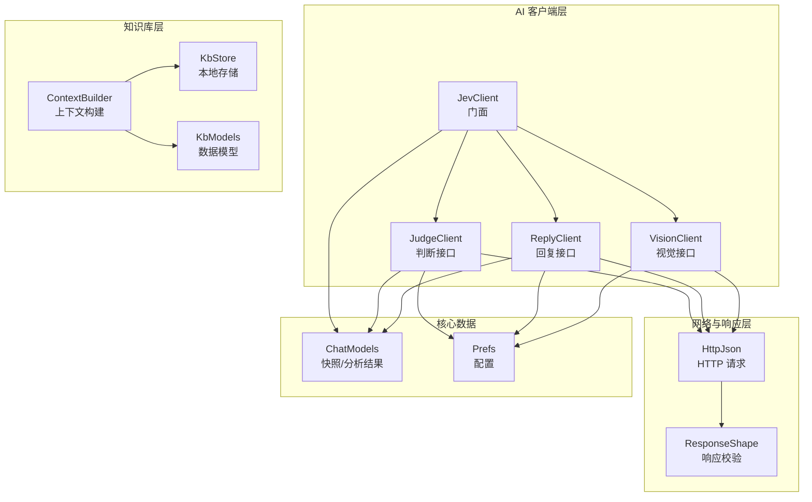
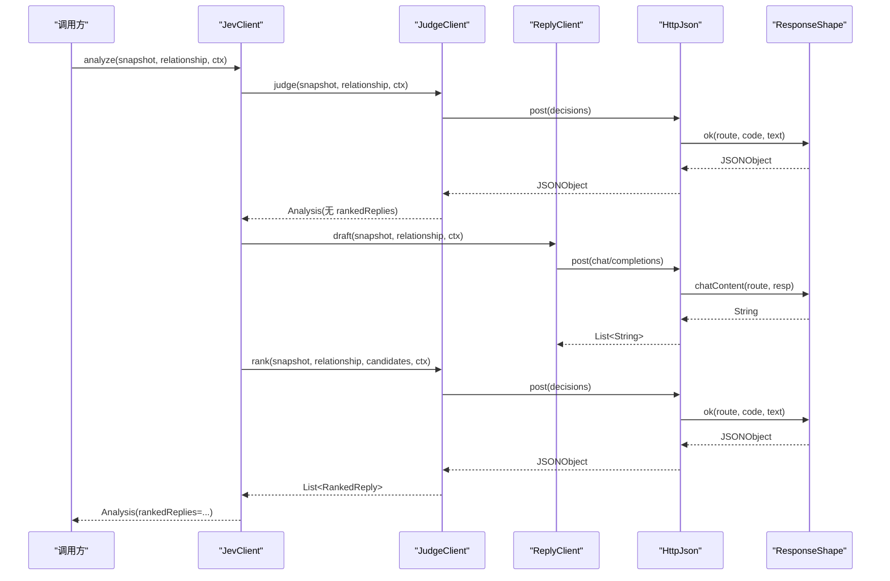
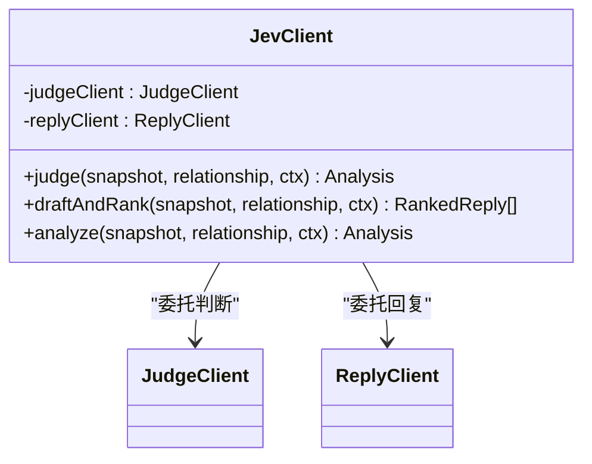
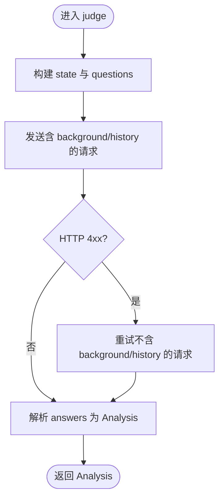
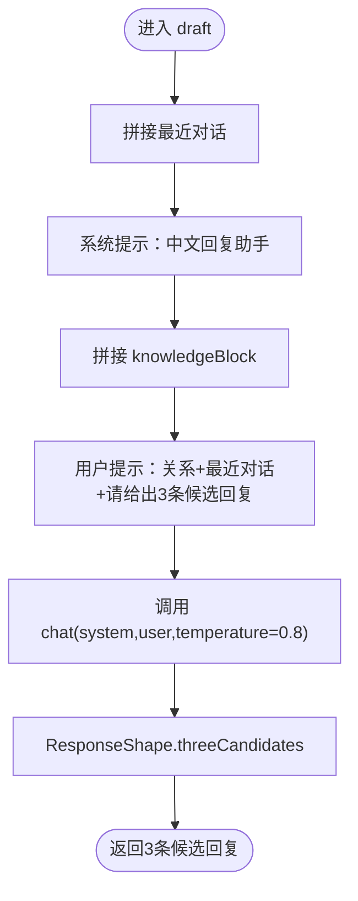
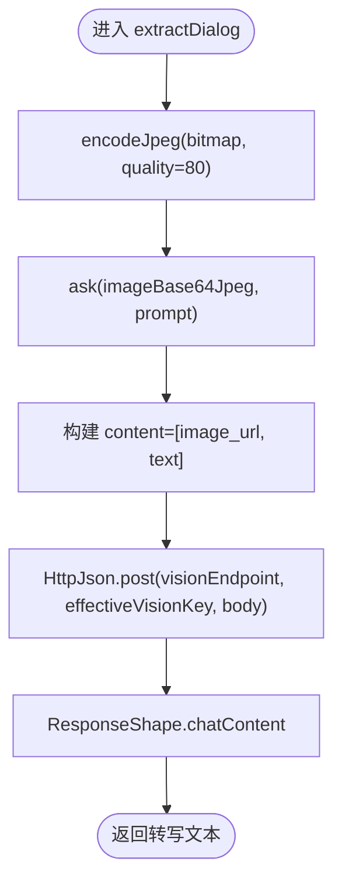
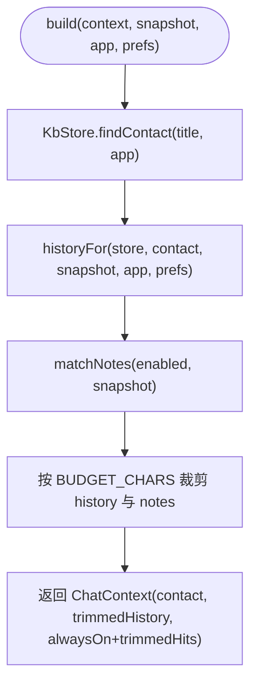
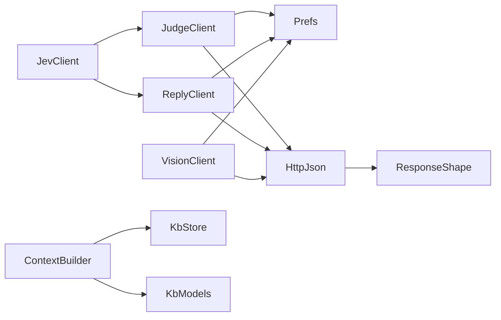
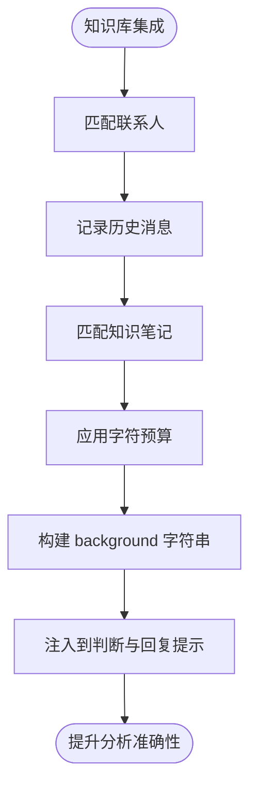

# AI 分析引擎

<cite>
**本文引用的文件**   
- [JevClient.kt](file://app/src/main/java/com/jev/probe/jev/JevClient.kt)
- [JudgeClient.kt](file://app/src/main/java/com/jev/probe/jev/JudgeClient.kt)
- [ReplyClient.kt](file://app/src/main/java/com/jev/probe/jev/ReplyClient.kt)
- [VisionClient.kt](file://app/src/main/java/com/jev/probe/jev/VisionClient.kt)
- [HttpJson.kt](file://app/src/main/java/com/jev/probe/jev/HttpJson.kt)
- [ResponseShape.kt](file://app/src/main/java/com/jev/probe/jev/ResponseShape.kt)
- [ContextBuilder.kt](file://app/src/main/java/com/jev/probe/core/kb/ContextBuilder.kt)
- [KbModels.kt](file://app/src/main/java/com/jev/probe/core/kb/KbModels.kt)
- [KbStore.kt](file://app/src/main/java/com/jev/probe/core/kb/KbStore.kt)
- [ChatModels.kt](file://app/src/main/java/com/jev/probe/core/ChatModels.kt)
- [Prefs.kt](file://app/src/main/java/com/jev/probe/core/Prefs.kt)
</cite>

## 目录
1. [引言](#引言)
2. [项目结构](#项目结构)
3. [核心组件](#核心组件)
4. [架构总览](#架构总览)
5. [详细组件分析](#详细组件分析)
6. [依赖关系分析](#依赖关系分析)
7. [性能与可靠性](#性能与可靠性)
8. [API 调用示例与配置说明](#api-调用示例与配置说明)
9. [知识库集成与上下文增强](#知识库集成与上下文增强)
10. [故障排查指南](#故障排查指南)
11. [结论](#结论)

## 引言
本文件面向“AI 分析引擎”的技术文档，目标是帮助开发者理解从聊天截图到 AI 判断、候选回复生成、排序以及视觉识别的完整链路。重点包括：
- JevClient 门面类如何统一封装 JudgeClient（判断）和 ReplyClient（回复），并对外暴露一致的调用入口。
- VisionClient 如何接入支持图像输入的视觉模型，完成截图转写等任务。
- ContextBuilder 如何将联系人、历史对话、知识笔记整合为 ChatContext，提升分析准确性。
- 网络层 HttpJson 的重试、超时、错误分类与降级策略。
- 从 ChatSnapshot 输入到 Analysis 输出的端到端流程，以及不同分析模式的参数与用法。

## 项目结构
该工程围绕 Android 应用中的“聊天辅助分析”能力组织代码，关键目录与职责如下：
- app/src/main/java/com/jev/probe/jev：AI 客户端门面与具体实现、HTTP 请求封装、响应形状校验。
- app/src/main/java/com/jev/probe/core/kb：本地知识库数据模型、存储实现、上下文构建器。
- app/src/main/java/com/jev/probe/core：核心数据模型（聊天快照、分析结果、偏好配置）。

**图表来源**
- [JevClient.kt:14-40](file://app/src/main/java/com/jev/probe/jev/JevClient.kt#L14-L40)
- [JudgeClient.kt:18-131](file://app/src/main/java/com/jev/probe/jev/JudgeClient.kt#L18-L131)
- [ReplyClient.kt:14-88](file://app/src/main/java/com/jev/probe/jev/ReplyClient.kt#L14-L88)
- [VisionClient.kt:26-70](file://app/src/main/java/com/jev/probe/jev/VisionClient.kt#L26-L70)
- [HttpJson.kt:48-149](file://app/src/main/java/com/jev/probe/jev/HttpJson.kt#L48-L149)
- [ResponseShape.kt:25-140](file://app/src/main/java/com/jev/probe/jev/ResponseShape.kt#L25-L140)
- [ContextBuilder.kt:16-123](file://app/src/main/java/com/jev/probe/core/kb/ContextBuilder.kt#L16-L123)
- [KbModels.kt:12-85](file://app/src/main/java/com/jev/probe/core/kb/KbModels.kt#L12-L85)
- [KbStore.kt:24-539](file://app/src/main/java/com/jev/probe/core/kb/KbStore.kt#L24-L539)
- [ChatModels.kt:27-56](file://app/src/main/java/com/jev/probe/core/ChatModels.kt#L27-L56)
- [Prefs.kt:14-332](file://app/src/main/java/com/jev/probe/core/Prefs.kt#L14-L332)

**章节来源**
- [JevClient.kt:14-40](file://app/src/main/java/com/jev/probe/jev/JevClient.kt#L14-L40)
- [Prefs.kt:14-332](file://app/src/main/java/com/jev/probe/core/Prefs.kt#L14-L332)

## 核心组件
- JevClient：门面类，统一对外提供 judge、draftAndRank、analyze 三种调用方式，内部委托给 JudgeClient 与 ReplyClient。
- JudgeClient：负责“判断”接口，发送 7 个判断问题，返回意图、危险等级、是否应回复、最佳行动等结构化结果；同时可对候选回复进行排序。
- ReplyClient：负责“回复”接口，基于 OpenAI 兼容的 /chat/completions 生成 3 条候选回复，并可对文本做摘要。
- VisionClient：负责“视觉”接口，将截图以 base64 JPEG 形式发送给支持 image_url 的模型，用于截图转写或通用问答。
- HttpJson：统一的 HTTP POST 工具，处理连接、超时、重试、错误分类与可读性提示。
- ResponseShape：统一校验各接口的响应体，避免“成功状态码但业务失败”的情况被误判为成功。
- ContextBuilder：根据当前聊天快照、联系人匹配、历史消息窗口、知识笔记匹配，构建 ChatContext，限制字符预算与命中数量。
- KbStore：本地 JSON 文件存储，提供原子写入、缓存、去重、最近日志读取等能力。
- Prefs：集中管理 API 地址、密钥、模型、开关与默认值，并提供 endpoint 构造方法。

**章节来源**
- [JevClient.kt:14-40](file://app/src/main/java/com/jev/probe/jev/JevClient.kt#L14-L40)
- [JudgeClient.kt:18-131](file://app/src/main/java/com/jev/probe/jev/JudgeClient.kt#L18-L131)
- [ReplyClient.kt:14-88](file://app/src/main/java/com/jev/probe/jev/ReplyClient.kt#L14-L88)
- [VisionClient.kt:26-70](file://app/src/main/java/com/jev/probe/jev/VisionClient.kt#L26-L70)
- [HttpJson.kt:48-149](file://app/src/main/java/com/jev/probe/jev/HttpJson.kt#L48-L149)
- [ResponseShape.kt:25-140](file://app/src/main/java/com/jev/probe/jev/ResponseShape.kt#L25-L140)
- [ContextBuilder.kt:16-123](file://app/src/main/java/com/jev/probe/core/kb/ContextBuilder.kt#L16-L123)
- [KbStore.kt:24-539](file://app/src/main/java/com/jev/probe/core/kb/KbStore.kt#L24-L539)
- [Prefs.kt:14-332](file://app/src/main/java/com/jev/probe/core/Prefs.kt#L14-L332)

## 架构总览
整体架构采用“门面 + 分路客户端 + 网络层 + 知识库”的分层设计：
- 门面层：JevClient 屏蔽多客户端差异，提供简洁 API。
- 客户端层：JudgeClient、ReplyClient、VisionClient 分别对应判断、文本生成、视觉识别三类能力。
- 网络层：HttpJson 统一处理超时、重试、错误信息格式化；ResponseShape 统一解析响应。
- 知识库层：ContextBuilder 聚合联系人、历史、笔记，形成 ChatContext；KbStore 提供持久化能力。
- 配置层：Prefs 统一管理所有路由、密钥、模型与功能开关。

**图表来源**
- [JevClient.kt:34-39](file://app/src/main/java/com/jev/probe/jev/JevClient.kt#L34-L39)
- [JudgeClient.kt:26-62](file://app/src/main/java/com/jev/probe/jev/JudgeClient.kt#L26-L62)
- [ReplyClient.kt:23-33](file://app/src/main/java/com/jev/probe/jev/ReplyClient.kt#L23-L33)
- [HttpJson.kt:56-122](file://app/src/main/java/com/jev/probe/jev/HttpJson.kt#L56-L122)
- [ResponseShape.kt:35-94](file://app/src/main/java/com/jev/probe/jev/ResponseShape.kt#L35-L94)

## 详细组件分析

### JevClient 门面类
- 设计模式：门面模式，对外暴露三个方法：
  - judge：仅执行判断，不生成回复。
  - draftAndRank：先生成 3 条候选回复，再调用判断接口排序。
  - analyze：顺序执行 judge 与 draftAndRank，若 judge 出错则直接返回错误分析结果。
- 职责分离：通过内部持有 JudgeClient 与 ReplyClient，避免上层耦合具体路由细节。
- 容错：在 analyze 中捕获 draftAndRank 异常，降级为空列表，保证判断结果仍可展示。

**图表来源**
- [JevClient.kt:14-40](file://app/src/main/java/com/jev/probe/jev/JevClient.kt#L14-L40)

**章节来源**
- [JevClient.kt:14-40](file://app/src/main/java/com/jev/probe/jev/JevClient.kt#L14-L40)

### JudgeClient 判断客户端
- 主要职责：
  - judge：发送 7 个判断问题，解析 true_intent、danger_level、she_needs、should_reply_now、best_action、tension_resolved、literal_question。
  - rank：对已生成的候选回复进行排序，返回 RankedReply 列表。
- 降级策略：当携带 background/history 的请求返回 4xx 时，自动重试一次不带这些字段的请求，确保兼容性。
- 错误处理：捕获异常并返回带 error 字段的 Analysis，避免 UI 误判为成功。

**图表来源**
- [JudgeClient.kt:73-90](file://app/src/main/java/com/jev/probe/jev/JudgeClient.kt#L73-L90)
- [JudgeClient.kt:26-48](file://app/src/main/java/com/jev/probe/jev/JudgeClient.kt#L26-L48)

**章节来源**
- [JudgeClient.kt:18-131](file://app/src/main/java/com/jev/probe/jev/JudgeClient.kt#L18-L131)

### ReplyClient 回复客户端
- 主要职责：
  - draft：基于最近 10 条消息与关系描述，生成 3 条候选回复；可注入知识库背景与历史。
  - summarize：对长文本生成第三人称摘要，用于联系人自动摘要。
  - ping：连通性测试，使用简单 prompt 验证回复接口可用性。
- 上下文注入：knowledgeBlock 将 ChatContext 的 background 与 history 拼接进 user prompt，要求模型严格遵循事实，不编造。

**图表来源**
- [ReplyClient.kt:23-33](file://app/src/main/java/com/jev/probe/jev/ReplyClient.kt#L23-L33)
- [ReplyClient.kt:36-53](file://app/src/main/java/com/jev/probe/jev/ReplyClient.kt#L36-L53)
- [ResponseShape.kt:84-94](file://app/src/main/java/com/jev/probe/jev/ResponseShape.kt#L84-L94)

**章节来源**
- [ReplyClient.kt:14-88](file://app/src/main/java/com/jev/probe/jev/ReplyClient.kt#L14-L88)

### VisionClient 视觉客户端
- 主要职责：
  - extractDialog：将截图转写为对话文本，每行一条，标注“我”或“对方”。
  - ask：通用视觉问答，支持任意 prompt。
  - encodeJpeg：Bitmap 压缩为 JPEG base64，避免 PNG 体积过大。
  - supportsVision：检测基础 URL 是否支持 vision（排除 DeepSeek 官方 API）。
- 格式要求：image_url 部分必须在 text 之前，且使用 Base64.NO_WRAP，避免换行破坏 data URL。

**图表来源**
- [VisionClient.kt:34-57](file://app/src/main/java/com/jev/probe/jev/VisionClient.kt#L34-L57)
- [VisionClient.kt:61-69](file://app/src/main/java/com/jev/probe/jev/VisionClient.kt#L61-L69)

**章节来源**
- [VisionClient.kt:26-70](file://app/src/main/java/com/jev/probe/jev/VisionClient.kt#L26-L70)

### ContextBuilder 上下文构建器
- 主要职责：
  - 联系人匹配：根据会话标题与应用包名查找 Contact。
  - 历史消息：记录当前屏幕消息，过滤掉已在屏幕上出现的重复项，取最近 n 条。
  - 知识笔记匹配：基于标题与最近若干消息进行关键词匹配，最多命中 N 条。
  - 字符预算：控制 notes 与 history 的总字符数不超过 BUDGET_CHARS，优先保留 alwaysOn 笔记，按时间裁剪历史与笔记。
- 输出：ChatContext，包含 contact、history、notes，并提供 background 字符串供下游使用。

**图表来源**
- [ContextBuilder.kt:35-63](file://app/src/main/java/com/jev/probe/core/kb/ContextBuilder.kt#L35-L63)
- [ContextBuilder.kt:70-91](file://app/src/main/java/com/jev/probe/core/kb/ContextBuilder.kt#L70-L91)
- [ContextBuilder.kt:98-116](file://app/src/main/java/com/jev/probe/core/kb/ContextBuilder.kt#L98-L116)

**章节来源**
- [ContextBuilder.kt:16-123](file://app/src/main/java/com/jev/probe/core/kb/ContextBuilder.kt#L16-L123)

### 网络层与响应层
- HttpJson：
  - 超时：连接超时 15 秒，读取超时 40 秒。
  - 重试：对 429/529 指数退避重试，最多 3 次；其他 4xx 不重试。
  - 错误分类：区分域名解析失败、无法连接、证书校验失败、超时等，提供可读提示。
- ResponseShape：
  - ok：校验 2xx 响应体，拒绝“成功状态码但业务失败”的情况。
  - chatContent：提取 OpenAI 兼容格式的 assistant 内容，空内容视为错误。
  - jevAnswers：校验 Jev decisions 接口返回的 answers 字段。
  - threeCandidates：从 JSON 数组或文本行中提取候选回复，不足 3 条填充占位符。

**章节来源**
- [HttpJson.kt:48-149](file://app/src/main/java/com/jev/probe/jev/HttpJson.kt#L48-L149)
- [ResponseShape.kt:25-140](file://app/src/main/java/com/jev/probe/jev/ResponseShape.kt#L25-L140)

### 知识库数据模型与存储
- KbModels：
  - Note：知识笔记，支持标签、alwaysOn、enabled、更新时间。
  - Contact：联系人，支持别名、应用包名、关系描述、备注、自动摘要。
  - LogEntry：历史消息条目，包含 side、text、时间戳、应用包名。
  - ChatContext：分析时可见的额外上下文，提供 isEmpty 与 background 方法。
- KbStore：
  - 原子写入：临时文件 + rename，防止崩溃导致半写文件。
  - 去重与增量：根据上次屏幕键序列判断是否滚动，避免重复写入。
  - 最近日志：限制最大行数，支持按联系人读取最近 n 条。
  - 清理与统计：清空知识库、统计笔记/联系人/日志行数。

**章节来源**
- [KbModels.kt:12-85](file://app/src/main/java/com/jev/probe/core/kb/KbModels.kt#L12-L85)
- [KbStore.kt:24-539](file://app/src/main/java/com/jev/probe/core/kb/KbStore.kt#L24-L539)

### 核心数据模型
- ChatSnapshot：聊天快照，包含 title、messages、bubbleRects、note，并提供 latestFrom 与 signature 方法。
- Analysis：分析结果，包含意图、危险等级、需求、是否应回复、最佳行动、张力解决度、字面问题概率、候选回复排序、延迟与错误信息。
- Choice/Score/RankedReply：判断与排序结果的细粒度数据结构。

**章节来源**
- [ChatModels.kt:27-56](file://app/src/main/java/com/jev/probe/core/ChatModels.kt#L27-L56)

## 依赖关系分析
- JevClient 依赖 JudgeClient 与 ReplyClient，二者均依赖 Prefs 获取路由与密钥。
- JudgeClient 与 ReplyClient 均依赖 HttpJson 进行网络请求，并通过 ResponseShape 校验响应。
- ContextBuilder 依赖 KbStore 与 KbModels，读取联系人、历史、笔记并构建 ChatContext。
- Prefs 提供 judgeEndpoint、replyEndpoint、visionEndpoint 等方法，集中管理路由地址。

**图表来源**
- [JevClient.kt:14-40](file://app/src/main/java/com/jev/probe/jev/JevClient.kt#L14-L40)
- [JudgeClient.kt:18-131](file://app/src/main/java/com/jev/probe/jev/JudgeClient.kt#L18-L131)
- [ReplyClient.kt:14-88](file://app/src/main/java/com/jev/probe/jev/ReplyClient.kt#L14-L88)
- [VisionClient.kt:26-70](file://app/src/main/java/com/jev/probe/jev/VisionClient.kt#L26-L70)
- [ContextBuilder.kt:16-123](file://app/src/main/java/com/jev/probe/core/kb/ContextBuilder.kt#L16-L123)
- [KbStore.kt:24-539](file://app/src/main/java/com/jev/probe/core/kb/KbStore.kt#L24-L539)
- [Prefs.kt:14-332](file://app/src/main/java/com/jev/probe/core/Prefs.kt#L14-L332)

**章节来源**
- [JevClient.kt:14-40](file://app/src/main/java/com/jev/probe/jev/JevClient.kt#L14-L40)
- [Prefs.kt:14-332](file://app/src/main/java/com/jev/probe/core/Prefs.kt#L14-L332)

## 性能与可靠性
- 网络层：
  - 超时控制：连接超时 15 秒，读取超时 40 秒，避免长时间阻塞。
  - 重试机制：对 429/529 指数退避重试，最多 3 次；其他 4xx 不重试，减少无效请求。
  - 错误可读性：将底层异常转换为人类可读的错误信息，便于用户定位问题。
- 降级策略：
  - JudgeClient 在携带 background/history 返回 4xx 时，自动重试不带这些字段的请求，确保兼容性。
  - JevClient.analyze 在 draftAndRank 抛出异常时，降级为空列表，保证判断结果仍可展示。
- 知识库：
  - 原子写入与缓存：防止崩溃导致数据损坏，提升读写性能。
  - 去重与增量：避免重复写入相同屏幕消息，节省存储空间。
  - 字符预算：限制注入上下文的字符数，避免超出模型 token 限制。

[本节为通用性能讨论，不直接分析具体文件]

## API 调用示例与配置说明

### 基本调用流程
- 初始化 JevClient：传入 Prefs 实例，所有路由与密钥从配置读取。
- 调用 analyze：传入 ChatSnapshot、relationship、可选 ChatContext，返回 Analysis。
- 若仅需判断：调用 judge，不生成候选回复。
- 若仅需生成回复：调用 draftAndRank，先生成候选回复再排序。

**章节来源**
- [JevClient.kt:14-40](file://app/src/main/java/com/jev/probe/jev/JevClient.kt#L14-L40)

### 配置不同分析模式
- 判断接口：
  - 设置 judgeProvider、judgeBaseUrl、judgeKey、judgeModel。
  - 支持 bocha、openrouter、typesafe、vercel、zen、custom 等提供商。
- 回复接口：
  - 设置 replyBaseUrl、replyKey、replyModel。
  - replyKey 为空时回退到 judgeKey。
- 视觉接口：
  - 设置 visionBaseUrl、visionKey、visionModel。
  - visionKey 为空时回退到 replyKey 再回退到 judgeKey。
  - 不支持 DeepSeek 官方 API 的 vision 能力。

**章节来源**
- [Prefs.kt:71-131](file://app/src/main/java/com/jev/probe/core/Prefs.kt#L71-L131)
- [Prefs.kt:224-244](file://app/src/main/java/com/jev/probe/core/Prefs.kt#L224-L244)
- [VisionClient.kt:67-69](file://app/src/main/java/com/jev/probe/jev/VisionClient.kt#L67-L69)

### 分析参数说明
- ChatSnapshot：
  - title：会话标题，用于联系人匹配。
  - messages：消息列表，side 为 "me" 或 "other"。
  - bubbleRects：OCR 回退时的气泡矩形。
  - note：快照来源说明，如 OCR 无法判断说话人。
- relationship：关系描述，用于提示模型理解双方关系。
- ChatContext：
  - contact：联系人信息，包含关系、备注、自动摘要。
  - history：历史消息，按时间排序，越靠下越新。
  - notes：匹配的知识笔记，包含标题与内容。

**章节来源**
- [ChatModels.kt:27-56](file://app/src/main/java/com/jev/probe/core/ChatModels.kt#L27-L56)
- [KbModels.kt:48-85](file://app/src/main/java/com/jev/probe/core/kb/KbModels.kt#L48-L85)

## 知识库集成与上下文增强
- 联系人匹配：
  - 根据会话标题与应用包名查找 Contact，支持别名跨应用匹配。
  - 未匹配的标题不会自动创建联系人，需用户手动保存。
- 历史消息：
  - 记录当前屏幕消息，过滤掉已在屏幕上出现的重复项，取最近 n 条。
  - 支持按联系人独立存储，限制最大行数。
- 知识笔记匹配：
  - 基于标题与最近若干消息进行关键词匹配，最多命中 N 条。
  - alwaysOn 笔记不受字符预算限制，始终注入。
- 字符预算：
  - 控制 notes 与 history 的总字符数不超过 BUDGET_CHARS，优先保留 alwaysOn 笔记，按时间裁剪历史与笔记。
- 上下文注入：
  - ChatContext.background 将关系、备注、自动摘要、匹配笔记拼接为字符串，供判断与回复接口使用。
  - ReplyClient.knowledgeBlock 将 background 与 history 拼接进 user prompt，要求模型严格遵循事实。

**图表来源**
- [ContextBuilder.kt:35-63](file://app/src/main/java/com/jev/probe/core/kb/ContextBuilder.kt#L35-L63)
- [ContextBuilder.kt:70-91](file://app/src/main/java/com/jev/probe/core/kb/ContextBuilder.kt#L70-L91)
- [ContextBuilder.kt:98-116](file://app/src/main/java/com/jev/probe/core/kb/ContextBuilder.kt#L98-L116)
- [KbModels.kt:70-84](file://app/src/main/java/com/jev/probe/core/kb/KbModels.kt#L70-L84)
- [ReplyClient.kt:36-53](file://app/src/main/java/com/jev/probe/jev/ReplyClient.kt#L36-L53)

**章节来源**
- [ContextBuilder.kt:16-123](file://app/src/main/java/com/jev/probe/core/kb/ContextBuilder.kt#L16-L123)
- [KbStore.kt:106-145](file://app/src/main/java/com/jev/probe/core/kb/KbStore.kt#L106-L145)
- [KbStore.kt:172-231](file://app/src/main/java/com/jev/probe/core/kb/KbStore.kt#L172-L231)
- [KbModels.kt:48-85](file://app/src/main/java/com/jev/probe/core/kb/KbModels.kt#L48-L85)

## 故障排查指南
- 网络错误：
  - 域名解析失败：检查地址是否正确，确认网络连接。
  - 无法连接：检查服务器是否可达，防火墙或代理设置。
  - HTTPS 证书校验失败：检查证书链是否有效，系统时间是否正确。
  - 网络超时：检查网络质量，适当调整超时参数。
- 接口错误：
  - 401/403：检查 API Key 是否正确，权限是否足够。
  - 429/529：服务繁忙，自动重试；若频繁出现，考虑降低请求频率或升级套餐。
  - 200 但业务失败：ResponseShape.ok 会抛出 ApiException，检查响应体中的 error 字段。
- 响应格式错误：
  - 非 OpenAI 兼容格式：检查 reply/vision 接口是否为 /chat/completions。
  - 非 Jev decisions 接口：检查 judge 接口是否为 /alpha/decisions 或 /v1/systemone。
  - 候选回复为空：检查模型输出是否符合预期，必要时调整 prompt 或模型。

**章节来源**
- [HttpJson.kt:138-149](file://app/src/main/java/com/jev/probe/jev/HttpJson.kt#L138-L149)
- [ResponseShape.kt:35-94](file://app/src/main/java/com/jev/probe/jev/ResponseShape.kt#L35-L94)

## 结论
本 AI 分析引擎通过门面类 JevClient 统一封装判断与回复能力，结合 VisionClient 支持视觉识别，借助 ContextBuilder 整合知识库信息，显著提升分析准确性。网络层 HttpJson 提供稳定的重试、超时与错误处理机制，ResponseShape 确保响应格式正确。整体架构清晰、职责分离明确，具备良好的可扩展性与容错能力。建议在生产环境中合理配置各接口参数，启用知识库上下文，并根据实际需求选择合适模型与提供商。

[本节为总结性内容，不直接分析具体文件]