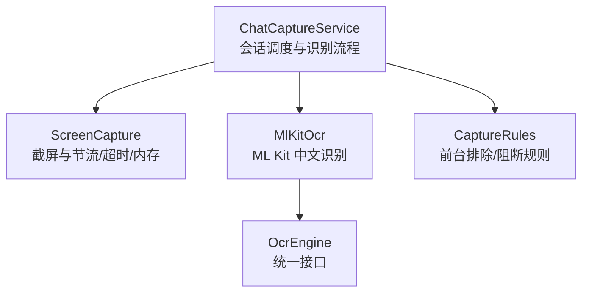
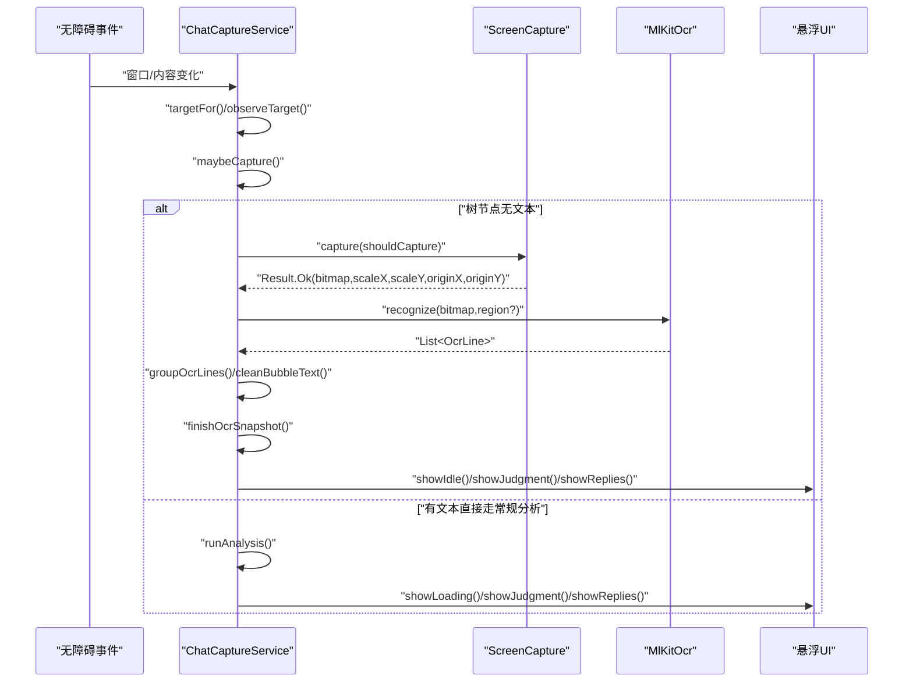
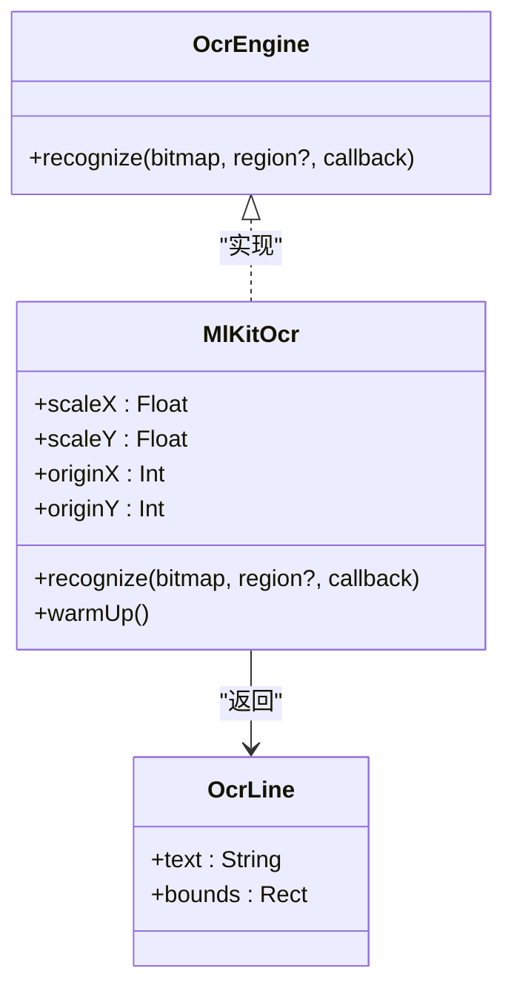
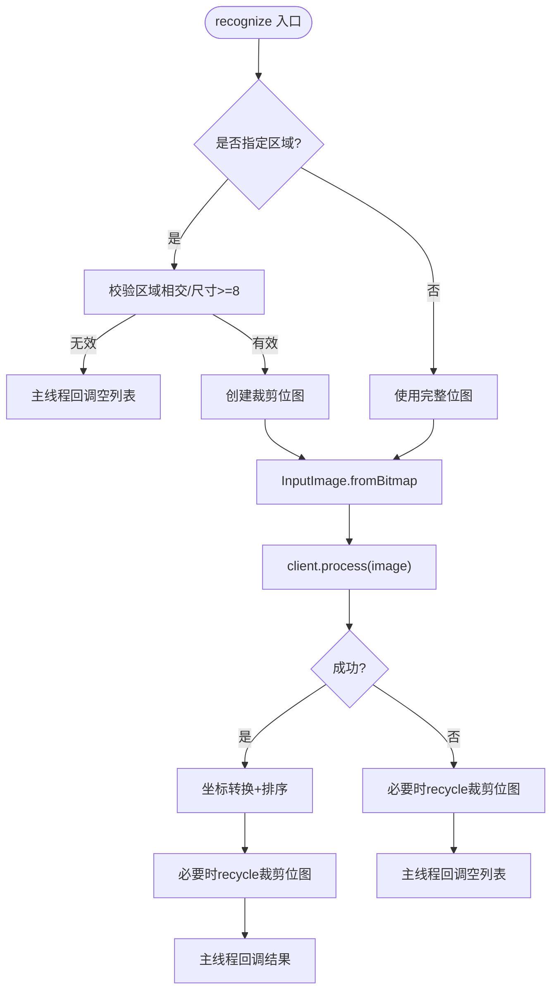
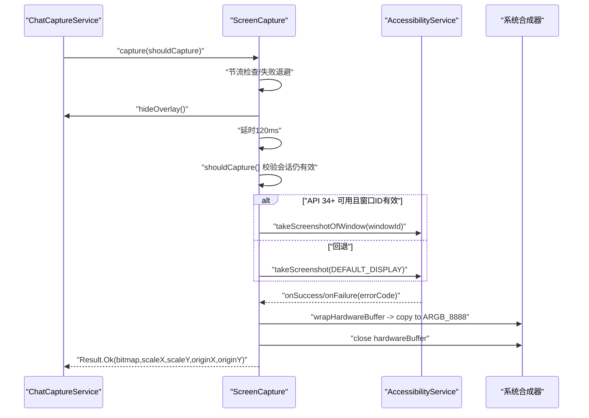
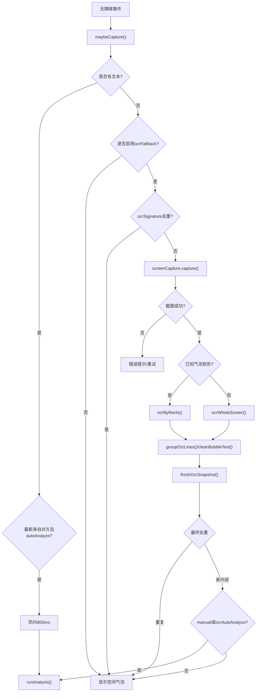
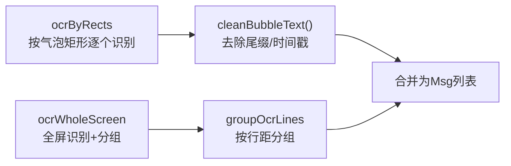
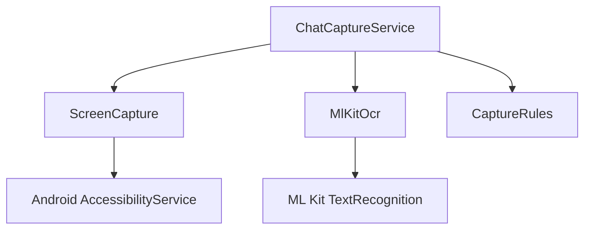

# OCR 文字识别

<cite>
**本文引用的文件**   
- [MlKitOcr.kt](file://app/src/main/java/com/jev/probe/capture/ocr/MlKitOcr.kt)
- [OcrEngine.kt](file://app/src/main/java/com/jev/probe/capture/ocr/OcrEngine.kt)
- [ScreenCapture.kt](file://app/src/main/java/com/jev/probe/capture/ocr/ScreenCapture.kt)
- [ChatCaptureService.kt](file://app/src/main/java/com/jev/probe/capture/ChatCaptureService.kt)
- [CaptureRules.kt](file://app/src/main/java/com/jev/probe/capture/CaptureRules.kt)
</cite>

## 目录
1. [引言](#引言)
2. [项目结构](#项目结构)
3. [核心组件](#核心组件)
4. [架构总览](#架构总览)
5. [详细组件分析](#详细组件分析)
6. [依赖关系分析](#依赖关系分析)
7. [性能与内存优化](#性能与内存优化)
8. [故障排查指南](#故障排查指南)
9. [结论](#结论)
10. [附录：扩展与示例](#附录扩展与示例)

## 引言
本技术文档围绕 OCR 文字识别系统展开，重点解释以下方面：
- MlKitOcr 的实现原理、Google ML Kit 集成方式、模型预热与识别性能优化。
- ScreenCapture 的截屏机制：权限要求、截屏时机控制、失败退避、内存安全。
- OcrEngine 抽象接口的设计目标与扩展性。
- 智能识别流程：自动触发条件、去重机制、错误恢复策略。
- 两种识别模式：基于矩形区域的精确识别和全屏文本分组识别。
- 性能调优参数、内存管理最佳实践与常见问题解决方案。
- 如何自定义 OCR 引擎实现与处理特殊场景。

## 项目结构
OCR 相关代码集中在 capture/ocr 包中，并由 ChatCaptureService 作为调度中心：
- OcrEngine：定义统一的 OCR 接口与结果数据结构。
- MlKitOcr：基于 Google ML Kit 中文离线识别器的具体实现。
- ScreenCapture：通过无障碍服务进行截屏，负责权限、节流、超时、内存回收等。
- ChatCaptureService：整合截图与 OCR，驱动智能识别流程、UI 悬浮窗与后续分析。
- CaptureRules：纯决策逻辑，用于前台排除、手动分析阻断等。

图表来源
- [ChatCaptureService.kt:182-189](file://app/src/main/java/com/jev/probe/capture/ChatCaptureService.kt#L182-L189)
- [ScreenCapture.kt:14-34](file://app/src/main/java/com/jev/probe/capture/ocr/ScreenCapture.kt#L14-L34)
- [MlKitOcr.kt:13-25](file://app/src/main/java/com/jev/probe/capture/ocr/MlKitOcr.kt#L13-L25)
- [OcrEngine.kt:6-22](file://app/src/main/java/com/jev/probe/capture/ocr/OcrEngine.kt#L6-L22)
- [CaptureRules.kt:12-25](file://app/src/main/java/com/jev/probe/capture/CaptureRules.kt#L12-L25)

章节来源
- [ChatCaptureService.kt:28-41](file://app/src/main/java/com/jev/probe/capture/ChatCaptureService.kt#L28-L41)
- [ScreenCapture.kt:14-34](file://app/src/main/java/com/jev/probe/capture/ocr/ScreenCapture.kt#L14-L34)
- [MlKitOcr.kt:13-25](file://app/src/main/java/com/jev/probe/capture/ocr/MlKitOcr.kt#L13-L25)
- [OcrEngine.kt:6-22](file://app/src/main/java/com/jev/probe/capture/ocr/OcrEngine.kt#L6-L22)
- [CaptureRules.kt:12-25](file://app/src/main/java/com/jev/probe/capture/CaptureRules.kt#L12-L25)

## 核心组件
- OcrEngine：定义 recognize(bitmap, region?, callback)，回调在主线程返回，失败时返回空列表而非抛异常；支持整图或局部区域识别。
- MlKitOcr：使用 ML Kit 中文离线识别器，提供坐标转换（屏幕坐标 ↔ 位图坐标）、批量识别、排序与主线程回调；提供 warmUp() 预热模型。
- ScreenCapture：封装 AccessibilityService.takeScreenshot/takeScreenshotOfWindow，负责：
  - 权限与能力检查（canTakeScreenshot）。
  - 节流与失败指数退避（至少 1s，失败递增到最多 30s）。
  - 窗口级截图优先（API 34+），回退到全量显示截图。
  - 硬件缓冲转 ARGB_8888 并立即关闭，避免系统合成器泄漏。
  - 隐藏/恢复悬浮 UI，避免截入自身浮层。
- ChatCaptureService：串联会话检测、截图与 OCR、去重、自动/手动触发、错误提示与后续 AI 分析。

章节来源
- [OcrEngine.kt:6-22](file://app/src/main/java/com/jev/probe/capture/ocr/OcrEngine.kt#L6-L22)
- [MlKitOcr.kt:26-112](file://app/src/main/java/com/jev/probe/capture/ocr/MlKitOcr.kt#L26-L112)
- [ScreenCapture.kt:35-176](file://app/src/main/java/com/jev/probe/capture/ocr/ScreenCapture.kt#L35-L176)
- [ChatCaptureService.kt:182-189](file://app/src/main/java/com/jev/probe/capture/ChatCaptureService.kt#L182-L189)

## 架构总览
整体数据流如下：
- 无障碍事件触发 → 会话判定 → 若树节点无文本则进入 OCR 路径。
- 截图 → 根据已知气泡矩形或全屏分组 → OCR 识别 → 生成消息快照 → 去重 → 可选自动分析。

图表来源
- [ChatCaptureService.kt:233-354](file://app/src/main/java/com/jev/probe/capture/ChatCaptureService.kt#L233-L354)
- [ChatCaptureService.kt:535-689](file://app/src/main/java/com/jev/probe/capture/ChatCaptureService.kt#L535-L689)
- [ScreenCapture.kt:66-176](file://app/src/main/java/com/jev/probe/capture/ocr/ScreenCapture.kt#L66-L176)
- [MlKitOcr.kt:39-95](file://app/src/main/java/com/jev/probe/capture/ocr/MlKitOcr.kt#L39-L95)

## 详细组件分析

### OcrEngine 抽象接口
- 设计目标：屏蔽不同 OCR 后端差异，统一输入输出与线程模型。
- 关键约定：
  - region 为位图坐标，null 表示整图。
  - 回调在主线程执行，失败返回空列表，不抛异常。
  - OcrLine.bounds 已经是屏幕坐标空间。

图表来源
- [OcrEngine.kt:6-22](file://app/src/main/java/com/jev/probe/capture/ocr/OcrEngine.kt#L6-L22)
- [MlKitOcr.kt:26-112](file://app/src/main/java/com/jev/probe/capture/ocr/MlKitOcr.kt#L26-L112)

章节来源
- [OcrEngine.kt:6-22](file://app/src/main/java/com/jev/probe/capture/ocr/OcrEngine.kt#L6-L22)

### MlKitOcr 实现原理与性能优化
- 集成方式：使用 ML Kit TextRecognition 与 ChineseTextRecognizerOptions，模型内置于 APK，无需 Play Services，首次加载较慢但之后稳定。
- 坐标转换：将 ML Kit 返回的位图坐标转换为屏幕坐标，考虑缩放比例与窗口偏移。
- 性能优化：
  - 进程内单例识别器，lazy 初始化以延迟模型加载。
  - 提供 warmUp() 在后台预热，避免首帧卡顿。
  - 裁剪区域小于阈值或相交失败时快速返回空结果，减少无效计算。
  - 成功/失败回调均 post 到主线程，简化上层调用。
  - 对裁剪产生的临时 Bitmap 及时 recycle。

图表来源
- [MlKitOcr.kt:39-95](file://app/src/main/java/com/jev/probe/capture/ocr/MlKitOcr.kt#L39-L95)
- [MlKitOcr.kt:97-112](file://app/src/main/java/com/jev/probe/capture/ocr/MlKitOcr.kt#L97-L112)

章节来源
- [MlKitOcr.kt:13-25](file://app/src/main/java/com/jev/probe/capture/ocr/MlKitOcr.kt#L13-L25)
- [MlKitOcr.kt:26-112](file://app/src/main/java/com/jev/probe/capture/ocr/MlKitOcr.kt#L26-L112)

### ScreenCapture 截屏机制
- 权限与能力：需要无障碍服务声明 canTakeScreenshot=true，并在设置中开关一次生效。
- 截屏时机控制：
  - 内部节流：至少 1s 间隔；连续失败采用指数退避（1s→2s→4s…上限 30s）。
  - 隐藏悬浮 UI 后等待 120ms 再截屏，避免截入自身浮层。
  - API 34+ 优先尝试 takeScreenshotOfWindow，失败回退到 takeScreenshot(Display)。
  - 超时保护：3s 无回调即视为超时。
- 内存优化：
  - 将 HardwareBuffer 转为 ARGB_8888 软件位图，立即关闭原始 buffer。
  - 计算 scaleX/scaleY 与 originX/originY，供 OCR 坐标反算。
  - 所有失败路径确保 buffer 被 close，避免系统合成器资源耗尽。

图表来源
- [ScreenCapture.kt:66-176](file://app/src/main/java/com/jev/probe/capture/ocr/ScreenCapture.kt#L66-L176)
- [ScreenCapture.kt:178-218](file://app/src/main/java/com/jev/probe/capture/ocr/ScreenCapture.kt#L178-L218)

章节来源
- [ScreenCapture.kt:14-34](file://app/src/main/java/com/jev/probe/capture/ocr/ScreenCapture.kt#L14-L34)
- [ScreenCapture.kt:66-176](file://app/src/main/java/com/jev/probe/capture/ocr/ScreenCapture.kt#L66-L176)
- [ScreenCapture.kt:178-218](file://app/src/main/java/com/jev/probe/capture/ocr/ScreenCapture.kt#L178-L218)

### 智能识别流程
- 自动触发条件：
  - 当前会话最新消息来自“对方”，且开启 autoAnalyze。
  - 若树节点无文本（如飞书绘制消息体、微信隐藏文本），则启用 OCR 回退。
- 去重机制：
  - 常规路径：按会话签名（标题+消息摘要）去重，避免重复分析。
  - OCR 路径：按 ocrSignature（包名+标题+气泡矩形集合）去重，防止频繁滚动/状态闪烁导致无限截屏。
- 错误恢复策略：
  - 截图失败：区分瞬时错误（节流/间隔太短）与用户可操作错误（未声明能力/受保护窗口）。
  - OCR 为空：自动路径忽略，手动路径提示“没认出文字”。
  - 会话切换：取消分析、清理缓存、重置 UI。

图表来源
- [ChatCaptureService.kt:269-354](file://app/src/main/java/com/jev/probe/capture/ChatCaptureService.kt#L269-L354)
- [ChatCaptureService.kt:535-689](file://app/src/main/java/com/jev/probe/capture/ChatCaptureService.kt#L535-L689)

章节来源
- [ChatCaptureService.kt:269-354](file://app/src/main/java/com/jev/probe/capture/ChatCaptureService.kt#L269-L354)
- [ChatCaptureService.kt:535-689](file://app/src/main/java/com/jev/probe/capture/ChatCaptureService.kt#L535-L689)

### 两种识别模式
- 基于矩形区域的精确识别（ocrByRects）：
  - 适用于已知气泡位置的应用（如飞书），每个矩形对应一条消息。
  - 将屏幕坐标转换为位图坐标，逐区域 OCR，合并文本并清理尾部时间戳/已读标记。
- 全屏文本分组识别（ocrWholeScreen）：
  - 裁剪顶部与底部区域，识别整屏文本行，按行间距分组为“伪气泡”。
  - 无法判断发送方，统一归为“对方”，并在面板标注说明。

图表来源
- [ChatCaptureService.kt:576-653](file://app/src/main/java/com/jev/probe/capture/ChatCaptureService.kt#L576-L653)

章节来源
- [ChatCaptureService.kt:576-653](file://app/src/main/java/com/jev/probe/capture/ChatCaptureService.kt#L576-L653)

## 依赖关系分析
- ChatCaptureService 依赖：
  - ScreenCapture：负责截屏与节流/超时/内存安全。
  - MlKitOcr：负责 OCR 识别与坐标转换。
  - CaptureRules：决定前台排除与手动分析阻断。
- 外部依赖：
  - Android AccessibilityService：提供无障碍事件与截屏能力。
  - Google ML Kit：中文离线识别器。

图表来源
- [ChatCaptureService.kt:182-189](file://app/src/main/java/com/jev/probe/capture/ChatCaptureService.kt#L182-L189)
- [ScreenCapture.kt:3-12](file://app/src/main/java/com/jev/probe/capture/ocr/ScreenCapture.kt#L3-L12)
- [MlKitOcr.kt:8-11](file://app/src/main/java/com/jev/probe/capture/ocr/MlKitOcr.kt#L8-L11)

章节来源
- [ChatCaptureService.kt:182-189](file://app/src/main/java/com/jev/probe/capture/ChatCaptureService.kt#L182-L189)
- [ScreenCapture.kt:3-12](file://app/src/main/java/com/jev/probe/capture/ocr/ScreenCapture.kt#L3-L12)
- [MlKitOcr.kt:8-11](file://app/src/main/java/com/jev/probe/capture/ocr/MlKitOcr.kt#L8-L11)

## 性能与内存优化
- 模型预热：
  - 在 onServiceConnected 时后台调用 MlKitOcr.warmUp()，避免首帧卡顿。
- 节流与退避：
  - ScreenCapture 内部节流至少 1s；连续失败指数退避至 30s，避免“截屏机枪”。
- 截图范围优化：
  - API 34+ 优先窗口级截图，减少无关区域与提升成功率。
- 内存安全：
  - HardwareBuffer 立即复制为 ARGB_8888 并关闭，避免系统合成器泄漏。
  - OCR 裁剪位图及时 recycle。
- 识别优化：
  - 小区域/无效区域快速返回空结果。
  - 按行排序与分组，减少后续处理复杂度。
- 建议参数：
  - 自动分析开关：autoAnalyze。
  - OCR 回退开关：ocrFallback。
  - OCR 自动分析开关：ocrAutoAnalyze。
  - 白名单：prefs.isAllowed(title)。

章节来源
- [ChatCaptureService.kt:196-230](file://app/src/main/java/com/jev/probe/capture/ChatCaptureService.kt#L196-L230)
- [ScreenCapture.kt:178-218](file://app/src/main/java/com/jev/probe/capture/ocr/ScreenCapture.kt#L178-L218)
- [MlKitOcr.kt:97-112](file://app/src/main/java/com/jev/probe/capture/ocr/MlKitOcr.kt#L97-L112)

## 故障排查指南
- 截屏失败常见原因：
  - 未声明截屏能力：需关闭再开启无障碍服务。
  - 间隔太短：等待 1s 后重试。
  - 窗口不可见或受保护（FLAG_SECURE）：无法截屏。
  - 没有有效显示：系统限制。
- OCR 无结果：
  - 自动路径忽略；手动路径提示“没认出文字”。
  - 检查是否启用 ocrFallback 与 ocrAutoAnalyze。
- 会话不稳定：
  - 检查 isCurrent/isSameWindowLive 判定逻辑与 manualSession 标志。
- 日志定位：
  - 使用 CaptureRules.idInventory 查看控件 id 分布，适配应用更新导致的 id 变更。

章节来源
- [ScreenCapture.kt:178-218](file://app/src/main/java/com/jev/probe/capture/ocr/ScreenCapture.kt#L178-L218)
- [ChatCaptureService.kt:494-511](file://app/src/main/java/com/jev/probe/capture/ChatCaptureService.kt#L494-L511)
- [CaptureRules.kt:40-56](file://app/src/main/java/com/jev/probe/capture/CaptureRules.kt#L40-L56)

## 结论
该 OCR 文字识别系统通过 OcrEngine 抽象解耦识别后端，结合 ScreenCapture 的安全截屏与 MlKitOcr 的高效识别，实现了在多种聊天应用中的稳定文字提取。智能识别流程兼顾自动触发与手动干预，具备完善的去重与错误恢复机制。通过模型预热、节流退避、内存回收与区域裁剪等优化手段，系统在性能与稳定性之间取得良好平衡。

## 附录：扩展与示例
- 自定义 OCR 引擎：
  - 实现 OcrEngine 接口，遵循主线程回调与失败返回空列表的约定。
  - 可在 recognize 中实现自己的裁剪、识别与坐标转换逻辑。
- 特殊场景处理：
  - 针对 FLAG_SECURE 界面：跳过 OCR 或提示用户。
  - 针对动态气泡：优先使用 ocrByRects，否则回退到 ocrWholeScreen。
- 代码示例路径：
  - 自定义引擎参考：[OcrEngine.kt:20-22](file://app/src/main/java/com/jev/probe/capture/ocr/OcrEngine.kt#L20-L22)
  - 截图与 OCR 调度参考：[ChatCaptureService.kt:535-689](file://app/src/main/java/com/jev/probe/capture/ChatCaptureService.kt#L535-L689)
  - 坐标转换与性能优化参考：[MlKitOcr.kt:39-112](file://app/src/main/java/com/jev/probe/capture/ocr/MlKitOcr.kt#L39-L112)

章节来源
- [OcrEngine.kt:20-22](file://app/src/main/java/com/jev/probe/capture/ocr/OcrEngine.kt#L20-L22)
- [ChatCaptureService.kt:535-689](file://app/src/main/java/com/jev/probe/capture/ChatCaptureService.kt#L535-L689)
- [MlKitOcr.kt:39-112](file://app/src/main/java/com/jev/probe/capture/ocr/MlKitOcr.kt#L39-L112)