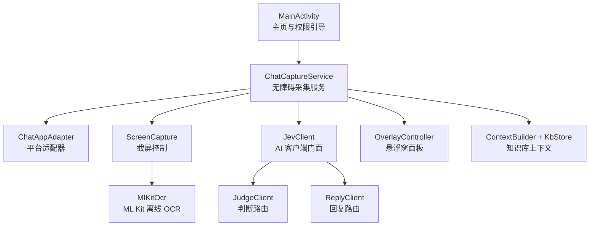
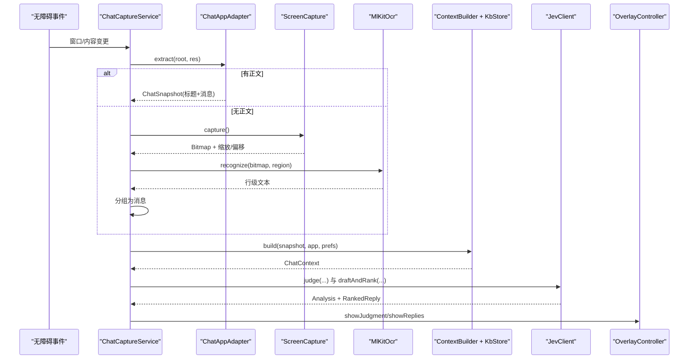
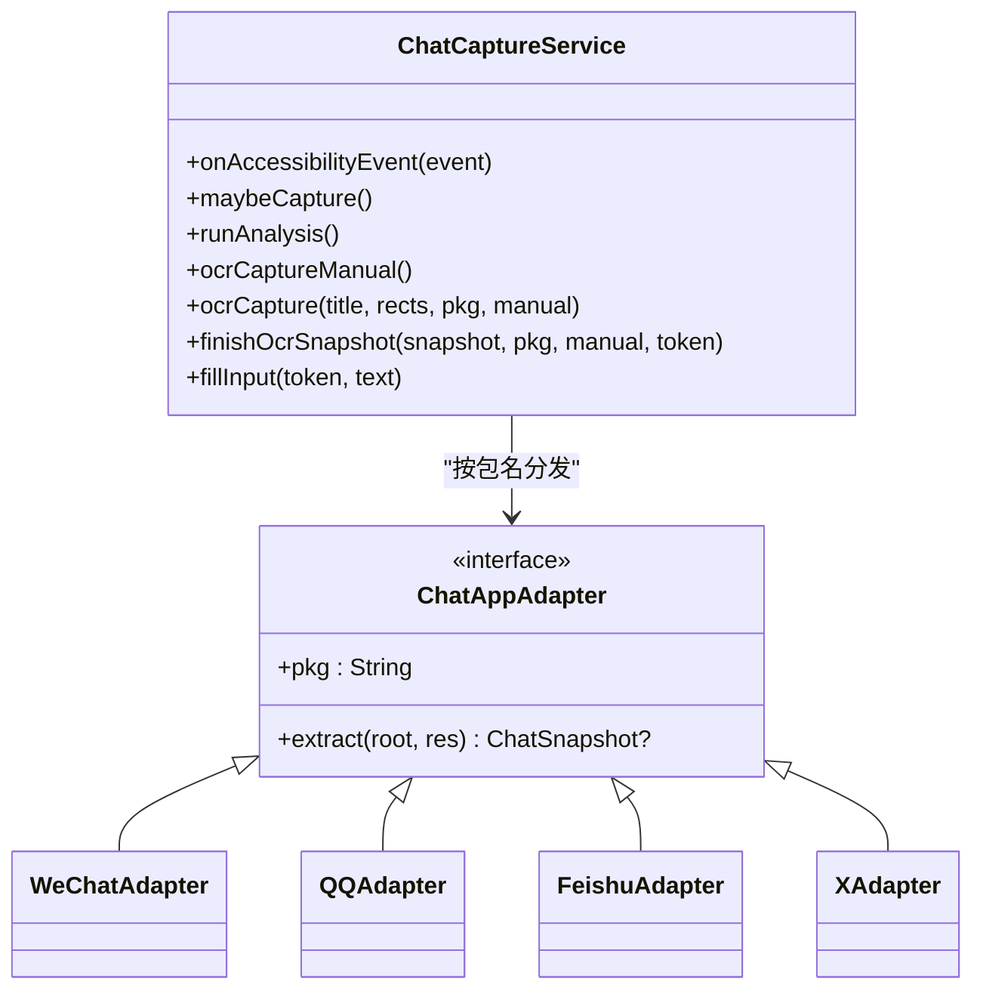
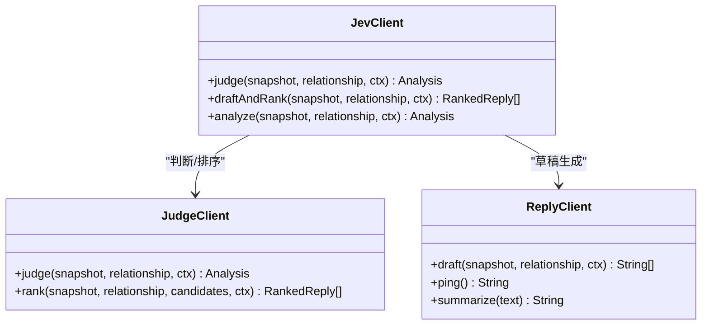
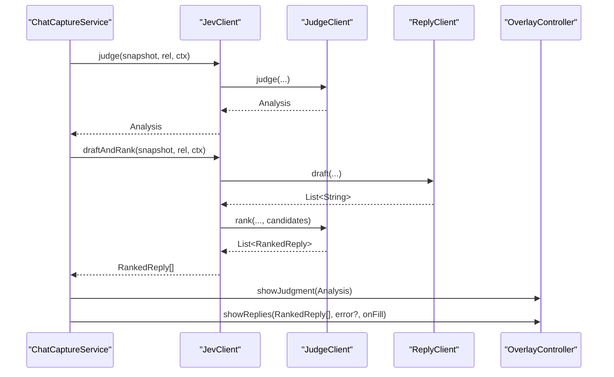
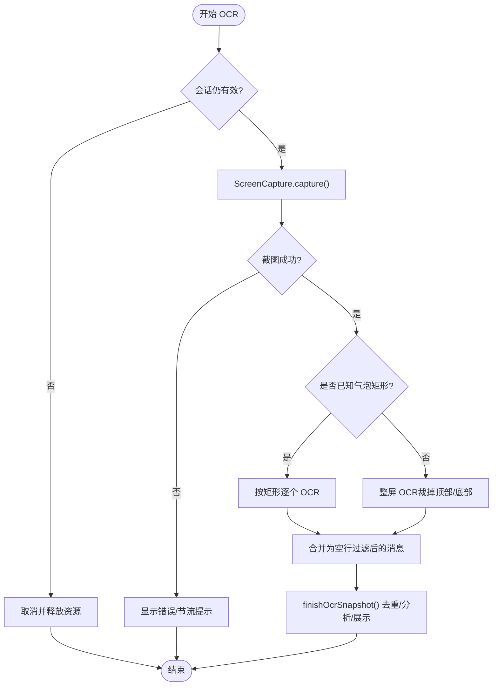
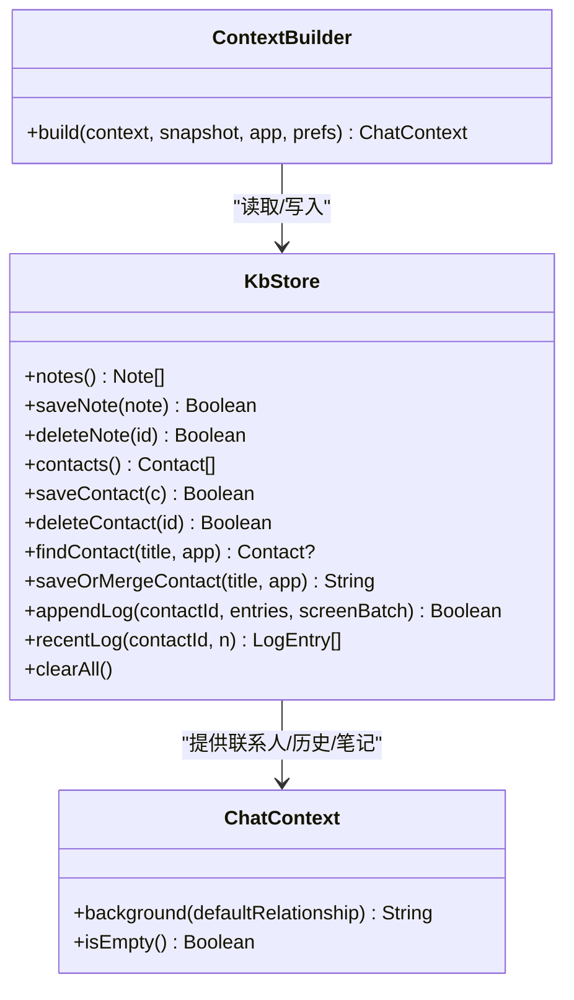
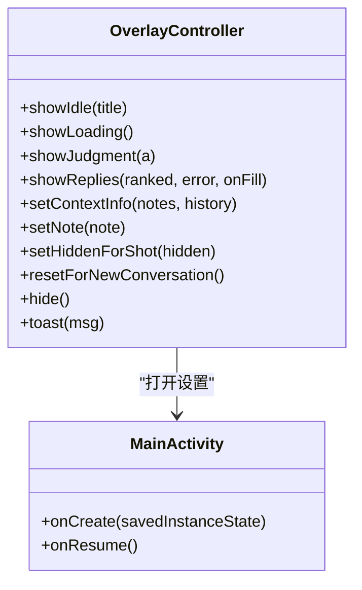
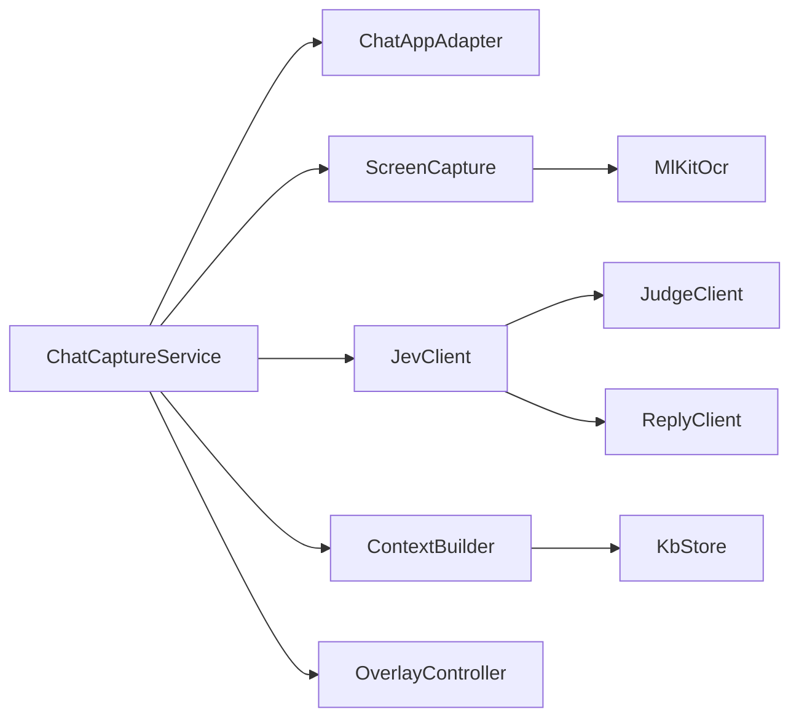

# 核心功能模块

<cite>
**本文引用的文件**   
- [README.md](file://README.md)
- [ChatCaptureService.kt](file://app/src/main/java/com/jev/probe/capture/ChatCaptureService.kt)
- [ChatAppAdapter.kt](file://app/src/main/java/com/jev/probe/capture/ChatAppAdapter.kt)
- [ConversationSession.kt](file://app/src/main/java/com/jev/probe/capture/ConversationSession.kt)
- [MlKitOcr.kt](file://app/src/main/java/com/jev/probe/capture/ocr/MlKitOcr.kt)
- [ScreenCapture.kt](file://app/src/main/java/com/jev/probe/capture/ocr/ScreenCapture.kt)
- [JevClient.kt](file://app/src/main/java/com/jev/probe/jev/JevClient.kt)
- [JudgeClient.kt](file://app/src/main/java/com/jev/probe/jev/JudgeClient.kt)
- [ReplyClient.kt](file://app/src/main/java/com/jev/probe/jev/ReplyClient.kt)
- [KbStore.kt](file://app/src/main/java/com/jev/probe/core/kb/KbStore.kt)
- [KbModels.kt](file://app/src/main/java/com/jev/probe/core/kb/KbModels.kt)
- [ContextBuilder.kt](file://app/src/main/java/com/jev/probe/core/kb/ContextBuilder.kt)
- [OverlayController.kt](file://app/src/main/java/com/jev/probe/overlay/OverlayController.kt)
- [MainActivity.kt](file://app/src/main/java/com/jev/probe/MainActivity.kt)
</cite>

## 目录
1. [引言](#引言)
2. [项目结构](#项目结构)
3. [核心组件](#核心组件)
4. [架构总览](#架构总览)
5. [详细组件分析](#详细组件分析)
6. [依赖关系分析](#依赖关系分析)
7. [性能与稳定性](#性能与稳定性)
8. [故障排查指南](#故障排查指南)
9. [结论](#结论)

## 引言
本文件面向 Jev 聊天助手 Android 端的核心实现，围绕五个关键子系统展开：消息采集系统、AI 分析引擎、OCR 文字识别、知识库管理系统和用户界面系统。文档从代码级实现出发，说明各模块的职责边界、接口契约、数据流和交互时序，并给出架构图、类图与时序图，帮助开发者快速理解“读屏 → 判断 → 生成候选 → 悬浮窗展示 → 用户填入”的完整链路。

## 项目结构
Android 应用以 `app/src/main/java/com/jev/probe` 为根包，按功能分层组织：
- `capture/`：无障碍服务、平台适配器、会话状态、截图与 OCR。
- `jev/`：Jev 客户端封装、判断与回复请求、响应解析。
- `core/kb/`：本地知识库模型、存储、上下文构建。
- `overlay/`：悬浮窗控制器。
- `MainActivity.kt` / `SettingsActivity.kt`：主界面与设置页。
- `android-core-flow-illustrations`：官方流程图资源（见 README）。

图表来源
- [ChatCaptureService.kt:28-41](file://app/src/main/java/com/jev/probe/capture/ChatCaptureService.kt#L28-L41)
- [ChatAppAdapter.kt:10-30](file://app/src/main/java/com/jev/probe/capture/ChatAppAdapter.kt#L10-L30)
- [ScreenCapture.kt:14-39](file://app/src/main/java/com/jev/probe/capture/ocr/ScreenCapture.kt#L14-L39)
- [MlKitOcr.kt:13-25](file://app/src/main/java/com/jev/probe/capture/ocr/MlKitOcr.kt#L13-L25)
- [JevClient.kt:9-13](file://app/src/main/java/com/jev/probe/jev/JevClient.kt#L9-L13)
- [JudgeClient.kt:13-17](file://app/src/main/java/com/jev/probe/jev/JudgeClient.kt#L13-L17)
- [ReplyClient.kt:9-13](file://app/src/main/java/com/jev/probe/jev/ReplyClient.kt#L9-L13)
- [OverlayController.kt:29-37](file://app/src/main/java/com/jev/probe/overlay/OverlayController.kt#L29-L37)
- [ContextBuilder.kt:8-15](file://app/src/main/java/com/jev/probe/core/kb/ContextBuilder.kt#L8-L15)
- [KbStore.kt:12-23](file://app/src/main/java/com/jev/probe/core/kb/KbStore.kt#L12-L23)

章节来源
- [README.md:223-241](file://README.md#L223-L241)

## 核心组件
- 消息采集系统：基于无障碍服务，按前台包名分发到平台适配器；未适配或无障碍树无正文时走截屏 + ML Kit 离线 OCR。
- AI 分析引擎：通过 JevClient 统一入口，分别调用 JudgeClient（意图/风险/动作判断）与 ReplyClient（候选回复），再对候选排序。
- OCR 文字识别：ScreenCapture 负责安全截屏、节流与退避；MlKitOcr 使用内置中文模型进行行级识别，坐标映射回屏幕空间。
- 知识库管理系统：本地 JSON 文件持久化笔记、联系人、历史；ContextBuilder 根据会话标题匹配联系人、命中笔记并裁剪预算。
- 用户界面系统：悬浮窗控制器提供可拖拽气泡、展开面板、危险等级、意图摘要、候选回复卡片及复制/填入操作。

章节来源
- [ChatCaptureService.kt:28-41](file://app/src/main/java/com/jev/probe/capture/ChatCaptureService.kt#L28-L41)
- [JevClient.kt:9-13](file://app/src/main/java/com/jev/probe/jev/JevClient.kt#L9-L13)
- [MlKitOcr.kt:13-25](file://app/src/main/java/com/jev/probe/capture/ocr/MlKitOcr.kt#L13-L25)
- [KbStore.kt:12-23](file://app/src/main/java/com/jev/probe/core/kb/KbStore.kt#L12-L23)
- [OverlayController.kt:29-37](file://app/src/main/java/com/jev/probe/overlay/OverlayController.kt#L29-L37)

## 架构总览
Jev 在 Android 端的整体流程如下：
- 无障碍事件触发 → ChatCaptureService 判定是否进入聊天窗口。
- 平台适配器将 UI 节点转换为统一的 ChatSnapshot（标题 + 消息列表）。
- 若树内无正文，则 ScreenCapture 截屏，MlKitOcr 识别文本并按行分组。
- ContextBuilder 结合 KbStore 构建 ChatContext（联系人、历史、命中笔记）。
- JevClient 并行发起判断与候选生成，JudgeClient 对候选排序。
- OverlayController 展示结果，用户点击“填入”后由 GuardedInputWriter 写入输入框，绝不自动发送。

图表来源
- [ChatCaptureService.kt:269-354](file://app/src/main/java/com/jev/probe/capture/ChatCaptureService.kt#L269-L354)
- [ChatAppAdapter.kt:10-30](file://app/src/main/java/com/jev/probe/capture/ChatAppAdapter.kt#L10-L30)
- [ScreenCapture.kt:65-93](file://app/src/main/java/com/jev/probe/capture/ocr/ScreenCapture.kt#L65-L93)
- [MlKitOcr.kt:39-95](file://app/src/main/java/com/jev/probe/capture/ocr/MlKitOcr.kt#L39-L95)
- [ContextBuilder.kt:35-63](file://app/src/main/java/com/jev/probe/core/kb/ContextBuilder.kt#L35-L63)
- [JevClient.kt:19-31](file://app/src/main/java/com/jev/probe/jev/JevClient.kt#L19-L31)
- [OverlayController.kt:380-391](file://app/src/main/java/com/jev/probe/overlay/OverlayController.kt#L380-L391)

## 详细组件分析

### 消息采集系统（无障碍服务与平台适配器）
- 服务职责：监听无障碍事件、维护当前会话、防抖与去重、触发分析、管理 OCR 路径、回填输入框。
- 适配器契约：`extract(root, res)` 返回三类结果：
  - `null`：不在聊天窗口。
  - 空消息列表：在聊天窗口但无障碍树无正文，触发 OCR 兜底。
  - 非空消息列表：正常采集。
- 已支持平台：微信（伪装无障碍）、QQ、X/Twitter、飞书（气泡矩形 + OCR）。

图表来源
- [ChatCaptureService.kt:269-354](file://app/src/main/java/com/jev/probe/capture/ChatCaptureService.kt#L269-L354)
- [ChatAppAdapter.kt:10-30](file://app/src/main/java/com/jev/probe/capture/ChatAppAdapter.kt#L10-L30)
- [ChatAppAdapter.kt:139-179](file://app/src/main/java/com/jev/probe/capture/ChatAppAdapter.kt#L139-L179)
- [ChatAppAdapter.kt:197-247](file://app/src/main/java/com/jev/probe/capture/ChatAppAdapter.kt#L197-L247)
- [ChatAppAdapter.kt:319-376](file://app/src/main/java/com/jev/probe/capture/ChatAppAdapter.kt#L319-L376)
- [ChatAppAdapter.kt:440-510](file://app/src/main/java/com/jev/probe/capture/ChatAppAdapter.kt#L440-L510)

章节来源
- [ChatCaptureService.kt:28-41](file://app/src/main/java/com/jev/probe/capture/ChatCaptureService.kt#L28-L41)
- [ChatAppAdapter.kt:10-30](file://app/src/main/java/com/jev/probe/capture/ChatAppAdapter.kt#L10-L30)

### AI 分析引擎（Jev 客户端封装、判断与回复流程）
- JevClient：门面类，聚合判断与回复两个子客户端，提供 `judge`、`draftAndRank`、`analyze`。
- JudgeClient：发送 7 道判断题目，解析意图、风险、需求、动作等；对候选回复进行排序。
- ReplyClient：调用 OpenAI 兼容 `/chat/completions`，生成 3 条候选回复，支持连通性测试与摘要。

图表来源
- [JevClient.kt:9-31](file://app/src/main/java/com/jev/probe/jev/JevClient.kt#L9-L31)
- [JudgeClient.kt:13-62](file://app/src/main/java/com/jev/probe/jev/JudgeClient.kt#L13-L62)
- [ReplyClient.kt:9-33](file://app/src/main/java/com/jev/probe/jev/ReplyClient.kt#L9-L33)

图表来源
- [ChatCaptureService.kt:383-442](file://app/src/main/java/com/jev/probe/capture/ChatCaptureService.kt#L383-L442)
- [JevClient.kt:19-31](file://app/src/main/java/com/jev/probe/jev/JevClient.kt#L19-L31)
- [JudgeClient.kt:26-62](file://app/src/main/java/com/jev/probe/jev/JudgeClient.kt#L26-L62)
- [ReplyClient.kt:23-33](file://app/src/main/java/com/jev/probe/jev/ReplyClient.kt#L23-L33)
- [OverlayController.kt:380-391](file://app/src/main/java/com/jev/probe/overlay/OverlayController.kt#L380-L391)

章节来源
- [JevClient.kt:9-31](file://app/src/main/java/com/jev/probe/jev/JevClient.kt#L9-L31)
- [JudgeClient.kt:13-62](file://app/src/main/java/com/jev/probe/jev/JudgeClient.kt#L13-L62)
- [ReplyClient.kt:9-33](file://app/src/main/java/com/jev/probe/jev/ReplyClient.kt#L9-L33)

### OCR 文字识别（ML Kit 集成、截图识别流程）
- ScreenCapture：通过无障碍服务截屏，避免悬浮窗入镜；实现节流、失败指数退避、超时保护；处理 API 34+ 窗口截图与全屏截图差异，输出位图与缩放/偏移参数。
- MlKitOcr：使用内置中文识别器，支持整屏或指定区域识别；回调在主线程返回行级文本，坐标转换回屏幕空间。
- ChatCaptureService：对飞书等气泡矩形逐个 OCR，或将整屏 OCR 结果按行间距分组为消息。

图表来源
- [ScreenCapture.kt:65-93](file://app/src/main/java/com/jev/probe/capture/ocr/ScreenCapture.kt#L65-L93)
- [ScreenCapture.kt:155-176](file://app/src/main/java/com/jev/probe/capture/ocr/ScreenCapture.kt#L155-L176)
- [MlKitOcr.kt:39-95](file://app/src/main/java/com/jev/probe/capture/ocr/MlKitOcr.kt#L39-L95)
- [ChatCaptureService.kt:535-689](file://app/src/main/java/com/jev/probe/capture/ChatCaptureService.kt#L535-L689)

章节来源
- [ScreenCapture.kt:14-39](file://app/src/main/java/com/jev/probe/capture/ocr/ScreenCapture.kt#L14-L39)
- [MlKitOcr.kt:13-25](file://app/src/main/java/com/jev/probe/capture/ocr/MlKitOcr.kt#L13-L25)
- [ChatCaptureService.kt:535-689](file://app/src/main/java/com/jev/probe/capture/ChatCaptureService.kt#L535-L689)

### 知识库管理系统（数据存储、联系人管理、笔记系统）
- 存储结构：`filesDir/kb` 下的 notes.json、contacts.json、logs/<contactId>.json 与 screen.json。
- 原子写入：临时文件 + rename，崩溃不产生半写文件；损坏文件备份为 `.corrupt.*`。
- 联系人匹配：按规范化名称/别名匹配，优先选择已知包名的联系人。
- 历史追加：按屏幕序列去重，滚动上翻旧消息不重复写入，限制最大行数。
- 上下文构建：预算上限 1500 字符，优先保留 alwaysOn 笔记，历史与命中笔记共享预算。

图表来源
- [KbStore.kt:24-40](file://app/src/main/java/com/jev/probe/core/kb/KbStore.kt#L24-L40)
- [KbStore.kt:44-96](file://app/src/main/java/com/jev/probe/core/kb/KbStore.kt#L44-L96)
- [KbStore.kt:122-145](file://app/src/main/java/com/jev/probe/core/kb/KbStore.kt#L122-L145)
- [KbStore.kt:172-221](file://app/src/main/java/com/jev/probe/core/kb/KbStore.kt#L172-L221)
- [KbStore.kt:438-459](file://app/src/main/java/com/jev/probe/core/kb/KbStore.kt#L438-L459)
- [ContextBuilder.kt:35-63](file://app/src/main/java/com/jev/probe/core/kb/ContextBuilder.kt#L35-L63)
- [KbModels.kt:48-84](file://app/src/main/java/com/jev/probe/core/kb/KbModels.kt#L48-L84)

章节来源
- [KbStore.kt:12-23](file://app/src/main/java/com/jev/probe/core/kb/KbStore.kt#L12-L23)
- [KbStore.kt:172-221](file://app/src/main/java/com/jev/probe/core/kb/KbStore.kt#L172-L221)
- [ContextBuilder.kt:8-15](file://app/src/main/java/com/jev/probe/core/kb/ContextBuilder.kt#L8-L15)
- [KbModels.kt:11-42](file://app/src/main/java/com/jev/probe/core/kb/KbModels.kt#L11-L42)

### 用户界面系统（悬浮窗控制器、主界面设计）
- 悬浮窗控制器：可拖拽气泡、展开面板、显示危险等级、意图、建议动作、候选回复；支持复制与“填入”输入框；长按气泡弹出菜单（截屏识别一次、存为联系人、打开设置、隐藏助手）。
- 主界面：权限检查、就绪状态、隐私提示、开关总控、跳转设置。

图表来源
- [OverlayController.kt:38-74](file://app/src/main/java/com/jev/probe/overlay/OverlayController.kt#L38-L74)
- [OverlayController.kt:235-249](file://app/src/main/java/com/jev/probe/overlay/OverlayController.kt#L235-L249)
- [OverlayController.kt:288-391](file://app/src/main/java/com/jev/probe/overlay/OverlayController.kt#L288-L391)
- [MainActivity.kt:27-106](file://app/src/main/java/com/jev/probe/MainActivity.kt#L27-L106)

章节来源
- [OverlayController.kt:29-37](file://app/src/main/java/com/jev/probe/overlay/OverlayController.kt#L29-L37)
- [MainActivity.kt:22-26](file://app/src/main/java/com/jev/probe/MainActivity.kt#L22-L26)

## 依赖关系分析
- ChatCaptureService 依赖：
  - ChatAppAdapter：平台适配。
  - ScreenCapture + MlKitOcr：OCR 兜底。
  - JevClient：AI 判断与回复。
  - ContextBuilder + KbStore：知识库上下文。
  - OverlayController：UI 展示与交互。
- JevClient 依赖：
  - JudgeClient：判断与排序。
  - ReplyClient：候选生成。
- OverlayController 依赖：
  - Prefs：透明度、气泡位置等配置。
  - 系统剪贴板：复制候选。

图表来源
- [ChatCaptureService.kt:28-41](file://app/src/main/java/com/jev/probe/capture/ChatCaptureService.kt#L28-L41)
- [JevClient.kt:9-13](file://app/src/main/java/com/jev/probe/jev/JevClient.kt#L9-L13)
- [ContextBuilder.kt:8-15](file://app/src/main/java/com/jev/probe/core/kb/ContextBuilder.kt#L8-L15)
- [KbStore.kt:12-23](file://app/src/main/java/com/jev/probe/core/kb/KbStore.kt#L12-L23)
- [OverlayController.kt:29-37](file://app/src/main/java/com/jev/probe/overlay/OverlayController.kt#L29-L37)

## 性能与稳定性
- 节流与退避：
  - 截屏频率限制至少 1 秒，连续失败指数退避至 30 秒，避免“截屏机枪”。
  - 内容变更事件去抖 800ms，避免频繁触发分析。
- 内存与资源：
  - 硬件缓冲立即复制到 ARGB_8888 位图并关闭，防止 compositor 泄漏。
  - OCR 区域裁剪后及时回收位图。
- 并发与生命周期：
  - 固定线程池执行分析与 OCR，销毁时 shutdownNow。
  - ConversationSession 通过 revision 令牌保证旧请求不会在新会话中复活。
- 网络容错：
  - JudgeClient 对携带 background/history 的请求若返回 4xx，降级重试不带这些字段。

章节来源
- [ScreenCapture.kt:188-206](file://app/src/main/java/com/jev/probe/capture/ocr/ScreenCapture.kt#L188-L206)
- [ChatCaptureService.kt:351-354](file://app/src/main/java/com/jev/probe/capture/ChatCaptureService.kt#L351-L354)
- [ConversationSession.kt:17-34](file://app/src/main/java/com/jev/probe/capture/ConversationSession.kt#L17-L34)
- [JudgeClient.kt:73-90](file://app/src/main/java/com/jev/probe/jev/JudgeClient.kt#L73-L90)

## 故障排查指南
- 无障碍服务未生效：
  - 确认无障碍开关已开启且包含本服务组件；必要时关闭再打开以启用截屏能力。
- 悬浮窗不可见：
  - 检查悬浮窗权限；国产 ROM 可能冻结后台，需开启自启动与省电无限制。
- 截屏失败：
  - 常见原因包括系统拒绝、间隔太短、窗口受保护（FLAG_SECURE）；查看错误码与人类可读消息。
- 无法识别正文：
  - 飞书等自绘控件需 OCR；未适配 App 可使用“截屏识别一次”，但无法区分我方/对方。
- 知识库未命中：
  - 笔记标签或标题需出现在会话标题或最近 6 条消息中；联系人名称/别名需规范化匹配。
- 输入框无法填入：
  - 仅支持已知输入框 id 或唯一可编辑节点；未知 App 会回退到剪贴板复制。

章节来源
- [ScreenCapture.kt:208-218](file://app/src/main/java/com/jev/probe/capture/ocr/ScreenCapture.kt#L208-L218)
- [ChatCaptureService.kt:719-779](file://app/src/main/java/com/jev/probe/capture/ChatCaptureService.kt#L719-L779)
- [ContextBuilder.kt:93-116](file://app/src/main/java/com/jev/probe/core/kb/ContextBuilder.kt#L93-L116)
- [KbStore.kt:106-145](file://app/src/main/java/com/jev/probe/core/kb/KbStore.kt#L106-L145)

## 结论
Jev 聊天助手 Android 端通过“无障碍采集 + 平台适配器 + OCR 兜底”的方式稳定获取聊天上下文，再以 Jev 判断与回复双通道完成意图分析与候选生成，最终通过悬浮窗呈现并由用户决定是否发送。知识库系统在本地持久化，确保分析具备背景与历史，同时保持数据可控与隐私合规。整体架构清晰、职责分离，具备良好的扩展性与鲁棒性。