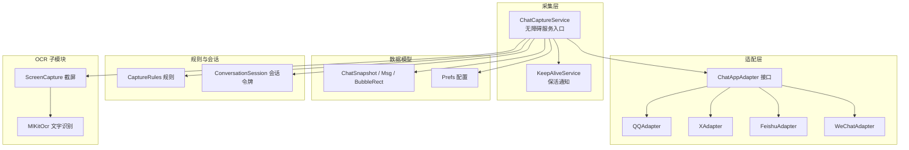
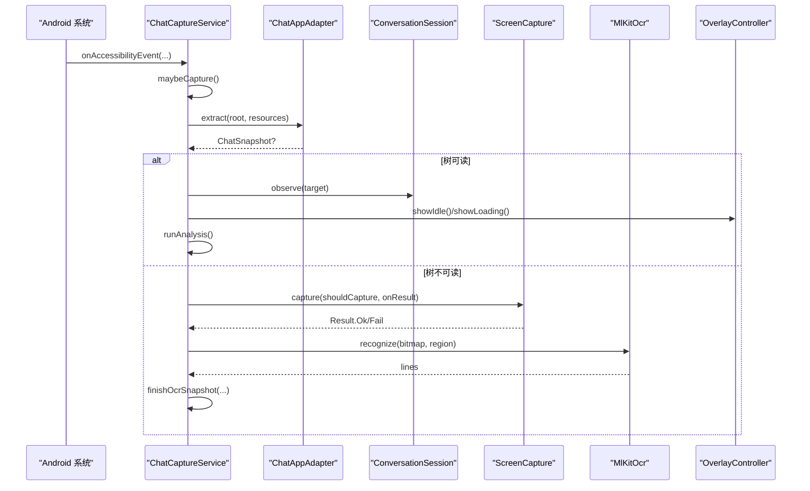
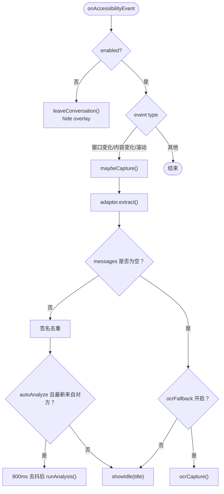
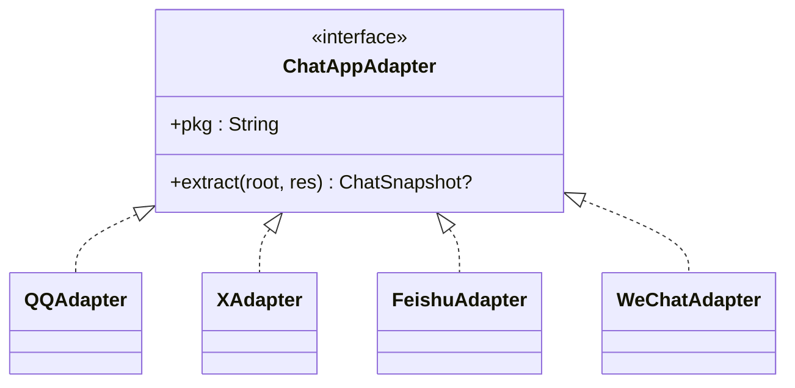
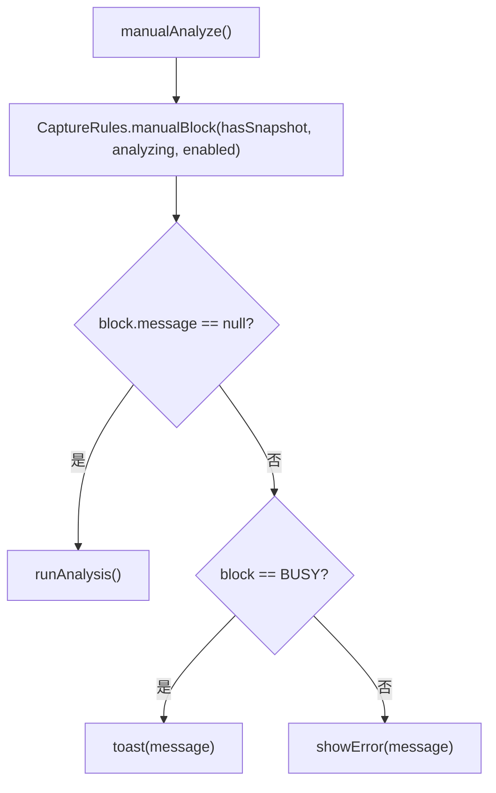
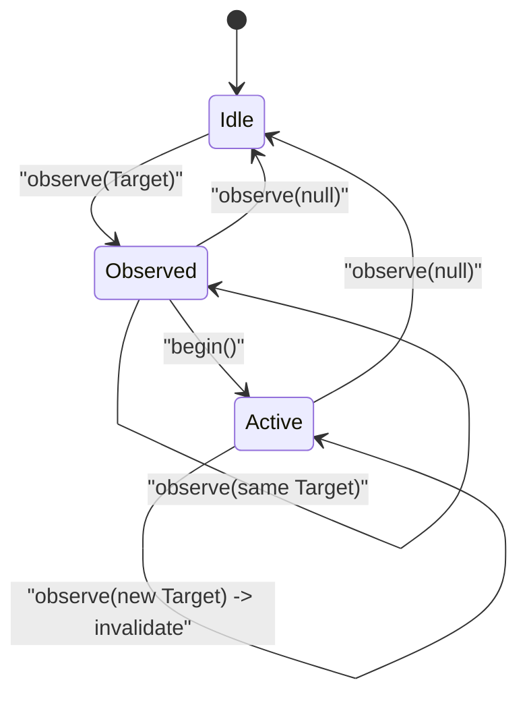
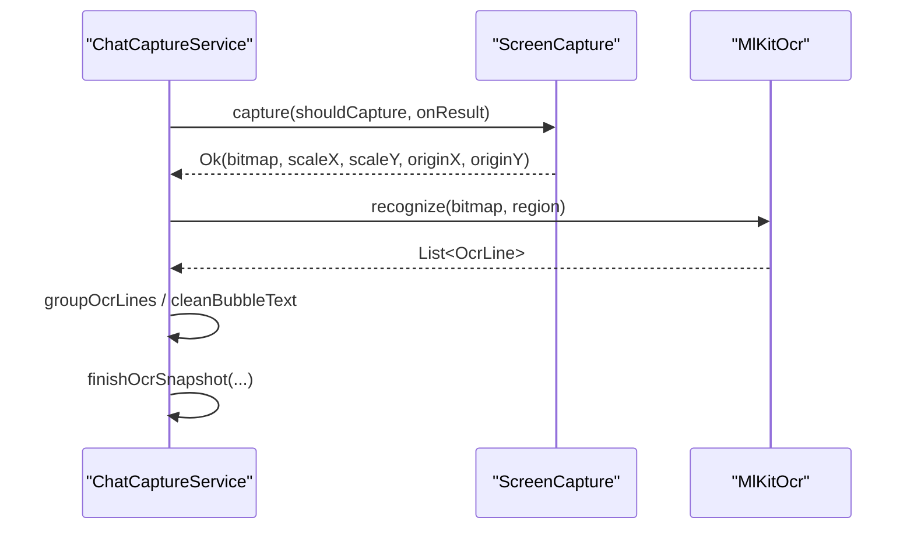
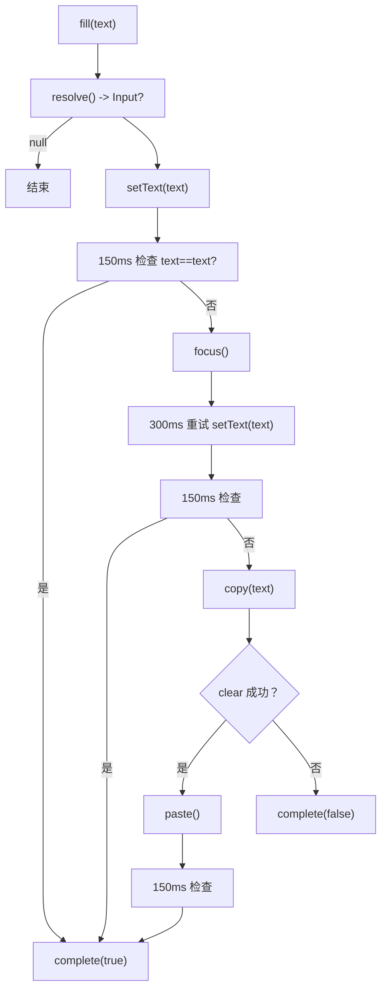
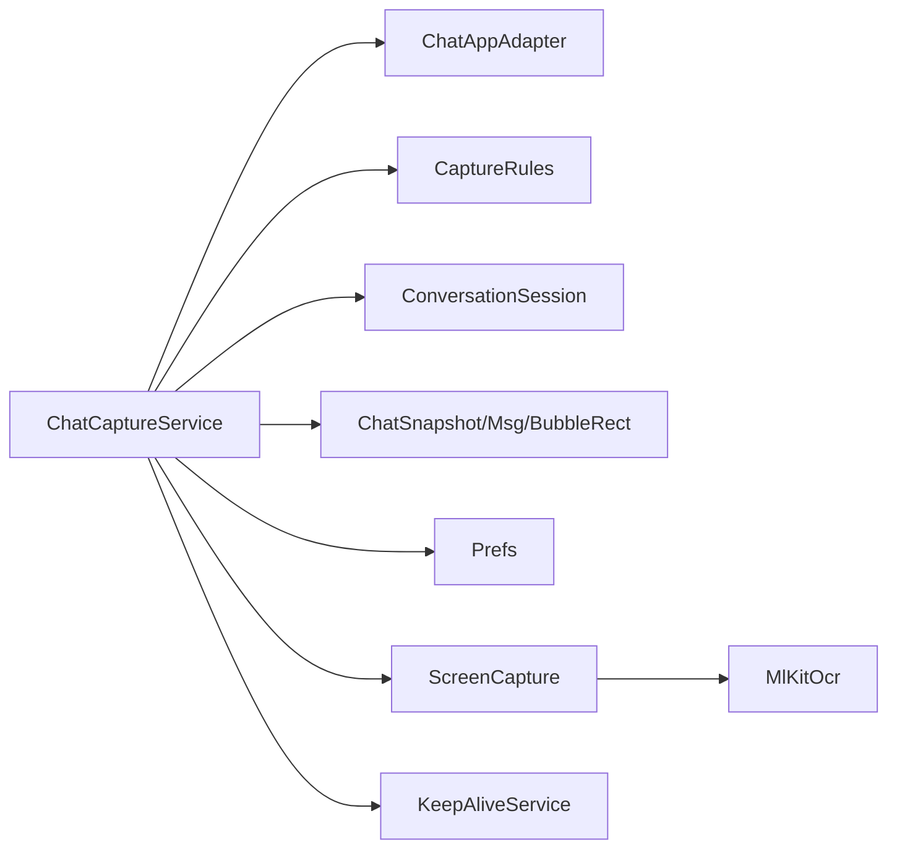

# 消息采集系统

<cite>
**本文引用的文件**   
- [ChatCaptureService.kt](file://app/src/main/java/com/jev/probe/capture/ChatCaptureService.kt)
- [ChatAppAdapter.kt](file://app/src/main/java/com/jev/probe/capture/ChatAppAdapter.kt)
- [CaptureRules.kt](file://app/src/main/java/com/jev/probe/capture/CaptureRules.kt)
- [ConversationSession.kt](file://app/src/main/java/com/jev/probe/capture/ConversationSession.kt)
- [GuardedInputWriter.kt](file://app/src/main/java/com/jev/probe/capture/GuardedInputWriter.kt)
- [KeepAliveService.kt](file://app/src/main/java/com/jev/probe/capture/KeepAliveService.kt)
- [MlKitOcr.kt](file://app/src/main/java/com/jev/probe/capture/ocr/MlKitOcr.kt)
- [ScreenCapture.kt](file://app/src/main/java/com/jev/probe/capture/ocr/ScreenCapture.kt)
- [ChatModels.kt](file://app/src/main/java/com/jev/probe/core/ChatModels.kt)
- [Prefs.kt](file://app/src/main/java/com/jev/probe/core/Prefs.kt)
</cite>

## 目录
1. [简介](#简介)
2. [项目结构](#项目结构)
3. [核心组件](#核心组件)
4. [架构总览](#架构总览)
5. [详细组件分析](#详细组件分析)
6. [依赖关系分析](#依赖关系分析)
7. [性能与优化](#性能与优化)
8. [错误处理与排障](#错误处理与排障)
9. [扩展新平台指南](#扩展新平台指南)
10. [结论](#结论)

## 简介
本系统基于 Android 无障碍服务，实时监听前台聊天应用的消息变化，自动或手动触发“意图判断 + 回复建议”的 AI 分析流程，并通过悬浮气泡面板展示结果、辅助用户快速填入输入框。系统采用“平台适配器 + 规则引擎 + 会话令牌”的分层设计：
- ChatCaptureService 负责生命周期管理、事件监听、线程调度与 UI 驱动；
- ChatAppAdapter 抽象出各聊天平台的界面差异，统一输出 ChatSnapshot；
- CaptureRules 提供白名单过滤、前台排除、手动分析阻断等纯决策逻辑；
- ConversationSession 维护目标检测、令牌与生命周期一致性；
- OCR 子系统（ScreenCapture + MlKitOcr）在树节点不可读时通过截屏识别兜底；
- KeepAliveService 维持进程前台重要性，避免厂商策略冻结无障碍服务。

## 项目结构

**图表来源**
- [ChatCaptureService.kt:42-52](file://app/src/main/java/com/jev/probe/capture/ChatCaptureService.kt#L42-L52)
- [ChatAppAdapter.kt:27-30](file://app/src/main/java/com/jev/probe/capture/ChatAppAdapter.kt#L27-L30)
- [ChatModels.kt:5-38](file://app/src/main/java/com/jev/probe/core/ChatModels.kt#L5-L38)
- [Prefs.kt:14-23](file://app/src/main/java/com/jev/probe/core/Prefs.kt#L14-L23)
- [CaptureRules.kt:12-56](file://app/src/main/java/com/jev/probe/capture/CaptureRules.kt#L12-L56)
- [ConversationSession.kt:4-35](file://app/src/main/java/com/jev/probe/capture/ConversationSession.kt#L4-L35)
- [ScreenCapture.kt:35-61](file://app/src/main/java/com/jev/probe/capture/ocr/ScreenCapture.kt#L35-L61)
- [MlKitOcr.kt:26-25](file://app/src/main/java/com/jev/probe/capture/ocr/MlKitOcr.kt#L26-L25)
- [KeepAliveService.kt:19-37](file://app/src/main/java/com/jev/probe/capture/KeepAliveService.kt#L19-L37)

**章节来源**
- [ChatCaptureService.kt:28-52](file://app/src/main/java/com/jev/probe/capture/ChatCaptureService.kt#L28-L52)
- [ChatAppAdapter.kt:10-30](file://app/src/main/java/com/jev/probe/capture/ChatAppAdapter.kt#L10-L30)
- [ChatModels.kt:5-38](file://app/src/main/java/com/jev/probe/core/ChatModels.kt#L5-L38)
- [Prefs.kt:14-23](file://app/src/main/java/com/jev/probe/core/Prefs.kt#L14-L23)
- [CaptureRules.kt:12-56](file://app/src/main/java/com/jev/probe/capture/CaptureRules.kt#L12-L56)
- [ConversationSession.kt:4-35](file://app/src/main/java/com/jev/probe/capture/ConversationSession.kt#L4-L35)
- [ScreenCapture.kt:14-34](file://app/src/main/java/com/jev/probe/capture/ocr/ScreenCapture.kt#L14-L34)
- [MlKitOcr.kt:13-25](file://app/src/main/java/com/jev/probe/capture/ocr/MlKitOcr.kt#L13-L25)
- [KeepAliveService.kt:12-18](file://app/src/main/java/com/jev/probe/capture/KeepAliveService.kt#L12-L18)

## 核心组件
- ChatCaptureService：无障碍服务主类，负责事件分发、会话观察、截图/OCR 控制、AI 分析调度与悬浮面板交互。
- ChatAppAdapter：平台适配器接口，将不同聊天应用的无障碍树转换为统一的 ChatSnapshot。
- CaptureRules：纯函数式规则集合，包括前台排除、手动分析阻断、资源 id 盘点等。
- ConversationSession：会话状态机，维护 Target、Token、Revision，保证回调与写入不会落到过期会话。
- GuardedInputWriter：非阻塞输入框填充序列，支持 SET_TEXT → 重试 → 清空 → PASTE 回退。
- ScreenCapture：无障碍截屏封装，包含节流、失败退避、窗口/全屏兼容、超时保护。
- MlKitOcr：本地中文 OCR，支持区域裁剪、坐标反算、首帧预热。
- KeepAliveService：前台通知服务，提升进程优先级，对抗厂商冻结。
- Prefs：配置中心，涵盖开关、白名单、API 路由、OCR 模式等。

**章节来源**
- [ChatCaptureService.kt:42-80](file://app/src/main/java/com/jev/probe/capture/ChatCaptureService.kt#L42-L80)
- [ChatAppAdapter.kt:27-30](file://app/src/main/java/com/jev/probe/capture/ChatAppAdapter.kt#L27-L30)
- [CaptureRules.kt:12-68](file://app/src/main/java/com/jev/probe/capture/CaptureRules.kt#L12-L68)
- [ConversationSession.kt:4-35](file://app/src/main/java/com/jev/probe/capture/ConversationSession.kt#L4-L35)
- [GuardedInputWriter.kt:4-44](file://app/src/main/java/com/jev/probe/capture/GuardedInputWriter.kt#L4-L44)
- [ScreenCapture.kt:35-93](file://app/src/main/java/com/jev/probe/capture/ocr/ScreenCapture.kt#L35-L93)
- [MlKitOcr.kt:26-112](file://app/src/main/java/com/jev/probe/capture/ocr/MlKitOcr.kt#L26-L112)
- [KeepAliveService.kt:19-49](file://app/src/main/java/com/jev/probe/capture/KeepAliveService.kt#L19-L49)
- [Prefs.kt:14-23](file://app/src/main/java/com/jev/probe/core/Prefs.kt#L14-L23)

## 架构总览

**图表来源**
- [ChatCaptureService.kt:233-354](file://app/src/main/java/com/jev/probe/capture/ChatCaptureService.kt#L233-L354)
- [ChatAppAdapter.kt:27-30](file://app/src/main/java/com/jev/probe/capture/ChatAppAdapter.kt#L27-L30)
- [ScreenCapture.kt:66-93](file://app/src/main/java/com/jev/probe/capture/ocr/ScreenCapture.kt#L66-L93)
- [MlKitOcr.kt:39-95](file://app/src/main/java/com/jev/probe/capture/ocr/MlKitOcr.kt#L39-L95)

## 详细组件分析

### ChatCaptureService：生命周期、事件监听与线程处理
- 生命周期
  - onServiceConnected：初始化配置、注册偏好变更监听、创建 OverlayController、启动保活服务、预热 OCR、延迟恢复当前会话气泡。
  - onAccessibilityEvent：根据真实前台包名决定隐藏/显示气泡；对窗口状态变化、内容变化、滚动事件进行去抖后触发 maybeCapture。
  - onDestroy：清理回调、取消任务、关闭工作线程池。
- 事件监听
  - 使用 rootInActiveWindow 的真实包名判断是否离开聊天应用，避免输入法或状态栏事件误判。
  - 未适配应用仅保留空闲气泡，不自动分析。
- 线程模型
  - main Handler 用于 UI 回调；worker 固定大小线程池执行分析任务；截图与 OCR 回调均回到主线程。
  - 防抖：content-changed 事件合并为 800ms 延迟执行。
  - 并发：judge 与 draftAndRank 并行提交，完成后计数归零。

**图表来源**
- [ChatCaptureService.kt:233-354](file://app/src/main/java/com/jev/probe/capture/ChatCaptureService.kt#L233-L354)

**章节来源**
- [ChatCaptureService.kt:196-231](file://app/src/main/java/com/jev/probe/capture/ChatCaptureService.kt#L196-L231)
- [ChatCaptureService.kt:233-354](file://app/src/main/java/com/jev/probe/capture/ChatCaptureService.kt#L233-L354)
- [ChatCaptureService.kt:781-800](file://app/src/main/java/com/jev/probe/capture/ChatCaptureService.kt#L781-L800)

### ChatAppAdapter：平台适配器架构与实现差异
- 接口契约
  - extract(root, res) 返回 ChatSnapshot?：
    - null：不在聊天窗口；
    - messages 为空：在聊天窗口但树无文本（触发 OCR 兜底）；
    - messages 非空：正常捕获。
- 具体实现差异
  - QQAdapter：通过稳定 id 收集消息体，按头像列边距判断发送方；标题缺失时回退到通用 ActionBar 查找。
  - XAdapter：Compose 行由 contentDescription 承载，解析“发件人：正文”并剥离时间戳与 Read 后缀；通过输入框与 DM 标签判定线程。
  - FeishuAdapter：消息文本绘制而非控件，返回 bubbleRects 供 OCR 逐块识别；通过“已读条”推断“我”的发送方向。
  - WeChatAdapter：树被混淆，仅能识别气泡容器 id；标题需额外过滤群公告与句子标点。

**图表来源**
- [ChatAppAdapter.kt:27-30](file://app/src/main/java/com/jev/probe/capture/ChatAppAdapter.kt#L27-L30)
- [ChatAppAdapter.kt:139-179](file://app/src/main/java/com/jev/probe/capture/ChatAppAdapter.kt#L139-L179)
- [ChatAppAdapter.kt:197-247](file://app/src/main/java/com/jev/probe/capture/ChatAppAdapter.kt#L197-L247)
- [ChatAppAdapter.kt:319-376](file://app/src/main/java/com/jev/probe/capture/ChatAppAdapter.kt#L319-L376)
- [ChatAppAdapter.kt:440-510](file://app/src/main/java/com/jev/probe/capture/ChatAppAdapter.kt#L440-L510)

**章节来源**
- [ChatAppAdapter.kt:10-30](file://app/src/main/java/com/jev/probe/capture/ChatAppAdapter.kt#L10-L30)
- [ChatAppAdapter.kt:139-179](file://app/src/main/java/com/jev/probe/capture/ChatAppAdapter.kt#L139-L179)
- [ChatAppAdapter.kt:197-247](file://app/src/main/java/com/jev/probe/capture/ChatAppAdapter.kt#L197-L247)
- [ChatAppAdapter.kt:319-376](file://app/src/main/java/com/jev/probe/capture/ChatAppAdapter.kt#L319-L376)
- [ChatAppAdapter.kt:440-510](file://app/src/main/java/com/jev/probe/capture/ChatAppAdapter.kt#L440-L510)

### CaptureRules：规则引擎工作机制
- 白名单过滤
  - isExcludedForeground：排除系统 UI、桌面及自身包，避免气泡遮挡或误读。
  - Prefs.isAllowed：按标题模糊匹配白名单，空集合表示全部允许。
- 前台应用检测
  - 基于 rootInActiveWindow 的真实包名，避免输入法/状态栏干扰。
- 会话状态管理
  - manualBlock：按顺序检查总开关、分析中、无快照，给出明确阻断原因。
  - idInventory：安全地盘点无障碍树中的 viewIdResourceName，便于适配更新后定位新 id。

**图表来源**
- [ChatCaptureService.kt:371-381](file://app/src/main/java/com/jev/probe/capture/ChatCaptureService.kt#L371-L381)
- [CaptureRules.kt:27-38](file://app/src/main/java/com/jev/probe/capture/CaptureRules.kt#L27-L38)

**章节来源**
- [CaptureRules.kt:12-68](file://app/src/main/java/com/jev/probe/capture/CaptureRules.kt#L12-L68)
- [Prefs.kt:246-254](file://app/src/main/java/com/jev/probe/core/Prefs.kt#L246-L254)

### ConversationSession：会话管理机制
- 目标检测
  - Target 由 pkg、windowId、title、messagesSignature 组成，确保跨应用、跨窗口、跨对话的唯一性。
- 令牌管理
  - Token 携带 target 与 revision；begin() 会递增 revision，旧 token 不再接受。
- 生命周期控制
  - observe(next)：目标变化则 invalidate 并返回 true；相同目标返回 false。
  - accepts(token)：严格校验 target 与 revision 一致。

**图表来源**
- [ConversationSession.kt:4-35](file://app/src/main/java/com/jev/probe/capture/ConversationSession.kt#L4-L35)

**章节来源**
- [ConversationSession.kt:4-35](file://app/src/main/java/com/jev/probe/capture/ConversationSession.kt#L4-L35)

### OCR 子系统：截屏与识别
- ScreenCapture
  - 节流：至少 1s 间隔；连续失败指数退避至 30s。
  - 窗口/全屏兼容：优先 API 34+ 窗口截图，否则回退全屏。
  - 超时保护：3s 无回调视为超时。
  - 内存安全：HardwareBuffer 立即复制并关闭，避免 compositor 泄漏。
- MlKitOcr
  - 本地中文识别，首帧预热避免首次卡顿。
  - 支持区域裁剪与坐标反算，将位图坐标映射回屏幕坐标。

**图表来源**
- [ScreenCapture.kt:66-147](file://app/src/main/java/com/jev/probe/capture/ocr/ScreenCapture.kt#L66-L147)
- [MlKitOcr.kt:39-95](file://app/src/main/java/com/jev/probe/capture/ocr/MlKitOcr.kt#L39-L95)
- [ChatCaptureService.kt:535-689](file://app/src/main/java/com/jev/probe/capture/ChatCaptureService.kt#L535-L689)

**章节来源**
- [ScreenCapture.kt:14-34](file://app/src/main/java/com/jev/probe/capture/ocr/ScreenCapture.kt#L14-L34)
- [ScreenCapture.kt:66-147](file://app/src/main/java/com/jev/probe/capture/ocr/ScreenCapture.kt#L66-L147)
- [MlKitOcr.kt:13-25](file://app/src/main/java/com/jev/probe/capture/ocr/MlKitOcr.kt#L13-L25)
- [MlKitOcr.kt:39-112](file://app/src/main/java/com/jev/probe/capture/ocr/MlKitOcr.kt#L39-L112)

### 输入填充：GuardedInputWriter 与写操作安全
- 非阻塞填充序列：SET_TEXT → 150ms 检查 → 聚焦重试 → 清空 + PASTE → 最终确认。
- 每步都重新 resolve 输入框，确保仍属于原会话且可见可用。
- 若会话变化，直接复制到剪贴板并提示用户粘贴。

**图表来源**
- [GuardedInputWriter.kt:17-43](file://app/src/main/java/com/jev/probe/capture/GuardedInputWriter.kt#L17-L43)
- [ChatCaptureService.kt:720-750](file://app/src/main/java/com/jev/probe/capture/ChatCaptureService.kt#L720-L750)

**章节来源**
- [GuardedInputWriter.kt:4-44](file://app/src/main/java/com/jev/probe/capture/GuardedInputWriter.kt#L4-L44)
- [ChatCaptureService.kt:691-779](file://app/src/main/java/com/jev/probe/capture/ChatCaptureService.kt#L691-L779)

## 依赖关系分析

**图表来源**
- [ChatCaptureService.kt:42-52](file://app/src/main/java/com/jev/probe/capture/ChatCaptureService.kt#L42-L52)
- [ChatAppAdapter.kt:27-30](file://app/src/main/java/com/jev/probe/capture/ChatAppAdapter.kt#L27-L30)
- [ChatModels.kt:5-38](file://app/src/main/java/com/jev/probe/core/ChatModels.kt#L5-L38)
- [Prefs.kt:14-23](file://app/src/main/java/com/jev/probe/core/Prefs.kt#L14-L23)
- [ScreenCapture.kt:35-61](file://app/src/main/java/com/jev/probe/capture/ocr/ScreenCapture.kt#L35-L61)
- [MlKitOcr.kt:26-25](file://app/src/main/java/com/jev/probe/capture/ocr/MlKitOcr.kt#L26-L25)
- [KeepAliveService.kt:19-37](file://app/src/main/java/com/jev/probe/capture/KeepAliveService.kt#L19-L37)

**章节来源**
- [ChatCaptureService.kt:42-52](file://app/src/main/java/com/jev/probe/capture/ChatCaptureService.kt#L42-L52)
- [ChatAppAdapter.kt:27-30](file://app/src/main/java/com/jev/probe/capture/ChatAppAdapter.kt#L27-L30)
- [ChatModels.kt:5-38](file://app/src/main/java/com/jev/probe/core/ChatModels.kt#L5-L38)
- [Prefs.kt:14-23](file://app/src/main/java/com/jev/probe/core/Prefs.kt#L14-L23)
- [ScreenCapture.kt:35-61](file://app/src/main/java/com/jev/probe/capture/ocr/ScreenCapture.kt#L35-L61)
- [MlKitOcr.kt:26-25](file://app/src/main/java/com/jev/probe/capture/ocr/MlKitOcr.kt#L26-L25)
- [KeepAliveService.kt:19-37](file://app/src/main/java/com/jev/probe/capture/KeepAliveService.kt#L19-L37)

## 性能与优化
- 事件去抖：800ms 合并 content-changed 事件，避免频繁分析。
- 截图节流与退避：至少 1s 间隔，连续失败指数退避至 30s，防止“机器枪”式截屏。
- OCR 首帧预热：服务连接时后台加载模型，避免首次截图卡顿。
- 并发分析：judge 与 draftAndRank 并行执行，减少端到端延迟。
- 内存安全：截屏 HardwareBuffer 立即复制并关闭，避免 compositor 泄漏。
- 轻量日志：仅记录消息侧别与长度，不记录聊天内容。

[本节为通用指导，不直接分析具体文件]

## 错误处理与排障
- 截屏失败
  - 代码含义：节流、超时、内部错误、无障碍未声明能力、显示无效、受保护窗口等。
  - 用户提示：根据 humanMessage 给出可操作指引。
- OCR 失败
  - 区域裁剪失败、识别异常均返回空列表，上层继续走空闲气泡或错误提示。
- 会话不一致
  - 所有回调前用 isLive(manual, token) 校验，会话切换或禁用时丢弃结果。
- 输入填充失败
  - 多阶段重试后回退剪贴板，并提示用户长按粘贴。
- 适配更新导致无法识别
  - 使用 logTreeIds 输出资源 id 清单，帮助定位新 id。

**章节来源**
- [ScreenCapture.kt:178-218](file://app/src/main/java/com/jev/probe/capture/ocr/ScreenCapture.kt#L178-L218)
- [ChatCaptureService.kt:535-574](file://app/src/main/java/com/jev/probe/capture/ChatCaptureService.kt#L535-L574)
- [ChatCaptureService.kt:494-511](file://app/src/main/java/com/jev/probe/capture/ChatCaptureService.kt#L494-L511)
- [ChatCaptureService.kt:720-750](file://app/src/main/java/com/jev/probe/capture/ChatCaptureService.kt#L720-L750)

## 扩展新平台指南
步骤概览：
1. 定义 ChatAppAdapter 实现类，注册 package name。
2. 实现 extract(root, res)：
   - 判断是否在聊天窗口（例如存在输入框、特定容器 id）。
   - 收集消息体与标题；若树不可读，返回空 messages 以触发 OCR。
   - 如能提供 bubbleRects，配合 OCR 提高准确率。
3. 如需特殊标题提取，复用 findTitleInActionBar 或实现平台专用方法。
4. 在 ChatCaptureService.adapters 中添加新适配器实例。
5. 如需支持自动填入，实现 inputFor 分支（可选），或使用剪贴板回退。

关键参考路径：
- 适配器接口与通用工具：[ChatAppAdapter.kt:27-74](file://app/src/main/java/com/jev/probe/capture/ChatAppAdapter.kt#L27-L74)
- QQ/X/飞书/微信实现差异：[ChatAppAdapter.kt:139-510](file://app/src/main/java/com/jev/probe/capture/ChatAppAdapter.kt#L139-L510)
- 适配器注册点：[ChatCaptureService.kt:51-52](file://app/src/main/java/com/jev/probe/capture/ChatCaptureService.kt#L51-L52)
- 输入框定位与写回：[ChatCaptureService.kt:691-779](file://app/src/main/java/com/jev/probe/capture/ChatCaptureService.kt#L691-L779)
- 数据模型 ChatSnapshot/Msg/BubbleRect：[ChatModels.kt:5-38](file://app/src/main/java/com/jev/probe/core/ChatModels.kt#L5-L38)

注意事项：
- 适配器的 extract 必须遵循三态契约：null / 空消息 / 非空消息。
- 对于 Compose 或绘制型 UI，优先返回 bubbleRects 给 OCR。
- 标题提取需排除时间戳、系统提示与占位符。
- 输入框定位应保守：找不到稳定 id 时使用 findEditable 并限制唯一性。

**章节来源**
- [ChatAppAdapter.kt:27-74](file://app/src/main/java/com/jev/probe/capture/ChatAppAdapter.kt#L27-L74)
- [ChatAppAdapter.kt:139-510](file://app/src/main/java/com/jev/probe/capture/ChatAppAdapter.kt#L139-L510)
- [ChatCaptureService.kt:51-52](file://app/src/main/java/com/jev/probe/capture/ChatCaptureService.kt#L51-L52)
- [ChatCaptureService.kt:691-779](file://app/src/main/java/com/jev/probe/capture/ChatCaptureService.kt#L691-L779)
- [ChatModels.kt:5-38](file://app/src/main/java/com/jev/probe/core/ChatModels.kt#L5-L38)

## 结论
本系统通过清晰的职责分层与严格的会话令牌机制，实现了跨聊天平台的稳定消息采集与智能辅助。平台差异被收敛在 ChatAppAdapter 中，规则与配置集中在 CaptureRules 与 Prefs，OCR 子系统提供可靠的兜底能力。整体设计兼顾性能、安全与可维护性，适合持续扩展新的聊天平台并应对不同界面的复杂结构。

[本节为总结性内容，不直接分析具体文件]