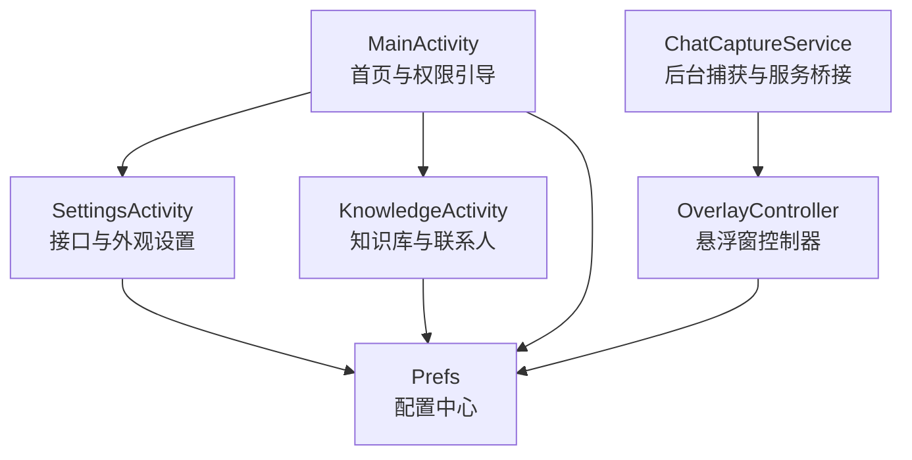
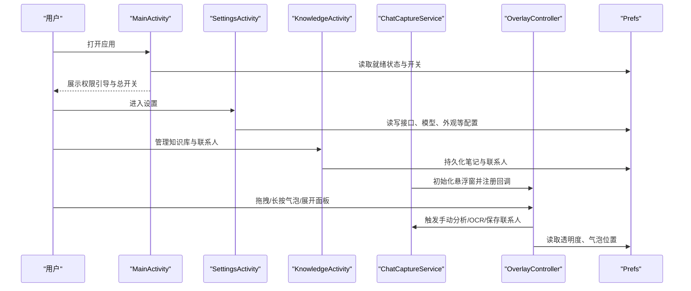
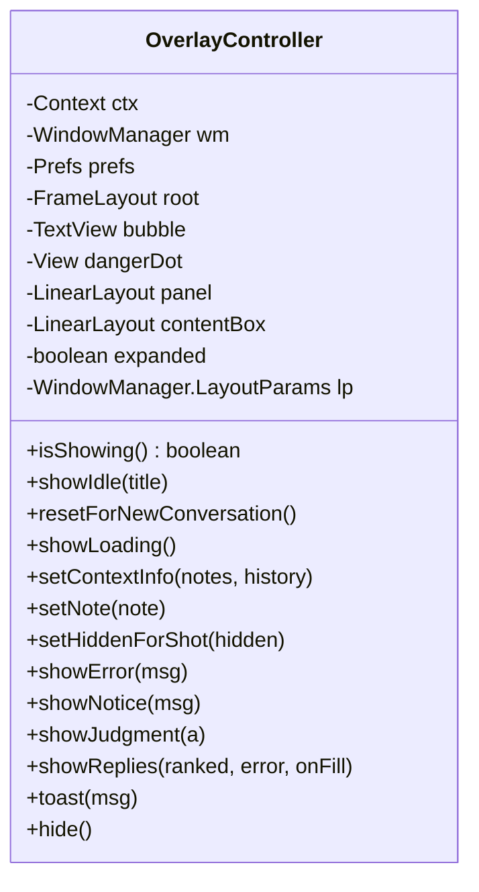
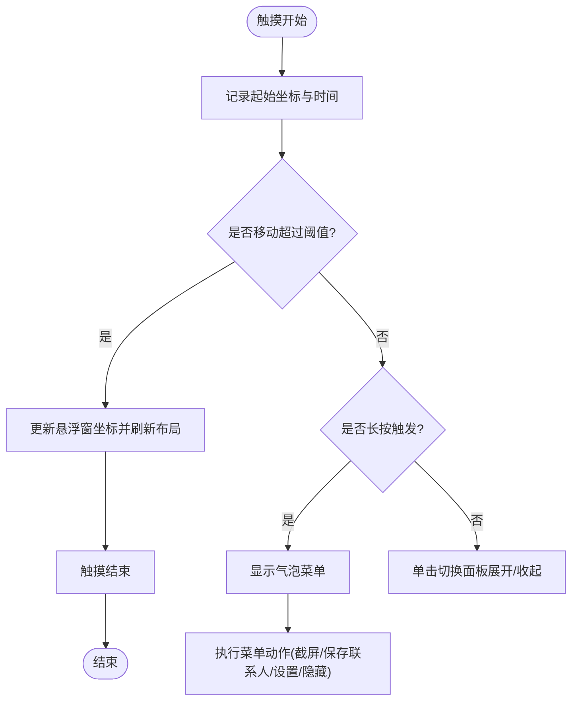
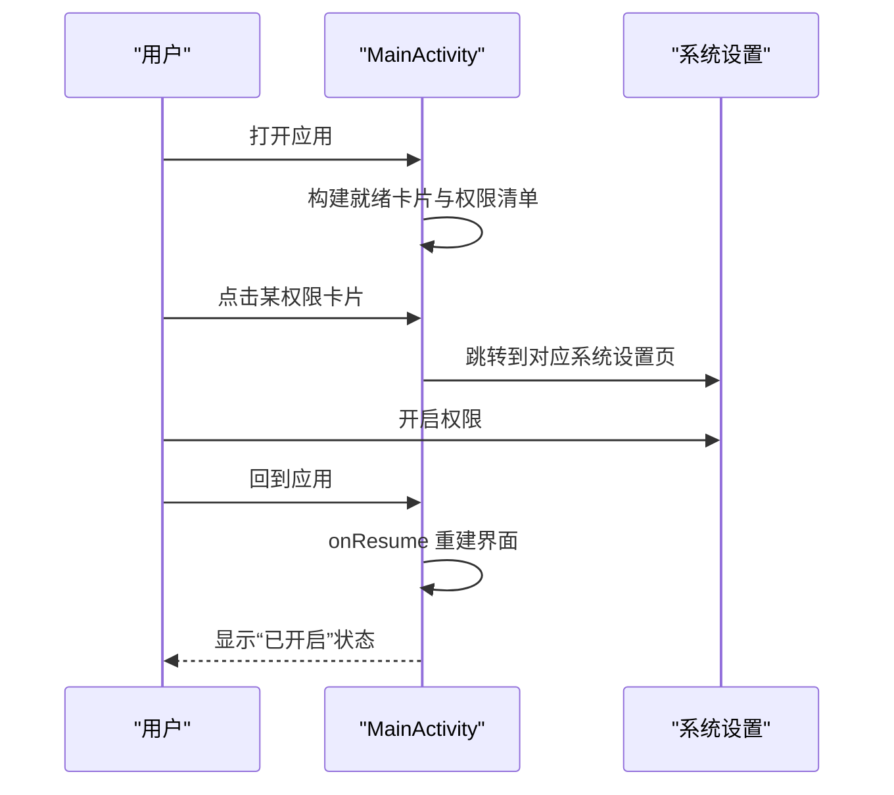
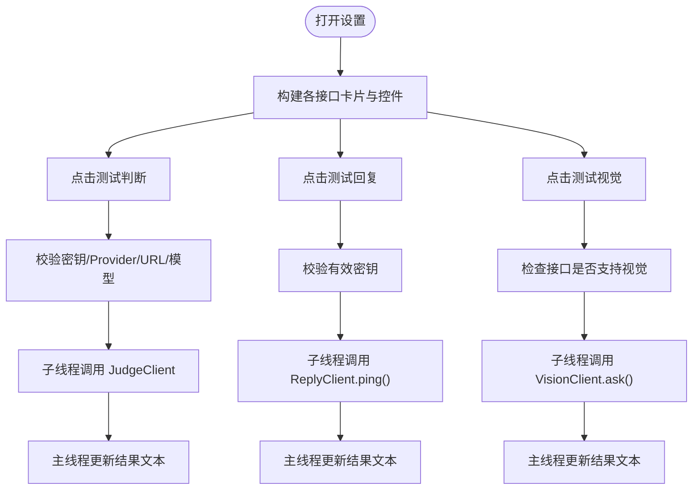
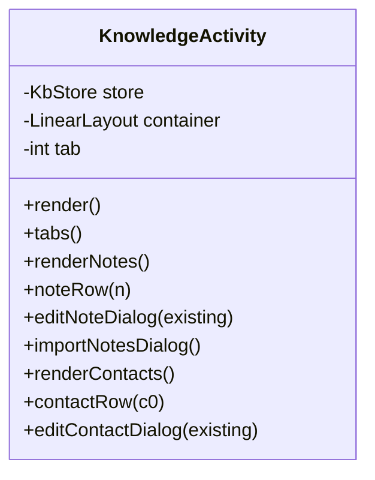
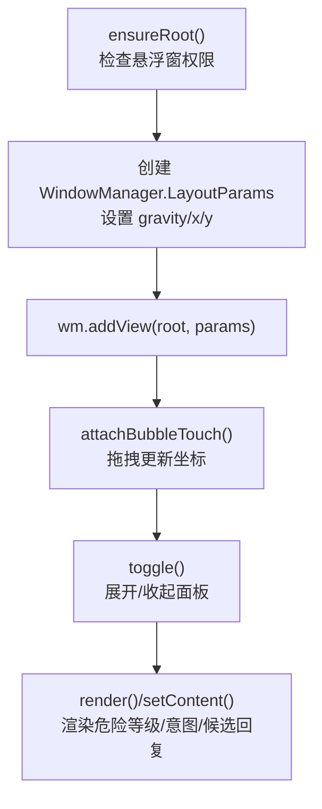
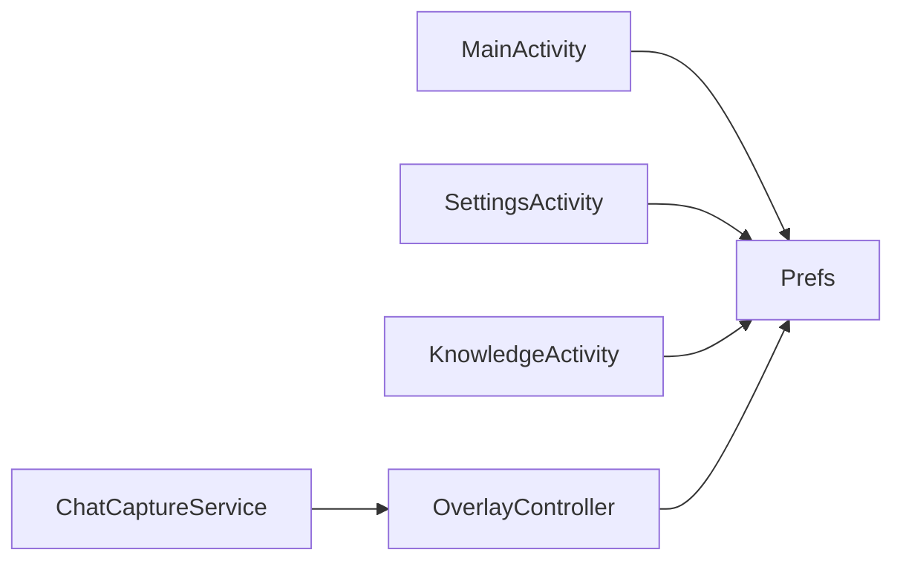

# 用户界面系统

<cite>
**本文引用的文件**   
- [MainActivity.kt](file://app/src/main/java/com/jev/probe/MainActivity.kt)
- [SettingsActivity.kt](file://app/src/main/java/com/jev/probe/SettingsActivity.kt)
- [KnowledgeActivity.kt](file://app/src/main/java/com/jev/probe/KnowledgeActivity.kt)
- [OverlayController.kt](file://app/src/main/java/com/jev/probe/overlay/OverlayController.kt)
- [Prefs.kt](file://app/src/main/java/com/jev/probe/core/Prefs.kt)
- [AndroidManifest.xml](file://app/src/main/AndroidManifest.xml)
- [themes.xml](file://app/src/main/res/values/themes.xml)
- [ChatCaptureService.kt](file://app/src/main/java/com/jev/probe/capture/ChatCaptureService.kt)
</cite>

## 目录
1. [引言](#引言)
2. [项目结构](#项目结构)
3. [核心组件](#核心组件)
4. [架构总览](#架构总览)
5. [详细组件分析](#详细组件分析)
6. [依赖关系分析](#依赖关系分析)
7. [性能与体验考量](#性能与体验考量)
8. [故障排查指南](#故障排查指南)
9. [结论](#结论)
10. [附录：扩展示例](#附录扩展示例)

## 引言
本文件面向“Jev 聊天助手”的用户界面系统，目标是帮助开发者快速理解并扩展以下能力：
- 悬浮窗控制器 OverlayController：窗口管理、手势处理、生命周期协调。
- 主界面 MainActivity：权限引导流程、功能开关管理与状态同步。
- 设置界面 SettingsActivity：配置项管理、实时预览与验证机制。
- 知识管理界面 KnowledgeActivity：列表展示、编辑功能和数据绑定。
- 悬浮窗显示逻辑：位置计算、层级管理、系统兼容性处理。
- UI 主题定制、响应式设计与无障碍访问支持。
- 如何扩展新的界面组件和处理复杂交互场景的代码级示例路径。

## 项目结构
UI 层由三个 Activity 和一个悬浮窗控制器组成，统一通过 Prefs 读写配置，并通过 AndroidManifest 声明入口、服务与权限。

**图表来源**
- [MainActivity.kt:22-106](file://app/src/main/java/com/jev/probe/MainActivity.kt#L22-L106)
- [SettingsActivity.kt:35-448](file://app/src/main/java/com/jev/probe/SettingsActivity.kt#L35-L448)
- [KnowledgeActivity.kt:32-74](file://app/src/main/java/com/jev/probe/KnowledgeActivity.kt#L32-L74)
- [OverlayController.kt:38-122](file://app/src/main/java/com/jev/probe/overlay/OverlayController.kt#L38-L122)
- [Prefs.kt:14-255](file://app/src/main/java/com/jev/probe/core/Prefs.kt#L14-L255)
- [AndroidManifest.xml:17-53](file://app/src/main/AndroidManifest.xml#L17-L53)

**章节来源**
- [AndroidManifest.xml:17-53](file://app/src/main/AndroidManifest.xml#L17-L53)
- [MainActivity.kt:22-106](file://app/src/main/java/com/jev/probe/MainActivity.kt#L22-L106)
- [SettingsActivity.kt:35-448](file://app/src/main/java/com/jev/probe/SettingsActivity.kt#L35-L448)
- [KnowledgeActivity.kt:32-74](file://app/src/main/java/com/jev/probe/KnowledgeActivity.kt#L32-L74)
- [OverlayController.kt:38-122](file://app/src/main/java/com/jev/probe/overlay/OverlayController.kt#L38-L122)
- [Prefs.kt:14-255](file://app/src/main/java/com/jev/probe/core/Prefs.kt#L14-L255)

## 核心组件
- MainActivity：应用启动页，负责权限引导、就绪状态展示、全局开关切换。
- SettingsActivity：集中管理判断接口、回复接口、视觉接口、分析行为、外观与隐私说明，并提供测试按钮。
- KnowledgeActivity：本地知识库（笔记）与联系人管理，提供新建、导入、编辑、删除等交互。
- OverlayController：悬浮窗控制器，负责悬浮气泡与面板的创建、拖拽、展开收起、内容渲染和菜单操作。
- Prefs：应用私有配置存储，封装 API 路由、模型、开关、白名单、透明度、气泡位置等。
- ChatCaptureService：后台服务，桥接悬浮窗回调（手动分析、保存联系人、OCR 截图）。

**章节来源**
- [MainActivity.kt:22-106](file://app/src/main/java/com/jev/probe/MainActivity.kt#L22-L106)
- [SettingsActivity.kt:35-448](file://app/src/main/java/com/jev/probe/SettingsActivity.kt#L35-L448)
- [KnowledgeActivity.kt:32-74](file://app/src/main/java/com/jev/probe/KnowledgeActivity.kt#L32-L74)
- [OverlayController.kt:38-122](file://app/src/main/java/com/jev/probe/overlay/OverlayController.kt#L38-L122)
- [Prefs.kt:14-255](file://app/src/main/java/com/jev/probe/core/Prefs.kt#L14-L255)
- [ChatCaptureService.kt:196-221](file://app/src/main/java/com/jev/probe/capture/ChatCaptureService.kt#L196-L221)

## 架构总览
UI 层采用“页面 + 悬浮窗”的双通道设计：
- 页面负责引导、配置与数据维护。
- 悬浮窗负责在聊天 App 上方提供轻量提示与候选回复。
- 所有配置通过 Prefs 统一管理，保证页面与悬浮窗的状态一致性。
- 后台服务负责将悬浮窗事件回传到业务逻辑（如 OCR、保存联系人）。

**图表来源**
- [MainActivity.kt:43-106](file://app/src/main/java/com/jev/probe/MainActivity.kt#L43-L106)
- [SettingsActivity.kt:52-448](file://app/src/main/java/com/jev/probe/SettingsActivity.kt#L52-L448)
- [KnowledgeActivity.kt:49-74](file://app/src/main/java/com/jev/probe/KnowledgeActivity.kt#L49-L74)
- [ChatCaptureService.kt:196-221](file://app/src/main/java/com/jev/probe/capture/ChatCaptureService.kt#L196-L221)
- [OverlayController.kt:97-122](file://app/src/main/java/com/jev/probe/overlay/OverlayController.kt#L97-L122)
- [Prefs.kt:14-255](file://app/src/main/java/com/jev/probe/core/Prefs.kt#L14-L255)

## 详细组件分析

### OverlayController 悬浮窗控制器
职责与实现要点：
- 窗口管理：使用 WindowManager 创建 TYPE_APPLICATION_OVERLAY 悬浮窗口；根据 Prefs.overlayOpacity 生成半透明白色背景；记录并恢复气泡坐标。
- 手势处理：为气泡注册触摸监听，区分点击、拖拽、长按；长按弹出菜单（截屏识别一次、保存当前会话为联系人、打开设置、隐藏助手、取消）。
- 生命周期协调：showIdle/showLoading/showJudgment/showReplies/showError/showNotice/hide 等方法控制面板内容与可见性；resetForNewConversation 清理旧对话上下文；setHiddenForShot 避免截图时遮挡。
- 位置计算与系统兼容：拖拽时限制 x/y 范围，避开 MIUI 返回手势区域；展开面板时将面板固定在左上角且顶部不超过屏幕一定比例，避免遮挡输入框或键盘。

**图表来源**
- [OverlayController.kt:38-122](file://app/src/main/java/com/jev/probe/overlay/OverlayController.kt#L38-L122)
- [OverlayController.kt:196-286](file://app/src/main/java/com/jev/probe/overlay/OverlayController.kt#L196-L286)
- [OverlayController.kt:288-399](file://app/src/main/java/com/jev/probe/overlay/OverlayController.kt#L288-L399)
- [OverlayController.kt:408-458](file://app/src/main/java/com/jev/probe/overlay/OverlayController.kt#L408-L458)

关键流程（气泡拖拽与菜单）：

**图表来源**
- [OverlayController.kt:198-233](file://app/src/main/java/com/jev/probe/overlay/OverlayController.kt#L198-L233)
- [OverlayController.kt:235-249](file://app/src/main/java/com/jev/probe/overlay/OverlayController.kt#L235-L249)

**章节来源**
- [OverlayController.kt:97-122](file://app/src/main/java/com/jev/probe/overlay/OverlayController.kt#L97-L122)
- [OverlayController.kt:196-286](file://app/src/main/java/com/jev/probe/overlay/OverlayController.kt#L196-L286)
- [OverlayController.kt:288-399](file://app/src/main/java/com/jev/probe/overlay/OverlayController.kt#L288-L399)
- [OverlayController.kt:408-458](file://app/src/main/java/com/jev/probe/overlay/OverlayController.kt#L408-L458)

### MainActivity 主界面
职责与实现要点：
- 权限引导流程：展示就绪卡片，逐项检查无障碍权限、悬浮窗权限、密钥是否已配置；每项提供跳转系统设置的快捷入口。
- 功能开关管理：大按钮作为总开关，切换后重建界面以反映最新状态。
- 状态同步机制：每次 onResume 重建视图，确保权限变化后立即生效；隐私链接与外部浏览器打开失败时降级为 Toast。

**图表来源**
- [MainActivity.kt:43-106](file://app/src/main/java/com/jev/probe/MainActivity.kt#L43-L106)
- [MainActivity.kt:157-171](file://app/src/main/java/com/jev/probe/MainActivity.kt#L157-L171)

**章节来源**
- [MainActivity.kt:43-106](file://app/src/main/java/com/jev/probe/MainActivity.kt#L43-L106)
- [MainActivity.kt:157-171](file://app/src/main/java/com/jev/probe/MainActivity.kt#L157-L171)

### SettingsActivity 设置界面
职责与实现要点：
- 配置项管理：分区块管理判断接口、回复接口、视觉接口、分析行为、外观与隐私说明；每个接口支持多 Provider 预设与自定义 URL。
- 实时预览与验证：提供“测试判断/测试回复/测试视觉”按钮，在子线程执行网络请求，在主线程更新结果文本；使用临时 Prefs 实例进行隔离测试，不污染真实配置。
- 验证机制：对必填字段（如密钥）、Provider 与 Base URL 的一致性校验；对不支持视觉的接口提前拦截并给出友好提示。

**图表来源**
- [SettingsActivity.kt:157-194](file://app/src/main/java/com/jev/probe/SettingsActivity.kt#L157-L194)
- [SettingsActivity.kt:224-249](file://app/src/main/java/com/jev/probe/SettingsActivity.kt#L224-L249)
- [SettingsActivity.kt:277-307](file://app/src/main/java/com/jev/probe/SettingsActivity.kt#L277-L307)
- [SettingsActivity.kt:403-448](file://app/src/main/java/com/jev/probe/SettingsActivity.kt#L403-L448)

**章节来源**
- [SettingsActivity.kt:52-448](file://app/src/main/java/com/jev/probe/SettingsActivity.kt#L52-L448)
- [SettingsActivity.kt:450-516](file://app/src/main/java/com/jev/probe/SettingsActivity.kt#L450-L516)

### KnowledgeActivity 知识管理界面
职责与实现要点：
- 列表展示：分为“笔记”和“联系人”两个标签页；按更新时间倒序展示条目。
- 编辑功能：通过对话框表单编辑标题、正文、标签、常驻开关、启用开关；支持从文本批量导入笔记。
- 数据绑定：直接调用 KbStore 进行增删改查；条目点击编辑、长按删除；联系人条目支持清空历史、删除联系人。

**图表来源**
- [KnowledgeActivity.kt:32-74](file://app/src/main/java/com/jev/probe/KnowledgeActivity.kt#L32-L74)
- [KnowledgeActivity.kt:100-182](file://app/src/main/java/com/jev/probe/KnowledgeActivity.kt#L100-L182)
- [KnowledgeActivity.kt:219-310](file://app/src/main/java/com/jev/probe/KnowledgeActivity.kt#L219-L310)

**章节来源**
- [KnowledgeActivity.kt:49-74](file://app/src/main/java/com/jev/probe/KnowledgeActivity.kt#L49-L74)
- [KnowledgeActivity.kt:100-182](file://app/src/main/java/com/jev/probe/KnowledgeActivity.kt#L100-L182)
- [KnowledgeActivity.kt:219-310](file://app/src/main/java/com/jev/probe/KnowledgeActivity.kt#L219-L310)

### 悬浮窗显示逻辑
- 位置计算：初始位置优先使用 Prefs.bubbleX/bubbleY；拖拽时限制在屏幕范围内，避免被系统手势区域吞掉；展开面板时固定到左上角，顶部不超过屏幕一定比例。
- 层级管理：使用 TYPE_APPLICATION_OVERLAY 与 FLAG_NOT_FOCUSABLE，确保悬浮窗位于最上层且不抢夺焦点；面板背景使用半透明白色，允许聊天内容透出。
- 系统兼容性处理：在 MIUI 等厂商 ROM 上，避免强制贴边导致手势冲突；悬浮窗 addView 失败时记录日志并重置 root。

**图表来源**
- [OverlayController.kt:97-122](file://app/src/main/java/com/jev/probe/overlay/OverlayController.kt#L97-L122)
- [OverlayController.kt:196-286](file://app/src/main/java/com/jev/probe/overlay/OverlayController.kt#L196-L286)
- [OverlayController.kt:408-458](file://app/src/main/java/com/jev/probe/overlay/OverlayController.kt#L408-L458)

**章节来源**
- [OverlayController.kt:97-122](file://app/src/main/java/com/jev/probe/overlay/OverlayController.kt#L97-L122)
- [OverlayController.kt:196-286](file://app/src/main/java/com/jev/probe/overlay/OverlayController.kt#L196-L286)
- [OverlayController.kt:408-458](file://app/src/main/java/com/jev/probe/overlay/OverlayController.kt#L408-L458)

## 依赖关系分析
UI 组件之间的耦合与协作如下：
- MainActivity 与 Prefs：读取 enabled、contextEnabled、hasKey 等状态，驱动就绪卡片与总开关。
- SettingsActivity 与 Prefs：读写 judge/reply/vision 相关配置，以及分析行为与外观选项。
- KnowledgeActivity 与 Prefs：间接通过 KbStore 影响上下文注入（由 Prefs.contextEnabled/contextHistoryCount 控制）。
- OverlayController 与 Prefs：读取 overlayOpacity、bubbleX/bubbleY，控制悬浮窗外观与位置。
- ChatCaptureService 与 OverlayController：注册悬浮窗回调，桥接业务逻辑（手动分析、保存联系人、OCR）。

**图表来源**
- [MainActivity.kt:43-106](file://app/src/main/java/com/jev/probe/MainActivity.kt#L43-L106)
- [SettingsActivity.kt:52-448](file://app/src/main/java/com/jev/probe/SettingsActivity.kt#L52-L448)
- [KnowledgeActivity.kt:49-74](file://app/src/main/java/com/jev/probe/KnowledgeActivity.kt#L49-L74)
- [OverlayController.kt:97-122](file://app/src/main/java/com/jev/probe/overlay/OverlayController.kt#L97-L122)
- [ChatCaptureService.kt:196-221](file://app/src/main/java/com/jev/probe/capture/ChatCaptureService.kt#L196-L221)
- [Prefs.kt:14-255](file://app/src/main/java/com/jev/probe/core/Prefs.kt#L14-L255)

**章节来源**
- [MainActivity.kt:43-106](file://app/src/main/java/com/jev/probe/MainActivity.kt#L43-L106)
- [SettingsActivity.kt:52-448](file://app/src/main/java/com/jev/probe/SettingsActivity.kt#L52-L448)
- [KnowledgeActivity.kt:49-74](file://app/src/main/java/com/jev/probe/KnowledgeActivity.kt#L49-L74)
- [OverlayController.kt:97-122](file://app/src/main/java/com/jev/probe/overlay/OverlayController.kt#L97-L122)
- [ChatCaptureService.kt:196-221](file://app/src/main/java/com/jev/probe/capture/ChatCaptureService.kt#L196-L221)
- [Prefs.kt:14-255](file://app/src/main/java/com/jev/probe/core/Prefs.kt#L14-L255)

## 性能与体验考量
- 悬浮窗渲染：面板高度限制为屏幕高度的 40%，内部使用 ScrollView，避免遮挡输入框或键盘；透明度可调，提升可读性与沉浸感。
- 手势优化：拖拽阈值与边界限制避免误触与系统手势冲突；长按延迟触发菜单，减少误操作。
- 网络测试：设置界面的测试按钮使用单线程执行器，避免阻塞 UI；结果通过主线程 Handler 更新。
- 无障碍支持：应用包含 SelectToSpeakService，并在 MainActivity 中检测其是否启用；悬浮窗不抢占焦点，便于辅助工具工作。

[本节为通用指导，不直接分析具体文件]

## 故障排查指南
常见问题与定位建议：
- 悬浮窗无法显示：检查 SYSTEM_ALERT_WINDOW 权限与 Settings.canDrawOverlays；查看 OverlayController.ensureRoot 中的日志输出。
- 悬浮窗被手势卡住：确认拖拽边界设置未贴边过紧；避免强制 snap-to-edge。
- 设置测试失败：核对 Provider 与 Base URL 匹配关系；检查密钥是否为空；注意某些接口不支持视觉（如 DeepSeek 官方）。
- 权限引导无效：确认 MainActivity 中跳转的系统设置 Intent 是否正确；检查无障碍服务组件名是否匹配。

**章节来源**
- [OverlayController.kt:97-122](file://app/src/main/java/com/jev/probe/overlay/OverlayController.kt#L97-L122)
- [SettingsActivity.kt:277-307](file://app/src/main/java/com/jev/probe/SettingsActivity.kt#L277-L307)
- [MainActivity.kt:70-91](file://app/src/main/java/com/jev/probe/MainActivity.kt#L70-L91)

## 结论
该 UI 系统通过清晰的页面分工与悬浮窗控制器，实现了“引导—配置—数据—悬浮提示”的完整闭环。Prefs 作为单一配置源，保证了各组件状态一致；OverlayController 提供了稳定、可拖拽、可定制的悬浮体验；SettingsActivity 与 KnowledgeActivity 分别承担配置与数据管理职责。整体架构简洁、可扩展性强，适合继续扩展更多界面组件与复杂交互场景。

[本节为总结性内容，不直接分析具体文件]

## 附录：扩展示例
以下为扩展新界面组件与复杂交互场景的代码级示例路径（不包含具体代码内容）：
- 新增一个带实时预览的配置项：参考 SettingsActivity 中 pills 与 toggleRow 的实现，结合 draftPrefs 与 worker 线程执行网络测试。
  - 参考路径：[SettingsActivity.kt:547-583](file://app/src/main/java/com/jev/probe/SettingsActivity.kt#L547-L583)、[SettingsActivity.kt:585-608](file://app/src/main/java/com/jev/probe/SettingsActivity.kt#L585-L608)、[SettingsActivity.kt:506-516](file://app/src/main/java/com/jev/probe/SettingsActivity.kt#L506-L516)
- 在悬浮窗中添加新的菜单项：参考 showBubbleMenu 与 menuItem 的实现，注册回调并关闭菜单。
  - 参考路径：[OverlayController.kt:235-249](file://app/src/main/java/com/jev/probe/overlay/OverlayController.kt#L235-L249)、[OverlayController.kt:251-254](file://app/src/main/java/com/jev/probe/overlay/OverlayController.kt#L251-L254)
- 扩展 KnowledgeActivity 的导入格式：参考 importNotesDialog 中的正则分段与 Note 构造。
  - 参考路径：[KnowledgeActivity.kt:184-214](file://app/src/main/java/com/jev/probe/KnowledgeActivity.kt#L184-L214)
- 调整悬浮窗透明度与位置：参考 panelBg 与 ensureRoot/toggle 的位置计算。
  - 参考路径：[OverlayController.kt:83-87](file://app/src/main/java/com/jev/probe/overlay/OverlayController.kt#L83-L87)、[OverlayController.kt:97-122](file://app/src/main/java/com/jev/probe/overlay/OverlayController.kt#L97-L122)、[OverlayController.kt:267-284](file://app/src/main/java/com/jev/probe/overlay/OverlayController.kt#L267-L284)

[本节为概念性指导，不直接分析具体文件]