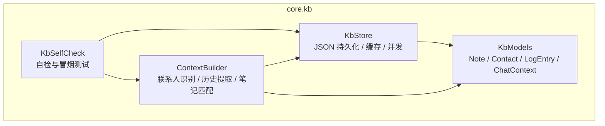
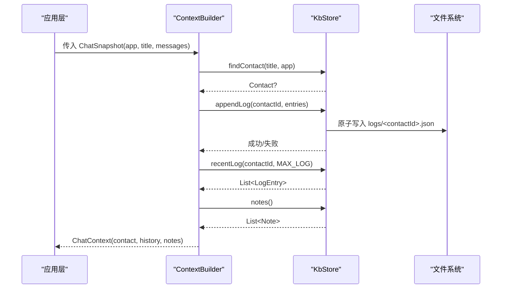
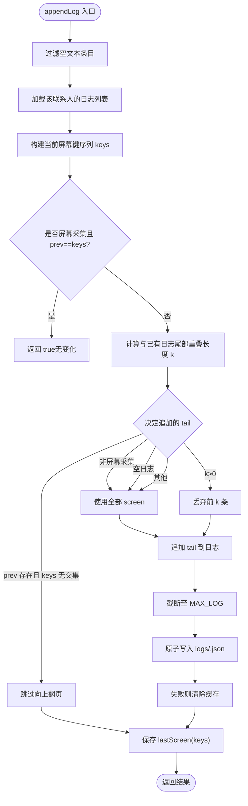
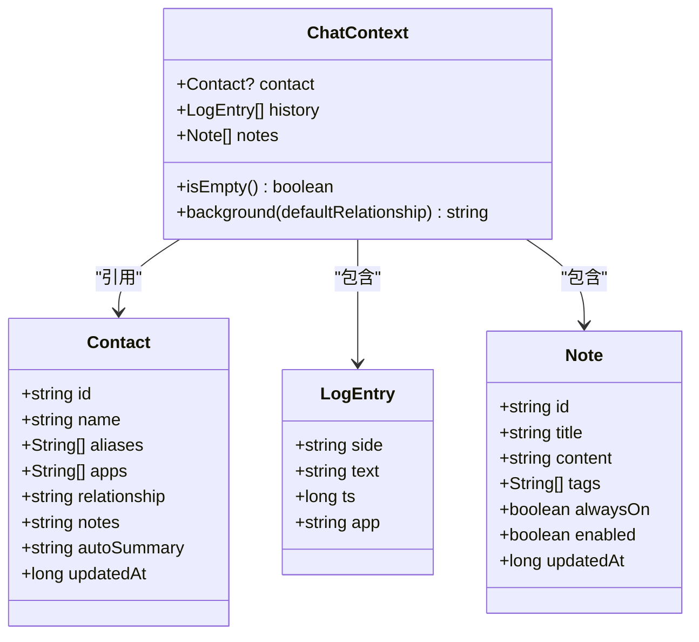
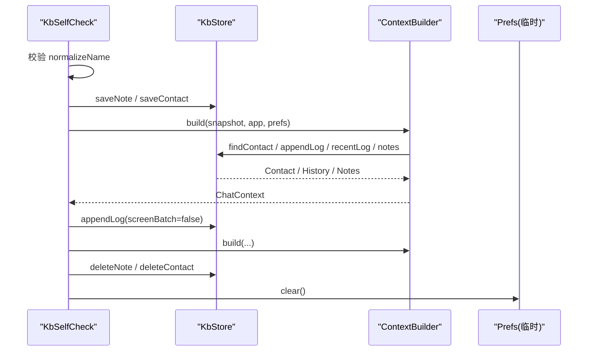
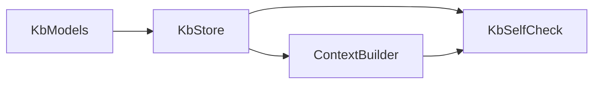

# 知识库管理系统

<cite>
**本文引用的文件**   
- [KbStore.kt](file://app/src/main/java/com/jev/probe/core/kb/KbStore.kt)
- [KbModels.kt](file://app/src/main/java/com/jev/probe/core/kb/KbModels.kt)
- [KbSelfCheck.kt](file://app/src/main/java/com/jev/probe/core/kb/KbSelfCheck.kt)
- [ContextBuilder.kt](file://app/src/main/java/com/jev/probe/core/kb/ContextBuilder.kt)
</cite>

## 目录
1. [引言](#引言)
2. [项目结构](#项目结构)
3. [核心组件](#核心组件)
4. [架构总览](#架构总览)
5. [详细组件分析](#详细组件分析)
6. [依赖关系分析](#依赖关系分析)
7. [性能与容量特性](#性能与容量特性)
8. [故障排查指南](#故障排查指南)
9. [结论](#结论)
10. [附录：扩展与最佳实践](#附录扩展与最佳实践)

## 引言
本技术文档围绕知识库管理系统的核心实现展开，重点覆盖以下方面：
- 存储层 KbStore：JSON 文件持久化、原子写入、内存缓存、并发锁、日志去重与滚动。
- 数据模型 KbModels：Note 笔记、Contact 联系人、LogEntry 聊天行、ChatContext 上下文聚合。
- 自检机制 KbSelfCheck：名称归一化、联系人匹配、笔记命中、历史去重与预算注入的端到端验证。
- 上下文构建 ContextBuilder：联系人识别、历史提取、笔记匹配、字符预算裁剪。
- 使用示例与扩展建议：如何新增数据类型、维护复杂关系映射、进行备份恢复与安全加固。

## 项目结构
知识库相关代码位于 Android 应用的 core.kb 包中，包含四个关键文件：
- KbStore.kt：统一的数据访问与持久化入口，负责 JSON 读写、缓存、并发控制与日志去重。
- KbModels.kt：领域数据模型定义，包括 Note、Contact、LogEntry、ChatContext。
- ContextBuilder.kt：从当前屏幕快照构建分析所需的“背景信息”，包括联系人、历史与笔记。
- KbSelfCheck.kt：对知识库路径的冒烟测试，确保关键流程在设备上可运行。

图表来源
- [KbStore.kt:1-540](file://app/src/main/java/com/jev/probe/core/kb/KbStore.kt#L1-L540)
- [KbModels.kt:1-86](file://app/src/main/java/com/jev/probe/core/kb/KbModels.kt#L1-L86)
- [ContextBuilder.kt:1-124](file://app/src/main/java/com/jev/probe/core/kb/ContextBuilder.kt#L1-L124)
- [KbSelfCheck.kt:1-134](file://app/src/main/java/com/jev/probe/core/kb/KbSelfCheck.kt#L1-L134)

章节来源
- [KbStore.kt:1-540](file://app/src/main/java/com/jev/probe/core/kb/KbStore.kt#L1-L540)
- [KbModels.kt:1-86](file://app/src/main/java/com/jev/probe/core/kb/KbModels.kt#L1-L86)
- [ContextBuilder.kt:1-124](file://app/src/main/java/com/jev/probe/core/kb/ContextBuilder.kt#L1-L124)
- [KbSelfCheck.kt:1-134](file://app/src/main/java/com/jev/probe/core/kb/KbSelfCheck.kt#L1-L134)

## 核心组件
- KbStore：提供 notes、contacts、logs 三类数据的增删改查；通过单写锁保证并发安全；采用临时文件 + rename 的原子写入策略；维护内存缓存减少磁盘 IO；按 contactId 分文件记录聊天历史并限制最大行数。
- KbModels：定义领域实体与上下文聚合对象，用于 UI 展示与 LLM 提示词注入。
- ContextBuilder：根据当前会话标题与消息窗口，匹配联系人、注入历史与笔记，并按字符预算裁剪。
- KbSelfCheck：构造临时数据，验证名称归一化、联系人别名匹配、笔记标签命中、历史去重与预算注入等关键路径。

章节来源
- [KbStore.kt:24-538](file://app/src/main/java/com/jev/probe/core/kb/KbStore.kt#L24-L538)
- [KbModels.kt:11-85](file://app/src/main/java/com/jev/probe/core/kb/KbModels.kt#L11-L85)
- [ContextBuilder.kt:16-123](file://app/src/main/java/com/jev/probe/core/kb/ContextBuilder.kt#L16-L123)
- [KbSelfCheck.kt:19-133](file://app/src/main/java/com/jev/probe/core/kb/KbSelfCheck.kt#L19-L133)

## 架构总览
知识库系统以“轻量 JSON 文件 + 内存缓存”为核心，避免引入数据库或网络依赖。整体流程如下：
- 上层（如聊天捕获）将屏幕快照交给 ContextBuilder。
- ContextBuilder 调用 KbStore 查找联系人、读取历史、匹配笔记。
- KbStore 通过 JSON 文件持久化数据，并使用锁和原子写入保证一致性。
- 自检模块定期验证关键路径，保障系统在设备上的稳定性。

图表来源
- [ContextBuilder.kt:35-63](file://app/src/main/java/com/jev/probe/core/kb/ContextBuilder.kt#L35-L63)
- [KbStore.kt:172-231](file://app/src/main/java/com/jev/probe/core/kb/KbStore.kt#L172-L231)
- [KbStore.kt:294-356](file://app/src/main/java/com/jev/probe/core/kb/KbStore.kt#L294-L356)

## 详细组件分析

### 存储层 KbStore：JSON 持久化、版本与并发
- 文件布局
  - kb/notes.json：所有笔记
  - kb/contacts.json：所有联系人
  - kb/logs/<contactId>.json：每个联系人的聊天历史（最多固定行数）
  - kb/logs/<contactId>.screen.json：上次写入的屏幕键序列，用于去重
- 并发控制
  - 全局单写锁 synchronized(lock)，所有读/写均进入同一临界区，避免竞态条件。
- 原子写入
  - 先写 .tmp 文件，再 rename 到目标文件；若 rename 失败则回退为原地写入，但标记非原子。
- 损坏处理
  - 解析失败时尝试将原文件移动到带时间戳的 .corrupt.* 备份；若移动失败则记录不可读集合，拒绝后续覆盖。
- 内存缓存
  - notesCache、contactsCache、logCache、lastScreenCache；仅在可信加载后更新，防止脏缓存。
- 日志去重与滚动
  - appendLog 支持 screenBatch=true（屏幕采集）与 false（手动注入）。
  - 比较上次屏幕键序列，跳过重复屏；计算尾部重叠长度 k，仅追加新尾；超过最大行数时丢弃最旧项。
- 工具方法
  - normalizeName/displayName/normalizeText：清理零宽字符、去除末尾成员数括号、大小写规范化。
  - newId：生成短 UUID。

图表来源
- [KbStore.kt:172-220](file://app/src/main/java/com/jev/probe/core/kb/KbStore.kt#L172-L220)
- [KbStore.kt:248-267](file://app/src/main/java/com/jev/probe/core/kb/KbStore.kt#L248-L267)
- [KbStore.kt:438-459](file://app/src/main/java/com/jev/probe/core/kb/KbStore.kt#L438-L459)

章节来源
- [KbStore.kt:24-538](file://app/src/main/java/com/jev/probe/core/kb/KbStore.kt#L24-L538)

### 数据模型 KbModels：实体与关系映射
- Note（笔记）
  - 字段：id、title、content、tags、alwaysOn、enabled、updatedAt
  - 用途：用户手工维护的知识片段，可按标签与标题匹配注入。
- Contact（联系人）
  - 字段：id、name、aliases、apps、relationship、notes、autoSummary、updatedAt
  - 用途：跨应用识别同一个人；aliases 支持不同聊天标题的别名；apps 记录出现的应用包名。
- LogEntry（聊天行）
  - 字段：side（me/other）、text、ts、app
  - 用途：记录最近对话，供分析注入。
- ChatContext（上下文聚合）
  - 字段：contact、history、notes
  - 方法：isEmpty、background(defaultRelationship)
  - 用途：将联系人信息与匹配到的笔记拼接成提示词背景字符串。

图表来源
- [KbModels.kt:11-85](file://app/src/main/java/com/jev/probe/core/kb/KbModels.kt#L11-L85)

章节来源
- [KbModels.kt:11-85](file://app/src/main/java/com/jev/probe/core/kb/KbModels.kt#L11-L85)

### 自检机制 KbSelfCheck：完整性验证与修复策略
- 名称归一化验证：确保半角/全角括号与成员数被正确剥离。
- 联系人匹配：通过别名与成员数剥离匹配到 Contact。
- 笔记命中：通过标签与标题匹配到 Note。
- 历史去重：当屏消息不应出现在注入历史中；历史落盘条数应等于截图消息数。
- 旧消息注入：手动注入一条旧消息，再次读取应只包含该旧消息。
- 预算注入：background 应包含笔记正文与联系人关系。
- 开关控制：contextEnabled=false 时不应注入历史。
- 清理：自检结束后删除临时 Note 与 Contact，并清空临时 Prefs。

图表来源
- [KbSelfCheck.kt:29-126](file://app/src/main/java/com/jev/probe/core/kb/KbSelfCheck.kt#L29-L126)
- [ContextBuilder.kt:35-63](file://app/src/main/java/com/jev/probe/core/kb/ContextBuilder.kt#L35-L63)
- [KbStore.kt:172-231](file://app/src/main/java/com/jev/probe/core/kb/KbStore.kt#L172-L231)

章节来源
- [KbSelfCheck.kt:29-126](file://app/src/main/java/com/jev/probe/core/kb/KbSelfCheck.kt#L29-L126)

### 联系人管理：自动提取、手动编辑、标签分类与搜索过滤
- 自动提取
  - 通过 ContextBuilder.findContact 基于会话标题与 app 包名匹配联系人；不会自动创建联系人，仅合并已知别名与应用来源。
- 手动编辑
  - 通过 saveContact/saveNote 直接更新联系人或笔记；deleteContact/deleteNote 删除对应数据。
- 标签分类
  - Note.tags 作为关键词集合，参与 matchNotes 子串匹配。
- 搜索过滤
  - 可通过 store.notes()/store.contacts() 获取列表并在上层实现过滤逻辑；KbStore 本身不暴露高级查询 API。

章节来源
- [ContextBuilder.kt:35-63](file://app/src/main/java/com/jev/probe/core/kb/ContextBuilder.kt#L35-L63)
- [KbStore.kt:44-96](file://app/src/main/java/com/jev/probe/core/kb/KbStore.kt#L44-L96)
- [KbStore.kt:106-145](file://app/src/main/java/com/jev/probe/core/kb/KbStore.kt#L106-L145)

### 笔记系统：富文本支持与批量操作
- 富文本支持
  - Note.content 为纯文本字段；如需富文本，可在上层渲染器中解析 HTML/Markdown 等格式，但存储仍为纯文本。
- 标签关联
  - Note.tags 与对话标题及最近若干消息进行子串匹配，命中后注入到 ChatContext.notes。
- 批量操作
  - 可通过遍历 store.notes()/store.contacts() 进行批量更新或删除；注意每次写都会触发原子写入。

章节来源
- [KbModels.kt:11-21](file://app/src/main/java/com/jev/probe/core/kb/KbModels.kt#L11-L21)
- [ContextBuilder.kt:98-116](file://app/src/main/java/com/jev/probe/core/kb/ContextBuilder.kt#L98-L116)
- [KbStore.kt:44-65](file://app/src/main/java/com/jev/probe/core/kb/KbStore.kt#L44-L65)

### 数据备份恢复机制
- 备份
  - 损坏文件会被移动到 .corrupt.<timestamp> 备份，避免下次写入覆盖原始数据。
- 恢复
  - 可将 .corrupt.* 文件复制回原文件名，重启应用后由 readJsonArray 重新解析；若仍损坏，需人工修复 JSON 结构。
- 清空
  - clearAll 会递归删除 kb 目录，但不影响其他 SharedPreferences 或密钥。

章节来源
- [KbStore.kt:412-428](file://app/src/main/java/com/jev/probe/core/kb/KbStore.kt#L412-L428)
- [KbStore.kt:282-290](file://app/src/main/java/com/jev/probe/core/kb/KbStore.kt#L282-L290)

### 性能优化策略
- 内存缓存
  - notesCache、contactsCache、logCache、lastScreenCache 减少频繁磁盘读取。
- 原子写入
  - 临时文件 + rename 降低崩溃导致的不完整 JSON 风险。
- 日志去重
  - 基于 lastScreen 键序列与尾部重叠匹配，避免重复写入。
- 预算裁剪
  - ChatContext.background 与注入历史共享字符预算 BUDGET_CHARS，优先保留较新的历史与笔记。

章节来源
- [KbStore.kt:35-40](file://app/src/main/java/com/jev/probe/core/kb/KbStore.kt#L35-L40)
- [KbStore.kt:438-459](file://app/src/main/java/com/jev/probe/core/kb/KbStore.kt#L438-L459)
- [KbStore.kt:172-220](file://app/src/main/java/com/jev/probe/core/kb/KbStore.kt#L172-L220)
- [ContextBuilder.kt:51-62](file://app/src/main/java/com/jev/probe/core/kb/ContextBuilder.kt#L51-L62)

### 数据安全保护措施
- 私有目录
  - 所有数据位于 filesDir/kb，应用私有，不会被其他应用访问。
- 日志脱敏
  - 聊天文本不输出到 logcat，仅记录计数与长度。
- 正则安全编译
  - safeRegex 包裹模式编译，避免因 ICU 引擎差异导致类初始化异常。

章节来源
- [KbStore.kt:12-23](file://app/src/main/java/com/jev/probe/core/kb/KbStore.kt#L12-L23)
- [KbStore.kt:494-514](file://app/src/main/java/com/jev/probe/core/kb/KbStore.kt#L494-L514)

## 依赖关系分析
- ContextBuilder 依赖 KbStore 与 KbModels，负责组装 ChatContext。
- KbSelfCheck 依赖 KbStore 与 ContextBuilder，模拟真实场景进行冒烟测试。
- KbStore 依赖 org.json 与 java.io.File，不依赖 Gson/Moshi。

图表来源
- [KbStore.kt:1-540](file://app/src/main/java/com/jev/probe/core/kb/KbStore.kt#L1-L540)
- [ContextBuilder.kt:1-124](file://app/src/main/java/com/jev/probe/core/kb/ContextBuilder.kt#L1-L124)
- [KbSelfCheck.kt:1-134](file://app/src/main/java/com/jev/probe/core/kb/KbSelfCheck.kt#L1-L134)

章节来源
- [KbStore.kt:1-540](file://app/src/main/java/com/jev/probe/core/kb/KbStore.kt#L1-L540)
- [ContextBuilder.kt:1-124](file://app/src/main/java/com/jev/probe/core/kb/ContextBuilder.kt#L1-L124)
- [KbSelfCheck.kt:1-134](file://app/src/main/java/com/jev/probe/core/kb/KbSelfCheck.kt#L1-L134)

## 性能与容量特性
- 日志上限
  - 每个联系人的日志文件最多保留固定行数（MAX_LOG），超出则丢弃最旧项。
- 历史预算
  - 注入的历史与笔记共享字符预算（BUDGET_CHARS），优先保留较新的历史，再裁剪笔记。
- 去重阈值
  - 当屏消息长度小于 DEDUPE_MIN_LEN 不参与去重判断，避免误判。
- 匹配窗口
  - 笔记匹配仅检查最近 MATCH_WINDOW 条消息，降低扫描成本。

章节来源
- [KbStore.kt:473-475](file://app/src/main/java/com/jev/probe/core/kb/KbStore.kt#L473-L475)
- [ContextBuilder.kt:18-28](file://app/src/main/java/com/jev/probe/core/kb/ContextBuilder.kt#L18-L28)
- [ContextBuilder.kt:98-116](file://app/src/main/java/com/jev/probe/core/kb/ContextBuilder.kt#L98-L116)

## 故障排查指南
- 常见问题
  - 名称归一化失败：检查半角/全角括号与成员数剥离是否正确。
  - 联系人未命中：确认别名与 app 包名设置是否一致。
  - 笔记未命中：检查 tags 与标题/最近消息是否包含关键词。
  - 历史重复写入：检查 screenBatch 参数与 lastScreen 键序列是否一致。
  - 损坏文件：查看 .corrupt.* 备份，修复 JSON 后恢复原文件名。
- 定位步骤
  - 运行 KbSelfCheck 自检，观察失败项。
  - 检查 kb 目录下各 JSON 文件结构与内容。
  - 查看日志中的 WARN/ERROR 信息，关注 unreadable 与 write failed。

章节来源
- [KbSelfCheck.kt:29-126](file://app/src/main/java/com/jev/probe/core/kb/KbSelfCheck.kt#L29-L126)
- [KbStore.kt:412-459](file://app/src/main/java/com/jev/probe/core/kb/KbStore.kt#L412-L459)

## 结论
知识库管理系统以简洁可靠的 JSON 文件存储为基础，结合内存缓存与原子写入，提供了稳定的数据持久化能力。通过 ContextBuilder 的轻量匹配与预算裁剪，系统在资源受限环境下仍能高效地为分析提供上下文。KbSelfCheck 确保了关键路径的正确性，便于在设备上快速发现与修复问题。

## 附录：扩展与最佳实践
- 新增数据类型
  - 在 KbModels.kt 中定义新数据类，并在 KbStore.kt 中添加对应的 JSON 序列化/反序列化方法与缓存。
  - 在 ContextBuilder.kt 中增加匹配逻辑与预算裁剪规则。
- 复杂关系映射
  - 使用 Contact.apps 与 aliases 建立跨应用的关系映射；必要时可扩展多对多关系表（以 JSON 数组形式存储）。
- 备份恢复
  - 定期导出 kb 目录；若发生损坏，优先恢复 .corrupt.* 备份文件。
- 安全加固
  - 避免将敏感信息写入日志；对用户输入进行清洗与校验；谨慎处理外部输入的 JSON。

章节来源
- [KbModels.kt:11-85](file://app/src/main/java/com/jev/probe/core/kb/KbModels.kt#L11-L85)
- [KbStore.kt:294-399](file://app/src/main/java/com/jev/probe/core/kb/KbStore.kt#L294-L399)
- [ContextBuilder.kt:98-116](file://app/src/main/java/com/jev/probe/core/kb/ContextBuilder.kt#L98-L116)