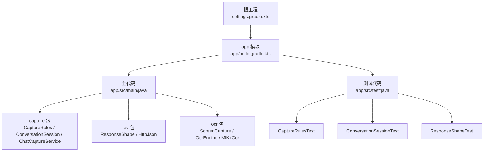
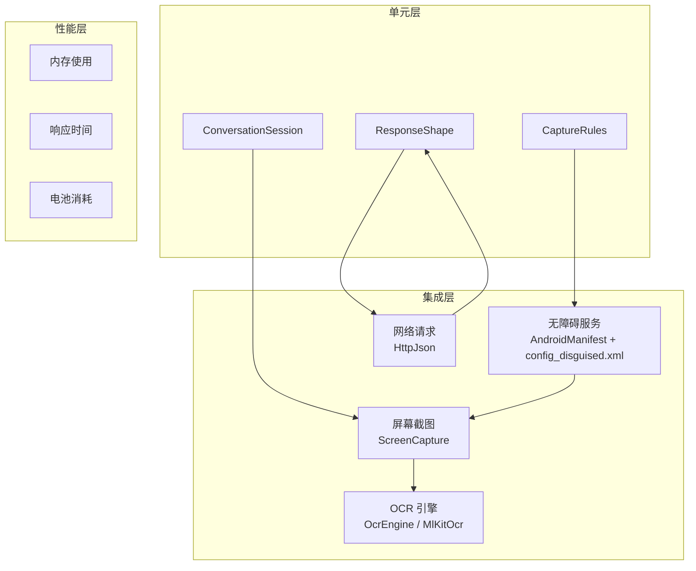
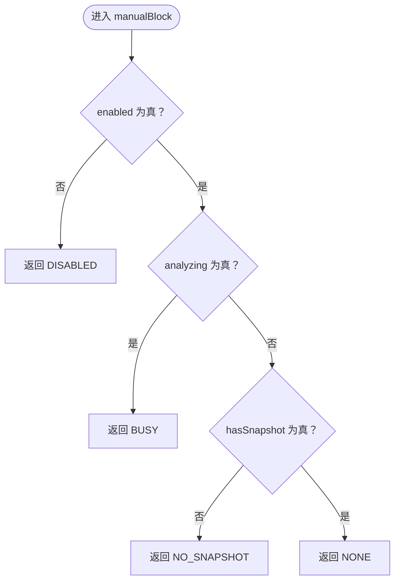
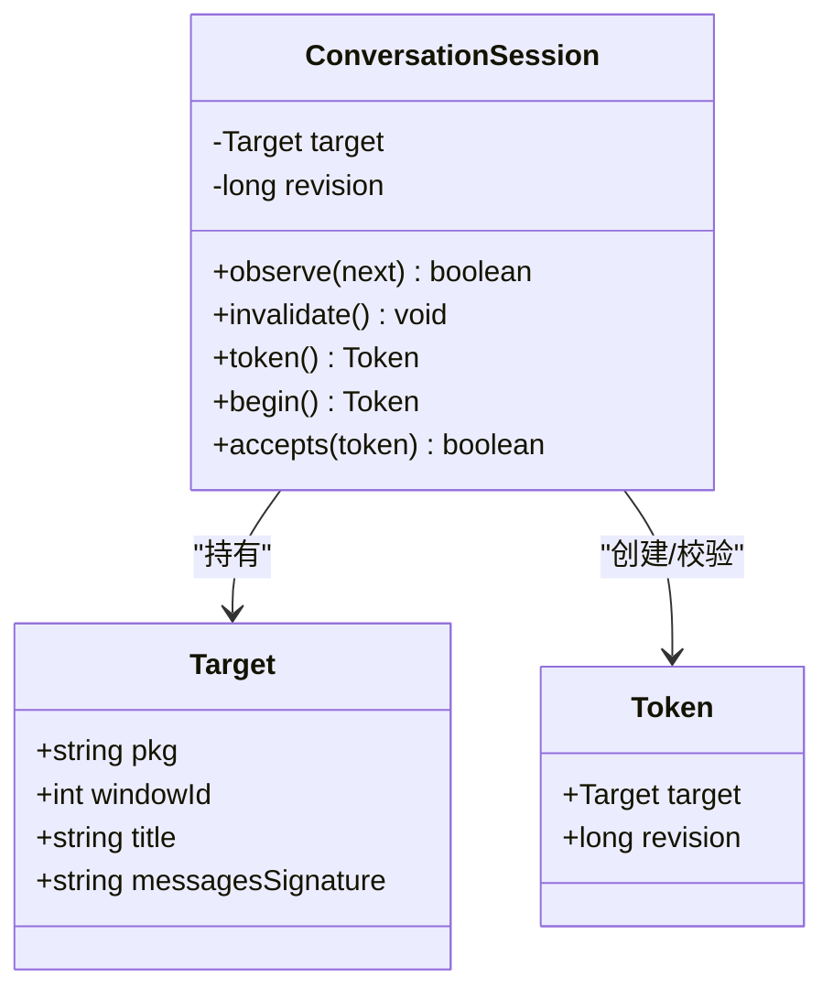
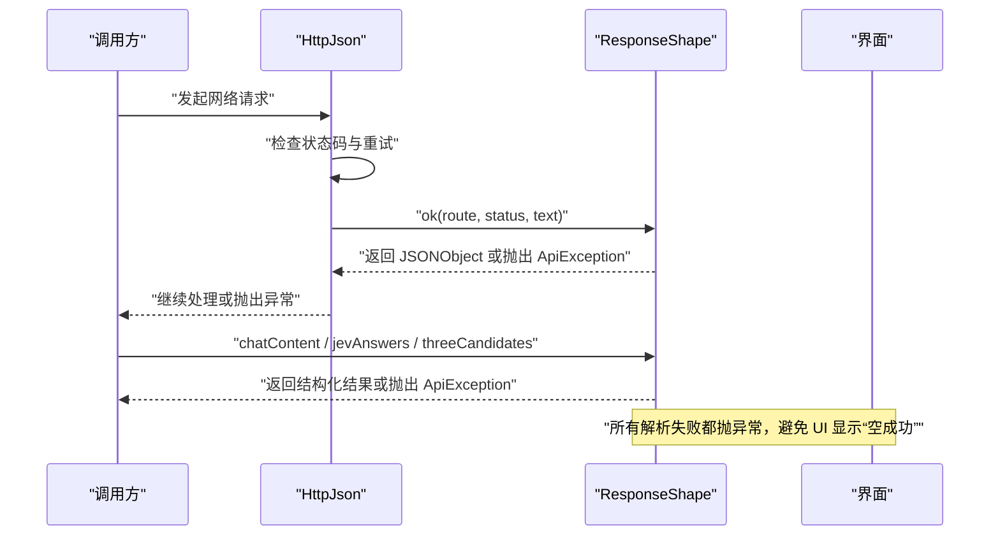
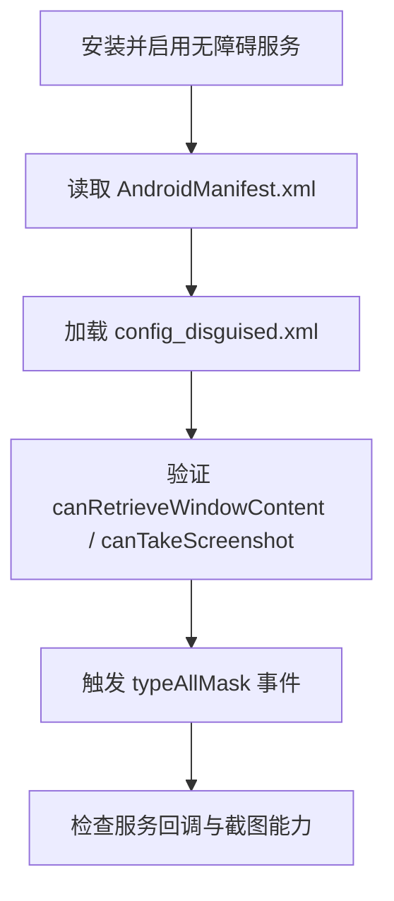
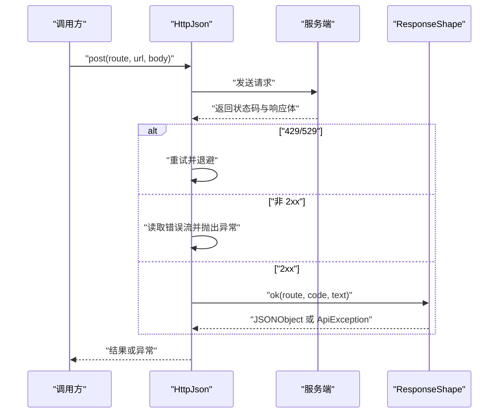
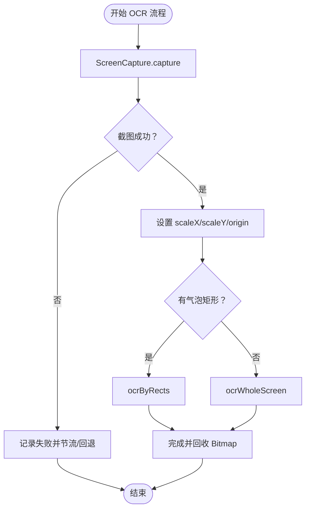
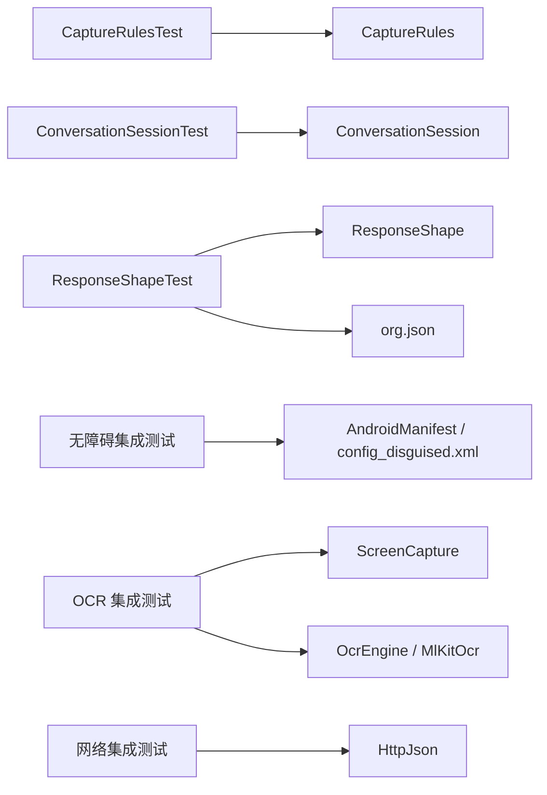

# 测试指南

<cite>
**本文引用的文件**   
- [app/build.gradle.kts](file://app/build.gradle.kts)
- [build.gradle.kts](file://build.gradle.kts)
- [settings.gradle.kts](file://settings.gradle.kts)
- [CaptureRulesTest.kt](file://app/src/test/java/com/jev/probe/capture/CaptureRulesTest.kt)
- [ConversationSessionTest.kt](file://app/src/test/java/com/jev/probe/capture/ConversationSessionTest.kt)
- [ResponseShapeTest.kt](file://app/src/test/java/com/jev/probe/jev/ResponseShapeTest.kt)
- [CaptureRules.kt](file://app/src/main/java/com/jev/probe/capture/CaptureRules.kt)
- [ConversationSession.kt](file://app/src/main/java/com/jev/probe/capture/ConversationSession.kt)
- [ResponseShape.kt](file://app/src/main/java/com/jev/probe/jev/ResponseShape.kt)
- [HttpJson.kt](file://app/src/main/java/com/jev/probe/jev/HttpJson.kt)
- [ScreenCapture.kt](file://app/src/main/java/com/jev/probe/capture/ocr/ScreenCapture.kt)
- [OcrEngine.kt](file://app/src/main/java/com/jev/probe/capture/ocr/OcrEngine.kt)
- [MlKitOcr.kt](file://app/src/main/java/com/jev/probe/capture/ocr/MlKitOcr.kt)
- [ChatCaptureService.kt](file://app/src/main/java/com/jev/probe/capture/ChatCaptureService.kt)
- [AndroidManifest.xml](file://app/src/main/AndroidManifest.xml)
- [config_disguised.xml](file://app/src/main/res/xml/config_disguised.xml)
</cite>

## 目录
1. [简介](#简介)
2. [项目结构](#项目结构)
3. [核心组件](#核心组件)
4. [架构总览](#架构总览)
5. [详细组件分析](#详细组件分析)
6. [依赖关系分析](#依赖关系分析)
7. [性能考虑](#性能考虑)
8. [故障排查指南](#故障排查指南)
9. [结论](#结论)
10. [附录](#附录)

## 简介
本测试指南面向 Jev 聊天助手 Android 项目的开发与质量保障人员，目标是：
- 明确单元测试框架与配置；
- 规范测试用例编写方式，覆盖 CaptureRules、ConversationSession、ResponseShape 等关键类；
- 说明测试数据准备与模拟策略；
- 给出无障碍服务、网络请求、OCR 功能的集成测试方案；
- 定义性能测试方法（内存、响应时间、电池消耗）；
- 提出覆盖率要求、持续集成与自动化流程建议。

## 项目结构
当前仓库采用单模块 Android 应用结构，测试代码位于 `app/src/test`，主业务代码位于 `app/src/main`。构建脚本集中在 Gradle Kotlin DSL 中，测试依赖通过 `testImplementation` 引入。

**图表来源**
- [settings.gradle.kts:1-18](file://settings.gradle.kts#L1-L18)
- [app/build.gradle.kts:1-86](file://app/build.gradle.kts#L1-L86)

**章节来源**
- [settings.gradle.kts:1-18](file://settings.gradle.kts#L1-L18)
- [app/build.gradle.kts:1-86](file://app/build.gradle.kts#L1-L86)

## 核心组件
本节聚焦三个已存在单元测试对应的核心实现，帮助理解被测逻辑与测试断言目标。

- CaptureRules：纯函数式规则，决定前台是否排除、手动分析为何被阻断、资源 id 清单如何生成。
- ConversationSession：会话状态机，维护当前对话目标、版本号与 Token，用于校验截图回调与网络回调是否仍属于同一轮请求。
- ResponseShape：统一解析三类接口返回体，将“HTTP 成功但业务失败”“字段缺失”“空内容”等错误转为明确的异常，避免 UI 误报成功。

**章节来源**
- [CaptureRules.kt:1-69](file://app/src/main/java/com/jev/probe/capture/CaptureRules.kt#L1-L69)
- [ConversationSession.kt:1-36](file://app/src/main/java/com/jev/probe/capture/ConversationSession.kt#L1-L36)
- [ResponseShape.kt:1-141](file://app/src/main/java/com/jev/probe/jev/ResponseShape.kt#L1-L141)

## 架构总览
Jev 的测试范围可划分为三层：
- 单元层：纯逻辑与数据契约，如 CaptureRules、ConversationSession、ResponseShape；
- 集成层：涉及系统能力与外部依赖，如无障碍服务、屏幕截图、OCR、网络请求；
- 性能层：内存、响应时间、电池消耗等运行时指标。

**图表来源**
- [AndroidManifest.xml:30-56](file://app/src/main/AndroidManifest.xml#L30-L56)
- [config_disguised.xml:1-9](file://app/src/main/res/xml/config_disguised.xml#L1-L9)
- [ScreenCapture.kt:1-39](file://app/src/main/java/com/jev/probe/capture/ocr/ScreenCapture.kt#L1-L39)
- [OcrEngine.kt:1-22](file://app/src/main/java/com/jev/probe/capture/ocr/OcrEngine.kt#L1-L22)
- [MlKitOcr.kt:1-113](file://app/src/main/java/com/jev/probe/capture/ocr/MlKitOcr.kt#L1-L113)
- [HttpJson.kt:80-102](file://app/src/main/java/com/jev/probe/jev/HttpJson.kt#L80-L102)

## 详细组件分析

### CaptureRules 测试分析
CaptureRules 提供三类能力：
- 前台包名过滤；
- 手动分析阻断原因枚举；
- 资源 id 清单生成。

测试重点包括：
- 自身包、系统 UI、启动器应被排除；
- 聊天应用不应被排除；
- 未知包名视为排除；
- 未适配聊天应用保留入口；
- 手动分析的阻断优先级：关闭 > 正在分析 > 无快照；
- 阻断消息不可互换且非空；
- id 清单去重、排序、截断、空集合诊断。

**图表来源**
- [CaptureRules.kt:32-38](file://app/src/main/java/com/jev/probe/capture/CaptureRules.kt#L32-L38)

**章节来源**
- [CaptureRulesTest.kt:1-122](file://app/src/test/java/com/jev/probe/capture/CaptureRulesTest.kt#L1-L122)
- [CaptureRules.kt:1-69](file://app/src/main/java/com/jev/probe/capture/CaptureRules.kt#L1-L69)

### ConversationSession 测试分析
ConversationSession 维护一个会话目标与版本号，任何目标变化或显式失效都会使旧 Token 失效。测试覆盖：
- 同一会话多次回调仍可接受；
- 切换会话后旧请求拒绝；
- 回到原会话不会复活旧请求；
- 不同应用的同名会话视为不同目标；
- 窗口 ID 变化导致失效；
- 消息签名变化导致失效；
- 离开会话后拒绝结果并阻止新请求；
- 新请求会拒绝旧请求；
- 显式失效同时拒绝截图和网络回调。

**图表来源**
- [ConversationSession.kt:1-36](file://app/src/main/java/com/jev/probe/capture/ConversationSession.kt#L1-L36)

**章节来源**
- [ConversationSessionTest.kt:1-89](file://app/src/test/java/com/jev/probe/capture/ConversationSessionTest.kt#L1-L89)
- [ConversationSession.kt:1-36](file://app/src/main/java/com/jev/probe/capture/ConversationSession.kt#L1-L36)

### ResponseShape 测试分析
ResponseShape 负责统一解析三类接口返回体，并将“成功状态码但业务失败”“字段缺失”“空内容”等错误转化为明确异常。测试重点包括：
- HTTP 200 但 body 报告失败应抛出异常；
- error 对象、字符串、success=false、code>=400 均应拒绝；
- null error 表示无错误；
- 正常 JSON 应通过；
- 非 JSON 应抛出 JSON 异常；
- chatContent 应提取 OpenAI 兼容正文；
- Anthropic 格式应提示不兼容；
- choices 缺失或内容为空应报错；
- threeCandidates 应从 JSON 数组或行文本中提取候选，不足补填充项，空输出应报错；
- transport 和状态失败应保持可重试。

**图表来源**
- [HttpJson.kt:80-102](file://app/src/main/java/com/jev/probe/jev/HttpJson.kt#L80-L102)
- [ResponseShape.kt:1-141](file://app/src/main/java/com/jev/probe/jev/ResponseShape.kt#L1-L141)

**章节来源**
- [ResponseShapeTest.kt:1-165](file://app/src/test/java/com/jev/probe/jev/ResponseShapeTest.kt#L1-L165)
- [ResponseShape.kt:1-141](file://app/src/main/java/com/jev/probe/jev/ResponseShape.kt#L1-L141)
- [HttpJson.kt:80-102](file://app/src/main/java/com/jev/probe/jev/HttpJson.kt#L80-L102)

### 单元测试框架与配置
- 测试运行器：JUnit 4。
- JSON 支持：在测试中使用真实 org.json，避免 android.jar 的 mock 行为影响解析测试。
- 编译选项：Kotlin JVM 目标为 17，Java 源与目标兼容版本为 17。
- NDK ABI：仅保留 arm64-v8a，减少 ML Kit 原生库体积。

建议在后续补充：
- 引入 Mockito/Kotlin Test 以简化模拟；
- 引入 JaCoCo 统计覆盖率；
- 引入 Robolectric 或 AndroidX Test 进行轻量级 Android 环境测试。

**章节来源**
- [app/build.gradle.kts:63-85](file://app/build.gradle.kts#L63-L85)

### 测试数据准备与模拟策略
- CaptureRules：使用固定包名、枚举值、id 列表构造输入，验证输出消息与集合行为。
- ConversationSession：构造多个 Target，比较 pkg、windowId、title、messagesSignature 的变化对 accepts 的影响。
- ResponseShape：构造多种 JSON 字符串，覆盖 success、error、code、choices、Anthropic 格式、空内容、非 JSON 等场景。
- 网络请求：建议使用 MockServer 或 OkHttp MockWebServer 拦截请求，替换真实后端；对 HttpJson 的状态码分支与重试逻辑进行断言。
- OCR：使用 OcrEngine 接口，在单元测试中用内存 Bitmap 与预定义 OcrLine 列表模拟识别结果；在设备测试中结合 ScreenCapture 与 MlKitOcr 进行端到端验证。

**章节来源**
- [CaptureRulesTest.kt:1-122](file://app/src/test/java/com/jev/probe/capture/CaptureRulesTest.kt#L1-L122)
- [ConversationSessionTest.kt:1-89](file://app/src/test/java/com/jev/probe/capture/ConversationSessionTest.kt#L1-L89)
- [ResponseShapeTest.kt:1-165](file://app/src/test/java/com/jev/probe/jev/ResponseShapeTest.kt#L1-L165)
- [OcrEngine.kt:1-22](file://app/src/main/java/com/jev/probe/capture/ocr/OcrEngine.kt#L1-L22)

### 集成测试方案

#### 无障碍服务测试
无障碍服务在 Manifest 中声明，并通过 XML 配置启用事件捕获、窗口内容检索、截图能力。集成测试应覆盖：
- 服务权限与元数据是否正确；
- canTakeScreenshot 是否生效；
- 事件类型与标志位是否满足需求；
- 用户开关服务后行为是否符合预期。

**图表来源**
- [AndroidManifest.xml:30-56](file://app/src/main/AndroidManifest.xml#L30-L56)
- [config_disguised.xml:1-9](file://app/src/main/res/xml/config_disguised.xml#L1-L9)

**章节来源**
- [AndroidManifest.xml:30-56](file://app/src/main/AndroidManifest.xml#L30-L56)
- [config_disguised.xml:1-9](file://app/src/main/res/xml/config_disguised.xml#L1-L9)

#### 网络请求测试
HttpJson 负责状态码判断、重试、错误体读取，并将 2xx 交由 ResponseShape 解析。集成测试应覆盖：
- 429/529 的重试退避；
- 非 2xx 的错误体读取；
- 空响应体；
- 2xx 但 body 业务失败的异常路径；
- 与 ResponseShape 的协作。

**图表来源**
- [HttpJson.kt:80-102](file://app/src/main/java/com/jev/probe/jev/HttpJson.kt#L80-L102)
- [ResponseShape.kt:1-141](file://app/src/main/java/com/jev/probe/jev/ResponseShape.kt#L1-L141)

**章节来源**
- [HttpJson.kt:80-102](file://app/src/main/java/com/jev/probe/jev/HttpJson.kt#L80-L102)
- [ResponseShapeTest.kt:1-165](file://app/src/test/java/com/jev/probe/jev/ResponseShapeTest.kt#L1-L165)

#### OCR 功能测试
OCR 路径由 ChatCaptureService 驱动，先截图再识别。测试应覆盖：
- 截图节流与失败回退；
- 坐标缩放与裁剪区域；
- 按气泡矩形识别与整屏识别；
- ML Kit 中文识别器的预热与回调线程。

**图表来源**
- [ChatCaptureService.kt:530-610](file://app/src/main/java/com/jev/probe/capture/ChatCaptureService.kt#L530-L610)
- [ScreenCapture.kt:1-39](file://app/src/main/java/com/jev/probe/capture/ocr/ScreenCapture.kt#L1-L39)
- [MlKitOcr.kt:1-113](file://app/src/main/java/com/jev/probe/capture/ocr/MlKitOcr.kt#L1-L113)

**章节来源**
- [ChatCaptureService.kt:530-610](file://app/src/main/java/com/jev/probe/capture/ChatCaptureService.kt#L530-L610)
- [ScreenCapture.kt:1-39](file://app/src/main/java/com/jev/probe/capture/ocr/ScreenCapture.kt#L1-L39)
- [MlKitOcr.kt:1-113](file://app/src/main/java/com/jev/probe/capture/ocr/MlKitOcr.kt#L1-L113)

## 依赖关系分析
测试与实现的依赖关系如下：
- CaptureRulesTest 依赖 CaptureRules；
- ConversationSessionTest 依赖 ConversationSession；
- ResponseShapeTest 依赖 ResponseShape 与 org.json；
- 集成测试依赖 Android 系统 API、ML Kit、网络栈。

**图表来源**
- [app/build.gradle.kts:73-85](file://app/build.gradle.kts#L73-L85)
- [AndroidManifest.xml:30-56](file://app/src/main/AndroidManifest.xml#L30-L56)
- [config_disguised.xml:1-9](file://app/src/main/res/xml/config_disguised.xml#L1-L9)

**章节来源**
- [app/build.gradle.kts:73-85](file://app/build.gradle.kts#L73-L85)

## 性能考虑
针对 Jev 聊天助手的性能测试建议：
- 内存使用：
  - 监控截图 Bitmap 的生命周期，确保及时 recycle；
  - 监控 ML Kit 识别过程中的内存峰值；
  - 使用 Android Profiler 观察 GC 频率与堆增长。
- 响应时间：
  - 测量从触发分析到 UI 展示结果的端到端耗时；
  - 区分截图耗时、OCR 耗时、网络往返耗时；
  - 对 429/529 重试路径进行延迟分布统计。
- 电池消耗：
  - 评估无障碍服务与前台 KeepAliveService 的功耗；
  - 避免频繁截图与 OCR 导致的 CPU/GPU 唤醒；
  - 在 MIUI/HyperOS 设备上验证后台冻结与自启动策略对耗电的影响。

[本节为通用性能指导，不直接分析具体文件]

## 故障排查指南
常见故障与定位要点：
- 无障碍服务无法截图：
  - 检查 canTakeScreenshot 是否启用；
  - 确认用户关闭并重新开启无障碍服务；
  - 查看截图节流与失败回退日志。
- 网络请求误报成功：
  - 检查 ResponseShape.ok 是否抛出 ApiException；
  - 确认 HttpJson 对非 2xx 与空响应体的处理；
  - 核对 error、success、code 字段解析逻辑。
- OCR 结果为空：
  - 检查坐标缩放与裁剪区域；
  - 确认 MlKitOcr.warmUp 是否提前预热；
  - 查看回调线程与 Bitmap 回收情况。

**章节来源**
- [ScreenCapture.kt:1-39](file://app/src/main/java/com/jev/probe/capture/ocr/ScreenCapture.kt#L1-L39)
- [ResponseShape.kt:1-141](file://app/src/main/java/com/jev/probe/jev/ResponseShape.kt#L1-L141)
- [HttpJson.kt:80-102](file://app/src/main/java/com/jev/probe/jev/HttpJson.kt#L80-L102)
- [MlKitOcr.kt:1-113](file://app/src/main/java/com/jev/probe/capture/ocr/MlKitOcr.kt#L1-L113)

## 结论
本项目已有良好的单元测试基础，覆盖了纯逻辑与数据契约的关键路径。下一步建议：
- 完善集成测试，覆盖无障碍服务、网络请求、OCR；
- 引入覆盖率工具与 CI 流水线；
- 建立性能基线与回归测试；
- 扩展模拟策略，提升测试稳定性与可重复性。

[本节为总结性内容，不直接分析具体文件]

## 附录

### 测试覆盖率要求
建议：
- 核心逻辑类（CaptureRules、ConversationSession、ResponseShape）行覆盖率不低于 90%；
- 网络与 OCR 集成测试覆盖主要分支；
- 新增功能需同步补充测试用例。

[本节为通用质量要求，不直接分析具体文件]

### 持续集成与自动化流程
建议流程：
- 拉取代码后执行 Gradle 任务：
  - 构建 debug 包；
  - 运行单元测试；
  - 生成覆盖率报告；
  - 可选：运行设备上的仪器测试。
- 失败时通知开发者并保留构建产物。

[本节为通用 CI 建议，不直接分析具体文件]