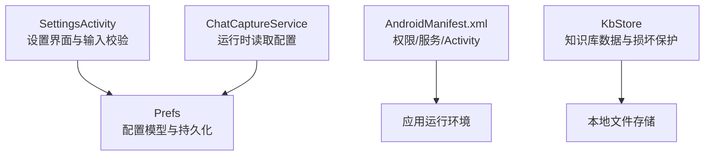
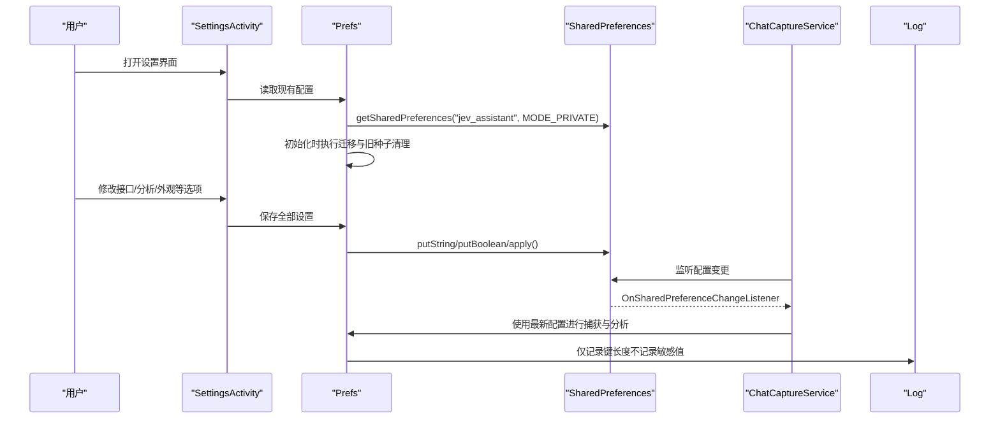
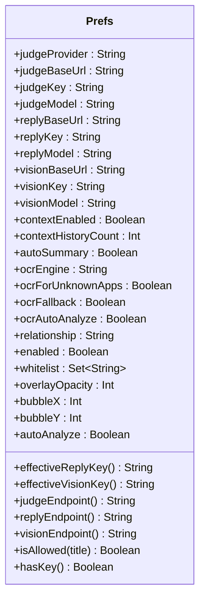
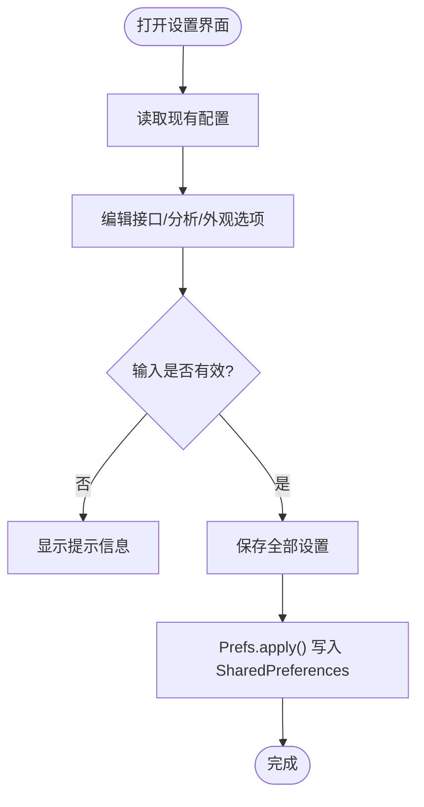
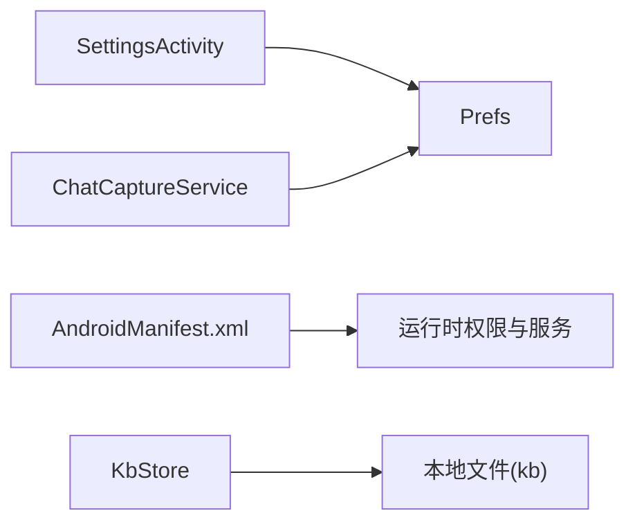

# 配置管理

<cite>
**本文引用的文件**   
- [Prefs.kt](file://app/src/main/java/com/jev/probe/core/Prefs.kt)
- [AndroidManifest.xml](file://app/src/main/AndroidManifest.xml)
- [SettingsActivity.kt](file://app/src/main/java/com/jev/probe/SettingsActivity.kt)
- [ChatCaptureService.kt](file://app/src/main/java/com/jev/probe/capture/ChatCaptureService.kt)
- [KbStore.kt](file://app/src/main/java/com/jev/probe/core/kb/KbStore.kt)
</cite>

## 目录
1. [引言](#引言)
2. [项目结构](#项目结构)
3. [核心组件](#核心组件)
4. [架构总览](#架构总览)
5. [详细组件分析](#详细组件分析)
6. [依赖关系分析](#依赖关系分析)
7. [性能与存储特性](#性能与存储特性)
8. [故障排查指南](#故障排查指南)
9. [结论](#结论)

## 引言
本文档面向 Jev 聊天助手的“配置管理”主题，聚焦以下目标：
- 应用配置结构：以 Prefs.kt 为核心的偏好设置模型。
- 用户配置项：接口配置（判断、回复、视觉）、分析选项（关系描述、白名单、OCR、上下文）与隐私开关。
- 环境变量与默认值：Provider 预设、Base URL、模型名、密钥回退策略。
- 存储位置与安全：SharedPreferences 私有存储、键长度日志、未启用备份。
- 系统级配置：AndroidManifest.xml 中的权限、服务与 Activity 声明。
- 配置验证、默认值处理与迁移策略：保存前校验、Provider 推导、v1.2→v1.3 迁移、旧版自动种子清理。
- 备份恢复机制：明确当前实现不提供全局配置备份；知识库数据具备损坏保护与隔离。

## 项目结构
与配置管理直接相关的代码与清单集中在以下位置：
- 配置模型与持久化：core/Prefs.kt
- 设置界面与输入校验：SettingsActivity.kt
- 运行时读取配置的服务：capture/ChatCaptureService.kt
- 系统权限与服务注册：AndroidManifest.xml
- 知识库数据与损坏保护：core/kb/KbStore.kt

图表来源
- [SettingsActivity.kt:52-447](file://app/src/main/java/com/jev/probe/SettingsActivity.kt#L52-L447)
- [Prefs.kt:14-254](file://app/src/main/java/com/jev/probe/core/Prefs.kt#L14-L254)
- [ChatCaptureService.kt:4-4](file://app/src/main/java/com/jev/probe/capture/ChatCaptureService.kt#L4-L4)
- [AndroidManifest.xml:10-54](file://app/src/main/AndroidManifest.xml#L10-L54)
- [KbStore.kt:278-290](file://app/src/main/java/com/jev/probe/core/kb/KbStore.kt#L278-L290)

章节来源
- [SettingsActivity.kt:52-447](file://app/src/main/java/com/jev/probe/SettingsActivity.kt#L52-L447)
- [Prefs.kt:14-254](file://app/src/main/java/com/jev/probe/core/Prefs.kt#L14-L254)
- [AndroidManifest.xml:10-54](file://app/src/main/AndroidManifest.xml#L10-L54)

## 核心组件
- Prefs：应用私有配置中心，封装 SharedPreferences 读写、Provider 预设、端点拼接、密钥回退、白名单判定、就绪检查等。
- SettingsActivity：提供用户可编辑的界面，负责输入校验、Provider 选择、默认值填充、测试连通性、最终保存。
- ChatCaptureService：运行时通过 SharedPreferences 订阅配置变更并消费配置。
- AndroidManifest.xml：声明网络、悬浮窗、前台服务、通知等权限，注册主 Activity、设置页、无障碍服务与保活服务。
- KbStore：知识库数据持久化，提供清空能力并对损坏文件进行隔离保护（不覆盖原始数据）。

章节来源
- [Prefs.kt:14-254](file://app/src/main/java/com/jev/probe/core/Prefs.kt#L14-L254)
- [SettingsActivity.kt:52-447](file://app/src/main/java/com/jev/probe/SettingsActivity.kt#L52-L447)
- [ChatCaptureService.kt:4-4](file://app/src/main/java/com/jev/probe/capture/ChatCaptureService.kt#L4-L4)
- [AndroidManifest.xml:10-54](file://app/src/main/AndroidManifest.xml#L10-L54)
- [KbStore.kt:278-290](file://app/src/main/java/com/jev/probe/core/kb/KbStore.kt#L278-L290)

## 架构总览
下图展示配置在“设置界面 → 配置模型 → 运行时服务”的生命周期，以及系统清单对运行环境的约束。

图表来源
- [SettingsActivity.kt:52-447](file://app/src/main/java/com/jev/probe/SettingsActivity.kt#L52-L447)
- [Prefs.kt:14-254](file://app/src/main/java/com/jev/probe/core/Prefs.kt#L14-L254)
- [ChatCaptureService.kt:4-4](file://app/src/main/java/com/jev/probe/capture/ChatCaptureService.kt#L4-L4)

## 详细组件分析

### 配置模型：Prefs.kt
- 存储位置
  - 使用 SharedPreferences，文件名为 jev_assistant，模式为 MODE_PRIVATE（应用私有，非世界可读）。
  - 所有键均为内部常量，不在日志中输出真实值，只记录键长度。
- 配置分组
  - 接口配置
    - 判断接口（Jev）：provider、base URL、key、model；支持 OpenRouter、博查 Jev、TypeSafe、Vercel、OpenCode Zen、自定义 Provider。
    - 回复接口：OpenAI 兼容 base URL、key、model；key 为空时回退到判断接口 key。
    - 视觉接口：base URL、key、model；key 为空时回退到回复 key，再回退到判断 key。
  - 分析选项
    - 关系描述：用于注入 Jev 的状态。
    - 会话白名单：按关键词匹配，空集合表示对所有会话生效。
    - OCR 相关：引擎选择（mlkit/vision）、未知 App 兜底、树读不到正文兜底、OCR 自动分析。
    - 上下文（D 阶段）：是否记录聊天历史、注入最近历史条数、自动摘要。
  - 隐私与外观
    - enabled 总开关。
    - overlayOpacity 悬浮窗不透明度（60–100%）。
    - bubbleX/bubbleY 悬浮气泡位置记忆。
    - autoAnalyze 是否每条消息自动分析。
- 默认值与回退
  - 各 Provider 有默认 Base URL 与 Model。
  - effectiveReplyKey()/effectiveVisionKey() 提供密钥回退链。
  - judgeEndpoint()/replyEndpoint()/visionEndpoint() 根据 Provider 拼接完整 POST 地址。
- 配置验证与就绪检查
  - hasKey() 要求判断接口 key 非空才视为已配置。
  - isAllowed(title) 基于白名单决定是否允许该会话被处理。
- 迁移与旧种子清理
  - v1.2→v1.3：将旧的 openrouter_key 迁移至 judge_key，且仅迁移一次。
  - 清理旧版自动种子：若检测到早期版本自动写入的 Bocha 默认值且用户从未手动配置，则移除 provider/base/model，恢复默认行为。

图表来源
- [Prefs.kt:71-254](file://app/src/main/java/com/jev/probe/core/Prefs.kt#L71-L254)

章节来源
- [Prefs.kt:14-254](file://app/src/main/java/com/jev/probe/core/Prefs.kt#L14-L254)

### 设置界面：SettingsActivity.kt
- 功能要点
  - 动态构建设置界面，分为“接口”“分析”“外观”“关于与隐私”四大区块。
  - 接口区：分别提供判断、回复、视觉接口的 Base URL、密钥、模型输入框，并提供“测试”按钮。
  - 分析区：关系描述、白名单、OCR 相关开关、上下文开关与数量、知识库入口、清空知识库与历史。
  - 外观区：悬浮窗不透明度滑块。
  - 保存逻辑：根据用户输入计算 Provider、Base URL、Model，并调用 Prefs 写入。
- 输入校验与默认值处理
  - 判断接口：若 Provider 为自定义且 Base URL 或 Model 为空，提示不完整。
  - 回复接口：若有效 key 为空，提示先填密钥。
  - 视觉接口：若不支持视觉（如 DeepSeek 官方），给出明确提示。
  - 保存时：Provider 由 Base URL 与选中 Pill 共同决定；Custom 保留用户原样输入；其他 Provider 使用对应默认值。
- 测试流程
  - 使用独立 scratch SharedPreferences 实例进行连通性测试，避免污染真实配置。
  - 后台线程执行请求，主线程更新结果文本。

图表来源
- [SettingsActivity.kt:52-447](file://app/src/main/java/com/jev/probe/SettingsActivity.kt#L52-L447)

章节来源
- [SettingsActivity.kt:52-447](file://app/src/main/java/com/jev/probe/SettingsActivity.kt#L52-L447)

### 运行时配置读取：ChatCaptureService.kt
- 通过 SharedPreferences.OnSharedPreferenceChangeListener 监听配置变化。
- 使用 Prefs.PREFS_MAIN 获取主配置文件，确保与设置界面一致。
- 在捕获流程中使用最新配置（例如 OCR 开关、白名单、自动分析等）。

章节来源
- [ChatCaptureService.kt:4-4](file://app/src/main/java/com/jev/probe/capture/ChatCaptureService.kt#L4-L4)

### 系统级配置：AndroidManifest.xml
- 权限声明
  - INTERNET：网络访问。
  - SYSTEM_ALERT_WINDOW：悬浮窗。
  - FOREGROUND_SERVICE / FOREGROUND_SERVICE_SPECIAL_USE：前台服务与特殊用途子类型。
  - POST_NOTIFICATIONS：通知。
- Application 属性
  - allowBackup=false：禁用应用数据备份（包括 SharedPreferences）。
- Activity 注册
  - MainActivity：主入口，exported=true。
  - SettingsActivity：设置页，exported=false。
  - KnowledgeActivity：知识库页，exported=false。
- Service 注册
  - SelectToSpeakService：无障碍服务，绑定 AccessibilityService，资源引用 config_disguised.xml。
  - KeepAliveService：前台特殊用途服务，保持无障碍读取器存活。

章节来源
- [AndroidManifest.xml:1-57](file://app/src/main/AndroidManifest.xml#L1-L57)

### 备份与恢复机制
- 应用配置（SharedPreferences）
  - 未启用 Android 原生备份（allowBackup=false）。
  - 无内置导出/导入配置的功能。
  - 建议：如需跨设备迁移，需通过外部方式（如 root 或厂商工具）拷贝应用私有数据目录。
- 知识库数据（KbStore）
  - clearAll() 仅删除 filesDir/kb 目录下的知识库文件，不影响 SharedPreferences 中的 API Key、白名单等设置。
  - 损坏文件保护：无法解析的文件会被重命名为 .corrupt.<timestamp> 并隔离，避免下次保存覆盖原始数据。

章节来源
- [AndroidManifest.xml:10-15](file://app/src/main/AndroidManifest.xml#L10-L15)
- [KbStore.kt:278-290](file://app/src/main/java/com/jev/probe/core/kb/KbStore.kt#L278-L290)
- [KbStore.kt:412-428](file://app/src/main/java/com/jev/probe/core/kb/KbStore.kt#L412-L428)

## 依赖关系分析
- SettingsActivity 依赖 Prefs 进行配置的读取与保存。
- ChatCaptureService 依赖 SharedPreferences 与 Prefs 常量来订阅和消费配置。
- AndroidManifest.xml 声明了运行所需权限与服务，影响运行时行为（悬浮窗、前台服务、通知）。
- KbStore 与 Prefs 解耦：clearAll() 明确不触碰 SharedPreferences。

图表来源
- [SettingsActivity.kt:52-447](file://app/src/main/java/com/jev/probe/SettingsActivity.kt#L52-L447)
- [Prefs.kt:14-254](file://app/src/main/java/com/jev/probe/core/Prefs.kt#L14-L254)
- [ChatCaptureService.kt:4-4](file://app/src/main/java/com/jev/probe/capture/ChatCaptureService.kt#L4-L4)
- [AndroidManifest.xml:10-54](file://app/src/main/AndroidManifest.xml#L10-L54)
- [KbStore.kt:278-290](file://app/src/main/java/com/jev/probe/core/kb/KbStore.kt#L278-L290)

章节来源
- [SettingsActivity.kt:52-447](file://app/src/main/java/com/jev/probe/SettingsActivity.kt#L52-L447)
- [Prefs.kt:14-254](file://app/src/main/java/com/jev/probe/core/Prefs.kt#L14-L254)
- [ChatCaptureService.kt:4-4](file://app/src/main/java/com/jev/probe/capture/ChatCaptureService.kt#L4-L4)
- [AndroidManifest.xml:10-54](file://app/src/main/AndroidManifest.xml#L10-L54)
- [KbStore.kt:278-290](file://app/src/main/java/com/jev/probe/core/kb/KbStore.kt#L278-L290)

## 性能与存储特性
- 存储后端
  - SharedPreferences：轻量、同步读写，适合少量键值配置。
  - 文件存储：知识库数据以 JSON 数组形式落盘，带缓存与损坏保护。
- I/O 与线程
  - SettingsActivity 使用单线程 Executor 执行网络测试，避免阻塞 UI。
  - ChatCaptureService 通过监听器响应配置变更，避免轮询。
- 安全与隐私
  - SharedPreferences 使用 MODE_PRIVATE。
  - 日志仅记录键长度，不记录敏感值。
  - 上下文记录默认关闭，需用户主动开启。

[本节为通用指导，无需具体文件分析]

## 故障排查指南
- 接口测试失败
  - 判断接口：确认 Provider 与 Base URL 路径匹配；自定义 Provider 必须填写完整 URL 与模型名。
  - 回复接口：若有效 key 为空，请先填写密钥或使用判断接口密钥。
  - 视觉接口：若目标接口不支持视觉（如 DeepSeek 官方），请更换为 OpenRouter 或通义兼容。
- 配置未生效
  - 确认 SettingsActivity 点击“保存全部设置”。
  - 检查 ChatCaptureService 是否正确监听 SharedPreferences 变更。
- 知识库数据损坏
  - 查看是否出现 .corrupt.<timestamp> 文件；KbStore 会将损坏文件隔离，不会覆盖原始数据。
  - 使用“清空知识库与历史”可重置知识库，但不会影响 SharedPreferences 中的设置。

章节来源
- [SettingsActivity.kt:158-307](file://app/src/main/java/com/jev/probe/SettingsActivity.kt#L158-L307)
- [KbStore.kt:412-428](file://app/src/main/java/com/jev/probe/core/kb/KbStore.kt#L412-L428)

## 结论
- Prefs 提供了统一、安全的配置入口，涵盖接口、分析与隐私相关选项，并通过默认值与回退策略降低配置复杂度。
- SettingsActivity 提供直观的输入校验与测试能力，确保用户能正确配置并验证连通性。
- AndroidManifest.xml 明确了运行所需的权限与服务，保证悬浮窗、前台服务与通知正常工作。
- 当前实现未提供全局配置备份与恢复；知识库数据具备损坏保护与隔离机制。
- 建议在需要跨设备迁移时采用外部备份方案，并在后续迭代中考虑引入加密存储与配置导入/导出功能。