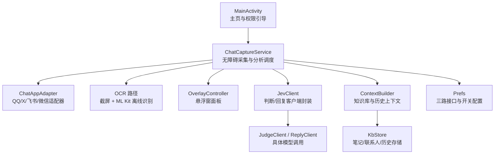
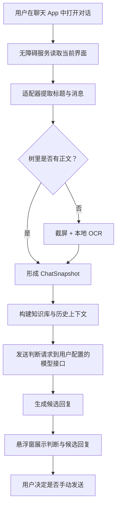
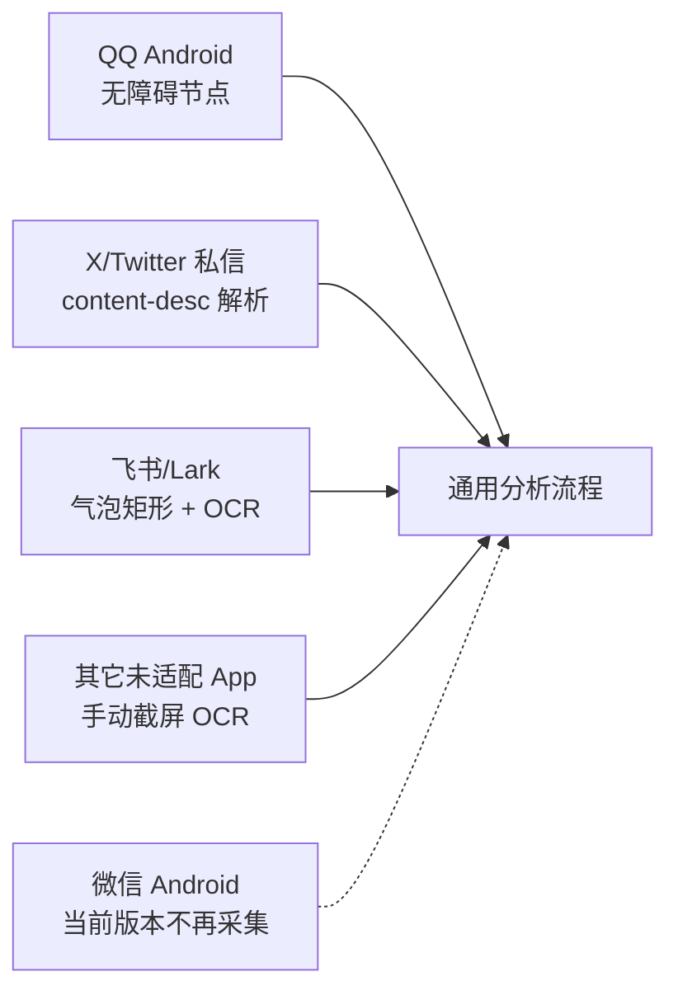
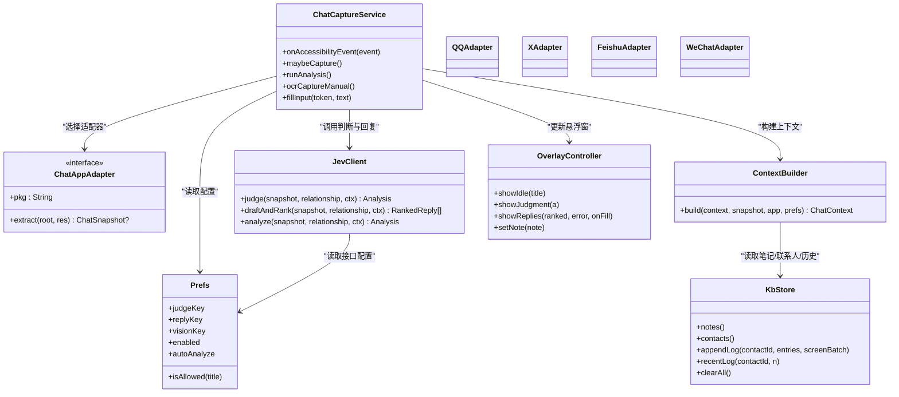
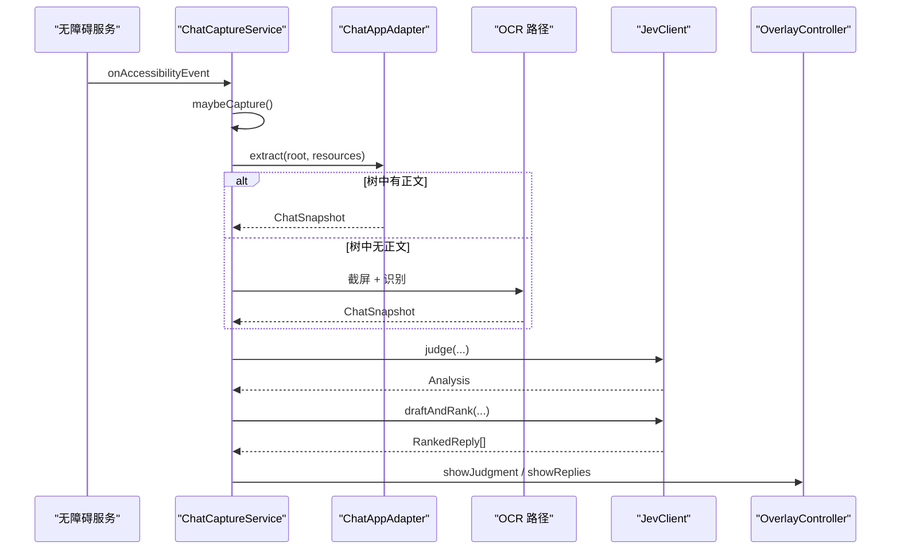
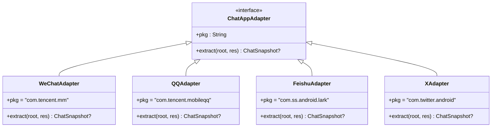
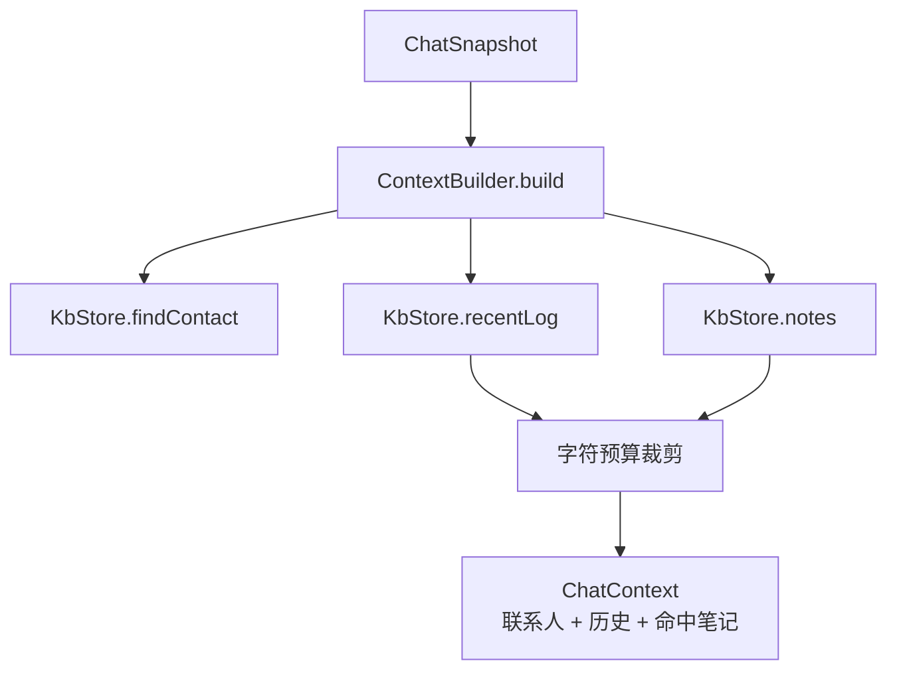
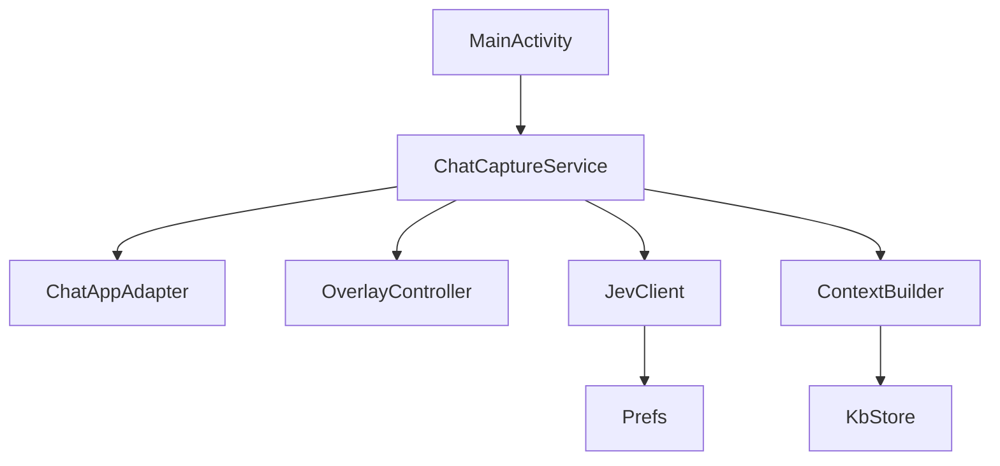

# 项目概述

<cite>
**本文引用的文件**   
- [README.md](file://README.md)
- [PRIVACY.md](file://PRIVACY.md)
- [MainActivity.kt](file://app/src/main/java/com/jev/probe/MainActivity.kt)
- [ChatCaptureService.kt](file://app/src/main/java/com/jev/probe/capture/ChatCaptureService.kt)
- [ChatAppAdapter.kt](file://app/src/main/java/com/jev/probe/capture/ChatAppAdapter.kt)
- [CaptureRules.kt](file://app/src/main/java/com/jev/probe/capture/CaptureRules.kt)
- [ContextBuilder.kt](file://app/src/main/java/com/jev/probe/core/kb/ContextBuilder.kt)
- [KbStore.kt](file://app/src/main/java/com/jev/probe/core/kb/KbStore.kt)
- [OverlayController.kt](file://app/src/main/java/com/jev/probe/overlay/OverlayController.kt)
- [JevClient.kt](file://app/src/main/java/com/jev/probe/jev/JevClient.kt)
- [ChatModels.kt](file://app/src/main/java/com/jev/probe/core/ChatModels.kt)
- [Prefs.kt](file://app/src/main/java/com/jev/probe/core/Prefs.kt)
</cite>

## 目录
1. [引言](#引言)
2. [项目结构](#项目结构)
3. [核心价值与功能特性](#核心价值与功能特性)
4. [安全设计与隐私保护](#安全设计与隐私保护)
5. [平台支持与适配策略](#平台支持与适配策略)
6. [技术架构概览](#技术架构概览)
7. [安装指南与快速开始](#安装指南与快速开始)
8. [与其他平台版本的关系](#与其他平台版本的关系)
9. [关键组件深度分析](#关键组件深度分析)
10. [依赖关系分析](#依赖关系分析)
11. [性能与稳定性考量](#性能与稳定性考量)
12. [常见问题与排错](#常见问题与排错)
13. [结论](#结论)

## 引言
Jev 聊天助手是一个面向 Android 的“对话副驾”：它在你正在使用的聊天 App 中读取当前屏幕上的对话，给出意图判断、危险等级和候选回复建议，但最终是否发送、何时发送完全由你决定。项目强调“先判断、再写字”，不修改聊天软件安装包，不调用聊天 App 的内部接口或账号体系，而是通过系统无障碍服务读取界面内容；截图识别也尽量在本机完成，避免把原始图片上传到网络。

该项目同时提供 Windows 版与 macOS 版，三者共享“辅助判断 + 候选回复 + 本地优先”的理念，但各自是独立仓库和安装包。Android 端适合移动场景下的即时聊天辅助，Windows 与 macOS 端则更适合桌面端的窗口旁挂式辅助。

## 项目结构
Android 应用位于 `app/` 模块，核心代码按职责分层组织：
- `capture/`：无障碍采集、各聊天 App 适配器、OCR 兜底、会话状态管理。
- `core/`：数据模型、偏好配置、知识库存储与上下文构建。
- `jev/`：对外模型接口的客户端封装。
- `overlay/`：悬浮窗面板，展示判断结果与候选回复。
- `KnowledgeActivity` / `SettingsActivity` / `MainActivity`：用户交互入口。

**图表来源**
- [MainActivity.kt:27-106](file://app/src/main/java/com/jev/probe/MainActivity.kt#L27-L106)
- [ChatCaptureService.kt:42-800](file://app/src/main/java/com/jev/probe/capture/ChatCaptureService.kt#L42-L800)
- [ChatAppAdapter.kt:10-511](file://app/src/main/java/com/jev/probe/capture/ChatAppAdapter.kt#L10-L511)
- [OverlayController.kt:29-583](file://app/src/main/java/com/jev/probe/overlay/OverlayController.kt#L29-L583)
- [JevClient.kt:9-41](file://app/src/main/java/com/jev/probe/jev/JevClient.kt#L9-L41)
- [ContextBuilder.kt:8-124](file://app/src/main/java/com/jev/probe/core/kb/ContextBuilder.kt#L8-L124)
- [KbStore.kt:12-540](file://app/src/main/java/com/jev/probe/core/kb/KbStore.kt#L12-L540)
- [Prefs.kt:6-334](file://app/src/main/java/com/jev/probe/core/Prefs.kt#L6-L334)

**章节来源**
- [README.md:224-241](file://README.md#L224-L241)

## 核心价值与功能特性
- **AI 对话辅助**：对当前聊天消息进行意图判断、风险评分、是否需要立即回复、最佳动作建议，并生成多条候选回复。
- **智能回复建议**：先生成候选，再用判断模型排序，最终在悬浮窗中显示排名、把握度和复制/填入操作。
- **多平台适配**：为不同聊天 App 提供专用适配器；未适配 App 可通过悬浮窗菜单手动触发整屏 OCR。
- **知识库管理**：支持笔记、联系人档案、可选聊天历史，用于让 AI 更了解“你是谁、对方是谁、之前聊过什么”。
- **隐私保护**：密钥、设置、知识库和本地历史存储在 App 私有目录；截图仅本机 OCR；分析时只发送文本给自行配置的模型接口。

这些能力在 README 中被总结为“不动聊天软件、发送权在你手里、一套内核多平台、本地知识库、接口自己配、本机存储可控”。

**章节来源**
- [README.md:62-70](file://README.md#L62-L70)
- [README.md:104-137](file://README.md#L104-L137)
- [PRIVACY.md:11-17](file://PRIVACY.md#L11-L17)

## 安全设计与隐私保护
项目的安全设计围绕三个原则展开：
1. **不修改聊天软件**：不 hook、不改包、不走聊天 App 内部接口或数据库。
2. **仅使用系统 API**：主要依赖无障碍服务读取界面内容，必要时使用截屏能力配合本地 OCR。
3. **数据本地处理为主**：截图识别在手机本地完成；密钥、知识库和历史默认保存在 App 私有目录。

隐私政策进一步说明：
- 会离开设备的只有“用于生成判断和回复”的聊天文字与背景信息，且只发往你在设置页填写的模型接口地址。
- 作者不运营中转服务器，也不接收你的聊天内容。
- 无广告、无第三方统计 SDK、不读通讯录、位置、其它 App 列表。
- 卸载应用会删除本机存储的全部数据。

**图表来源**
- [ChatCaptureService.kt:233-354](file://app/src/main/java/com/jev/probe/capture/ChatCaptureService.kt#L233-L354)
- [ChatCaptureService.kt:383-442](file://app/src/main/java/com/jev/probe/capture/ChatCaptureService.kt#L383-L442)
- [ContextBuilder.kt:35-63](file://app/src/main/java/com/jev/probe/core/kb/ContextBuilder.kt#L35-L63)
- [PRIVACY.md:19-31](file://PRIVACY.md#L19-L31)

**章节来源**
- [PRIVACY.md:1-17](file://PRIVACY.md#L1-L17)
- [PRIVACY.md:42-75](file://PRIVACY.md#L42-L75)
- [README.md:62-70](file://README.md#L62-L70)

## 平台支持与适配策略
项目明确支持以下平台：
- **QQ Android**：通过无障碍节点解析，群聊已验证。
- **X/Twitter 私信**：解析 Compose 节点的 content-desc。
- **飞书/Lark**：正文自绘，走气泡矩形 + ML Kit 离线 OCR。
- **微信 Android**：曾全链路支持，但因风控与稳定性问题，当前版本不再采集、OCR、分析或填入微信内容。
- **其它未适配 App**：可通过悬浮窗菜单“截屏识别一次”做整屏 OCR，但不区分我方与对方。

**图表来源**
- [README.md:72-84](file://README.md#L72-L84)
- [ChatAppAdapter.kt:139-511](file://app/src/main/java/com/jev/probe/capture/ChatAppAdapter.kt#L139-L511)

**章节来源**
- [README.md:72-84](file://README.md#L72-L84)
- [ChatAppAdapter.kt:10-26](file://app/src/main/java/com/jev/probe/capture/ChatAppAdapter.kt#L10-L26)

## 技术架构概览
Android 端采用“采集层 + 分析层 + 展示层 + 存储层”的分层结构：
- **采集层**：`ChatCaptureService` 监听无障碍事件，根据前台包名选择对应 `ChatAppAdapter`，将聊天界面转换为统一的 `ChatSnapshot`。
- **分析层**：`JevClient` 封装判断与回复两个模型调用；`ContextBuilder` 负责从知识库和联系人中抽取上下文。
- **展示层**：`OverlayController` 管理悬浮窗气泡与面板，展示危险等级、意图、候选回复，并提供复制/填入操作。
- **存储层**：`KbStore` 管理笔记、联系人、聊天历史；`Prefs` 管理三路接口配置与功能开关。

**图表来源**
- [ChatCaptureService.kt:42-800](file://app/src/main/java/com/jev/probe/capture/ChatCaptureService.kt#L42-L800)
- [ChatAppAdapter.kt:27-511](file://app/src/main/java/com/jev/probe/capture/ChatAppAdapter.kt#L27-L511)
- [JevClient.kt:9-41](file://app/src/main/java/com/jev/probe/jev/JevClient.kt#L9-L41)
- [ContextBuilder.kt:8-124](file://app/src/main/java/com/jev/probe/core/kb/ContextBuilder.kt#L8-L124)
- [KbStore.kt:12-540](file://app/src/main/java/com/jev/probe/core/kb/KbStore.kt#L12-L540)
- [OverlayController.kt:29-583](file://app/src/main/java/com/jev/probe/overlay/OverlayController.kt#L29-L583)
- [Prefs.kt:6-334](file://app/src/main/java/com/jev/probe/core/Prefs.kt#L6-L334)

## 安装指南与快速开始
### 安装方式
- 下载仓库提供的签名 release APK。
- 支持 Android 11+，ARM64 / `arm64-v8a`。
- 也可通过 ADB 安装：`adb install -r apk/jev-assistant-v1.4-release.apk`。

### 首次设置
1. **填密钥**：在设置页配置判断接口、回复接口、视觉接口。最简单只需填判断接口的 API Key，其余两栏留空会自动继承。
2. **开权限**：
   - 无障碍：读取当前聊天窗口消息。
   - 悬浮窗：在聊天窗口上方显示分析卡片。
   - 自启动 + 省电无限制：国产 ROM（尤其小米/HyperOS）需要配置，否则后台可能被冻结。
3. **启用助手**：主页有总开关，开启后进入聊天 App，悬浮窗会显示“分析当前对话”。

### 基本用法
- 当新消息来自对方且自动分析开启时，悬浮窗会显示判断结果与候选回复。
- 点击“填入”会把候选回复写入输入框，不会自动发送。
- 如果某个聊天 App 没有专用适配器，可在悬浮窗菜单中选择“截屏识别一次”。

**章节来源**
- [README.md:86-102](file://README.md#L86-L102)
- [README.md:104-137](file://README.md#L104-L137)
- [MainActivity.kt:63-106](file://app/src/main/java/com/jev/probe/MainActivity.kt#L63-L106)

## 与其他平台版本的关系
Jev 聊天助手在多个平台都有实现，但它们不是同一个安装包：
- **Android 版**：基于无障碍服务，适合手机聊天场景。
- **Windows 版**：聊天窗口旁挂的回复辅助，窗口截图 + 本地 OCR，候选回复一键填入，发送始终手动。
- **macOS 版**：消息意图识别悬浮窗，看屏 + 本地小模型判断意图和风险，再按话术生成回复候选。

三者在理念上保持一致：辅助判断、候选回复、不自动发送、本地优先。但数据采集方式、UI 形态和平台 API 不同，因此分别维护。

**章节来源**
- [README.md:281-288](file://README.md#L281-L288)

## 关键组件深度分析

### 无障碍采集与分析调度：ChatCaptureService
`ChatCaptureService` 是整个 Android 端的核心调度器：
- 监听无障碍事件，判断前台应用是否在支持的聊天 App 中。
- 根据包名选择对应的 `ChatAppAdapter`，提取聊天标题和消息列表。
- 如果无障碍树中没有正文，则走截屏 + OCR 路径。
- 构造 `ChatSnapshot` 后，异步调用 `JevClient` 执行判断与回复。
- 将结果交给 `OverlayController` 展示，并通过无障碍 API 尝试填入输入框。

该服务还处理了多种边界情况：
- 防抖：避免频繁的内容变化导致重复分析。
- 去重：相同消息内容不会反复触发分析。
- 会话切换：离开聊天窗口或切换到白名单外会话时清理状态。
- 手动模式：用户主动触发分析时，放宽窗口存活检查。

**图表来源**
- [ChatCaptureService.kt:233-354](file://app/src/main/java/com/jev/probe/capture/ChatCaptureService.kt#L233-L354)
- [ChatCaptureService.kt:383-442](file://app/src/main/java/com/jev/probe/capture/ChatCaptureService.kt#L383-L442)

**章节来源**
- [ChatCaptureService.kt:28-41](file://app/src/main/java/com/jev/probe/capture/ChatCaptureService.kt#L28-L41)
- [ChatCaptureService.kt:233-354](file://app/src/main/java/com/jev/probe/capture/ChatCaptureService.kt#L233-L354)
- [ChatCaptureService.kt:383-442](file://app/src/main/java/com/jev/probe/capture/ChatCaptureService.kt#L383-L442)

### 聊天 App 适配器：ChatAppAdapter
`ChatAppAdapter` 定义了每个聊天 App 的统一契约：
- `pkg`：包名。
- `extract(root, res)`：返回 `null` 表示不在聊天窗口；返回空消息列表表示在聊天窗口但树里没有正文；返回非空消息列表表示正常采集。

已有实现包括：
- `WeChatAdapter`：通过气泡容器 ID 判断聊天窗口，按气泡左右位置判断“我”或“对方”。
- `QQAdapter`：通过固定资源 ID 提取消息正文、标题和输入框。
- `FeishuAdapter`：正文自绘，主要靠气泡矩形坐标 + OCR。
- `XAdapter`：解析 Compose UI 的 content-desc，按中文分隔符拆分发件人与正文。

**图表来源**
- [ChatAppAdapter.kt:27-511](file://app/src/main/java/com/jev/probe/capture/ChatAppAdapter.kt#L27-L511)

**章节来源**
- [ChatAppAdapter.kt:10-26](file://app/src/main/java/com/jev/probe/capture/ChatAppAdapter.kt#L10-L26)
- [ChatAppAdapter.kt:139-179](file://app/src/main/java/com/jev/probe/capture/ChatAppAdapter.kt#L139-L179)
- [ChatAppAdapter.kt:197-247](file://app/src/main/java/com/jev/probe/capture/ChatAppAdapter.kt#L197-L247)
- [ChatAppAdapter.kt:319-376](file://app/src/main/java/com/jev/probe/capture/ChatAppAdapter.kt#L319-L376)
- [ChatAppAdapter.kt:440-511](file://app/src/main/java/com/jev/probe/capture/ChatAppAdapter.kt#L440-L511)

### 知识库与上下文：KbStore 与 ContextBuilder
`KbStore` 是本地知识库的实现，负责：
- 笔记：标题、内容、标签、是否常驻。
- 联系人：姓名、别名、关系、备注、所属 App。
- 聊天历史：按联系人分文件保存，最多保留固定条数。
- 原子写入：临时文件 + rename，防止崩溃留下半写文件。
- 名称归一化：去除零宽字符、群成员数量后缀等干扰。

`ContextBuilder` 负责把当前聊天快照转化为 AI 能用的上下文：
- 匹配联系人。
- 根据开关注入最近 N 条历史。
- 根据标题和最近消息匹配笔记。
- 控制上下文字符预算，优先保留历史记录，再裁剪笔记。

**图表来源**
- [ContextBuilder.kt:35-63](file://app/src/main/java/com/jev/probe/core/kb/ContextBuilder.kt#L35-L63)
- [KbStore.kt:106-145](file://app/src/main/java/com/jev/probe/core/kb/KbStore.kt#L106-L145)
- [KbStore.kt:172-241](file://app/src/main/java/com/jev/probe/core/kb/KbStore.kt#L172-L241)

**章节来源**
- [KbStore.kt:12-23](file://app/src/main/java/com/jev/probe/core/kb/KbStore.kt#L12-L23)
- [KbStore.kt:172-241](file://app/src/main/java/com/jev/probe/core/kb/KbStore.kt#L172-L241)
- [ContextBuilder.kt:8-15](file://app/src/main/java/com/jev/probe/core/kb/ContextBuilder.kt#L8-L15)
- [ContextBuilder.kt:35-63](file://app/src/main/java/com/jev/probe/core/kb/ContextBuilder.kt#L35-L63)

### 悬浮窗面板：OverlayController
`OverlayController` 负责：
- 创建可拖拽的悬浮气泡。
- 展开/收起分析面板。
- 显示危险等级、真实意图、建议动作、候选回复。
- 提供复制、填入、重新分析、打开设置等操作。
- 在截屏时暂时隐藏自身，避免截图拍到悬浮窗。

面板设计强调“可读、可扫、可退让”：危险等级高亮、意图一句话概括、候选回复带概率，且面板高度受限，避免遮挡输入框。

**章节来源**
- [OverlayController.kt:29-37](file://app/src/main/java/com/jev/probe/overlay/OverlayController.kt#L29-L37)
- [OverlayController.kt:95-188](file://app/src/main/java/com/jev/probe/overlay/OverlayController.kt#L95-L188)
- [OverlayController.kt:286-458](file://app/src/main/java/com/jev/probe/overlay/OverlayController.kt#L286-L458)

### 模型客户端：JevClient
`JevClient` 是对判断与回复两个客户端的薄封装：
- `judge`：调用判断接口，返回意图、危险等级、建议动作等。
- `draftAndRank`：先调用回复接口生成候选，再用判断接口排序。
- `analyze`：顺序执行判断与回复，用于设置页连通性测试。

所有接口地址、密钥、模型名都从 `Prefs` 读取，因此更换服务商或自定义网关时不需要改业务逻辑。

**章节来源**
- [JevClient.kt:9-41](file://app/src/main/java/com/jev/probe/jev/JevClient.kt#L9-L41)

### 数据模型：ChatModels
`ChatModels` 定义了核心数据结构：
- `Msg`：一条消息，包含方向“me”或“other”和文本。
- `BubbleRect`：无障碍树能定位但无法读取的气泡矩形。
- `ChatSnapshot`：当前聊天快照，包含标题、消息列表、气泡矩形和说明。
- `Analysis`：判断结果，包含意图、危险等级、建议动作、候选回复等。
- `Choice` / `Score` / `RankedReply`：判断分类、分数和排序后的回复。

这些模型让采集层、分析层、展示层之间保持统一的数据契约。

**章节来源**
- [ChatModels.kt:5-57](file://app/src/main/java/com/jev/probe/core/ChatModels.kt#L5-L57)

## 依赖关系分析
Android 端的依赖关系可以理解为：
- `MainActivity` 负责引导用户完成权限与密钥配置。
- `ChatCaptureService` 是运行时核心，协调采集、OCR、分析、展示。
- `ChatAppAdapter` 是扩展点，新增聊天 App 只需实现一个适配器。
- `JevClient` 依赖 `Prefs` 获取模型接口配置。
- `ContextBuilder` 依赖 `KbStore` 获取知识库与历史。
- `OverlayController` 依赖 `Prefs` 控制悬浮窗样式和行为。

**图表来源**
- [MainActivity.kt:27-106](file://app/src/main/java/com/jev/probe/MainActivity.kt#L27-L106)
- [ChatCaptureService.kt:42-800](file://app/src/main/java/com/jev/probe/capture/ChatCaptureService.kt#L42-L800)
- [JevClient.kt:9-41](file://app/src/main/java/com/jev/probe/jev/JevClient.kt#L9-L41)
- [ContextBuilder.kt:35-63](file://app/src/main/java/com/jev/probe/core/kb/ContextBuilder.kt#L35-L63)
- [KbStore.kt:12-540](file://app/src/main/java/com/jev/probe/core/kb/KbStore.kt#L12-L540)
- [OverlayController.kt:29-583](file://app/src/main/java/com/jev/probe/overlay/OverlayController.kt#L29-L583)
- [Prefs.kt:6-334](file://app/src/main/java/com/jev/probe/core/Prefs.kt#L6-L334)

**章节来源**
- [ChatCaptureService.kt:47-53](file://app/src/main/java/com/jev/probe/capture/ChatCaptureService.kt#L47-L53)
- [ChatAppAdapter.kt:10-26](file://app/src/main/java/com/jev/probe/capture/ChatAppAdapter.kt#L10-L26)

## 性能与稳定性考量
项目在性能和稳定性方面做了多处优化：
- **线程隔离**：主线程处理 UI 与无障碍回调，后台线程池处理分析任务。
- **防抖与去重**：内容变化频繁时延迟分析；相同消息签名不重复触发。
- **OCR 限频**：截屏和 OCR 有节流、失败退避，避免每秒连拍。
- **会话状态管理**：切换聊天、关闭助手、离开前台时清理分析任务和悬浮窗状态。
- **写入安全**：知识库使用临时文件 + rename，防止崩溃导致 JSON 损坏。
- **日志安全**：日志只输出消息条数、字符长度、异常类名，不输出聊天正文。

这些设计使应用在国产 ROM 后台冻结、聊天 App 更新、无障碍树变化等复杂场景中仍能保持相对稳定。

**章节来源**
- [ChatCaptureService.kt:44-58](file://app/src/main/java/com/jev/probe/capture/ChatCaptureService.kt#L44-L58)
- [ChatCaptureService.kt:325-354](file://app/src/main/java/com/jev/probe/capture/ChatCaptureService.kt#L325-L354)
- [ChatCaptureService.kt:535-689](file://app/src/main/java/com/jev/probe/capture/ChatCaptureService.kt#L535-L689)
- [KbStore.kt:430-459](file://app/src/main/java/com/jev/probe/core/kb/KbStore.kt#L430-L459)
- [CaptureRules.kt:40-56](file://app/src/main/java/com/jev/probe/capture/CaptureRules.kt#L40-L56)

## 常见问题与排错
- **悬浮球不见了或读不到消息**：通常是国产 ROM 冻结后台。确认无障碍、悬浮窗、自启动、省电无限制都已开启；小米/HyperOS 尤其注意后两项。
- **升级后没反应**：把系统设置里的无障碍开关关掉再打开一次，让服务重新绑定截屏能力。
- **飞书读不到正文**：飞书正文是自绘控件，走 OCR 路径；如果判反，可用“存为联系人”并在备注中说明，或关闭自动分析改用手动。
- **其它 App 能用吗**：可以用悬浮窗菜单的“截屏识别一次”，但无法区分我方与对方。
- **要花钱吗**：软件本身免费开源；模型调用走你自己的 API Key，费用在对应服务商结算。

**章节来源**
- [README.md:139-187](file://README.md#L139-L187)

## 结论
Jev 聊天助手 Android 项目的核心价值在于：**在不侵入聊天软件的前提下，用系统 API 和本地能力为用户提供意图判断、风险提示和智能回复建议**。它的设计重点不是“自动替你发消息”，而是“帮你更快理解对方、更安全地回应”。

对于初学者，你可以把它理解为“聊天时的 AI 副驾”：它观察屏幕、分析对话、给你建议，但最终按键永远在你手里。  
对于开发者，它的价值在于清晰的采集-分析-展示分层、可扩展的聊天 App 适配器、本地知识库与隐私优先的数据策略。

如果你希望继续深入，可以从以下方向入手：
- 阅读 `ChatAppAdapter` 的实现，学习如何为一个新聊天 App 写适配器。
- 阅读 `KbStore` 和 `ContextBuilder`，理解本地知识库如何影响 AI 判断。
- 阅读 `Prefs`，理解三路接口配置与默认服务商行为。
- 结合 `PRIVACY.md` 与源码，验证“不上传截图、不读数据库、不自动发送”的安全承诺。